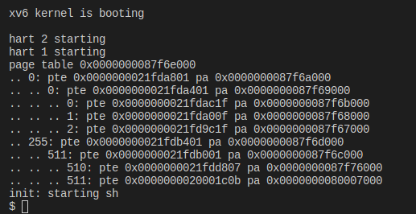

写oslab的一些代码，

>   xv6中文文档：https://th0ar.gitbooks.io/xv6-chinese/content/content/chapter2.html

[toc]

# 进度

进度：


| lab_num/lab_name | Is it completed |
| :--------------- | :-------------- |
| Lab1/sleep       | Finish          |
| Lab1/pingpong    | Finish          |
| Lab1/prime       | Finish          |
| Lab1/find        |                 |
| Lab1/xargs       |                 |
| Lab2/trace       | Finish          |
| Lab2/sysinfo     | Finish          |
| Lab3/vmprint     | Finish          |

# 环境

之前搞到一半，，环境有点问题，想着重新搞个虚拟机写os的lab

依赖，源码：

```
sudo apt-get install git build-essential gdb-multiarch qemu-system-misc gcc-riscv64-linux-gnu binutils-riscv64-linux-gnu 

sudo apt-get remove qemu-system-misc
sudo apt-get install qemu-system-misc=1:4.2-3ubuntu6
sudo apt install gcc-riscv64-unknown-elf
git clone git://g.csail.mit.edu/xv6-labs-2020
```

有如下分支：

```shell
yutao@ubuntu:~/xv6-labs-2020$ git branch  --remote
  origin/HEAD -> origin/master
  origin/cow
  origin/fs
  origin/lazy
  origin/lock
  origin/master
  origin/mmap
  origin/net
  origin/pgtbl
  origin/riscv
  origin/syscall
  origin/thread
  origin/traps
  origin/util
```

调试的话要在Makefile里加：

```makefile
gdb:
	riscv64-unknown-elf-gdb kernel/kernel
```

调试的话：

```
gdb-multiarch  kernel/kernel
make qemu-gdb
```

评测脚本grade-lab-util是python程序，这里对第一行进行修改，将

```python
PYTHON
#!/usr/bin/env python
```

修改为：

```python
PYTHON
#!/usr/bin python
```

还要再Makefile里面加。


## 分支建议：

(6). **xv6实验git分支建议**

建议是每个实验创建一个测试分支，例如对于**util**来说

```bash
git checkout util         # 切换到util分支
git checkout -b util_test # 建立并切换到util的测试分支
```

当你在***util_test\***分支中每测试通过一个作业，请提交（`git commit`）你的代码，并将所做的修改合并（`git merge`）到***util\***中，然后提交（`git push`）到github

```bash
git add .
git commit -m "完成了第一个作业"
git checkout util
git merge util_test
git push github util:util
```

# lab1

实验指导书：https://pdos.csail.mit.edu/6.828/2020/labs/util.html

## sleep

代码：

```c
#include "kernel/types.h"
#include "kernel/stat.h"
#include "user/user.h"
int main(int argc, char **argv)
{
    int n;
    if (argc != 2)
    {
        printf("please enter a number!");
        exit(1);
    }
    else
    {
        n = atoi( argv[1]);
        sleep(n);
        exit(0);
    }
}

yutao@ubuntu:~/xv6-labs-2020$ sudo python3 grade-lab-util sleep
make: 'kernel/kernel' is up to date.
== Test sleep, no arguments == sleep, no arguments: OK (1.6s) 
== Test sleep, returns == sleep, returns: OK (1.0s) 
== Test sleep, makes syscall == sleep, makes syscall: OK (0.9s) 
```

## pingpong

```c
// #include <stdio.h>
#include "kernel/types.h"
#include "user/user.h"
// 编写一个程序，使用UNIX系统调用在一对管道上的两
// 个进程之间“乒乓”一个字节，每个方向一个。父级应向子
// 级发送一个字节；子进程应该打印“：received ping”，
// 其中是其进程ID，将管道上的字节写入父进程，然后退出；
// 父进程应该从子进程读取字节，打印“：received pong”，
// 然后退出。您的解决方案应该在文件“user/pingpong.c”中。
#define READEND 0
#define WRITTEND 1
int main()
{
    int p[2];
    int pid;
    char buf[2];
    char *parmsg = "a";
    char *chimsg = "b";

    pipe(p);

    pid = fork();
    if (pid < 0)
    {
        exit(1);
    }
    else if (pid == 0) // child processs
    {
        read(p[READEND], buf, 1);
        printf("child receive: %c\n", buf[0]);
        printf("%d: received ping\n", getpid());
        write(p[WRITTEND], chimsg, 1);
        close(p[READEND]);
        close(p[WRITTEND]);

        exit(0);
    }
    else
    {
        write(p[WRITTEND], parmsg, 1);
        wait(0);
        read(p[READEND], buf, 1);

        printf("parent receive: %c\n", buf[0]);
        printf("%d: received pong\n", getpid());
        close(p[WRITTEND]);
        close(p[READEND]);
        exit(0);
    }
}

// yutao@ubuntu:~/xv6-labs-2020$ sudo python3 grade-lab-util pingpong
// make: 'kernel/kernel' is up to date.
// == Test pingpong == pingpong: OK (1.9s)
```


## prime

使用的方法是埃拉托斯特尼素数筛，简称筛法。简单地说就是，每次得到一个素数时，在所有小于 n 的数中，删除它的倍数，然后不断迭代，剩下的就全是素数了。


# Lab2 system calls

>   实验指导书：https://pdos.csail.mit.edu/6.828/2020/labs/syscall.html

需要读xv6book的第2章、4.3、4.4.

用户空间的系统调用在：`user/user.h和user/usys.pl`

kernel空间的系统调用在：`kernel/kernel.h和kernel/syscall.c`

与process相关的代码在：`kernel/proc.h && kernel/proc.c`

```sh
  $ git checkout syscall
  $ make clean
```


## System call tracing

>   In this assignment you will add a system call tracing feature that may help you when debugging later labs. You'll create a new trace system call that will control tracing. It should take one argument, an integer "mask", whose bits specify which system calls to trace. For example, to trace the fork system call, a program calls trace(1 << SYS_fork), where SYS_fork is a syscall number from kernel/syscall.h. You have to modify the xv6 kernel to print out a line when each system call is about to return, if the system call's number is set in the mask. The line should contain the process id, the name of the system call and the return value; you don't need to print the system call arguments. The trace system call should enable tracing for the process that calls it and any children that it subsequently forks, but should not affect other processes.

示例：

```c
$ trace 32 grep hello README
3: syscall read -> 1023
3: syscall read -> 966
3: syscall read -> 70
3: syscall read -> 0
$
$ trace 2147483647 grep hello README
4: syscall trace -> 0
4: syscall exec -> 3
4: syscall open -> 3
4: syscall read -> 1023
4: syscall read -> 966
4: syscall read -> 70
4: syscall read -> 0
4: syscall close -> 0
$
$ grep hello README
$
$ trace 2 usertests forkforkfork
usertests starting
test forkforkfork: 407: syscall fork -> 408
408: syscall fork -> 409
409: syscall fork -> 410
410: syscall fork -> 411
409: syscall fork -> 412
410: syscall fork -> 413
409: syscall fork -> 414
411: syscall fork -> 415
...
$
```

>   In the first example above, trace invokes grep tracing just the read system call. The 32 is 1<<SYS_read. In the second example, trace runs grep while tracing all system calls; the 2147583647 has all 31 low bits set. In the third example, the program isn't traced, so no trace output is printed. In the fourth example, the fork system calls of all the descendants of the forkforkfork test in usertests are being traced. Your solution is correct if your program behaves as shown above (though the process IDs may be different).

在这个实验里，我们需要让内核输出每个mask变量指定的系统函数的调用情况，格式为：

```text
<pid>: syscall <syscall_name> -> <return_value>
```

### hints

1.  Add `$U/_trace` to UPROGS in Makefile
2.  添加声明到`user/user.h`中
3.  添加一个`entry`到`user/usys.pl`
4.  添加一个syscall number到`kernel/syscall.h`中
5.  添加`sys_trace()`函数到`kernel/sysproc.c`中
6.  修改`kernel/proc.h`中的proc结构体(记录当前进程信息)，添加一个mask值，用来识别system number


proc结构体：

```c
// Per-process state
struct proc
{
  struct spinlock lock;

  // p->lock must be held when using these:
  enum procstate state; // Process state
  struct proc *parent;  // Parent process
  void *chan;           // If non-zero, sleeping on chan
  int killed;           // If non-zero, have been killed
  int xstate;           // Exit status to be returned to parent's wait
  int pid;              // Process ID

  // these are private to the process, so p->lock need not be held.
  uint64 kstack;               // Virtual address of kernel stack
  uint64 sz;                   // Size of process memory (bytes)
  pagetable_t pagetable;       // User page table
  struct trapframe *trapframe; // data page for trampoline.S
  struct context context;      // swtch() here to run process
  struct file *ofile[NOFILE];  // Open files
  struct inode *cwd;           // Current directory
  char name[16];               // Process name (debugging)
  int mask;                    // system call
};
```

sys_trace具体实现

```c
uint64 sys_trace(void)
{
	int n;
	// argint检索的是第n个系统调用的参数，因此不包括系统调用本身，传入的参数为0
	if (argint(0, &n) < 0)
		return -1;
	myproc()->mask = n;
	return 0;
}
```

修改`kernel/proc.c`中的`fork`函数，添加子进程复制父进程mask：

```c
np->mask = p->mask;
```

修改`kernel/syscall.c`，添加`SYS_trace`的声明，之后加到syscall的数组中，然后添加trace的识别功能。

`p->trapframe->a0`中存放的是函数调用的返回值。

```c
extern uint64 sys_trace(void);

static uint64 (*syscalls[])(void) = {
	.....
	[SYS_close] sys_close,
	[SYS_trace] sys_trace,
};
char *sysCallName[23] = {"", "fork", "exit", "wait", "pipe", "read", "kill", "exec",
						 "fstat", "chdir", "dup", "getpid", "sbrk", "sleep", "uptime",
						 "open", "write", "mknod", "unlink", "link", "mkdir", "close", "trace"};

void syscall(void)
{
	int num;
	struct proc *p = myproc();

	num = p->trapframe->a7;
	if (num > 0 && num < NELEM(syscalls) && syscalls[num])
	{
		p->trapframe->a0 = syscalls[num]();
		if (p->mask & (1 << num))
		{
			printf("%d: syscall %s -> %d\n", p->pid, sysCallName[num], p->trapframe->a0);
		}
	}
	else
	{
		printf("%d %s: unknown sys call %d\n",
			   p->pid, p->name, num);
		p->trapframe->a0 = -1;
	}
}
```


```sh
yutao@ubuntu:~/xv6-labs-2020$ sudo python3 grade-lab-syscall trace
make: 'kernel/kernel' is up to date.
== Test trace 32 grep == trace 32 grep: OK (1.4s) 
== Test trace all grep == trace all grep: OK (1.0s) 
== Test trace nothing == trace nothing: OK (1.0s) 
== Test trace children == trace children: OK (12.1s) 
```

## Sysinfo

>   https://github.com/whileskies/xv6-labs-2020/blob/main/doc/Lab2-system%20calls.md

>   In this assignment you will add a system call, sysinfo, that collects information about the running system. The system call takes one argument: a pointer to a struct sysinfo (see kernel/sysinfo.h). The kernel should fill out the fields of this struct: the freemem field should be set to the number of bytes of free memory, and the nproc field should be set to the number of processes whose state is not UNUSED. We provide a test program sysinfotest; you pass this assignment if it prints "sysinfotest: OK".

添加一个系统调用`sysinfo`，用于收集有关正在运行的系统的信息。系统调用采用一个参数：指向结构`sysinfo`的指针（参见`kernel/sysinfo.h`）。内核应填写此结构的字段：`freemem`字段应设置为可用内存的字节数，`nproc`字段应设置为其状态未使用的进程数。提供了一个测试程序sysinfotest；如果输出“sysinfotest:OK”，则通过此分配。

1.  添加`$U/_sysinfotest\`
2.  添加函数声明到`user.h`，添加`entry`到`usys.pl`，添加`syscall number`到`syscall.h`，然后加入到`syscall`函数数组中
3.  然后为了添加`sys_sysinfo`函数到`kernel/sysproc.c`，这里为了实现需要在`kernel/proc.c`和`kernel/kalloc.c`中分别添加函数获取正在使用的进程和可用的内存数，然后记得将添加的函数声明在`defs.h`
4.  然后实现`sys_sysinfo`函数，这里需要看一下`copyout`函数的使用方法(参考`sys_fstat(kernel/sysfile.c)`和`filestat(kernel/file.c)`)

添加函数声明：

```c
struct sysinfo;
int sysinfo(struct sysinfo *);
```

添加`entry`：

```c
entry("sysinfo");
```

添加`syscall`：

```c
//syscall.h
#define SYS_sysinfo 23
```

加到`syscallname`的数组中：

```c
extern uint64 sys_sysinfo(void);
//还有syscalls的数组也要加
char *sysCallName[24] = {"", "fork", "exit", "wait", "pipe", "read", "kill", "exec",
						 "fstat", "chdir", "dup", "getpid", "sbrk", "sleep", "uptime",
						 "open", "write", "mknod", "unlink", "link", "mkdir", "close", "trace", "sysinfo"};
```

`kernel/proc.c`加`processNum`函数：

```c
uint64 processNum(void)
{
	struct proc *p;
	uint64 cnt = 0;
	for (p = proc; p < proc[NPROC]; p++)
	{
		if (p->state != UNUSED)
		{
			cnt++;
		}
	}
	return cnt;
}
```

`kalloc.c`加`getFreeMemory`函数：

```c
uint64 getFreeMemory(void)
{
	int num = 0;
	struct run *r;
	for (r = kmem.freelist; r; r = r->next, num++)
		;
	return num * PGSIZE;
}
```

之后在`defs.h`中添加声明

`sysproc.c`加`sys_sysinfo`函数：

```c
uint64 sys_sysinfo(void)
{
	struct sysinfo info;
	struct proc *p = myproc();
	uint64 addr;
	if (argaddr(0, &addr) < 0)
		return -1;
	info.freemem = getFreememory();
	info.nproc = processNum();
	if (copyout(p->pagetable, addr, (char *)&info, sizeof(info)) < 0)
		return -1;
	return 0;
}
```


# Lab3

>   指导书：https://pdos.csail.mit.edu/6.828/2020/labs/pgtbl.html

## Print a page table

打印页表的一些信息，用来帮助调试的。

>   Define a function called `vmprint()`. It should take a `pagetable_t` argument, and print that pagetable in the format described below. Insert `if(p->pid==1) vmprint(p->pagetable)` in exec.c just before the `return argc`, to print the first process's page table. You receive full credit for this assignment if you pass the `pte printout` test of `make grade`.

>   第一行显示vmprint的参数。之后，每个PTE都有一行，包括引用树中更深的页-表-页的PTE。每个PTE行由若干“.”缩进这表明它在树中的深度。每个PTE行显示其页面表页面中的PTE索引、PTE位和从PTE提取的物理地址。不要打印无效的PTE。在上例中，顶级页面table页面具有条目0和255的映射。条目0的下一级仅映射了索引0，该索引0的底层映射了条目0、1和2。

-   `defs.c`中加vmprint定义

    ```c
    void vmprint(pagetable_t);
    ```

-   `kernel/exec.c`：

    ```c
    // exec.c
    
    int
    exec(char *path, char **argv)
    {
      // ......
      vmprint(p->pagetable); // 按照实验要求，在 exec 返回之前打印一下页表。
      return argc; // this ends up in a0, the first argument to main(argc, argv)
    ```

-   在`kernel/vm.c`中写`vmprint()`

    ```c
    void vmprintwalk(pagetable_t pagetable, int deep)
    {
    	for (int i = 0; i < 512; i++)
    	{
    		// 2^9 PTEs in a page table
    		pte_t pte = pagetable[i];
    		if (pte & PTE_V)
    		{
    			for (int i = 0; i <= deep; ++i)
    			{
    				printf(".. ");
    			}
    			printf("%d: pte %p pa %p\n", i, pte, PTE2PA(pte));
    			if ((pte & (PTE_R | PTE_W | PTE_X)) == 0)
    			{
    				// this PTE points to a lower-level page table.
    				uint64 child = PTE2PA(pte);
    				vmprintwalk((pagetable_t)child, deep + 1);
    			}
    		}
    	}
    }
    void vmprint(pagetable_t pagetable)
    {
    	printf("page table %p\n", pagetable);
    	vmprintwalk(pagetable, 0);
    }
    ```

    



## A kernel page table per process

>   Xv6有一个单独的内核页表，每当它在内核中执行时都会使用它。内核页表是物理地址的直接映射，因此内核虚拟地址x映射到物理地址x。Xv6还为每个进程的用户地址空间提供了一个单独的页表，仅包含该进程用户内存的映射，从虚拟地址零开始。因为内核页表不包含这些映射，所以用户地址在内核中无效。因此，当内核需要使用在系统调用中传递的用户指针（例如，传递给write()的缓冲区指针）时，内核必须首先将指针转换为物理地址。本节和下一节的目标是允许内核直接解引用用户指针。
>
>   您的第一项工作是修改内核，使每个进程在内核中执行时都使用自己的内核页表副本。修改struct proc以维护每个进程的内核页表，并修改调度器以在切换进程时切换内核页表。对于这一步，每个进程内核页表应该与现有的全局内核页表相同。如果usertests运行正确，则通过这部分实验室。

本 Lab 目标是让每一个进程进入内核态后，都能有自己的独立**内核页表**，为第三个实验做准备。

-   在进程结构体proc中加kernelpgtbl字段，用于存储进程专享的内核态页表。

    ```c
    // kernel/proc.h
    // Per-process state
    struct proc
    {
      struct spinlock lock;
    
      // p->lock must be held when using these:
      enum procstate state; // Process state
      struct proc *parent;  // Parent process
      void *chan;           // If non-zero, sleeping on chan
      int killed;           // If non-zero, have been killed
      int xstate;           // Exit status to be returned to parent's wait
      int pid;              // Process ID
    
      // these are private to the process, so p->lock need not be held.
      uint64 kstack;               // Virtual address of kernel stack
      uint64 sz;                   // Size of process memory (bytes)
      pagetable_t pagetable;       // User page table
      pagetable_t kernelPageTable; // Kernel page table
      struct trapframe *trapframe; // data page for trampoline.S
      struct context context;      // swtch() here to run process
      struct file *ofile[NOFILE];  // Open files
      struct inode *cwd;           // Current directory
      char name[16];               // Process name (debugging)
    };
    
    ```

-   之后是初始化这个`kernelPageTable`字段，仿`kernel/vm.c`里`kvminit`函数，用内核自己pagetable初始化的方式初始化用户进程的`kernel pagetable`，其中`uvmmap`类似于`kvmmap`，只不过`kvmmap`是直接对全局的`kernel_pagetable`进行`mappage`，而`uvmmap`并没有指定page table

    ```c
    pagetable_t proc_kvminit()
    {
    	// kernel_pagetable = (pagetable_t)kalloc();
    	// memset(kernel_pagetable, 0, PGSIZE);
    	pagetable_t kernelPageTable;
    	kernelPageTable = uvmcreate();
    	if (kernelPageTable == 0)
    		return 0;
    	uvmmap(UART0, UART0, PGSIZE, PTE_R | PTE_W);
    	uvmmap(VIRTIO0, VIRTIO0, PGSIZE, PTE_R | PTE_W);
    	uvmmap(CLINT, CLINT, 0x10000, PTE_R | PTE_W);
    	uvmmap(PLIC, PLIC, 0x400000, PTE_R | PTE_W);
    	uvmmap(KERNBASE, KERNBASE, (uint64)etext - KERNBASE, PTE_R | PTE_X);
    	uvmmap((uint64)etext, (uint64)etext, PHYSTOP - (uint64)etext, PTE_R | PTE_W);
    	uvmmap(TRAMPOLINE, (uint64)trampoline, PGSIZE, PTE_R | PTE_X);
    	return kernelPageTable;
    }
    void uvmmap(uint64 va, uint64 pa, uint64 sz, int perm)
    {
    	if (mappages(kernel_pagetable, va, sz, pa, perm) != 0)
    		panic("uvmmap");
    }
    ```

-   在defs.h加声明

    ```c
    pagetable_t     proc_kvminit(void);
    ```
    
-   在`kernel/proc.c`中的`allocproc`函数中添加调用`proc_kvminit()`的代码段

    ```c
    p->kernelPageTable = proc_kvminit();
    if (p->kernelPageTable == 0)
    {
    	freeproc(p);
    	release(&p->lock);
    	return 0;
    }
    ```

-   接下来是初始化内核栈，内核栈的初始化原来是在 `kernel/proc.c` 中的 `procinit` 函数内，这部分要求将函数内的代码转移到 `allocproc` 函数内，因此在上一步初始化内核态页表的代码下面接着添加初始化内核栈的代码：

    ```c
    	p->kernelPageTable = proc_kvminit();
    	if (p->kernelPageTable == 0)
    	{
    		freeproc(p);
    		release(&p->lock);
    		return 0;
    	}
    	// 初始化内核栈
    	char *pa = kalloc();
    	if (pa == 0)
    		panic("kalloc");
    	uint64 va = KSTACK((int)(p - proc));
    	uvmmap(va, (uint64)pa, PGSIZE, PTE_R | PTE_W);
    	p->kstack = va;
    ```
    
-   进程调度时，切换内核页：内核页的管理使用的是 SATP 寄存器，在 `kernel/proc.c` 的调度函数 `scheduler` 中添加切换 SATP 寄存器的代码，并在调度后切换回来, `w_satp()` 函数用于设置最高级页目录地址的寄存器 SATP, `sfence_vam()` 用于清空当前 TLB.

    ```c
    // change satp
    w_satp(MAKE_SATP(p->kernelPageTable));
    sfence_vma();
    // change process
    swtch(&c->context, &p->context);
    // change back
    kvminithart();
    ```
    
-   释放内核页表：直接遍历所有的页表，释放所有有效的页表项即可。仿照 `freewalk` 函数。仅释放页表的映射关系即可，不能将真实的物理地址也释放了。

    ```c
    void proc_freewalk(pagetable_t pagetable)
    {
    	// there are 2^9 = 512 PTEs in a page table.
    	for (int i = 0; i < 512; i++)
    	{
    		pte_t pte = pagetable[i];
    
    		if (pte & PTE_V)
    		{
    			pagetable[i] = 0;
    			if ((pte & PTE_V) && (pte & (PTE_R | PTE_W | PTE_X)) == 0)
    			{
    				// this PTE points to a lower-level page table.
    				uint64 child = PTE2PA(pte);
    				proc_freewalk((pagetable_t)child);
    			}
    		}
    	}
    	kfree((void *)pagetable);
    }
    ```

-   `freeproc()` 代码如下, 还需注意的一点是, 内核栈 `p->stack` 需要在内核页表 `p->kpagetable` 之前清除.

    ```c
    static void
    freeproc(struct proc *p)
    {
    	if (p->trapframe)
    		kfree((void *)p->trapframe);
    	p->trapframe = 0;
    	if (p->pagetable)
    		proc_freepagetable(p->pagetable, p->sz);
    	p->pagetable = 0;
    	p->sz = 0;
    	p->pid = 0;
    	p->parent = 0;
    	p->name[0] = 0;
    	p->chan = 0;
    	p->killed = 0;
    	p->xstate = 0;
    	// free kernel stack
    	if (p->kstack)
    		uvmunmap(p->kernelPageTable, p->kstack, 1, 1);
    	p->kstack = 0;
    	if (p->kernelPageTable)
    		proc_freewalk(p->kernelPageTable);
    	p->kernelPageTable = 0;
    
    	p->state = UNUSED;
    
    ```

-   在 vm.c 中添加头文件：

    ```c
    #include "spinlock.h"
    #include "proc.h"
    ```

-   `kvmpa()` 函数用于将内核虚拟地址转换为物理地址, 其中调用 `walk()` 函数时使用了全局的内核页表. 此时需要换位当前进程的内核页表. 

    ```c
    uint64
    kvmpa(uint64 va)
    {
    	uint64 off = va % PGSIZE;
    	pte_t *pte;
    	uint64 pa;
    
    	pte = walk(myproc()->kernelPageTable, va, 0);//here
    
    	if (pte == 0)
    		panic("kvmpa");
    	if ((*pte & PTE_V) == 0)
    		panic("kvmpa");
    	pa = PTE2PA(*pte);
    	return pa + off;
    }
    ```

    


