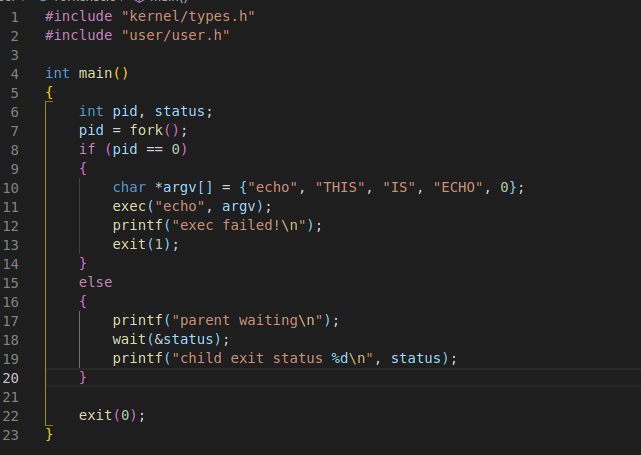
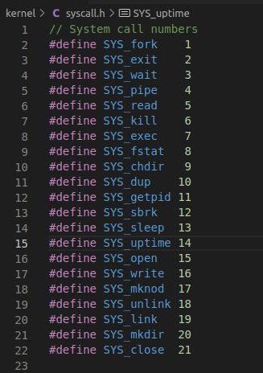
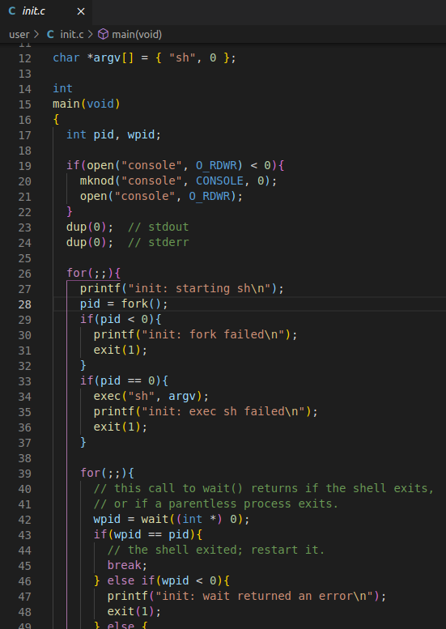
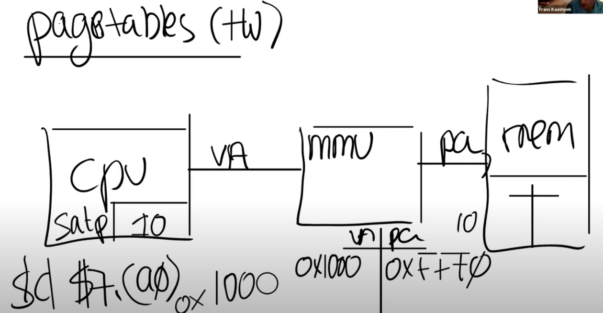
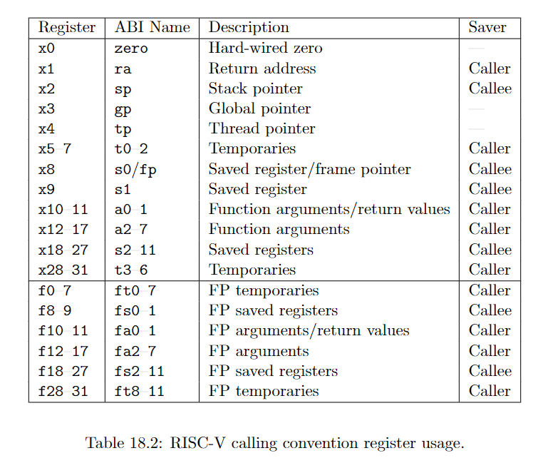

[toc]

>   6.s081看的是文档（比较快些），没看视频，：https://github.com/Ghostasky/MIT6.S081
>
>   XV6:https://pdos.csail.mit.edu/6.828/2020/xv6/book-riscv-rev1.pdf

有一说一，这课是真他娘好看，就按照章节顺序来做笔记吧。

>   上次没看完，，，这个暑假搞完，，，，

# Chapter1

## 6.s081

操作系统的目标：

1.  抽象硬件(Abstraction)。对CPU，内存这些，使用应用程序实现高层级的接口和抽象，例如进程，文件系统。
2.  多个应用程序之间共用硬件资源(multiplex)。
3.  隔离性(Isolation)：多个程序之间互不干扰
4.  共享(Sharing)：数据交互，协同完成任务等
5.  Security(或者Permission System或者是Access Control System)
6.  高性能(Performance)
7.  支持大量不同类型的程序

### 操作系统结构

在这门课程中，我们主要关注点在Kernel、连接Kernel和用户空间程序的接口、Kernel内软件的架构；会关心Kernel中的服务，其中一个服务是文件系统，另一个就是进程管理系统。

每一个用户空间程序都被称为一个进程，它们有自己的内存和共享的CPU时间。

应用程序是与Kernel交互通过系统调用实现。

`fork()：创建了一个与调用进程一模一样的新的进程，并返回新进程的process ID/pid`


当程序员在写普通的应用程序时，应用程序下面都是操作系统。而当我们在构建操作系统时，在操作系统下面就是硬件了，这些硬件通常会更难处理。在这门课程中，我们会使用一个叫做QEMU的硬件模拟器，来模拟CPU和计算机。

### read,write,exit系统调用

以下都使用XV6，XV6运行在一个RISC-V微处理器上，会在一个QEMU模拟器上运行XV6。

首先是copy程序：

```c
#include "kernel/types.h"
#include "user/user.h"

int main()
{
    char buf[64];
    while (1)
    {
        int n = read(0, buf, sizeof(buf));
        if (n <= 0)
            break;
        write(1, buf, n);
    }
    exit(0);
}
```

注意在Makefile里面：

```makefile
UPROGS=\
	$U/_cat\
	$U/_echo\
	$U/_forktest\
	$U/_grep\
	$U/_init\
	$U/_kill\
	$U/_ln\
	$U/_ls\
	$U/_mkdir\
	$U/_rm\
	$U/_sh\
	$U/_stressfs\
	$U/_usertests\
	$U/_grind\
	$U/_wc\
	$U/_zombie\
	$U/_copy
```

read系统调用：

1.  第一个参数为文件描述符，文件描述符0连接到console的输入，文件描述符1连接到了console的输出。
2.  第二个参数是指向某段内存的指针
3.  第三个参数是代码想读取的最大长度

grep x会搜索输入中包含x的行，我可以告诉shell将输入重定向到文件out，这样我们就可以查看out中的x。

```sh
$ grep a <out
xargstest.sh   2 3 93
cat            2 4 23968
```


### 环境搭建：

依据官网：https://pdos.csail.mit.edu/6.828/2020/tools.html

```sh
sudo apt-get install git build-essential gdb-multiarch qemu-system-misc gcc-riscv64-linux-gnu binutils-riscv64-linux-gnu
sudo apt-get remove qemu-system-misc
sudo apt-get install qemu-system-misc=1:4.2-3ubuntu6
git clone git://g.csail.mit.edu/xv6-labs-2020
cd xv6-labs-2020
git checkout util
sudo make qemu
```

test:

```sh
test:
$ riscv64-unknown-elf-gcc --version
riscv64-unknown-elf-gcc (GCC) 10.1.0
...

$ qemu-system-riscv64 --version
QEMU emulator version 5.1.0
# in the xv6 directory
$ make qemu
# ... lots of output ...
init: starting sh
$
#success
```

### fork

```c
   int pid;
    pid = fork();
    printf("fork return %d\n",pid);
    if(pid==0)
    {
        printf("child\n");
    }else{
        printf("father\n");
    }
    exit(0);
```

```sh
yutao@ubuntu:~/xv6-labs-2020$ ./a
fork return 67703
father
fork return 0
child
```

fork系统调用在两个进程中都会返回，在原始的进程中，fork系统调用会返回大于0的整数，这个是新创建进程的ID。而在新创建的进程中，fork系统调用会返回0。所以即使两个进程的内存是完全一样的，我们还是可以通过fork的返回值区分旧进程和新进程。

父子进程拥有不同的内存空间和寄存器，改变一个进程中的变量不会影响另一个进程。

### close

形式是`int close(int fd)`，将打开的文件`fd`释放，使该文件描述符可以被后面的`open`、`pipe`等其他system call使用。

### dup

`dup`。形式是`int dup(int fd)`，复制一个新的`fd`指向的I/O对象，返回这个新fd值，两个I/O对象(文件)的offset相同

### pipe

管道，暴露给进程的一对文件描述符，一个文件描述符用来读，另一个文件描述符用来写，将数据从管道的一端写入，将使其能够被从管道的另一端读出,管道的行为是**FIFO**（先进先出）

`pipe`是一个system call，形式为`int pipe(int p[])`，`p[0]`为读取的文件描述符，`p[1]`为写入的文件描述符

```c
#include <stdio.h>
#include <unistd.h>
#define MSGSIZE 16
char* msg1 = "hello, world #1";
char* msg2 = "hello, world #2";
char* msg3 = "hello, world #3";
  
int main()
{
    char inbuf[MSGSIZE];
    int p[2], i;
  
    if (pipe(p) < 0)
        return 0;
  
    /* continued */
    /* write pipe */
  
    write(p[1], msg1, MSGSIZE);
    write(p[1], msg2, MSGSIZE);
    write(p[1], msg3, MSGSIZE);
  
    for (i = 0; i < 3; i++) {
        /* read pipe */
        read(p[0], inbuf, MSGSIZE);
        printf("% s\n", inbuf);
    }
    return 0;
}
```


### exec，wait系统调用

系统调用 `exec` 将从某个文件（通常是可执行文件）里读取内存镜像，并将其替换到调用它的进程的内存空间，这样相当于丢弃了调用进程的内存，并开始执行新加载的指令。

通常来说exec系统调用不会返回，因为exec会完全替换当前进程的内存，相当于当前进程不复存在了，所以exec系统调用已经没有地方能返回了。所以shell的话会先fork，之后在子进程里进行exec



```sh
$ forkexec
parent waiting
THIS IS ECHO
child exit status 0
```

wait会等待之前创建的子进程退出(只能父等子进程)，其中的 status是子进程退出时的状态，正常退出的是0。

```
exec("echoasasdf", argv);
printf("exec failed!\n");
exit(1111);

$ forkexec
parent waiting
exec failed!
child exit status 1111
```


# Chapter3

>   https://zhayujie.com/mit6828-env.html

1.  隔离性（isolation）
2.  防御性 (Defensive)
3.  协同调度（Cooperative Scheduling）：在发现自己运行了一段时间之后，需要让别的程序也有机会能运行。这种机制有时候称为协同调度。
3.  kernel mode：特殊权限指令主要是一些直接操纵硬件的指令和设置保护的指令，例如设置page table寄存器、关闭时钟中断。在处理器上有各种各样的状态，操作系统会使用这些状态，但是只能通过特殊权限指令来变更这些状态。


RISC-V的模式其实是三种：（user/kernel/machine）

内核有时候也被称为可被信任的计算空间（Trusted Computing Base）

宏内核 vs 微内核 （Monolithic Kernel vs Micro Kernel）

宏内核：整个操作系统代码都运行在kernel mode。大多数的Unix操作系统实现都运行在kernel mode。比如，XV6中，所有的操作系统服务都在kernel mode中，这种形式被称为Monolithic Kernel Design。宏内核的优势在于，因为这些子模块现在都位于同一个程序中，它们可以紧密的集成在一起，这样的集成提供很好的性能。例如Linux，它就有很不错的性能。

微内核：希望在kernel mode中运行尽可能少的代码。所以这种设计下还是有内核，但是内核只有非常少的几个模块。


需要有一种方式能够让应用程序可以将控制权转移给内核（Entering Kernel）。

在RISC-V中，有一个专门的指令用来实现这个功能，叫做ECALL。ECALL接收一个数字参数，当一个用户程序想要将程序执行的控制权转移到内核，它只需要执行ECALL指令，并传入一个数字。这里的数字参数代表了应用程序想要调用的System Call。


可被信任的计算空间（Trusted Computing Base）TCB

IPC（Inter-Process Communication，进程间通信）


对于任何文件系统的交互，都需要分别完成2次用户空间<-&gt;内核空间的跳转。与宏内核对比，在宏内核中如果一个应用程序需要与文件系统交互，只需要完成1次用户空间<->内核空间的跳转，所以微内核的的跳转是宏内核的两倍。


## 编译运行kernel

xv6为宏内核

kernel：包含所有内核文件，里所有的文件会被编译成一个叫做kernel的二进制文件，然后这个二进制文件会被运行在kernle mode中。

mkfs：它会创建一个空的文件镜像，我们会将这个镜像存在磁盘上，这样我们就可以直接使用一个空的文件系统。

编译内核过程：

-   首先，Makefile（XV6目录下的文件）会读取一个C文件，例如proc.c；之后调用gcc编译器，生成一个文件叫做proc.s，这是RISC-V 汇编语言文件；之后再走到汇编解释器，生成proc.o，这是汇编语言的二进制格式。
-   Makefile会为所有内核文件做相同的操作。
-   之后，系统加载器（Loader）会收集所有的.o文件，将它们链接在一起，并生成内核文件。

这里为了方便还会生成kernel.asm，包含了内核的完整汇编语言:

```assembly

kernel/kernel:     file format elf64-littleriscv


Disassembly of section .text:

0000000080000000 <_entry>:
    80000000:	0000a117          	auipc	sp,0xa
    80000004:	83010113          	addi	sp,sp,-2000 # 80009830 <stack0>
    80000008:	6505                	lui	a0,0x1
    8000000a:	f14025f3          	csrr	a1,mhartid
    8000000e:	0585                	addi	a1,a1,1
    80000010:	02b50533          	mul	a0,a0,a1
    80000014:	912a                	add	sp,sp,a0
    80000016:	070000ef          	jal	ra,80000086 <start>

000000008000001a <spin>:
    8000001a:	a001                	j	8000001a <spin>

000000008000001c <timerinit>:
// which arrive at timervec in kernelvec.S,
// which turns them into software interrupts for
// devintr() in trap.c.
void
timerinit()
{
    8000001c:	1141                	addi	sp,sp,-16
    8000001e:	e422                	sd	s0,8(sp)
    80000020:	0800                	addi	s0,sp,16
// which hart (core) is this?
static inline uint64
r_mhartid()
{
.........
```

可以看到第一个指令在0x80000000.

```sh
yutao@ubuntu:~/xv6-labs-2020$ sudo make qemu
qemu-system-riscv64 -machine virt -bios none -kernel kernel/kernel -m 128M -smp 3 -nographic -drive file=fs.img,if=none,format=raw,id=x0 -device virtio-blk-device,drive=x0,bus=virtio-mmio-bus.0

xv6 kernel is booting

hart 2 starting
hart 1 starting
init: starting sh
$ 

```

传给QEMU的几个参数：

-   -kernel：这里传递的是内核文件（kernel目录下的kernel文件），这是将在QEMU中运行的程序文件。
-   -m：这里传递的是RISC-V虚拟机将会使用的内存数量
-   -smp：这里传递的是虚拟机可以使用的CPU核数
-   -drive：传递的是虚拟机使用的磁盘驱动，这里传入的是fs.img文件

当我们说QEMU仿真了RISC-V处理器时，背后的含义：

直观来看，QEMU是一个大型的开源C程序，你可以下载或者git clone它。但是在内部，在QEMU的主循环中，只在做一件事情：

-   读取4字节或者8字节的RISC-V指令。
-   解析RISC-V指令，并找出对应的操作码（op code）。我们之前在看kernel.asm的时候，看过一些操作码的二进制版本。通过解析，或许可以知道这是一个ADD指令，或者是一个SUB指令。
-   之后，在软件中执行相应的指令。

## xv6启动过程

启动qemu，打开gdb：

```sh
yutao@ubuntu:~/xv6-labs-2020$ sudo make CPUS=1 qemu-gdb 
*** Now run 'gdb' in another window.
qemu-system-riscv64 -machine virt -bios none -kernel kernel/kernel -m 128M -smp 1 -nographic -drive file=fs.img,if=none,format=raw,id=x0 -device virtio-blk-device,drive=x0,bus=virtio-mmio-bus.0 -S -gdb tcp::25000

```

在xv6的目录再打开一个终端：

```sh
gdb-multiarch kernel/kernel
#至于还要装什么我也忘了，鼓弄一下午，，，，fk
```

常用gdb指令：

```shell
layout split        # 同时打开源码及汇编窗口
layout reg          # 打开寄存器窗口
layout asm          # 打开汇编窗口
next / nexti        # 单步到下一行 源代码 / 指令，不进入函数
step / stepi        # 单步到下一行 源代码 / 指令，进入函数
break (b)           # 设置断点，后面可接函数、行号、地址等
continue (c)        # 继续执行到下一个断点
```

进去之后断在_entry

```sh
For help, type "help".
Type "apropos word" to search for commands related to "word"...
Reading symbols from kernel/kernel...
The target architecture is assumed to be riscv:rv64
0x0000000000001000 in ?? ()
(gdb) b _entry
Breakpoint 1 at 0x8000000a
(gdb) c
Continuing.

Breakpoint 1, 0x000000008000000a in _entry ()
=> 0x000000008000000a <_entry+10>:	f3 25 40 f1	csrr	a1,mhartid
(gdb) 
```

这里可以看到，XV6从entry.s开始启动，这个时候没有内存分页，没有隔离性，并且运行在M-mode（machine mode）。XV6会尽可能快的跳转到kernel mode或者说是supervisor mode。我们在main函数设置一个断点，main函数已经运行在supervisor mode了。接下来我运行程序，代码会在断点，也就是main函数的第一条指令停住。

```sh
(gdb) b main
Breakpoint 2 at 0x80000ec6: file kernel/main.c, line 13.
```

进入 layout split 模式：


main.c

```c
void
main()
{
  if(cpuid() == 0){
    consoleinit();
    printfinit();
    printf("\n");
    printf("xv6 kernel is booting\n");
    printf("\n");
    kinit();         // physical page allocator
    kvminit();       // create kernel page table
    kvminithart();   // turn on paging
    procinit();      // process table
    trapinit();      // trap vectors
    trapinithart();  // install kernel trap vector
    plicinit();      // set up interrupt controller
    plicinithart();  // ask PLIC for device interrupts
    binit();         // buffer cache
    iinit();         // inode cache
    fileinit();      // file table
    virtio_disk_init(); // emulated hard disk
    userinit();      // first user process
    __sync_synchronize();
    started = 1;
  } else {
    while(started == 0)
      ;
    __sync_synchronize();
    printf("hart %d starting\n", cpuid());
    kvminithart();    // turn on paging
    trapinithart();   // install kernel trap vector
    plicinithart();   // ask PLIC for device interrupts
  }

  scheduler();        
}
```

有很多初始化的函数，顺序也很重要：

-   kinit：设置好页表分配器（page allocator）
-   kvminit：设置好虚拟内存，这是下节课的内容
-   kvminithart：打开页表，也是下节课的内容
-   processinit：设置好初始进程或者说设置好进程表单
-   trapinit/trapinithart：设置好user/kernel mode转换代码
-   plicinit/plicinithart：设置好中断控制器PLIC（Platform Level Interrupt Controller），我们后面在介绍中断的时候会详细的介绍这部分，这是我们用来与磁盘和console交互方式
-   binit：分配buffer cache
-   iinit：初始化inode缓存
-   fileinit：初始化文件系统
-   virtio_disk_init：初始化磁盘
-   userinit：最后当所有的设置都完成了，操作系统也运行起来了，会通过userinit运行第一个进程，这里有点意思，接下来我们看一下userinit

跟userinit：


实际上initcode就是执行了exec("/init")

断在syscall：


`num = p->trapframe->a7;`读取使用的系统调用的整数，执行完：

```sh
(gdb) p num
$1 = 7
```



是exc系统调用。

之后的` p->trapframe->a0 = syscalls[num]();`执行系统调用，跟到syscalls中去：


sys\_exec会从用户空间读取参数，它会读取path，也就是要执行程序的文件名。这里首先会为参数分配空间，然后从用户空间将参数拷贝到内核空间。

传入的是init程序，看下



init会为用户空间设置好一些东西，比如配置好console，调用fork，并在fork出的子进程中执行shell。

然后就可以在qemu中看到shell起来了


# Chapter4

页表，内存管理单元（Memory Management Unit）



page table保存在内存中，MMU只是会去查看page table，我们接下来会看到，page table比我们这里画的要稍微复杂一些。

当操作系统将CPU从一个应用程序切换到另一个应用程序时，同时也需要切换SATP寄存器中的内容，从而指向新的进程保存在物理内存中的地址对应表单。

RISC-V中，一个page是4KB。

首先对于虚拟内存地址，我们将它划分为两个部分，index和offset，index用来查找page，offset对应的是一个page中的哪个字节。

当MMU在做地址翻译的时候，通过读取虚拟内存地址中的index可以知道物理内存中的page号，将offset加上page的起始地址，就可以得到物理内存地址。

实际上，在我们使用的RSIC-V处理器上，并不是所有的64bit都被使用了，也就是说高25bit并没有被使用。这样的结果是限制了虚拟内存地址的数量，虚拟内存地址的数量现在只有2^39个，大概是512GB。

在剩下的39bit中，有27bit被用来当做index，12bit被用来当做offset。offset必须是12bit，因为对应了一个page的4096个字节。


在RISC-V中，物理内存地址是56bit。其中44bit是物理page号（PPN，Physical Page Number），剩下12bit是offset完全继承自虚拟内存地址（也就是地址转换时，只需要将虚拟内存中的27bit翻译成物理内存中的44bit的page号，剩下的12bitoffset直接拷贝过来即可）。

实际上page table是一个多级的结构，下图是一个真正的RISC-V page table结构和硬件实现。3级结构是由硬件实现而不是系统。


27bit的index，实际上是由3个9bit的数字组成（L2，L1，L0）。前9个bit被用来索引最高级的page directory。Directory中的一个条目被称为PTE（Page Table Entry）是64bits，就像寄存器的大小一样，也就是8Bytes。所以一个Directory page有512个条目。

实际上，SATP寄存器会指向最高一级的page directory的物理内存地址，之后我们用虚拟内存中index的高9bit用来索引最高一级的page directory，这样我们就能得到一个PPN，也就是物理page号。这个PPN指向了中间级的page directory。

当我们在使用中间级的page directory时，我们通过虚拟内存地址中的L1部分完成索引。接下来会走到最低级的page directory，我们通过虚拟内存地址中的L0部分完成索引。在最低级的page directory中，我们可以得到对应于虚拟内存地址的物理内存地址。

之前的方案要用到2^27个PTE，现在这个方案中，只需要3 * 512个PTE，大大减少

接下来看看PTE中的Flag。每个PTE的低10bit是一堆标志位：

-   第一个标志位是Valid。如果Valid bit位为1，那么表明这是一条合法的PTE，你可以用它来做地址翻译。对于刚刚举得那个小例子（应用程序只用了1个page的例子），我们只使用了3个page directory，每个page directory中只有第0个PTE被使用了，所以只有第0个PTE的Valid bit位会被设置成1，其他的511个PTE的Valid bit为0。这个标志位告诉MMU，你不能使用这条PTE，因为这条PTE并不包含有用的信息。
-   下两个标志位分别是Readable和Writable。表明你是否可以读/写这个page。
-   Executable表明你可以从这个page执行指令。
-   User表明这个page可以被运行在用户空间的进程访问。
-   其他标志位并不是那么重要。

这里还会用到页表缓存（Translation Lookaside Buffer）：对于一个虚拟内存地址的寻址，需要读三次内存，这里代价有点高。所以实际中，几乎所有的处理器都会对于最近使用过的虚拟地址的翻译结果有缓存。

接下来看XV6中，page table是如何工作的。

下图就是内核中地址的对应关系，左边是内核的虚拟地址空间，右边上半部分是物理内存或者说是DRAM，右边下半部分是I/O设备。


或者说是这样：


上面那个图的右侧，地址0x1000是boot ROM的物理地址，当你对主板上电，主板做的第一件事情就是运行存储在boot ROM中的代码，当boot完成之后，会跳转到地址0x80000000。

其他的一些IO设备：

-   PLIC是中断控制器（Platform-Level Interrupt Controller）。
-   CLINT（Core Local Interruptor）也是中断的一部分。所以多个设备都能产生中断，需要中断控制器来将这些中断路由到合适的处理函数。
-   UART0（Universal Asynchronous Receiver/Transmitter）负责与Console和显示器交互。
-   VIRTIO disk，与磁盘进行交互。

低于0x80000000的物理地址，不存在于DRAM中，当我们在使用这些地址的时候，指令会直接走向其他的硬件。

有一些page在虚拟内存中的地址很靠后，比如kernel stack在虚拟内存中的地址就很靠后。这是因为在它之下有一个未被映射的Guard page，这个Guard page对应的PTE的Valid 标志位没有设置，这样，如果kernel stack耗尽了，它会溢出到Guard page，但是因为Guard page的PTE中Valid标志位未设置，会导致立即触发page fault，这样的结果好过内存越界之后造成的数据混乱。立即触发一个panic（也就是page fault），你就知道kernel stack出错了。同时我们也又不想浪费物理内存给Guard page，所以Guard page不会映射到任何物理内存，它只是占据了虚拟地址空间的一段靠后的地址。

同时，kernel stack被映射了两次，在靠后的虚拟地址映射了一次，在PHYSTOP下的Kernel data中又映射了一次，但是实际使用的时候用的是上面的部分，因为有Guard page会更加安全。

该跟着调4.6了

这里应该先跳过了，先干后面的。

## kvminit函数


首先分配物理page，就是kalloc那里，之后初始化内存为0，之后将每个I/O设备映射到内核，

在memlayout.h中，可以看到映射地址：

通过kvmmap可以将物理地址映射到相同的虚拟地址（注，因为kvmmap的前两个参数一致）


# Chapter5

>   导读：https://pdos.csail.mit.edu/6.828/2020/readings/riscv-calling.pdf

这里用到的asm不是x86而是RISC-V，精简指令集（诞生于uc berkeley），而x86是复杂是复杂指令集CISC。

RISC指令集开源相关文档在课程页可找到，包含特殊权限指令和普通指令。相比x86的文档小了很多。

>   5.3的一些图片被删了，commit里面可以找到：https://github.com/huihongxiao/MIT6.S081/commit/6e5a0d8c2a3840bc9d3a8a381ff491567f1f9ee9。

用到的RISC指令：



然后是stack相关的内容，和之前pwn的内容重合，就不写了，但是里面一些gdb的指令还是可以看看的。

在gdb中输入layout asm，可以在tui窗口看到所有的汇编指令。再输入layout reg可以看到所有的寄存器信息。


# Chapter6

>   导读：阅读【1】中第4章，除了4.6；阅读RISCV.h【2】；阅读trampoline.S【3】；阅读trap.c【4】
>
>   【1】https://pdos.csail.mit.edu/6.828/2020/xv6/book-riscv-rev1.pdf
>
>   【2】https://github.com/mit-pdos/xv6-riscv/blob/riscv/kernel/riscv.h
>
>   【3】https://github.com/mit-pdos/xv6-riscv/blob/riscv/kernel/trampoline.S
>
>   【4】https://github.com/mit-pdos/xv6-riscv/blob/riscv/kernel/trap.c

RISC-V总共有32个比如a0，a1这样的寄存器，用户应用程序可以使用全部的寄存器。

一些重要的寄存器介绍：

-   `stvec`：内核在这里写入其陷阱处理程序的地址；RISC-V跳转到这里处理陷阱。
-   `sepc`：当发生陷阱时，RISC-V会在这里保存程序计数器`pc`（因为`pc`会被`stvec`覆盖）。`sret`（从陷阱返回）指令会将`sepc`复制到`pc`。内核可以写入`sepc`来控制`sret`的去向。
-   `scause`： RISC-V在这里放置一个描述陷阱原因的数字。
-   `sscratch`：内核在这里放置了一个值，这个值在陷阱处理程序一开始就会派上用场。
-   `sstatus`：其中的**SIE**位控制设备中断是否启用。如果内核清空**SIE**，RISC-V将推迟设备中断，直到内核重新设置**SIE**。**SPP**位指示陷阱是来自用户模式还是管理模式，并控制`sret`返回的模式。

## trap的执行流程

这里使用write来举例，ecall执行系统调用，ecall后会切换到内核，内核中执行的第一个指令是一个由汇编语言写的函数，叫做`uservec`（`trampoline.s`），执行完后会跳到`usertrap`(`trap.c`)，`usertrap`中会执行`syscall`，`syscall`会在一个表单中，根据传入的代表系统调用的数字进行查找，并在内核中执行具体实现了系统调用功能的函数。

之后会输出内容到终端，完成后返回到`syscall`，再之后回复user空间代码，`syscall`中调用了`usertrapret`(`trap.c`)，`usertrapret`完成了部分方便在C代码中实现的返回到用户空间的工作，剩下的一些工作由汇编完成，即`userret`（`trampoline.s`），完成后会返回到用户空间继续执行用户代码。

>   vm.c运行在kernel mode下。

## ECALL指令之前状态

`sh.c`:

```c
int getcmd(char *buf, int nbuf)
{
  // fprintf(2, "$ ");
  write(2, "$", 2);
  memset(buf, 0, nbuf);
  gets(buf, nbuf);
  if (buf[0] == 0) // EOF
    return -1;
  return 0;
}
```

write系统调用，它将“$ ”写入到文件描述符2.

用户代码的Shell调用write时，实际上调用的是关联到Shell的一个库函数。在usys.s。

```assembly
write:
 li a7, SYS_write
 ecall
 ret
```

看下`sh.asm`,，找到ecall的指令的地址，下断点：是0xdee

```assembly
0000000000000dea <write>:
.global write
write:
 li a7, SYS_write
     dea:	48c1                	li	a7,16
 ecall
     dec:	00000073          	ecall
 ret
     df0:	8082                	ret
```

下断点：可以看下PC寄存器

```sh
(gdb) b *0xdec
Breakpoint 1 at 0xdee
(gdb) c
Continuing.
[Switching to Thread 1.2]

Thread 2 hit Breakpoint 1, 0x0000000000000dee in ?? ()
=> 0x0000000000000dec:	73 00 00 00	ecall
(gdb) print $pc
$1 = (void (*)()) 0xdec
```

还可以`info reg`打印全部寄存器（user）

```sh
(gdb) info reg
ra             0xe8c    0xe8c
sp             0x3e90   0x3e90
gp             0x505050505050505        0x505050505050505
tp             0x505050505050505        0x505050505050505
t0             0x505050505050505        361700864190383365
t1             0x505050505050505        361700864190383365
t2             0x505050505050505        361700864190383365
fp             0x3eb0   0x3eb0
s1             0x12f1   4849
a0             0x1      1
a1             0x3e9f   16031
a2             0x1      1
a3             0x505050505050505        361700864190383365
a4             0x505050505050505        361700864190383365
a5             0x24     36
a6             0x505050505050505        361700864190383365
a7             0x10     16
s2             0x24     36
s3             0x0      0
s4             0x25     37
s5             0x2      2
s6             0x3f50   16208
s7             0x1438   5176
s8             0x64     100
```

a0，a1，a2是Shell传递给write系统调用的参数。所以a0是文件描述符2；a1是Shell想要写入字符串的指针；a2是想要写入的字符数。可以打印shell想要写入的字符串：

```sh
(gdb) x/2c $a1
0x12f0:	36 '$'	0 '\000'
```

系统调用是会有大量状态的变更，其中一个最重要的需要变更的状态，并且在它变更之前我们对它还有依赖的，就是是当前的`page table`。我们可以查看SATP寄存器：

```sh
(gdb) print/x $satp
$3 = 0x8000000000087f63
```

这里输出的是物理地址，page table的映射关系，QEMU可以打印：在qemu界面，ctrl a+c 进到qemu的console，输入`info mem`：

```sh
(qemu) info mem
vaddr            paddr            size             attr
---------------- ---------------- ---------------- -------
0000000000000000 0000000087f60000 0000000000001000 rwxu-a-
0000000000001000 0000000087f5d000 0000000000001000 rwxu-a-
0000000000002000 0000000087f5c000 0000000000001000 rwx----
0000000000003000 0000000087f5b000 0000000000001000 rwxu-ad
0000003fffffe000 0000000087f6f000 0000000000001000 rw---ad
0000003ffffff000 0000000080007000 0000000000001000 r-x--a-
```

attr这一列是PTE的标志位，u标志位（rwx后），它表明PTE\_u标志位是否被设置，用户代码只能访问u标志位设置了的PTE。再下一个标志位是a（Accessed），表明这条PTE是不是被使用过。再下一个标志位d（Dirty）表明这条PTE是不是被写过。

最后两条PTE的虚拟地址非常大，非常接近虚拟地址的顶端，这两个page分别是`trapframe page`和`trampoline page`，都没有设置u标志，所以用户代码不能访问这两条PTE。一旦我们进入到了supervisor mode，就可以访问这两条PTE了。

## ECALL指令之后状态

```sh
(gdb) x/3i 0xdee
=> 0xdee:	ecall
   0xdf2:	ret
   0xdf4:	li	a7,21
(gdb) stepi
0x0000000000000df2 in ?? ()
=> 0x0000000000000df2:	82 80	ret
```

能看出这里其实没进内核，，，试了好几次也不知道为啥，，

正常情况下，进去之后直接就到高地址了，，，，PC寄存器可以看到。（下面就按照假设进去之后

PC在`trampoline page`的最开始，要进行的指令是内核在`supervisor mode`中将要执行的最开始的几条指令，如下：

```assembly
# swap a0 and sscratch
# so that a0 is TRAPFRAME
csrrw a0, sscratch, a0
# save the user registers in TRAPFRAME
sd ra, 40(a0)
sd sp, 48(a0)
sd gp, 56(a0)
sd tp, 64(a0)
sd t0, 72(a0)
........
```

`csrrw`指令交换了寄存器`a0`和`sscratch`的内容

现在在这个地址`0x3ffffff000`，也就是上面page table输出的最后一个page，`trampoline page`，这个page包含了内核的trap处理代码。ecall并不会切换page table。


# Chapter8

## page fault basics

这章内容是`page fault`，以及通过`page fault`可以实现的一系列虚拟内存功能。XV6中没有实现`page fault`

下一个实验`lazy lab`

虚拟内存的两个主要优点：

-   隔离性
-   另一个好处是`level of indirection`，提供了一层抽象。处理器和所有的指令都可以使用虚拟地址，而内核会定义从虚拟地址到物理地址的映射关系。

以上介绍的内存地址映射都相对静止，就是分配好就不动了。

下面介绍的`page fault`使这种映射变得动态起来。

通过page fault，内核可以更新page table。

什么样的信息是`page fault`必须得，或者说内核需要什么样的信息才能响应`page fault`？

-   出错的虚拟地址
-   出错的原因
-   触发page fault的指令的地址：存放在SEPC（Supervisor Exception Program Counter）寄存器中，并同时会保存在trapframe-&gt;epc

所以说有价值的信息为：引起page fault的内存地址、原因类型、程序计数器值。

## lazy page allocation

这小结讲的是Allocate，或者说是`sbrk`，sbrk是xv6的系统调用，用于增大heap，这里xv6的heap在stack的上面，即高地址，最起码ppt是这样显示的。

那么最开始的时候sbrk指向heap的底端，也就是stack的顶端，用sz字段表示，这里以`p->sz`表示。

这意味着，当sbrk实际发生或者被调用的时候，内核会分配一些物理内存，并将这些内存映射到用户应用程序的地址空间，然后将内存内容初始化为0，再返回sbrk系统调用。当然参数可正可负，本节只关注增加内存的情况。

sbrk的系统调用做的事情就是提升`p->sz`，加n，n是需要的page数。之后要将新的内存映射到page table。

改下sbrk的调用的代码：

```c
uint64
sys_sbrk(void)
{
	int addr;
	int n;

	if (argint(0, &n) < 0)
		return -1;
	addr = myproc()->sz;
	myproc()->sz = myproc()->sz + n;
	// if (growproc(n) < 0)
	//   return -1;
	return addr;
}
```

之后echo下：

```sh
$ echo hi
usertrap(): unexpected scause 0x000000000000000f pid=3
            sepc=0x00000000000012ac stval=0x0000000000004008
panic: uvmunmap: not mapped
```

输出了：

-   SCAUSE寄存器内容：表明这是一个store page fault
-   pid
-   SEPC寄存器值
-   出错的虚拟内存地址，STVAL寄存器：0x4008

以上是错误信息。我们接下来看看如何能够聪明的处理这里的page fault。

usertrap:

```c
//
// handle an interrupt, exception, or system call from user space.
// called from trampoline.S
//
void usertrap(void)
{
	int which_dev = 0;

	if ((r_sstatus() & SSTATUS_SPP) != 0)
		panic("usertrap: not from user mode");

	// send interrupts and exceptions to kerneltrap(),
	// since we're now in the kernel.
	w_stvec((uint64)kernelvec);

	struct proc *p = myproc();

	// save user program counter.
	p->trapframe->epc = r_sepc();

	if (r_scause() == 8)
	{
		// system call

		if (p->killed)
			exit(-1);

		// sepc points to the ecall instruction,
		// but we want to return to the next instruction.
		p->trapframe->epc += 4;

		// an interrupt will change sstatus &c registers,
		// so don't enable until done with those registers.
		intr_on();

		syscall();
	}
	else if ((which_dev = devintr()) != 0)
	{
		// ok
	}
	else
	{
		printf("usertrap(): unexpected scause %p pid=%d\n", r_scause(), p->pid);
		printf("            sepc=%p stval=%p\n", r_sepc(), r_stval());
		p->killed = 1;
	}

	if (p->killed)
		exit(-1);

	// give up the CPU if this is a timer interrupt.
	if (which_dev == 2)
		yield();

	usertrapret();
}
```

`usertrap`根据不同的`SCAUSE`完成不同操作。

Chapter6中是SCAUSE \=\= 8时进入的trap，如果SCAUSE不等于8，接下来会检查是否有任何的设备中断，如果有的话处理相关的设备中断。如果两个条件都不满足，这里会打印一些信息，并且杀掉进程。

增加下scause为15时的内容：

```c
	else if ((which_dev = devintr()) != 0)
	{
		// ok
	}
	else if (r_scause() == 15)
	{
		uint64 va = r_stval();
		printf("page fault %p\n", va);
		uint64 ka = (uint64)kalloc();
		if (ka == 0)
		{
			p->killed = 1;
		}
		else
		{
			memset((void *)ka, 0, PGSIZE);
			va = PGROUNDDOWN(va);
			if (mappages(p->pagetable, va, PGSIZE, ka, PTE_W | PTE_U | PTE_R) != 0)
			{
				kfree((void *)ka);
				p->killed = 1;
			}
		}
	}
```

新分配的内存为0表示没物理内存分配了，杀掉进程；有的话，将物理内存page指向用户地址空间中合适的虚拟内存地址。

具体来说，我们首先将虚拟地址向下取整，这里引起page fault的虚拟地址是0x4008，向下取整之后是0x4000。之后我们将物理内存地址跟取整之后的虚拟内存地址的关系加到page table中。对应的PTE需要设置常用的权限标志位。

```sh
$ echo hi
page fault 0x0000000000004008
page fault 0x0000000000013f48
panic: uvmunmap: not mapped
QEMU: Terminated
```

但是并没有正常工作。uvmunmap在报错，它尝试unmap的page并不存在。这里unmap的内存是之前lazy allocation但是又没有实际分配的内存。

所以对于这个内存，并没有对应的物理内存。所以在uvmunmap函数中，当PTE的v标志位为0并且没有对应的mapping，这并不是一个实际的panic，这是预期的行为，改为continue：

```c
void uvmunmap(pagetable_t pagetable, uint64 va, uint64 npages, int do_free)
{
	uint64 a;
	pte_t *pte;

	if ((va % PGSIZE) != 0)
		panic("uvmunmap: not aligned");

	for (a = va; a < va + npages * PGSIZE; a += PGSIZE)
	{
		if ((pte = walk(pagetable, a, 0)) == 0)
			panic("uvmunmap: walk");
		if ((*pte & PTE_V) == 0)
		{
			continue;
			// panic("uvmunmap: not mapped");
		}
		if (PTE_FLAGS(*pte) == PTE_V)
			panic("uvmunmap: not a leaf");
		if (do_free)
		{
			uint64 pa = PTE2PA(*pte);
			kfree((void *)pa);
		}
		*pte = 0;
	}
}
```

之后就可以直接执行了。

```c
$ echo hi
page fault 0x0000000000004008
page fault 0x0000000000013f48
hi
```

>   学生提问：我并不能理解为什么在uvmunmap中可以直接改成continue？
>
>   Frans教授：之前的panic表明，我们尝试在释放一个并没有map的page。怎么会发生这种情况呢？唯一的原因是sbrk增加了p->sz，但是应用程序还没有使用那部分内存。因为对应的物理内存还没有分配，所以这部分新增加的内存的确没有映射关系。我们现在是lazy allocation，我们只会为需要的内存分配物理内存page。如果我们不需要这部分内存，那么就不会存在map关系，这非常的合理。相应的，我们对于这部分内存也不能释放，因为没有实际的物理内存可以释放，所以这里最好的处理方式就是continue，跳过并处理下一个page。
>
>   学生提问：在uvmunmap中，我认为之前的panic存在是有理由的，我们是不是应该判断一下，然后对于特定的场景还是panic？
>
>   Frans教授：为什么之前的panic会存在？对于未修改的XV6，永远也不会出现用户内存未map的情况，所以一旦出现这种情况需要panic。但是现在我们更改了XV6，所以我们需要去掉这里的panic，因为之前的不可能变成了可能。

## Zero Fill On Demand

这节是基于page fault 和page table可以做的其他酷的事情。

BSS区域包含了未被初始化或者初始化为0的全局或者静态变量。

BSS段或许有很多个page，但是所有page都为0，调优的方法：在物理内存中，我只需要分配一个page，这个page的内容全是0，然后将所有虚拟地址空间的全0的page都map到这一个物理page上。这样至少在程序启动的时候能节省大量的物理内存分配。


这个PTE是只读的。如果更改BSS的一两个变量的值时，会page fault，解决办法：物理内存申请一个新的page，memset(0)，之后更新这个page的映射关系，这个PTE设置为可读可写。

## Copy On Write Fork

也是一个常见的优化，有时叫COW fork。

shell处理指令时，会fork子进程，之后exec，现在的情况是，fork创建了Shell地址空间的一个完整的拷贝，而exec做的第一件事情就是丢弃这个地址空间，取而代之的是一个包含了echo的地址空间。这里看起来有点浪费。

所以对于这个特定场景有一个非常有效的优化：当我们创建子进程时，直接共享父进程的物理内存page。

这里要小心些，因为隔离性，有些更新对父进程应不可见。

首先先把父子进程的PTE都设置为只读，之后修改的时候会page fault，分配新的物理page，然后将page fault相关的物理内存page拷贝到新分配的物理内存page中，并将新分配的物理内存page映射到子进程。新分配的物理内存page只对子进程的地址空间可见，设置PTE为可读写，原来page fault的物理page，只对父进程可见，相应的PTE对父进程也为可读写了。

PTE中有个copy-on-write标志位，RSW。

## Demand Paging

也是一个流行的功能。

exec时os会加载text，data区域，并且以eager的方式将这些区域加载进page table。这里可以在稍后加载进page table。

so，对于exec，虚拟地址中，为text和data分配好地址段，但是相应的PTE并不对应任何物理内存page。对于这些PTE，只需要将valid bit位设置为0即可。

应用程序是从地址0开始运行。text区域从地址0开始向上增长。位于地址0的指令是会触发第一个page fault的指令。如何处理？这些page是on-demand page。需要在某个地方记录了这些page对应的程序文件，在page fault handler中需要从程序文件中读取page数据，加载到内存中；之后将内存page映射到page table；最后再重新执行指令，就可以执行了。

dirty page是曾经被写过的page，而non-dirty page是只被读过，但是没有被写过的page。

## Memory Mapped Files

将完整或者部分文件加载到内存中，这样就可以通过内存地址相关的load或者store指令来操纵文件。为了支持这个功能，一个现代的操作系统会提供一个叫做mmap的系统调用。这个系统调用会接收一个虚拟内存地址（VA），长度（len），protection，一些标志位，一个打开文件的文件描述符，和偏移量（offset）。


# Chapter9


产生中断后，操作系统需要做的是，保存当前的工作，处理中断，处理完成之后再恢复之前的工作。

中断与系统调用主要有3个小的差别：

1.  异步（asynchronous）。当硬件生成中断时，Interrupt handler与当前运行的进程在CPU上没有任何关联。但如果是系统调用的话，系统调用发生在运行进程的context下。
2.  并发（concurrency）。对于中断来说，CPU和生成中断的设备是并行的在运行。网卡自己独立的处理来自网络的packet，然后在某个时间点产生中断，但是同时，CPU也在运行。所以我们在CPU和设备之间是真正的并行的，我们必须管理这里的并行。
3.  program device。我们这节主要关注外部设备，例如网卡，UART，而这些设备需要被编程。每个设备都有一个编程手册，就像RISC-V有一个包含了指令和寄存器的手册一样。设备的编程手册包含了它有什么样的寄存器，它能执行什么样的操作，在读写控制寄存器的时候，设备会如何响应。不过通常来说，设备的手册不如RISC-V的手册清晰，这会使得对于设备的编程会更加复杂。

接下来讨论终端中的\$与按下键盘后ls是怎样在console显示出来的。

首先是中断的硬件部分。拿UART0举例，UART0会映射到内核内存地址的某处，而所有的物理内存都映射在地址空间的0x80000000之上。

下面是中断的软件部分。管理设备的代码称为驱动，所有的驱动都在内核中。

大部分的驱动都有bottom/top两个部分：

-   bottom部分通常是Interrupt handler。当一个中断送到了CPU，并且CPU设置接收这个中断，CPU会调用相应的Interrupt handler。Interrupt handler并不运行在任何特定进程的context中，它只是处理中断。
-   top部分是用户部分或者内核调用的接口

通常情况下，驱动中会有一些队列（或者说buffer），top部分的代码会从队列中读写数据，而Interrupt handler（bottom部分）同时也会向队列中读写数据。

也没啥想看的，都在跟源码，，passpass

# Chapter10

本章内容为锁相关。

>   首先，我们来看一下为什么我们需要锁？故事要从应用程序想要使用多个CPU核开始。使用多个CPU核可以带来性能的提升，如果一个应用程序运行在多个CPU核上，并且执行了系统调用，那么内核需要能够处理并行的系统调用。如果系统调用并行的运行在多个CPU核上，那么它们可能会并行的访问内核中共享的数据结构。到目前为止，你们也看到了XV6有很多共享的数据结构，例如proc、ticks和我们之后会看到的buffer cache等等。当并行的访问数据结构时，例如一个核在读取数据，另一个核在写入数据，我们需要使用锁来协调对于共享数据的更新，以确保数据的一致性。所以，我们需要锁来控制并确保共享的数据是正确的。
>
>   但是实际的情况有些令人失望，因为我们想要通过并行来获得高性能，我们想要并行的在不同的CPU核上执行系统调用，但是如果这些系统调用使用了共享的数据，我们又需要使用锁，而锁又会使得这些系统调用串行执行，所以最后锁反过来又限制了性能。

使用锁为了保证正确性，一个共享数据同时被读写时，如果没有锁，可能会出现race condition，条件竞争，进而导致程序出错。


# Chapter11


跳跳跳，编译原理


>   一些6.s081的博客
>
>   1.  http://doraemonzzz.com/tags/6-S081/
>   2.  https://fanxiao.tech/posts/MIT-6S081-notes/
>   3.  https://www.cnblogs.com/weijunji/tag/XV6/
>   4.  http://xv6.dgs.zone/labs/use_git/git1.html
>
>   
