刚入RE，话不多说，BUU简单RE题目WP如下：

[toc]

## 1.easyre


cmd打开，输入，发现输出错误，拖入IDA查看


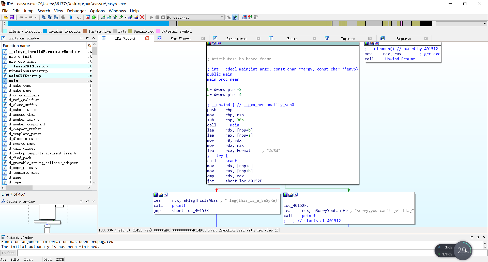
其实直接看到flag，但还是具体来分析一下

首先输入两个输入两个int类型的数，然后比较，如果不相等，则跳转到loc_40152F，并输出sorry,youcan't get flag；如果相等，则继续执行，输出flag。

反汇编代码如下：

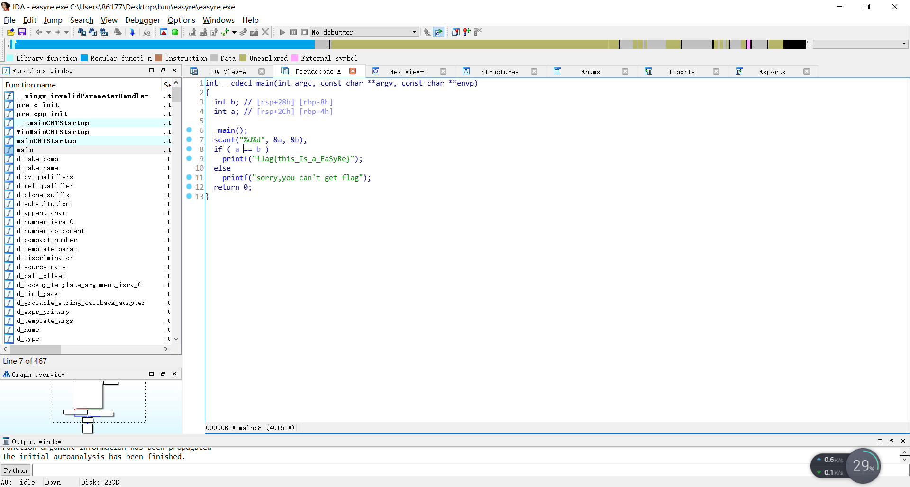
与之前分析的还是如出一辙。

## 2.reverse1

下载EXE，cmd打开，输入后发现输出wrong


拖入IDA打开后发现找不到入口，查找字符串发现有类似flag的东西，之后一个个函数查看，发现sub_140011bC0出有异样


关键代码第二个for循环处，大致含义是将str2字符串的字母o改为数字零（111和48的ASCII码分别为o和0，IDA中按R即可转换）

str2为：

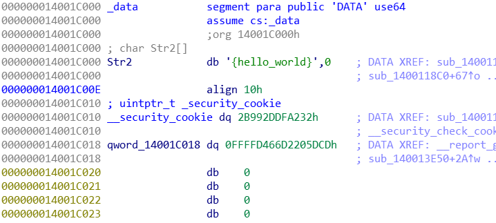
输入flag，正确：


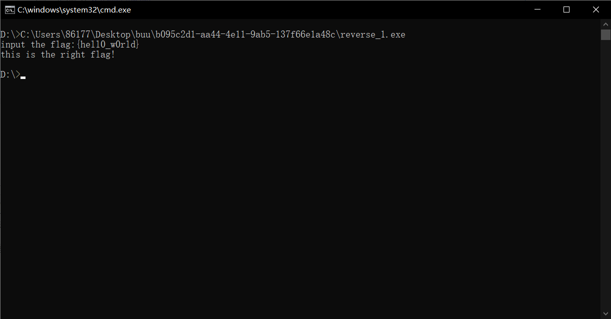


## 3.reverse2

下载打开后发现无后缀名，拖入winhex查看：


是Linux下可执行文件，执行查看：

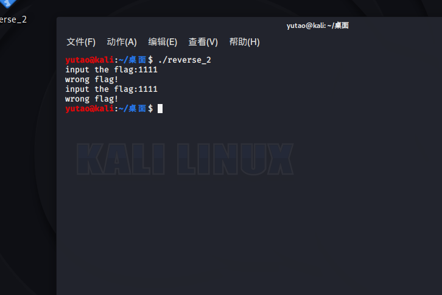
拖入IDA查看


大致含义即为将i和r替换成为1，输入，得到flag。

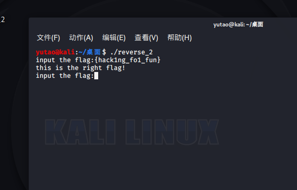

## 4.内涵的软件

下载文件，cmd打开


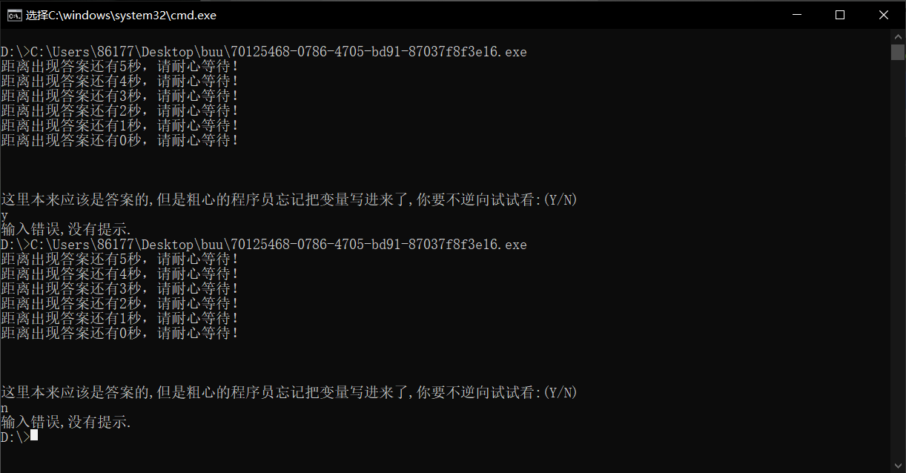
拖入IDA查看


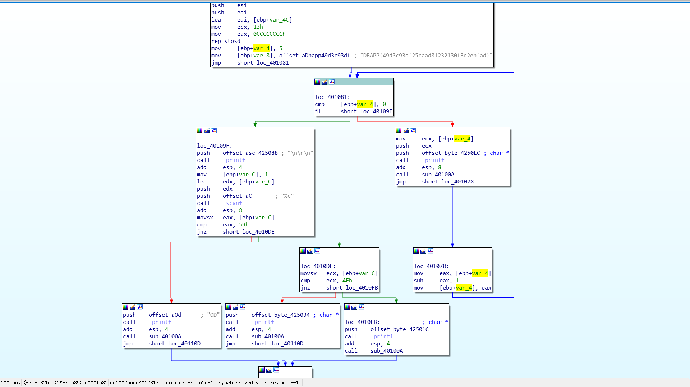
直接可以看到flag，但还是分析一波


额。。好像和v2没啥关系。。flag对就完事了

## 5.新年快乐

下载EXE后运行


拖入IDA发现有壳，peid查壳


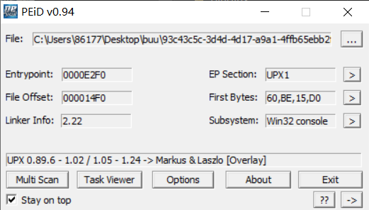
upx -d 脱壳

// 刚学PE没多久，upx壳的话。。先往后稍稍，这个是网上查的。


拖入ida


得到flag


## 6.[BJDCTF2nd]guessgame

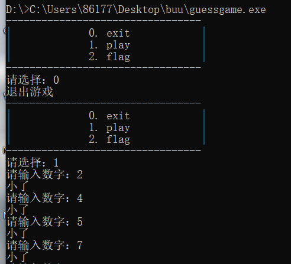
shift+F12直接看到flag。。。

## 7.helloworld

没学过apk逆向，网上翻了下其他的wp，apkkiller打开

字符串中看到flag：


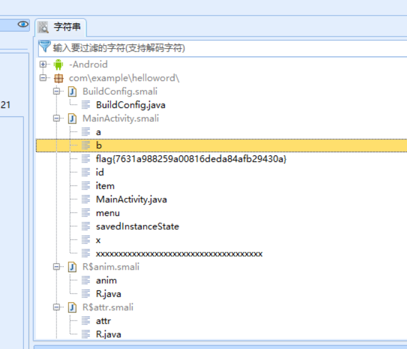
## 8.XOR

拖入IDA


global：


shift+e提取：


代码如下：


第一次自己写，不会py，所以用c写的，也就那样，凑合着看吧...

## 9.reserve3

下载打开


丢进IDA


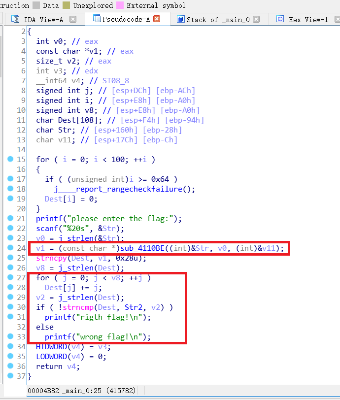
经过一个sub_4110BE函数，然后for循环，之后再与str2比较，str2如下：

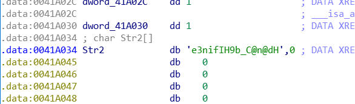
跟进sub_4110BE:

```c
void *__cdecl sub_411AB0(char *a1, unsigned int a2, int *a3)
{
  int v4; // STE0_4
  int v5; // STE0_4
  int v6; // STE0_4
  int v7; // [esp+D4h] [ebp-38h]
  signed int i; // [esp+E0h] [ebp-2Ch]
  unsigned int v9; // [esp+ECh] [ebp-20h]
  int v10; // [esp+ECh] [ebp-20h]
  signed int v11; // [esp+ECh] [ebp-20h]
  void *Dst; // [esp+F8h] [ebp-14h]
  char *v13; // [esp+104h] [ebp-8h]

  if ( !a1 || !a2 )
    return 0;
  v9 = a2 / 3;
  if ( (signed int)(a2 / 3) % 3 )
    ++v9;
  v10 = 4 * v9;
  *a3 = v10;
  Dst = malloc(v10 + 1);
  if ( !Dst )
    return 0;
  j_memset(Dst, 0, v10 + 1);
  v13 = a1;
  v11 = a2;
  v7 = 0;
  while ( v11 > 0 )
  {
    byte_41A144[2] = 0;
    byte_41A144[1] = 0;
    byte_41A144[0] = 0;
    for ( i = 0; i < 3 && v11 >= 1; ++i )
    {
      byte_41A144[i] = *v13;
      --v11;
      ++v13;
    }
    if ( !i )
      break;
    switch ( i )
    {
      case 1:
        *((_BYTE *)Dst + v7) = aAbcdefghijklmn[(signed int)(unsigned __int8)byte_41A144[0] >> 2];
        v4 = v7 + 1;
        *((_BYTE *)Dst + v4++) = aAbcdefghijklmn[((byte_41A144[1] & 0xF0) >> 4) | 16 * (byte_41A144[0] & 3)];
        *((_BYTE *)Dst + v4++) = aAbcdefghijklmn[64];
        *((_BYTE *)Dst + v4) = aAbcdefghijklmn[64];
        v7 = v4 + 1;
        break;
      case 2:
        *((_BYTE *)Dst + v7) = aAbcdefghijklmn[(signed int)(unsigned __int8)byte_41A144[0] >> 2];
        v5 = v7 + 1;
        *((_BYTE *)Dst + v5++) = aAbcdefghijklmn[((byte_41A144[1] & 0xF0) >> 4) | 16 * (byte_41A144[0] & 3)];
        *((_BYTE *)Dst + v5++) = aAbcdefghijklmn[((byte_41A144[2] & 0xC0) >> 6) | 4 * (byte_41A144[1] & 0xF)];
        *((_BYTE *)Dst + v5) = aAbcdefghijklmn[64];
        v7 = v5 + 1;
        break;
      case 3:
        *((_BYTE *)Dst + v7) = aAbcdefghijklmn[(signed int)(unsigned __int8)byte_41A144[0] >> 2];
        v6 = v7 + 1;
        *((_BYTE *)Dst + v6++) = aAbcdefghijklmn[((byte_41A144[1] & 0xF0) >> 4) | 16 * (byte_41A144[0] & 3)];
        *((_BYTE *)Dst + v6++) = aAbcdefghijklmn[((byte_41A144[2] & 0xC0) >> 6) | 4 * (byte_41A144[1] & 0xF)];
        *((_BYTE *)Dst + v6) = aAbcdefghijklmn[byte_41A144[2] & 0x3F];
        v7 = v6 + 1;
        break;
    }
  }
  *((_BYTE *)Dst + v7) = 0;
  return Dst;
}

```

感觉挺像base64，而且 

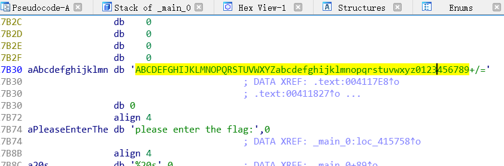
那应该是就是了，恰巧之前了解过base64，具体如下：

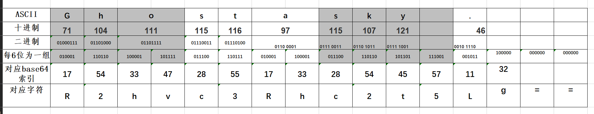
不会py，还是c


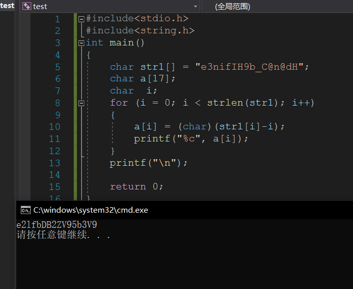
，之后base64 解密得到flag

## 10.不一样的flag

下载打开：


```c
int __cdecl main(int argc, const char **argv, const char **envp)
{
  char v3; // [esp+17h] [ebp-35h]
  int v4; // [esp+30h] [ebp-1Ch]
  int v5; // [esp+34h] [ebp-18h]
  signed int v6; // [esp+38h] [ebp-14h]
  int i; // [esp+3Ch] [ebp-10h]
  int v8; // [esp+40h] [ebp-Ch]

  __main();
  v4 = 0;
  v5 = 0;
  qmemcpy(&v3, _data_start__, 0x19u);
  while ( 1 )
  {
    puts("you can choose one action to execute");
    puts("1 up");
    puts("2 down");
    puts("3 left");
    printf("4 right\n:");
    scanf("%d", &v6);
    if ( v6 == 2 )
    {
      ++v4;
    }
    else if ( v6 > 2 )
    {
      if ( v6 == 3 )
      {
        --v5;
      }
      else
      {
        if ( v6 != 4 )
LABEL_13:
          exit(1);
        ++v5;
      }
    }
    else
    {
      if ( v6 != 1 )
        goto LABEL_13;
      --v4;
    }
    for ( i = 0; i <= 1; ++i )
    {
      if ( *(&v4 + i) < 0 || *(&v4 + i) > 4 )
        exit(1);
    }
    if ( *(&v8 + 5 * v4 + v5 - 41) == '1' )
      exit(1);
    if ( *(&v8 + 5 * v4 + v5 - 41) == '#' )
    {
      puts("\nok, the order you enter is the flag!");
      exit(0);
    }
  }
}
```


之前做过一道走迷宫的题，感觉挺像，而且：


只要是1就退出，是#就puts()

```
	*1111
	01000
	01010
	00010
	1111#
```

就是走迷宫，得到flag.

## 11.SimpleRev

拖入ida看，

```c
int __cdecl __noreturn main(int argc, const char **argv, const char **envp)                         
{                                                                                                   
  int v3; // eax                                                                                    
  char v4; // [rsp+Fh] [rbp-1h]                                                                     
                                                                                                    
  while ( 1 )                                                                                       
  {                                                                                                 
    while ( 1 )                                                                                     
    {                                                                                               
      printf("Welcome to CTF game!\nPlease input d/D to start or input q/Q to quit this program: ", argv, envp);
      v4 = getchar();                                                                               
      if ( v4 != 100 && v4 != 68 )                                                                  
        break;                                                                                      
      Decry();                                                                                      
    }                                                                                               
    if ( v4 == 113 || v4 == 81 )                                                                    
      Exit();                                                                                       
    puts("Input fault format!");                                                                    
    v3 = getchar();                                                                                 
    putchar(v3);                                                                                    
  }                                                                                                 
}          
```

关键代码是Decry()

```c


unsigned __int64 Decry()
{
  char v1; // [rsp+Fh] [rbp-51h]
  int v2; // [rsp+10h] [rbp-50h]
  int v3; // [rsp+14h] [rbp-4Ch]
  int i; // [rsp+18h] [rbp-48h]
  int v5; // [rsp+1Ch] [rbp-44h]
  char src[8]; // [rsp+20h] [rbp-40h]
  __int64 v7; // [rsp+28h] [rbp-38h]
  int v8; // [rsp+30h] [rbp-30h]
  __int64 v9; // [rsp+40h] [rbp-20h]
  __int64 v10; // [rsp+48h] [rbp-18h]
  int v11; // [rsp+50h] [rbp-10h]
  unsigned __int64 v12; // [rsp+58h] [rbp-8h]

  v12 = __readfsqword('(');
  *(_QWORD *)src = 'SLCDN';
  v7 = 0LL;
  v8 = 0;
  v9 = 'wodah';
  v10 = 0LL;
  v11 = 0;
  text = join(key3, (const char *)&v9);         // text = killshadow
  strcpy(key, key1);
  strcat(key, src);                             // key = ADSFKNDCLS
  v2 = 0;
  v3 = 0;
  getchar();
  v5 = strlen(key);                             // v5长度 10
  for ( i = 0; i < v5; ++i )
  {
    if ( key[v3 % v5] > 64 && key[v3 % v5] <= 90 )//大小写转换
      key[i] = key[v3 % v5] + 32;               // key = adsfkndcls
    ++v3;
  }
  printf("Please input your flag:", src);
  while ( 1 )
  {
    v1 = getchar();
    if ( v1 == '\n' )
      break;
    if ( v1 == ' ' )                            //如果getchar为空格，v2加1
    {
      ++v2;
    }
    else
    {
      if ( v1 <= '`' || v1 > 'z' )              // 如果v1不是小写字母
      {
        if ( v1 > '@' && v1 <= 'Z' )            // 如果v1为大写字母
          str2[v2] = (v1 - 39 - key[v3++ % v5] + 97) % 26 + 97;// 处理str2[v2],转换为小写字母

      }
      else                                      // 如果是小写字母
      {
        str2[v2] = (v1 - 39 - key[v3++ % v5] + 97) % 26 + 97;
      }
      if ( !(v3 % v5) )
        putchar(' ');
      ++v2;
    }
  }
  if ( !strcmp(text, str2) )                    // 如果两个值相同，则congratulation
    puts("Congratulation!\n");
  else
    puts("Try again!\n");
  return __readfsqword(40u) ^ v12;
}

```

其中的join()：


代码：

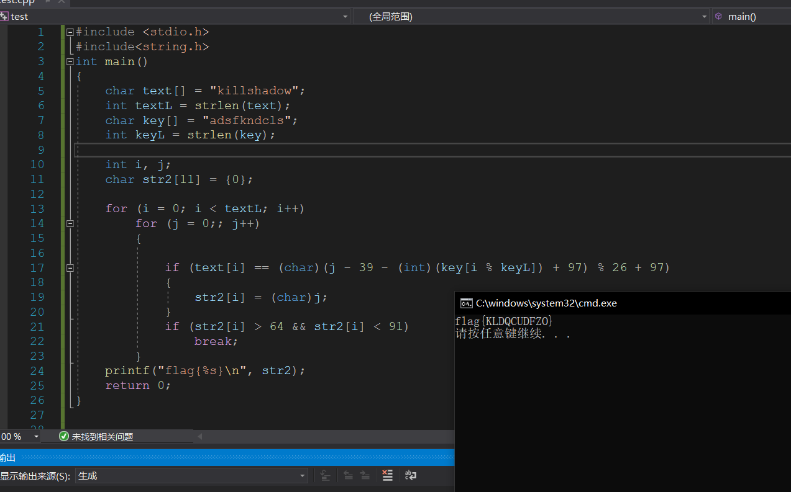
这个代码我这个菜狗写了半天，再看看人家py的代码短的一批，py要赶紧学了....

## 12.Java逆向解密

不太会Java，看了看网上WP说是要jd-gui的一个软件，打开：


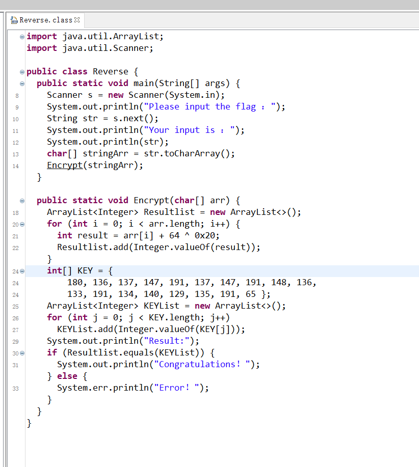
Java不太会，差不多就是逐个将输入的字符加上@的ascii码再异或32，然后和KEY比较，


目前就先干这么多吧，赶紧先把py学一学，用c写代码太...

