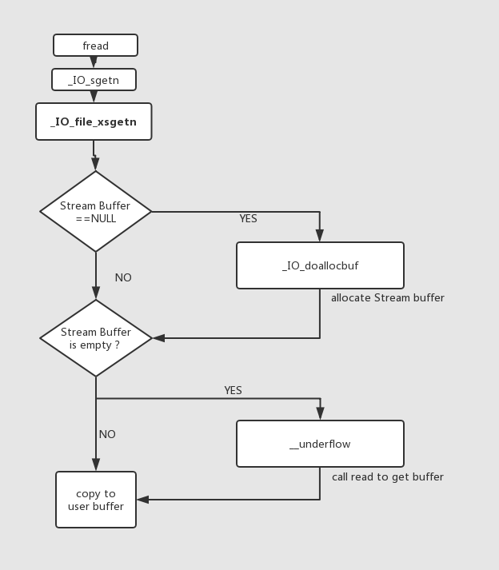

[TOC]

开始干\_\_IO\_FILE。会依次调fopen,fwrite,fread之类的IO函数的源码。


# IO_FILE之fopen详解

## demo程序

```c
#include<stdio.h>
int main()
{
    FILE*fp=fopen("test","wb");
    char *ptr=malloc(0x20);
    return 0;
}
```

## 源码分析

跟进去之后可以看到fopen实际是`_IO_new_fopen`函数。它调用的是`__fopen_internal`

```shell
─────────────────────────────────────────────────────────────────────────────────────────────[ SOURCE (CODE) ]──────────────────────────────────────────────────────────────────────────────────────────────
In file: /usr/src/glibc/glibc-2.23/libio/iofopen.c
    91   return NULL;
    92 }
    93 
    94 _IO_FILE *
    95 _IO_new_fopen (const char *filename, const char *mode)
 ►  96 {
    97   return __fopen_internal (filename, mode, 1);
    98 }
    99 
   100 #ifdef _LIBC
   101 strong_alias (_IO_new_fopen, __new_fopen)

```

跟进`__fopen_internal`看下

```c
_IO_FILE *__fopen_internal (const char *filename, const char *mode, int is32)
{
  struct locked_FILE
  {
    struct _IO_FILE_plus fp;
#ifdef _IO_MTSAFE_IO
    _IO_lock_t lock;
#endif
    struct _IO_wide_data wd;
  } *new_f = (struct locked_FILE *) malloc (sizeof (struct locked_FILE));
    //step1:分配内存
    

  if (new_f == NULL)
    return NULL;
#ifdef _IO_MTSAFE_IO
  new_f->fp.file._lock = &new_f->lock;
#endif
#if defined _LIBC || defined _GLIBCPP_USE_WCHAR_T
  _IO_no_init (&new_f->fp.file, 0, 0, &new_f->wd, &_IO_wfile_jumps);
  //step2:NULL初始化结构体数组  
    
#else
  _IO_no_init (&new_f->fp.file, 1, 0, NULL, NULL);
#endif
  _IO_JUMPS (&new_f->fp) = &_IO_file_jumps;// 设置vtable为_IO_file_jumps
  _IO_file_init (&new_f->fp);//step3:将file结构体链接进去_IO_list_all
#if  !_IO_UNIFIED_JUMPTABLES
  new_f->fp.vtable = NULL;
#endif
  //打开文件
  if (_IO_file_fopen ((_IO_FILE *) new_f, filename, mode, is32) != NULL)
    return __fopen_maybe_mmap (&new_f->fp.file);

  _IO_un_link (&new_f->fp);
  free (new_f);
  return NULL;
}
```

>   整个`__fopen_internal`函数包含四个部分：
>
>   1.  malloc分配内存
>   2.  `_IO_no_init` 对file结构体进行`null`初始化。
>   3.  `_IO_file_init`将结构体链接进`_IO_list_all`链表。
>   4.  `_IO_file_fopen`执行系统调用打开文件。


### step1:malloc分配内存空间

可以看到先malloc了 `sizeof (struct locked_FILE)`大小的结构体，x64中为0x230，包含了三个结构体：`_IO_FILE_plus`，`_IO_lock_t`，`_IO_wide_data`。分别为fp，lock，wd。

```shell
pwndbg> print new_f
$3 = (struct locked_FILE *) 0x602010
pwndbg> x/10gx 0x602010-0x10
0x602000:	0x0000000000000000	0x0000000000000231
0x602010:	0x0000000000000000	0x0000000000000000
0x602020:	0x0000000000000000	0x0000000000000000
0x602030:	0x0000000000000000	0x0000000000000000
0x602040:	0x0000000000000000	0x0000000000000000
pwndbg> print *new_f
$2 = {
  fp = {
    file = {
      _flags = 0, 
      _IO_read_ptr = 0x0, 
      _IO_read_end = 0x0, 
      _IO_read_base = 0x0, 
      _IO_write_base = 0x0, 
      _IO_write_ptr = 0x0, 
      _IO_write_end = 0x0, 
      _IO_buf_base = 0x0, 
      _IO_buf_end = 0x0, 
      _IO_save_base = 0x0, 
      _IO_backup_base = 0x0, 
      _IO_save_end = 0x0, 
      _markers = 0x0, 
      _chain = 0x0, 
      _fileno = 0, 
      _flags2 = 0, 
      _old_offset = 0, 
      _cur_column = 0, 
      _vtable_offset = 0 '\000', 
      _shortbuf = "", 
      _lock = 0x0, 
      _offset = 0, 
      _codecvt = 0x0, 
      _wide_data = 0x0, 
      _freeres_list = 0x0, 
      _freeres_buf = 0x0, 
      __pad5 = 0, 
      _mode = 0, 
      _unused2 = '\000' <repeats 19 times>
    }, 
    vtable = 0x0
  }, 
  lock = {
    lock = 0, 
    cnt = 0, 
    owner = 0x0
  }, 
  wd = {
    _IO_read_ptr = 0x0, 
    _IO_read_end = 0x0, 
    _IO_read_base = 0x0, 
    _IO_write_base = 0x0, 
    _IO_write_ptr = 0x0, 
    _IO_write_end = 0x0, 
    _IO_buf_base = 0x0, 
    _IO_buf_end = 0x0, 
    _IO_save_base = 0x0, 
    _IO_backup_base = 0x0, 
    _IO_save_end = 0x0, 
    _IO_state = {
      __count = 0, 
      __value = {
        __wch = 0, 
        __wchb = "\000\000\000"
      }
    }, 
    _IO_last_state = {
      __count = 0, 
      __value = {
        __wch = 0, 
        __wchb = "\000\000\000"
      }
    }, 
    _codecvt = {
      __codecvt_destr = 0x0, 
      __codecvt_do_out = 0x0, 
      __codecvt_do_unshift = 0x0, 
      __codecvt_do_in = 0x0, 
      __codecvt_do_encoding = 0x0, 
      __codecvt_do_always_noconv = 0x0, 
      __codecvt_do_length = 0x0, 
      __codecvt_do_max_length = 0x0, 
      __cd_in = {
        __cd = {
          __nsteps = 0, 
          __steps = 0x0, 
          __data = 0x6021b8
        }, 
        __combined = {
          __cd = {
            __nsteps = 0, 
            __steps = 0x0, 
            __data = 0x6021b8
          }, 
          __data = {
            __outbuf = 0x0, 
            __outbufend = 0x0, 
            __flags = 0, 
            __invocation_counter = 0, 
            __internal_use = 0, 
            __statep = 0x0, 
            __state = {
              __count = 0, 
              __value = {
                __wch = 0, 
                __wchb = "\000\000\000"
              }
            }
          }
        }
      }, 
      __cd_out = {
        __cd = {
          __nsteps = 0, 
          __steps = 0x0, 
          __data = 0x6021f8
        }, 
        __combined = {
          __cd = {
            __nsteps = 0, 
            __steps = 0x0, 
            __data = 0x6021f8
          }, 
          __data = {
            __outbuf = 0x0, 
            __outbufend = 0x0, 
            __flags = 0, 
            __invocation_counter = 0, 
            __internal_use = 0, 
            __statep = 0x0, 
            __state = {
              __count = 0, 
              __value = {
                __wch = 0, 
                __wchb = "\000\000\000"
              }
            }
          }
        }
      }
    }, 
    _shortbuf = L"", 
    _wide_vtable = 0x0
  }
}

```

### step2:_IO_no_init 对file结构体进行null初始化

分配完后，调用了`_IO_no_init`初始化改结构体

跟进去，在`/libio/genops.c`中

```c
void _IO_old_init (_IO_FILE *fp, int flags)
{
  fp->_flags = _IO_MAGIC|flags;
  fp->_flags2 = 0;
  fp->_IO_buf_base = NULL;
  fp->_IO_buf_end = NULL;
  fp->_IO_read_base = NULL;
  fp->_IO_read_ptr = NULL;
  fp->_IO_read_end = NULL;
  fp->_IO_write_base = NULL;
  fp->_IO_write_ptr = NULL;
  fp->_IO_write_end = NULL;
  fp->_chain = NULL; /* Not necessary. */

  fp->_IO_save_base = NULL;
  fp->_IO_backup_base = NULL;
  fp->_IO_save_end = NULL;
  fp->_markers = NULL;
  fp->_cur_column = 0;
#if _IO_JUMPS_OFFSET
  fp->_vtable_offset = 0;
#endif
#ifdef _IO_MTSAFE_IO
  if (fp->_lock != NULL)
    _IO_lock_init (*fp->_lock);
#endif
}

void _IO_no_init (_IO_FILE *fp, int flags, int orientation,
	     struct _IO_wide_data *wd, const struct _IO_jump_t *jmp)
{
  _IO_old_init (fp, flags);
  fp->_mode = orientation;
#if defined _LIBC || defined _GLIBCPP_USE_WCHAR_T
  if (orientation >= 0)
    {
      //初始化_wide_data字段
      fp->_wide_data = wd;
      fp->_wide_data->_IO_buf_base = NULL;
      fp->_wide_data->_IO_buf_end = NULL;
      fp->_wide_data->_IO_read_base = NULL;
      fp->_wide_data->_IO_read_ptr = NULL;
      fp->_wide_data->_IO_read_end = NULL;
      fp->_wide_data->_IO_write_base = NULL;
      fp->_wide_data->_IO_write_ptr = NULL;
      fp->_wide_data->_IO_write_end = NULL;
      fp->_wide_data->_IO_save_base = NULL;
      fp->_wide_data->_IO_backup_base = NULL;
      fp->_wide_data->_IO_save_end = NULL;

      fp->_wide_data->_wide_vtable = jmp;
    }
  else
    /* Cause predictable crash when a wide function is called on a byte
       stream.  */
    fp->_wide_data = (struct _IO_wide_data *) -1L;
#endif
  fp->_freeres_list = NULL;
}
```

初始化了`locked_FILE`结构体中的`_IO_FILE_plus`结构体，以及其中的`_wide_data`字段，执行完`IO_no_init`后： 

```shell
pwndbg> print new_f->fp
$4 = {
  file = {
    _flags = -72548352, 
    _IO_read_ptr = 0x0, 
    _IO_read_end = 0x0, 
    _IO_read_base = 0x0, 
    _IO_write_base = 0x0, 
    _IO_write_ptr = 0x0, 
    _IO_write_end = 0x0, 
    _IO_buf_base = 0x0, 
    _IO_buf_end = 0x0, 
    _IO_save_base = 0x0, 
    _IO_backup_base = 0x0, 
    _IO_save_end = 0x0, 
    _markers = 0x0, 
    _chain = 0x0, 
    _fileno = 0, 
    _flags2 = 0, 
    _old_offset = 0, 
    _cur_column = 0, 
    _vtable_offset = 0 '\000', 
    _shortbuf = "", 
    _lock = 0x6020f0, 
    _offset = 0, 
    _codecvt = 0x0, 
    _wide_data = 0x602100, 
    _freeres_list = 0x0, 
    _freeres_buf = 0x0, 
    __pad5 = 0, 
    _mode = 0, 
    _unused2 = '\000' <repeats 19 times>
  }, 
  vtable = 0x0
}

```

### step3: \_IO\_file\_init将结构体链接进_IO_list_all

回到`__fopen_internal`后，函数将`_IO_FILE_plus`结构体的vtable设置成了`_IO_file_jumps`，然后调用`_IO_file_init`将`_IO_FILE_plus`结构体链接进入`_IO_list_all`链表，跟进去后：


```c
void _IO_new_file_init (struct _IO_FILE_plus *fp)
{
  fp->file._offset = _IO_pos_BAD;
  fp->file._IO_file_flags |= CLOSED_FILEBUF_FLAGS;
  //调用_IO_link_in并设置_fileno
  _IO_link_in (fp);
  fp->file._fileno = -1;
}
libc_hidden_ver (_IO_new_file_init, _IO_file_init)
```

```shell
pwndbg> print *fp
$9 = {
  file = {
    _flags = -72548352, 
    _IO_read_ptr = 0x0, 
    _IO_read_end = 0x0, 
    _IO_read_base = 0x0, 
    _IO_write_base = 0x0, 
    _IO_write_ptr = 0x0, 
    _IO_write_end = 0x0, 
    _IO_buf_base = 0x0, 
    _IO_buf_end = 0x0, 
    _IO_save_base = 0x0, 
    _IO_backup_base = 0x0, 
    _IO_save_end = 0x0, 
    _markers = 0x0, 
    _chain = 0x0, 
    _fileno = 0, 
    _flags2 = 0, 
    _old_offset = 0, 
    _cur_column = 0, 
    _vtable_offset = 0 '\000', 
    _shortbuf = "", 
    _lock = 0x6020f0, 
    _offset = 0, 
    _codecvt = 0x0, 
    _wide_data = 0x602100, 
    _freeres_list = 0x0, 
    _freeres_buf = 0x0, 
    __pad5 = 0, 
    _mode = 0, 
    _unused2 = '\000' <repeats 19 times>
  }, 
  vtable = 0x7ffff7dd06e0 <_IO_file_jumps>
}
```

继续跟`_IO_link_in`：

```c
void
_IO_link_in (struct _IO_FILE_plus *fp)
{
    //检查_flags标志位是否是_IO_LINKED
  if ((fp->file._flags & _IO_LINKED) == 0)
    {
      //设置标志位
      fp->file._flags |= _IO_LINKED;
#ifdef _IO_MTSAFE_IO
      _IO_cleanup_region_start_noarg (flush_cleanup);
      _IO_lock_lock (list_all_lock);
      run_fp = (_IO_FILE *) fp;
      _IO_flockfile ((_IO_FILE *) fp);
#endif
      fp->file._chain = (_IO_FILE *) _IO_list_all;
      _IO_list_all = fp;
      ++_IO_list_all_stamp;
#ifdef _IO_MTSAFE_IO
      _IO_funlockfile ((_IO_FILE *) fp);
      run_fp = NULL;
      _IO_lock_unlock (list_all_lock);
      _IO_cleanup_region_end (0);
#endif
    }
}
libc_hidden_def (_IO_link_in)
```

FILE结构体是通过`_IO_list_all`的单链表来进行管理的 ，这里`_IO_link_in`是检查FILE结构体是否包含`_IO_LINKED`标志，如果不包含则表示这个结构体没有链接进`_IO_list_all`，之后会将它链接进`_IO_list_all`链表，同时设置`_chain`为之前的链表的值。

```
pwndbg> print _IO_list_all
$10 = (struct _IO_FILE_plus *) 0x7ffff7dd2540 <_IO_2_1_stderr_>
pwndbg> print _IO_list_all
$11 = (struct _IO_FILE_plus *) 0x602010
pwndbg> print *fp
$12 = {
  file = {
    _flags = -72538996, 
    _IO_read_ptr = 0x0, 
    _IO_read_end = 0x0, 
    _IO_read_base = 0x0, 
    _IO_write_base = 0x0, 
    _IO_write_ptr = 0x0, 
    _IO_write_end = 0x0, 
    _IO_buf_base = 0x0, 
    _IO_buf_end = 0x0, 
    _IO_save_base = 0x0, 
    _IO_backup_base = 0x0, 
    _IO_save_end = 0x0, 
    _markers = 0x0, 
    _chain = 0x7ffff7dd2540 <_IO_2_1_stderr_>, 
    _fileno = 0, 
    _flags2 = 0, 
    _old_offset = 0, 
    _cur_column = 0, 
    _vtable_offset = 0 '\000', 
    _shortbuf = "", 
    _lock = 0x6020f0, 
    _offset = -1, 
    _codecvt = 0x0, 
    _wide_data = 0x602100, 
    _freeres_list = 0x0, 
    _freeres_buf = 0x0, 
    __pad5 = 0, 
    _mode = 0, 
    _unused2 = '\000' <repeats 19 times>
  }, 
  vtable = 0x7ffff7dd06e0 <_IO_file_jumps>
}
```

可以看到没有执行`_IO_file_init`的时候指向`stderr`结构体，执行后指向申请出来的结构体。

并且`_chain`指向`stderr`结构体。

### step4:_IO_file_fopen打开文件句柄

之后回到，继续跟进


```c
_IO_FILE * _IO_new_file_fopen (_IO_FILE *fp, const char *filename, const char *mode, int is32not64)
{
  int oflags = 0, omode;
  int read_write;
  int oprot = 0666;
  int i;
  _IO_FILE *result;
#ifdef _LIBC
  const char *cs;
  const char *last_recognized;
#endif
  //检查文件是否已打开
  if (_IO_file_is_open (fp))
    return 0;
  //设置打开模式
  switch (*mode)
    {
    case 'r':
      omode = O_RDONLY;
      read_write = _IO_NO_WRITES;
      break;
	...
    }
  //调用_IO_file_open
  result = _IO_file_open (fp, filename, omode|oflags, oprot, read_write,
			  is32not64);
  ...
}
libc_hidden_ver (_IO_new_file_fopen, _IO_file_fopen)
```

检查是否打开，之后设置打开模式，然后调用`_IO_file_open`继续跟进：

```c
_IO_FILE *
_IO_file_open (_IO_FILE *fp, const char *filename, int posix_mode, int prot,
	       int read_write, int is32not64)
{
  int fdesc;
#ifdef _LIBC
  if (__glibc_unlikely (fp->_flags2 & _IO_FLAGS2_NOTCANCEL))
    fdesc = open_not_cancel (filename,
			     posix_mode | (is32not64 ? 0 : O_LARGEFILE), prot);
  else
    //调用系统函数open打开文件
    fdesc = open (filename, posix_mode | (is32not64 ? 0 : O_LARGEFILE), prot);
#else
  fdesc = open (filename, posix_mode, prot);
#endif
  if (fdesc < 0)
    return NULL;
  //将文件描述符写到_fileno字段里
  fp->_fileno = fdesc;
  _IO_mask_flags (fp, read_write,_IO_NO_READS+_IO_NO_WRITES+_IO_IS_APPENDING);
  /* For append mode, send the file offset to the end of the file.  Don't
     update the offset cache though, since the file handle is not active.  */
  if ((read_write & (_IO_IS_APPENDING | _IO_NO_READS))
      == (_IO_IS_APPENDING | _IO_NO_READS))
    {
      _IO_off64_t new_pos = _IO_SYSSEEK (fp, 0, _IO_seek_end);
      if (new_pos == _IO_pos_BAD && errno != ESPIPE)
	{
	  close_not_cancel (fdesc);
	  return NULL;
	}
    }
  //调用_IO_link_in
  _IO_link_in ((struct _IO_FILE_plus *) fp);
  return fp;
}
libc_hidden_def (_IO_file_open)
```

执行完后可以看到`_fileno`已经被设置：

```shell
pwndbg> print new_f->fp
$17 = {
  file = {
    _flags = -72539004, 
    _IO_read_ptr = 0x0, 
    _IO_read_end = 0x0, 
    _IO_read_base = 0x0, 
    _IO_write_base = 0x0, 
    _IO_write_ptr = 0x0, 
    _IO_write_end = 0x0, 
    _IO_buf_base = 0x0, 
    _IO_buf_end = 0x0, 
    _IO_save_base = 0x0, 
    _IO_backup_base = 0x0, 
    _IO_save_end = 0x0, 
    _markers = 0x0, 
    _chain = 0x7ffff7dd2540 <_IO_2_1_stderr_>, 
    _fileno = 3, 
    _flags2 = 0, 
    _old_offset = 0, 
    _cur_column = 0, 
    _vtable_offset = 0 '\000', 
    _shortbuf = "", 
    _lock = 0x6020f0, 
    _offset = -1, 
    _codecvt = 0x0, 
    _wide_data = 0x602100, 
    _freeres_list = 0x0, 
    _freeres_buf = 0x0, 
    __pad5 = 0, 
    _mode = 0, 
    _unused2 = '\000' <repeats 19 times>
  }, 
  vtable = 0x7ffff7dd06e0 <_IO_file_jumps>
}

```

## 小结

fopen的流程：

>   1.  malloc
>   2.  `_IO_no_init`初始化
>   3.  `_IO_file_init`将结构体链接进`_IO_list_all`链表
>   4.  `_IO_file_fopen`进行系统调用打开文件

整个流程还是比较简单的，fopen返回之后`_IO_list_all`链表指向返回的FILE结构体，且FILE结构体的_chain字段指向之前的结构体（没有其他额外打开文件的话，将是指向`stderr`），同时其他的字段大多都是默认的null值，`vtable`存储的是`__GI__IO_file_jumps`函数表，

# IO_FILE之fread详解

上面写了fopen的分析，讲了系统是如何为FILE结构体分配内存并将其链接进`_IO_list_all`中的。

本次来讲fread，实现从文件读数据。下面是本次fread的流程图：



fread的大致流程：

fread调用`_IO_sgetn`，之后`_IO_sgetn`调用vtable中的`_IO_XSGETN`也就是

`_IO_file_xsgetn`，这个是fread的核心，简单流程：

1.  判断`fp->_IO_buf_base`输入缓冲区 是否为空，如果为空则调用`_IO_doallocbuf`初始化输入缓冲区
2.  分配完输入缓冲区或者输入缓冲区不为空的情况下，判断输入缓冲区中是否有数据
3.  如果有数据，直接拷贝到用户缓冲区，如果没有或不够则调用`__underflow`执行系统调用读取数据到输入缓冲区，再拷贝到用户缓冲区

## demo

```c
#include<stdio.h>
int main(){
    char data[20];
    FILE*fp=fopen("test","rb");
    fread(data,1,20,fp);
    return 0;
}
```


## 源码分析

进到fread，看到调用了`_IO_fread`

先看下FILE结构体的fp内容，可以看到`_IO_read_ptr`、`_IO_buf_base`等还是空的，后面的分析的重要的步骤也是看这些指针如何被赋值以及发挥作用的。

```shell
pwndbg> print *_IO_list_all
$2 = {
  file = {
    _flags = -72539000, 
    _IO_read_ptr = 0x0, 
    _IO_read_end = 0x0, 
    _IO_read_base = 0x0, 
    _IO_write_base = 0x0, 
    _IO_write_ptr = 0x0, 
    _IO_write_end = 0x0, 
    _IO_buf_base = 0x0, 
    _IO_buf_end = 0x0, 
    _IO_save_base = 0x0, 
    _IO_backup_base = 0x0, 
    _IO_save_end = 0x0, 
    _markers = 0x0, 
    _chain = 0x7ffff7dd2540 <_IO_2_1_stderr_>, 
    _fileno = 3, 
    _flags2 = 0, 
    _old_offset = 0, 
    _cur_column = 0, 
    _vtable_offset = 0 '\000', 
    _shortbuf = "", 
    _lock = 0x6020f0, 
    _offset = -1, 
    _codecvt = 0x0, 
    _wide_data = 0x602100, 
    _freeres_list = 0x0, 
    _freeres_buf = 0x0, 
    __pad5 = 0, 
    _mode = 0, 
    _unused2 = '\000' <repeats 19 times>
  }, 
  vtable = 0x7ffff7dd06e0 <_IO_file_jumps>
}
pwndbg> print *_IO_list_all->vtable
$3 = {
  __dummy = 0, 
  __dummy2 = 0, 
  __finish = 0x7ffff7a869d0 <_IO_new_file_finish>, 
  __overflow = 0x7ffff7a87740 <_IO_new_file_overflow>, 
  __underflow = 0x7ffff7a874b0 <_IO_new_file_underflow>, 
  __uflow = 0x7ffff7a88610 <__GI__IO_default_uflow>, 
  __pbackfail = 0x7ffff7a89990 <__GI__IO_default_pbackfail>, 
  __xsputn = 0x7ffff7a861f0 <_IO_new_file_xsputn>, 
  __xsgetn = 0x7ffff7a85ed0 <__GI__IO_file_xsgetn>, 
  __seekoff = 0x7ffff7a854d0 <_IO_new_file_seekoff>, 
  __seekpos = 0x7ffff7a88a10 <_IO_default_seekpos>, 
  __setbuf = 0x7ffff7a85440 <_IO_new_file_setbuf>, 
  __sync = 0x7ffff7a85380 <_IO_new_file_sync>, 
  __doallocate = 0x7ffff7a7a190 <__GI__IO_file_doallocate>, 
  __read = 0x7ffff7a861b0 <__GI__IO_file_read>, 
  __write = 0x7ffff7a85b80 <_IO_new_file_write>, 
  __seek = 0x7ffff7a85980 <__GI__IO_file_seek>, 
  __close = 0x7ffff7a85350 <__GI__IO_file_close>, 
  __stat = 0x7ffff7a85b70 <__GI__IO_file_stat>, 
  __showmanyc = 0x7ffff7a89b00 <_IO_default_showmanyc>, 
  __imbue = 0x7ffff7a89b10 <_IO_default_imbue>
}

```

fread的调用：

```c
_IO_size_t
_IO_fread (void *buf, _IO_size_t size, _IO_size_t count, _IO_FILE *fp)
{
  _IO_size_t bytes_requested = size * count;
  _IO_size_t bytes_read;
  CHECK_FILE (fp, 0);
  if (bytes_requested == 0)
    return 0;
  _IO_acquire_lock (fp);
    
  //调用_IO_sgetn函数
  bytes_read = _IO_sgetn (fp, (char *) buf, bytes_requested);
  _IO_release_lock (fp);
  return bytes_requested == bytes_read ? count : bytes_read / size;
}
libc_hidden_def (_IO_fread)
```

继续跟进`_IO_sgetn`函数：

```c
_IO_size_t
_IO_sgetn (_IO_FILE *fp, void *data, _IO_size_t n)
{
  /* FIXME handle putback buffer here! */
  return _IO_XSGETN (fp, data, n);
}
libc_hidden_def (_IO_sgetn)
```

可以看到他的调用是`_IO_XSGETN`函数，它的定义：

```c
#define _IO_XSGETN(FP, DATA, N) JUMP2 (__xsgetn, FP, DATA, N)
```

实际就是调用了vtable中的`__xsgetn`函数，继续跟：

```c
_IO_size_t
_IO_file_xsgetn (_IO_FILE *fp, void *data, _IO_size_t n)
{
  _IO_size_t want, have;
  _IO_ssize_t count;
  char *s = data;

  want = n;

  if (fp->_IO_buf_base == NULL)
    {
	  ....
      //step1：如果fp->_IO_buf_base == NULL，调用_IO_doallocbuf
      _IO_doallocbuf (fp);
    }

  while (want > 0)
    {
      have = fp->_IO_read_end - fp->_IO_read_ptr;
      //step2：如果输入缓冲区中已有足够的字符，直接将缓冲区中的字符给目标buf
      if (want <= have)
	{
	  memcpy (s, fp->_IO_read_ptr, want);
	  fp->_IO_read_ptr += want;
	  want = 0;
	}
      else
	{
      //如果缓冲区中有部分字符，但没有达到fread的size，先将已有的拷贝到目标buf
	  if (have > 0)
	    {
#ifdef _LIBC
	      s = __mempcpy (s, fp->_IO_read_ptr, have);
#else
	      memcpy (s, fp->_IO_read_ptr, have);
	      s += have;
#endif
	      want -= have;
	      fp->_IO_read_ptr += have;
	    }

	  /* Check for backup and repeat */
	  if (_IO_in_backup (fp))
	    {
	      _IO_switch_to_main_get_area (fp);
	      continue;
	    }

	  /* If we now want less than a buffer, underflow and repeat
	     the copy.  Otherwise, _IO_SYSREAD directly to
	     the user buffer. */
	  if (fp->_IO_buf_base
	      && want < (size_t) (fp->_IO_buf_end - fp->_IO_buf_base))
	    {
	      if (__underflow (fp) == EOF)
             //step3：如果输入缓冲区不能满足要求，调用__underflow读数据
			break;
	      continue;
	    }

	  .....
  return n - want;
}
libc_hidden_def (_IO_file_xsgetn)
```

函数`_IO_file_xsgetn`是fread的核心，分为以下几个部分：

1.  如果`fp->_IO_buf_base == NULL`，表名输入缓冲区还未建立，调用`_IO_doallocbuf`初始化指针，建立输入缓冲区
2.  输入缓冲区中有数据，即`fp->_IO_read_ptr`小于`fp->_IO_read_end`，直接将输入缓冲区中的内筒拷贝到目标buf
3.  输入缓冲区为空或者不能满足全部的需求，调用`__underflow`调用系统调用读入数据

接下来就是具体介绍这几个部分。


### step1：初始化输入缓冲区

如果`fp->_IO_buf_base == NULL`则调用`_IO_doallocbuf`：

```c
void
_IO_doallocbuf (_IO_FILE *fp)
{
  if (fp->_IO_buf_base)
    return;
  if (!(fp->_flags & _IO_UNBUFFERED) || fp->_mode > 0)
    if (_IO_DOALLOCATE (fp) != EOF)
      return;
  _IO_setb (fp, fp->_shortbuf, fp->_shortbuf+1, 0);
}
libc_hidden_def (_IO_doallocbuf)
```

先检查`fp->_IO_buf_base`是否为空，不为空代表缓冲区已被初始化，直接返回，然后检查`fp->_flags`是不是`_IO_UNBUFFERED`或者`fp->_mode`大于0。

如果满足则执行`_IO_DOALLOCATE`，及调用vtable中的`_IO_file_doallocate`，跟进去看看：

```c
int
_IO_file_doallocate (_IO_FILE *fp)
{
  _IO_size_t size;
  char *p;
  struct stat64 st;

#ifndef _LIBC
  /* If _IO_cleanup_registration_needed is non-zero, we should call the
     function it points to.  This is to make sure _IO_cleanup gets called
     on exit.  We call it from _IO_file_doallocate, since that is likely
     to get called by any program that does buffered I/O. */
  if (__glibc_unlikely (_IO_cleanup_registration_needed != NULL))
    (*_IO_cleanup_registration_needed) ();
#endif

  size = _IO_BUFSIZ;
  if (fp->_fileno >= 0 && __builtin_expect (_IO_SYSSTAT (fp, &st), 0) >= 0)
      //调用_IO_SYSSTAT获取FILE信息
    {
      if (S_ISCHR (st.st_mode))
	{
	  /* Possibly a tty.  */
	  if (
#ifdef DEV_TTY_P
	      DEV_TTY_P (&st) ||
#endif
	      local_isatty (fp->_fileno))
	    fp->_flags |= _IO_LINE_BUF;
	}
#if _IO_HAVE_ST_BLKSIZE
      if (st.st_blksize > 0)
	size = st.st_blksize;
#endif
    }
  p = malloc (size);
  if (__glibc_unlikely (p == NULL))
    return EOF;
  _IO_setb (fp, p, p + size, 1);
  //调用_IO_setb设置缓冲区
  return 1;
}
libc_hidden_def (_IO_file_doallocate)
```

可以看到`_IO_file_doallocate`先调用`_IO_SYSSTAT`获取文件信息（`_IO_SYSSTAT`是vtable中的`_start`函数，获取文件信息，修改相应需要申请的size）：

```shell
pwndbg> print st
$7 = {
  st_dev = 2049, 
  st_ino = 545917, 
  st_nlink = 1, 
  st_mode = 33188, 
  st_uid = 1000, 
  st_gid = 1000, 
  __pad0 = 0, 
  st_rdev = 0, 
  st_size = 0, 
  st_blksize = 4096, 
  st_blocks = 0, 
  st_atim = {
    tv_sec = 1632561914, 
    tv_nsec = 519216733
  }, 
  st_mtim = {
    tv_sec = 1632490672, 
    tv_nsec = 158707989
  }, 
  st_ctim = {
    tv_sec = 1632490672, 
    tv_nsec = 158707989
  }, 
  __glibc_reserved = {0, 0, 0}
}
```

可以看到`st_blksize`为0x1000，malloc之后调用了`_IO_setb`：

```c
void
_IO_setb (_IO_FILE *f, char *b, char *eb, int a)
{
  if (f->_IO_buf_base && !(f->_flags & _IO_USER_BUF))
    free (f->_IO_buf_base);
  f->_IO_buf_base = b;//设置了_IO_buf_base 
  f->_IO_buf_end = eb;//设置_IO_buf_end
  if (a)
    f->_flags &= ~_IO_USER_BUF;
  else
    f->_flags |= _IO_USER_BUF;
}
libc_hidden_def (_IO_setb)
```

设置了`_IO_buf_base`和`_IO_buf_end`，`_IO_setb`执行完后`_IO_buf_base`和`_IO_buf_end`已被赋值：

```c
pwndbg> print *_IO_list_all
$2 = {
  file = {
    _flags = -72539000, 
    _IO_read_ptr = 0x0, 
    _IO_read_end = 0x0, 
    _IO_read_base = 0x0, 
    _IO_write_base = 0x0, 
    _IO_write_ptr = 0x0, 
    _IO_write_end = 0x0, 
    _IO_buf_base = 0x602240 "", 
    _IO_buf_end = 0x603240 "", 
    _IO_save_base = 0x0, 
    _IO_backup_base = 0x0, 
    _IO_save_end = 0x0, 
    _markers = 0x0, 
    _chain = 0x7ffff7dd2540 <_IO_2_1_stderr_>, 
    _fileno = 3, 
    _flags2 = 0, 
    _old_offset = 0, 
    _cur_column = 0, 
    _vtable_offset = 0 '\000', 
    _shortbuf = "", 
    _lock = 0x6020f0, 
    _offset = -1, 
    _codecvt = 0x0, 
    _wide_data = 0x602100, 
    _freeres_list = 0x0, 
    _freeres_buf = 0x0, 
    __pad5 = 0, 
    _mode = 0, 
    _unused2 = '\000' <repeats 19 times>
  }, 
  vtable = 0x7ffff7dd06e0 <_IO_file_jumps>
}
```

初始化之后返回到`_IO_file_doallocate`，然后`_IO_file_doallocate`也执行完成 ，返回到`_IO_file_xsgetn`中。

### step2：拷贝输入缓冲区数据

初始化完成后就到了第二步，拷贝输入缓冲区数据。如果输入缓冲区中已有足够的字符，直接将缓冲区中的字符给目标buf。`fp->_IO_read_ptr`指向的是输入缓冲区的其实地址，`fp->_IO_read_end`指向输入缓冲区的结束。


### step3：执行系统调用读取数据

当输入缓冲区为0或者不能满足需求的时候会执行`__underflow`调用系统调用read读取数据并放到输入缓冲区中：

```c
int
__underflow (_IO_FILE *fp)
{
    //一些检查
#if defined _LIBC || defined _GLIBCPP_USE_WCHAR_T
  if (_IO_vtable_offset (fp) == 0 && _IO_fwide (fp, -1) != -1)
    return EOF;
#endif

  if (fp->_mode == 0)
    _IO_fwide (fp, -1);
  if (_IO_in_put_mode (fp))
    if (_IO_switch_to_get_mode (fp) == EOF)
      return EOF;
  if (fp->_IO_read_ptr < fp->_IO_read_end)
    return *(unsigned char *) fp->_IO_read_ptr;
  if (_IO_in_backup (fp))
    {
      _IO_switch_to_main_get_area (fp);
      if (fp->_IO_read_ptr < fp->_IO_read_end)
	return *(unsigned char *) fp->_IO_read_ptr;
    }
  if (_IO_have_markers (fp))
    {
      if (save_for_backup (fp, fp->_IO_read_end))
	return EOF;
    }
  else if (_IO_have_backup (fp))
    _IO_free_backup_area (fp);
  return _IO_UNDERFLOW (fp);
}
libc_hidden_def (__underflow)
```

其中一个检查是如果`fp->_IO_read_ptr`小于`fp->_IO_read_end`则表明输入缓冲区里存在数据，可直接返回，否则则表示需要继续读入数据。都通过的话会执行`_IO_UNDERFLOW`，它是vtable中的`_IO_new_file_underflow`：

```c
int
_IO_new_file_underflow (_IO_FILE *fp)
{
  _IO_ssize_t count;
  ...
  // 如果存在_IO_NO_READS标志，则直接返回
  if (fp->_flags & _IO_NO_READS)
    {
      fp->_flags |= _IO_ERR_SEEN;
      __set_errno (EBADF);
      return EOF;
    }
  // 如果输入缓冲区里存在数据，则直接返回
  if (fp->_IO_read_ptr < fp->_IO_read_end)
    return *(unsigned char *) fp->_IO_read_ptr;
  ...
  // 如果没有输入缓冲区，则调用_IO_doallocbuf分配输入缓冲区
  if (fp->_IO_buf_base == NULL)
    {
      ...
      _IO_doallocbuf (fp);
    }
  ...
  // 设置FILE结构体指针
  fp->_IO_read_base = fp->_IO_read_ptr = fp->_IO_buf_base;
  fp->_IO_read_end = fp->_IO_buf_base;
  fp->_IO_write_base = fp->_IO_write_ptr = fp->_IO_write_end
    = fp->_IO_buf_base;
  //调用_IO_SYSREAD函数最终执行系统调用读取数据
  count = _IO_SYSREAD (fp, fp->_IO_buf_base,
           fp->_IO_buf_end - fp->_IO_buf_base);
  ...
  // 设置结构体指针
  fp->_IO_read_end += count;
  ...
  return *(unsigned char *) fp->_IO_read_ptr;
}
libc_hidden_ver (_IO_new_file_underflow, _IO_file_underflow)
```

`_IO_new_file_underflow`是最终执行系统调用的地方，调用前仍有一些检查：

1.  检查FILE结构体的`_flag`标志位是否包含`_IO_NO_READS`，如果存在这个标志位则直接返回`EOF`，其中`_IO_NO_READS`标志位的定义是`#define _IO_NO_READS 4 /* Reading not allowed */`。
2.  如果`fp->_IO_buf_base`位null，则调用`_IO_doallocbuf`分配输入缓冲区。
3.  接着初始化设置FILE结构体指针，将他们都设置成`fp->_IO_buf_base`
4.  调用`_IO_SYSREAD`（vtable中的`_IO_file_read`函数），该函数最终执行系统调用read，读取文件数据，数据读入到`fp->_IO_buf_base`中，读入大小为输入缓冲区的大小`fp->_IO_buf_end - fp->_IO_buf_base`。
5.  设置输入缓冲区已有数据的size，即设置`fp->_IO_read_end`为`fp->_IO_read_end += count`。


其中第四步的`_IO_SYSREAD`（vtable中的`_IO_file_read`函数）：

```c
_IO_ssize_t
_IO_file_read (_IO_FILE *fp, void *buf, _IO_ssize_t size)
{
   return (__builtin_expect (fp->_flags2 & _IO_FLAGS2_NOTCANCEL, 0)
           ? read_not_cancel (fp->_fileno, buf, size)
           : read (fp->_fileno, buf, size));
 }
```

执行完后，FILE结构体的各个指针已被赋值，

```shell
pwndbg> print *_IO_list_all
$6 = {
  file = {
    _flags = -72539000, 
    _IO_read_ptr = 0x602240 "111111111\n", 
    _IO_read_end = 0x60224a "", 
    _IO_read_base = 0x602240 "111111111\n", 
    _IO_write_base = 0x602240 "111111111\n", 
    _IO_write_ptr = 0x602240 "111111111\n", 
    _IO_write_end = 0x602240 "111111111\n", 
    _IO_buf_base = 0x602240 "111111111\n", 
    _IO_buf_end = 0x603240 "", 
    _IO_save_base = 0x0, 
    _IO_backup_base = 0x0, 
    _IO_save_end = 0x0, 
    _markers = 0x0, 
    _chain = 0x7ffff7dd2540 <_IO_2_1_stderr_>, 
    _fileno = 3, 
    _flags2 = 0, 
    _old_offset = 0, 
    _cur_column = 0, 
    _vtable_offset = 0 '\000', 
    _shortbuf = "", 
    _lock = 0x6020f0, 
    _offset = -1, 
    _codecvt = 0x0, 
    _wide_data = 0x602100, 
    _freeres_list = 0x0, 
    _freeres_buf = 0x0, 
    __pad5 = 0, 
    _mode = -1, 
    _unused2 = '\000' <repeats 19 times>
  }, 
  vtable = 0x7ffff7dd06e0 <_IO_file_jumps>
}
```

##  小结

1.  `_IO_sgetn`函数调用了vtable的`_IO_file_xsgetn`。
2.  `_IO_doallocbuf`函数调用了vtable的`_IO_file_doallocate`以初始化输入缓冲区。
3.  vtable中的`_IO_file_doallocate`调用了vtable中的`__GI__IO_file_stat`以获取文件信息。
4.  `__underflow`函数调用了vtable中的`_IO_new_file_underflow`实现文件数据读取。
5.  vtable中的`_IO_new_file_underflow`调用了vtable`__GI__IO_file_read`最终去执行系统调用read。

