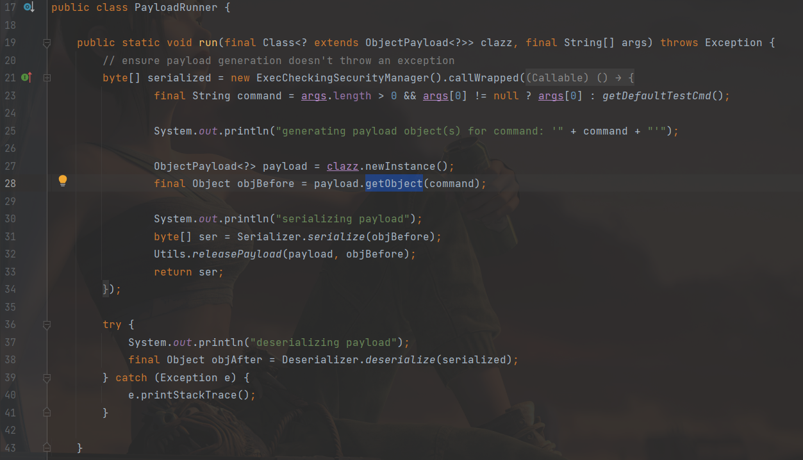

java安全的东西在github仓库里写了一点，正好放假了，在博客里再重新写一遍，，感觉忘的差不多了。

[toc]

# URLDNS

>   `URLDNS`为`ysoserial`的一个利用链的名字，但准确来说，这个其实不能称作“利⽤链”。因为其参数不 是⼀个可以“利⽤”的命令，⽽仅为⼀个URL，其能触发的结果也不是命令执⾏，⽽是⼀次DNS请求。

整个URLDNS的链，首先反序列化出发readObject()：

1.  `HashMap->readObject()`
2.  `HashMap->hash(kay)`
3.  `URL->hashCode()`
4.  `URLStreamHandler->hashCode()`
5.  `URLStreamHandler->getHostAddress()`
6.  `InetAddress->getByName(host)`


# 分析

`ysoserial`执行时会调用某个类的`getObject`方法：



看下`Hashmap`的`readObject`方法：

```java
    /**
     * Reconstitute the {@code HashMap} instance from a stream (i.e.,
     * deserialize it).
     */
    private void readObject(java.io.ObjectInputStream s)
        throws IOException, ClassNotFoundException {
        // Read in the threshold (ignored), loadfactor, and any hidden stuff
        s.defaultReadObject();
        reinitialize();
        if (loadFactor <= 0 || Float.isNaN(loadFactor))
            throw new InvalidObjectException("Illegal load factor: " +
                                             loadFactor);
        s.readInt();                // Read and ignore number of buckets
        int mappings = s.readInt(); // Read number of mappings (size)
        if (mappings < 0)
            throw new InvalidObjectException("Illegal mappings count: " +
                                             mappings);
        else if (mappings > 0) { // (if zero, use defaults)
            // Size the table using given load factor only if within
            // range of 0.25...4.0
            float lf = Math.min(Math.max(0.25f, loadFactor), 4.0f);
            float fc = (float)mappings / lf + 1.0f;
            int cap = ((fc < DEFAULT_INITIAL_CAPACITY) ?
                       DEFAULT_INITIAL_CAPACITY :
                       (fc >= MAXIMUM_CAPACITY) ?
                       MAXIMUM_CAPACITY :
                       tableSizeFor((int)fc));
            float ft = (float)cap * lf;
            threshold = ((cap < MAXIMUM_CAPACITY && ft < MAXIMUM_CAPACITY) ?
                         (int)ft : Integer.MAX_VALUE);
            @SuppressWarnings({"rawtypes","unchecked"})
                Node<K,V>[] tab = (Node<K,V>[])new Node[cap];
            table = tab;

            // Read the keys and values, and put the mappings in the HashMap
            for (int i = 0; i < mappings; i++) {
                @SuppressWarnings("unchecked")
                    K key = (K) s.readObject();
                @SuppressWarnings("unchecked")
                    V value = (V) s.readObject();
                putVal(hash(key), key, value, false, false);
            }
        }
    }
```

在最后`putVal`的时候计算了`key`的hash值：

```java
    static final int hash(Object key) {
        int h;
        return (key == null) ? 0 : (h = key.hashCode()) ^ (h >>> 16);
    }
```

调用了`hashCode()`方法，其中key为`URL`对象，调用的是`java.net.URL`中的`hashcode`：

```java
    public synchronized int hashCode() {
        if (hashCode != -1)
            return hashCode;

        hashCode = handler.hashCode(this);
        return hashCode;
    }
```

这里的`handler`是`URLStreamHandler`对象：

```java
    /**
     * The URLStreamHandler for this URL.
     */
    transient URLStreamHandler handler;
```

继续跟`URLStreamHandler`的`hashCode()`

```java
    protected int hashCode(URL u) {
        int h = 0;

        // Generate the protocol part.
        String protocol = u.getProtocol();
        if (protocol != null)
            h += protocol.hashCode();

        // Generate the host part.
        InetAddress addr = getHostAddress(u);
        if (addr != null) {
            h += addr.hashCode();
        } else {
            String host = u.getHost();
            if (host != null)
                h += host.toLowerCase().hashCode();
        }

        // Generate the file part.
        String file = u.getFile();
        if (file != null)
            h += file.hashCode();

        // Generate the port part.
        if (u.getPort() == -1)
            h += getDefaultPort();
        else
            h += u.getPort();

        // Generate the ref part.
        String ref = u.getRef();
        if (ref != null)
            h += ref.hashCode();

        return h;
    }
```

其中调用了`getHostAddress()`：

```java
    protected synchronized InetAddress getHostAddress(URL u) {
        if (u.hostAddress != null)
            return u.hostAddress;

        String host = u.getHost();
        if (host == null || host.equals("")) {
            return null;
        } else {
            try {
                u.hostAddress = InetAddress.getByName(host);
            } catch (UnknownHostException ex) {
                return null;
            } catch (SecurityException se) {
                return null;
            }
        }
        return u.hostAddress;
    }
```

其中的getByName为根据主机名查找IP，就是一次DNS查询，后面的就没必要跟了。

# EXP

