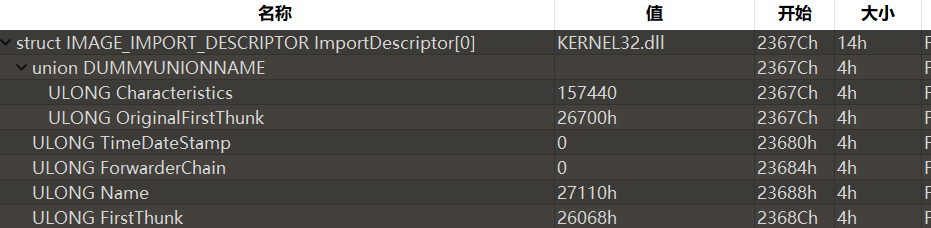
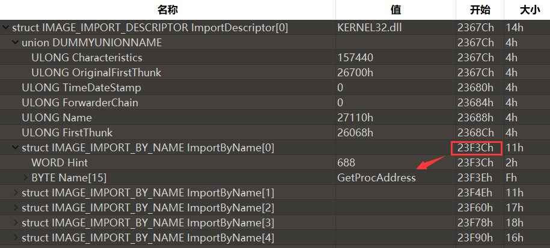
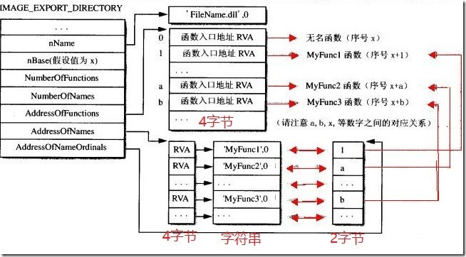
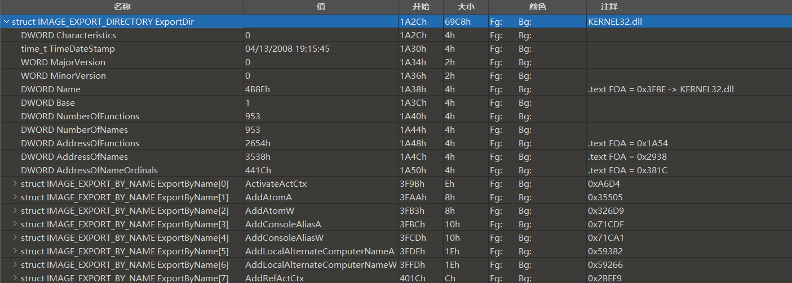
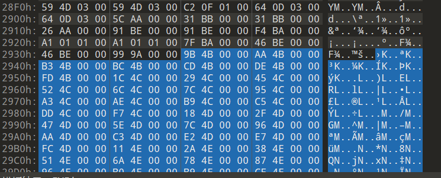
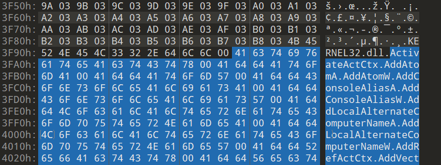
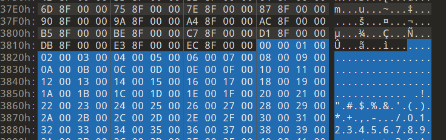
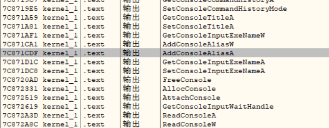

[toc]


# PE文件结构解析

## 0.总述

大致结构如下：

1.  DOS头（占位），仅适用于映像文件
2.  DOS存根（又叫签名），仅适用于映像文件
3.  COFF文件头，适用于映像文件和目标文件
4.  NT（可选文件头），仅适用于映像文件
5.  节表（节区头）
6.  节

其中，PE头包含DOS头、DOS存根、NT头、节表。

用到的结构体都在`winnt.h`头文件中。

## 1.DOS头

Mz那里

```c
typedef struct _IMAGE_DOS_HEADER {      // DOS .EXE header
    WORD   e_magic;                     // Magic number
    WORD   e_cblp;                      // Bytes on last page of file
    WORD   e_cp;                        // Pages in file
    WORD   e_crlc;                      // Relocations
    WORD   e_cparhdr;                   // Size of header in paragraphs
    WORD   e_minalloc;                  // Minimum extra paragraphs needed
    WORD   e_maxalloc;                  // Maximum extra paragraphs needed
    WORD   e_ss;                        // Initial (relative) SS value
    WORD   e_sp;                        // Initial SP value
    WORD   e_csum;                      // Checksum
    WORD   e_ip;                        // Initial IP value
    WORD   e_cs;                        // Initial (relative) CS value
    WORD   e_lfarlc;                    // File address of relocation table
    WORD   e_ovno;                      // Overlay number
    WORD   e_res[4];                    // Reserved words
    WORD   e_oemid;                     // OEM identifier (for e_oeminfo)
    WORD   e_oeminfo;                   // OEM information; e_oemid specific
    WORD   e_res2[10];                  // Reserved words
    LONG   e_lfanew;                    // File address of new exe header
  } IMAGE_DOS_HEADER, *PIMAGE_DOS_HEADER;
```

重要的只有最后的：`e_lfanew`，表示NT头的偏移

## 2.DOS存根

就是`This program cannot be run in DOS mode.`那里，

## 4.NT头

以下为`notepad.exe`的NT头：


```c
typedef struct _IMAGE_NT_HEADERS64 {
    DWORD Signature;
    IMAGE_FILE_HEADER FileHeader;
    IMAGE_OPTIONAL_HEADER64 OptionalHeader;
} IMAGE_NT_HEADERS64, *PIMAGE_NT_HEADERS64;

typedef struct _IMAGE_NT_HEADERS {
    DWORD Signature;
    IMAGE_FILE_HEADER FileHeader;
    IMAGE_OPTIONAL_HEADER32 OptionalHeader;
} IMAGE_NT_HEADERS32, *PIMAGE_NT_HEADERS32;
```

由3部分构成：签名，文件头，可选头

其中Signature就是上面的PE:`504B`。

下面是文件头`IMAGE_FILE_HEADER`:

```c
typedef struct _IMAGE_FILE_HEADER
{
    WORD Machine;
    WORD NumberOfSections; //节的数目
    DWORD TimeDateStamp;
    DWORD PointerToSymbolTable; //符号表的文件offset
    DWORD NumberOfSymbols;      //符号表中元素数目
    WORD SizeOfOptionalHeader;  //指出下面结构体IMAGE_OPTIONAL_HEADER32（32位系统）的长度
    WORD Characteristics;       //标识文件属性，文件是否是可运行形态、是否为DLL等，以bit OR形式进行组合
} IMAGE_FILE_HEADER, *PIMAGE_FILE_HEADER;
```

接下来是可选头：

前几个是标准，后面的是可选

```c
typedef struct _IMAGE_OPTIONAL_HEADER
{
    //
    // Standard fields.
    //

    WORD Magic; //32位为0x10B,64位为0x20B
    BYTE MajorLinkerVersion;
    BYTE MinorLinkerVersion;
    DWORD SizeOfCode;              //代码节(.test)大小，有多个的话是总和
    DWORD SizeOfInitializedData;   //已初始化数据节的大小，有多个的话是总和
    DWORD SizeOfUninitializedData; //未初始化数据节的大小，有多个的话是总和
    DWORD AddressOfEntryPoint;     //EP的RVA值
    DWORD BaseOfCode;              //内存中代码节的开头相对于映像基址的偏移地址。
    DWORD BaseOfData;

    //
    // NT additional fields.
    //

    DWORD ImageBase;        //载入内存时优先装载的地址
    DWORD SectionAlignment; //节区在内存中的最小单位
    DWORD FileAlignment;    //节区在磁盘文件中的最小单位
    WORD MajorOperatingSystemVersion;
    WORD MinorOperatingSystemVersion;
    WORD MajorImageVersion;
    WORD MinorImageVersion;
    WORD MajorSubsystemVersion;
    WORD MinorSubsystemVersion;
    DWORD Win32VersionValue;
    DWORD SizeOfImage;   //指定了PE Image在虚拟内存中所占空间的大小，包含所有头
    DWORD SizeOfHeaders; //整个PE头的大小
    DWORD CheckSum;
    WORD Subsystem;
    WORD DllCharacteristics;
    DWORD SizeOfStackReserve;
    DWORD SizeOfStackCommit;
    DWORD SizeOfHeapReserve;
    DWORD SizeOfHeapCommit;
    DWORD LoaderFlags;
    DWORD NumberOfRvaAndSizes;                                            //下面数组的个数
    IMAGE_DATA_DIRECTORY DataDirectory[IMAGE_NUMBEROF_DIRECTORY_ENTRIES]; //16个
} IMAGE_OPTIONAL_HEADER32, *PIMAGE_OPTIONAL_HEADER32;

typedef struct _IMAGE_DATA_DIRECTORY
{
    DWORD VirtualAddress; //表的RVA
    DWORD Size;
} IMAGE_DATA_DIRECTORY, *PIMAGE_DATA_DIRECTORY;
```

## 5.节表

```c
typedef struct _IMAGE_SECTION_HEADER
{
    BYTE Name[IMAGE_SIZEOF_SHORT_NAME]; //8
    union
    {
        DWORD PhysicalAddress;
        DWORD VirtualSize; //载入内存时此节区的大小
    } Misc;
    DWORD VirtualAddress;   //内存中节区起始地址(RVA)
    DWORD SizeOfRawData;    //磁盘中节区所占大小
    DWORD PointerToRawData; //磁盘中本节对于文件头的距离
    DWORD PointerToRelocations;
    DWORD PointerToLinenumbers;
    WORD NumberOfRelocations;
    WORD NumberOfLinenumbers;
    DWORD Characteristics;
} IMAGE_SECTION_HEADER, *PIMAGE_SECTION_HEADER;
```

## 6.RVA与RAW地址转换

**RAW - PointerToRawData = RVA - VirtualAddress**

**RAW = RVA - VirtualAddress + PointerToRawData**

rva = RAW - PointerToRawData + VirtualAddress

# IAT表分析

首先是INT和IAT导入的步骤：

1.  读`IMAGE_IMPORT_DESCRIPTOR`的`Name`成员获取库名称的字符串(比如'kernel32.dll')
2.  装载相应的库，LoadLibrary("kernel32.dll")
3.  读`IMAGE_IMPORT_DESCRIPTOR`的`OriginalFirstThunk`成员，获得INT表的地址
4.  逐一获取INT数组的`IMAGE_IMPORT_BY_NAME`地址
5.  使用`IMAGE_IMPORT_BY_NAME`的hint或者name项，获取相应函数的起始地址
6.  读`IMAGE_IMPORT_DESCRIPTOR`的`FirstThunk`(IAT)，获取IAT的地址
7.  将上面获得的函数地址输入相应的IAT数组值
8.  重复4~7

导入表、导入地址表(`IMPORT ADDRESS TABLE`)，导入表在上面16个数组的第2个。

```c
typedef struct _IMAGE_DATA_DIRECTORY
{
    DWORD VirtualAddress; //该表的RVA
    DWORD Size;
} IMAGE_DATA_DIRECTORY, *PIMAGE_DATA_DIRECTORY;
```


可以看出导入表的RVA为0x2647C，在.idata段，

那么RAW= 0x2647C - 0x26000 + 0x23200 =0x2367C


有多少导入的库就有多少`IMAGE_IMPORT_DESCRIPTOR`结构体：

```c
typedef struct _IMAGE_IMPORT_DESCRIPTOR
{
    union
    {
        DWORD Characteristics;    // 0 for terminating null import descriptor
        DWORD OriginalFirstThunk; // INT address(RVA)，数组，指向IMAGE_IMPORT_BY_NAME结构体
    } DUMMYUNIONNAME;
    DWORD TimeDateStamp;
    DWORD ForwarderChain;
    DWORD Name;       //library name string address(RVA)
    DWORD FirstThunk; //IAT address(RVA)，数组，指向IMAGE_IMPORT_BY_NAME结构体
} IMAGE_IMPORT_DESCRIPTOR;

typedef struct _IMAGE_IMPORT_BY_NAME {
    WORD    Hint;//可能为0，编译器决定，如果不为0，是函数在导出表中的索引
    CHAR   Name[1];
} IMAGE_IMPORT_BY_NAME, *PIMAGE_IMPORT_BY_NAME;
```

程序加载前IAT和INT都之指向同一个位置。


每个库只有一个`IMAGE_IMPORT_DESCRIPTOR`，但是每个该结构体的`INT(OriginalFirstThunk)`和`IAT(FirstThunk)`为数组，表示该库所有导入的API的地址:



INT的RAW= 0x26700 -  0x26000 + 0x23200  = 0x23900


上面都是需要导入的INT的`IMAGE_IMPORT_BY_NAME`的地址，比如第一个0x26D3C:

RAW= 0x26D3C-  0x26000 + 0x23200 =0x23F3C



INT就是上面那样，IAT也是如此

上面都是导入前，导入后INT不变，IAT为函数的地址：


# 导出表分析

在上面16个数组的第一个，这里拿kernel32.dll来测试（notepad没有导出表

```c
typedef struct _IMAGE_EXPORT_DIRECTORY
{
    DWORD Characteristics;
    DWORD TimeDateStamp;
    WORD MajorVersion;
    WORD MinorVersion;
    DWORD Name;                  //要导出的名字的地址
    DWORD Base;                  //oridinal base
    DWORD NumberOfFunctions;     //实际导出函数个数
    DWORD NumberOfNames;         //导出函数中有名字的个数
    DWORD AddressOfFunctions;    //导出函数的地址(数组，RVA，元素个数=NumberOfFunctions )
    DWORD AddressOfNames;        //导出函数的名称的地址(数组，RVA，元素个数=NumberOfNames)
    DWORD AddressOfNameOrdinals; //导出函数序号表的地址(数组，RVA，元素个数=NumberOfNames)，函数序号表
} IMAGE_EXPORT_DIRECTORY, *PIMAGE_EXPORT_DIRECTORY;
```

获得函数地址的API为：`GetProcAddress`，原理：

>   1.  利用adressofname转到函数名称的数组
>   2.  上面的数组存着的是地址，通过strcmp，查到指定的函数名，这时索引记为name_index
>   3.  用addressofnameordinals转到ordinal数组，
>   4.  通过name_index查找相应index值
>   5.  利用addressoffunction转到 函数地址数组
>   6.  用ordinal找到需要函数的地址。


图胜千言




## 示例

下面实际找一下，使用kernel32.dll，找AddConsoleAlisaA函数：



```c
AddressOfFunctions :   RVA = 0x2654  FOA = 0x1A54
AddressOfNames:        RVA = 0x3538  FOA = 0x2938
AddressOfNameOrdinals: RVA = 0x441C  FOA = 0x381C
```

### AddressOfName

是一个个的RVA，个数为0x953，经过转换，FOA = 0x2938：



RVA = 4B9B ==> FOA = 3F9B ：



是第4个，索引为3，

### AddressOfNameOrdinals



索引和值是一样的，也是第4个，下面查地址：

### AddressOfFunctions


第4个是0x071cdf，kernel32.dll的imagebase是0x7c800000，加起来是'0x7c871cdf'




# 重定位表


