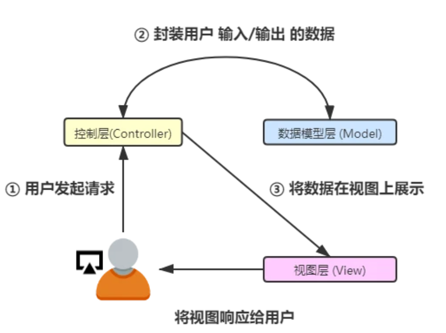
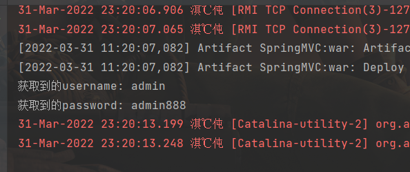

最近想看看java，不知道从哪开始，。。正好spring有最近不太平，就从spring MVC开始看吧。

[toc]

# 开篇

"静态"与"动态"，这两个词最大的不同就是在于其**交互性**。动态页面却可以实现根据用户的要求和选择而动态的去改变和响应，浏览器客户端，成为了前后端动态交互的一个桥梁。

## 三层架构

BS架构中，常见的为三层架构的开发模式：

1.  表现层（WEB层）

    -   作用：接收客户端请求（一般是HTTP请求），同时向其响应结果

    -   分类：表现层分为，展示层和控制层，控制层 (Servlet) 负责接收请求，展示层 (HTML JSP) 负责结果的展示

    -   在表现层会依赖于业务层，进行业务处理，也就是好比在 Servlet 中调用某个Service

        一般使用 MVC 模型开发（仅限此层，详情下面会说）

2.  业务层（Service层）

    -   作用：根据项目需求，进行业务逻辑处理
    -   在业务层可能会依赖于持久层，也就是好比在 Service 中调用某个 Dao

3.  持久层（Dao）

    -   作用：数据持久化
    -   说白了，就是实现和数据库之间的交互，本质都是增删改查，只不过不同的项目复杂程度会有所不同

## MVC模型

model-view-controller

-   Model(模型)
    -    可以叫做数据模型层，也就是用来封装数据的，例如请求的过程中，用户信息被封装在 User 实体类中，这个实体类就属于 Model 层中
-   View(视图)
    -   选择一个恰当的视图来显示最终的执行结果，例如常见的 HTML JSP 就是用来展示数据的
-   Controller(控制)
    -   比较直观的用来处理交互的部分，接收用户请求，然后执行业务等流程，以及一些数据的校验，最终反馈结果

如图：




这一款框架，本质上也是基于 Servlet 的。

# 浅尝

## 环境搭建

选择webapp：


创建java和resource文件夹.

pom文件：

```xml
<?xml version="1.0" encoding="UTF-8"?>

<project xmlns="http://maven.apache.org/POM/4.0.0" xmlns:xsi="http://www.w3.org/2001/XMLSchema-instance"
  xsi:schemaLocation="http://maven.apache.org/POM/4.0.0 http://maven.apache.org/xsd/maven-4.0.0.xsd">
  <modelVersion>4.0.0</modelVersion>

  <groupId>cn.ideal</groupId>
  <artifactId>spring_mvc_01_basic</artifactId>
  <version>1.0-SNAPSHOT</version>
  <packaging>war</packaging>

  <name>spring_mvc_01_basic Maven Webapp</name>
  <!-- FIXME change it to the project's website -->
  <url>http://www.example.com</url>

  <properties>
    <project.build.sourceEncoding>UTF-8</project.build.sourceEncoding>
    <maven.compiler.source>1.8</maven.compiler.source>
    <maven.compiler.target>1.8</maven.compiler.target>
    <spring.version>5.0.2.RELEASE</spring.version>
  </properties>

  <dependencies>
    <dependency>
      <groupId>org.springframework</groupId>
      <artifactId>spring-context</artifactId>
      <version>${spring.version}</version>
    </dependency>

    <dependency>
      <groupId>org.springframework</groupId>
      <artifactId>spring-web</artifactId>
      <version>${spring.version}</version>
    </dependency>

    <dependency>
      <groupId>org.springframework</groupId>
      <artifactId>spring-webmvc</artifactId>
      <version>${spring.version}</version>
    </dependency>

    <dependency>
      <groupId>javax.servlet</groupId>
      <artifactId>servlet-api</artifactId>
      <version>2.5</version>
      <scope>provided</scope>
    </dependency>

    <dependency>
      <groupId>javax.servlet.jsp</groupId>
      <artifactId>jsp-api</artifactId>
      <version>2.0</version>
      <scope>provided</scope>
    </dependency>

    <dependency>
      <groupId>junit</groupId>
      <artifactId>junit</artifactId>
      <version>4.11</version>
      <scope>test</scope>
    </dependency>

  </dependencies>


  <build>
    <finalName>spring_mvc_01_basic</finalName>
    <pluginManagement><!-- lock down plugins versions to avoid using Maven defaults (may be moved to parent pom) -->
      <plugins>
        <plugin>
          <artifactId>maven-clean-plugin</artifactId>
          <version>3.1.0</version>
        </plugin>
        <!-- see http://maven.apache.org/ref/current/maven-core/default-bindings.html#Plugin_bindings_for_war_packaging -->
        <plugin>
          <artifactId>maven-resources-plugin</artifactId>
          <version>3.0.2</version>
        </plugin>
        <plugin>
          <artifactId>maven-compiler-plugin</artifactId>
          <version>3.8.0</version>
        </plugin>
        <plugin>
          <artifactId>maven-surefire-plugin</artifactId>
          <version>2.22.1</version>
        </plugin>
        <plugin>
          <artifactId>maven-war-plugin</artifactId>
          <version>3.2.2</version>
        </plugin>
        <plugin>
          <artifactId>maven-install-plugin</artifactId>
          <version>2.5.2</version>
        </plugin>
        <plugin>
          <artifactId>maven-deploy-plugin</artifactId>
          <version>2.8.2</version>
        </plugin>
      </plugins>
    </pluginManagement>
  </build>
</project>

```


## 编写

在javaweb中，前端发出的请求，都会被映射到 Web.xml 中，然后匹配到对应的 Servlet 中，然后调用对应的 Servlet 类 来处理这个请求

### 配置核心控制器

由于现在使用springmvc，就都交给springmvc进行管理，在webapp-web-info中找到web.xml，进行配置核心控制器，`DispatcherServelt`

`<servlet ></servlet >`标签中指定了一个实现类为 DispatcherServelt ，名称为 dispatcherServlet 的 servlet 配置

`<servlet-mapping></servlet-mapping>`标签中则指定了 dispatcherServlet 拦截请求的范围，使用 `/` 即代表所有请求都需要经过这里

`<init-param></init-param>`标签对中放置 DispatcherServelt 所需要的初始化参数，配置的是 contextConfigLocation 上下文参数变量，其加载的配置文件为编译目录下的 springmvc.xml

```xml
<!DOCTYPE web-app PUBLIC
 "-//Sun Microsystems, Inc.//DTD Web Application 2.3//EN"
 "http://java.sun.com/dtd/web-app_2_3.dtd" >

<web-app>
  <display-name>Archetype Created Web Application</display-name>
  <servlet>
    <servlet-name>dispatcherServlet</servlet-name>
    <servlet-class>org.springframework.web.servlet.DispatcherServlet</servlet-class>
    <!--配置Servlet初始化参数，读取springmvc的配置文件，创建spring容器-->
    <init-param>
      <param-name>contextConfigLocation</param-name>
      <param-value>classpath:springmvc.xml</param-value>
    </init-param>
    <!-- 配置servlet启动时加载对象-->
    <load-on-startup>1</load-on-startup>

  </servlet>
  <servlet-mapping>
    <servlet-name>dispatcherServlet</servlet-name>
    <url-pattern>/</url-pattern>
  </servlet-mapping>
</web-app>
```


### 创建核心配置文件

开启扫描，以及开启注解，还有就是配置视图解析器，它的作用就是执行方法后，根据返回的信息，来加载相应的界面，并且绑定反馈数据。刚开始访问controller的时候一直是500，后来知道这个xml在resource下（应该是位置的问题），springmvc.xml

```xml
<?xml version="1.0" encoding="UTF-8"?>
<beans xmlns="http://www.springframework.org/schema/beans"
       xmlns:mvc="http://www.springframework.org/schema/mvc"
       xmlns:context="http://www.springframework.org/schema/context"
       xmlns:xsi="http://www.w3.org/2001/XMLSchema-instance"
       xsi:schemaLocation="
        http://www.springframework.org/schema/beans
        http://www.springframework.org/schema/beans/spring-beans.xsd
        http://www.springframework.org/schema/mvc
        http://www.springframework.org/schema/mvc/spring-mvc.xsd
        http://www.springframework.org/schema/context
        http://www.springframework.org/schema/context/spring-context.xsd">

    <!-- 配置spring创建容器时要扫描的包-->
    <context:component-scan base-package="com.yutao"></context:component-scan>

    <!-- 配置视图解析器-->
    <bean id="viewResolver"
          class="org.springframework.web.servlet.view.InternalResourceViewResolver">
        <property name="prefix" value="/WEB-INF/pages/"></property>
        <property name="suffix" value=".jsp"></property>
    </bean>

    <!-- 配置spring开启注解mvc的支持 -->
    <mvc:annotation-driven></mvc:annotation-driven>
</beans>
```

这里还有可能爆404的错，就是进不去controller，如果配置都写对的话，那就是没有导入依赖到web-info下的lib中，下图是导入后的，导入的话点put into output root就行。


### 写控制类 ControllerDemo

```java
package com.yutao.controller;

import org.springframework.stereotype.Controller;
import org.springframework.web.bind.annotation.RequestMapping;

@Controller
public class ControllerDemo {
    @RequestMapping(path = "/test")
    public String methodTest() {
        System.out.println("这是Controller测试方法");
        return "testSuccess";
    }
}
```

### 编写页面

index.jsp

```jsp
<%@ page contentType="text/html;charset=UTF-8" language="java" %>
<html>
<head>
    <title>Title</title>
</head>
<body>
    <h3>这是主页面</h3>
    <a href="test">访问test试试</a>
</body>
</html>

```

WEB-INFO->pages：testSuccess.jsp

```jsp
<%@ page contentType="text/html;charset=UTF-8" language="java" %>
<html>
<head>
    <title>Title</title>
</head>
<body>
    <h3>跳转成功</h3>
</body>
</html>
```

然后就是配置tomcat.

# MVC请求流程


**前端控制器（DispatcherServlet）**

-   接收用户请求，以及做出响应
-   它负责调用其他组件处理用户的请求，控制整个流程的执行，想当于一个中央处理器
-   它降低了组件之间的耦合行，利于组件之间的扩展

**处理器映射器（HandlerMapping）**

-   根据用户请求的 URL 路径，通过注解或者 XML 配置，寻找匹配的 Handler 即处理器

**处理器适配器（HandlerAdapter）**

-   根据映射器找到的处理器（Handler）信息，按照特定规则执行相关的 Handler （常称为 Controller）

**处理器（Hander）**

-   这就是开发中要编写的具体业务逻辑控制器，执行相关的请求处理逻辑，并且返回相应的数据和视图信息，然后封装到 ModeAndView 对象中

**视图解析器（View resolver）**

-   通过ModelAndView 对象中的 View 信息将逻辑视图名解析成物理视图名，即具体的页面地址，然后再生成 View 视图对象，最后对 View 进行渲染处理结果通过页面展示给用户

**视图（View）**

-   本身是一个接口，实现类支持不同 View 类型 (JSP、FreeMarker、Excel 等)

注：我们开发人员真正需要进行开发的是处理器（Handler）和视图（View）

也就是，处理用户请求的具体逻辑代码，以及展示给用户的界面

# 请求映射与参数绑定

## RequestMapping

`@RequestMaspping` 注解是指定控制器可以处理哪些URL请求，这个注解可以放在类或者方法上。

-   类上：一级访问目录
-   方法上：二级访问目录

参数：

-   path：指定请求路径的url
-   value：value属性和path属性是一样的
-   mthod：指定该方法的请求方式
-   params：指定限制请求参数的条件
-   headers：发送的请求中必须包含的请求头

eg:`@RequestMaspping(/test)`

## 请求参数绑定

用户页面的请求一般都是键值对，传统javaweb使用`request.getParameter()`方法获取请求参数

而springMVC可以通过参数绑定，将客户端的k/v格式的数据绑定到controller处理器方法的形参上，支持的数据类型分为三类：

### 基本类型和字符串类型

以下均为部分：

index.jsp

```jsp
<a href="user/testA?username=admin&password=admin888">测试一下</a>
```

testsuccess.jsp不变

userController：

```java
package com.yutao.controller;

import org.springframework.stereotype.Controller;
import org.springframework.web.bind.annotation.RequestMapping;

@Controller
@RequestMapping("/user")
public class UserController {

    @RequestMapping("/testA")
    public String testA(String username, String password) {
        System.out.println("获取到的username: " + username);
        System.out.println("获取到的password: " + password);
        return "testSuccess";
        //构造url：user/testA?username=admin&password=admin888
    }

}
```



### JavaBean实体类型

#### 基础

>   JavaBeans是Java中一种特殊的类，可以将多个对象封装到一个对象（bean）中。特点是**可序列化**，**提供无参构造器**，**提供getter方法和setter方法访问对象的属性**。名称中的“Bean”是用于Java的可重用软件组件的惯用叫法。 --from 维基百科

Javabean相比其他java类的特征：

-   提供一个默认的无参构造函数。
-   需要被序列化并且实现了 Serializable 接口。
-   可能有一系列可读写属性。
-   可能有一系列的 getter 或 **setter** 方法。

#### code

1.jsp:

```jsp
<%--
  Created by IntelliJ IDEA.
  User: 86177
  Date: 2022/3/31
  Time: 23:35
  To change this template use File | Settings | File Templates.
--%>
<%@ page contentType="text/html;charset=UTF-8" language="java" %>
<html>
<head>
    <title>javabean</title>
</head>
<body>
<form action="user/testB" method="post">
    昵称: <input type="text" name="nickname"><br/>
    年龄: <input type="text" name="age"><br/>
    <input type="submit" value="提交">
</form>
</body>
</html>
```

usercontroller:

```java
@RequestMapping("/testB")
    public String testB(User user) {
        System.out.println(user);
        System.out.println("nickname: " + user.getNickname());
        System.out.println("age: " + user.getAge());
        return "testSuccess";
    }
```

实体类user

```java
package com.yutao.controller;

import java.io.Serializable;

public class User implements Serializable {
    private String nickname;
    private int age;

    public String getNickname() {
        return this.nickname;
    }

    public int getAge() {
        return this.age;
    }

    public void setNickname(String nickname) {
        this.nickname = nickname;
    }

    public void setAge(int age) {
        this.age = age;
    }

}
```


# 常用注解

## RequestParam注解

-   作用：把请求中的指定名称的参数传递给控制器中的形参

```java
import org.springframework.web.bind.annotation.RequestParam;
@RequestMapping(path = "/hello")
    public String sayHello(@RequestParam(value = "nick", required = false) String nickname) {
        System.out.println(nickname);
        return "testSuccess";
    }
```

## RequestBody注解

作用：用于获取请求体的内容（注：get方法不可以）

```java
@RequestMapping("/testC")
public String testC(@RequestBody String body) {
    System.out.println(body);
    return "testSuccess";
}
//post：nickname=BWH_Steven&age=666&address=beijing

```

## PathVariable 注解

用于绑定url中的占位符，例如：url中有/test/{id}，{id}就是占位符

```java
@RequestMapping(path="/test/{uid}")
public String testD(@PathVariable(value="uid") String id) {
    System.out.println(id);
    return "testSuccess";
}

```

## RequestHeader注解

-   作用：获取指定请求头的值

```java
@RequestMapping("/testE")
public String testE(@RequestHeader(value="Accept") String header) {
    System.out.println(header);
    return "testSuccess";
}
```

打印结果：

```
text/html,application/xhtml+xml,application/xml;q=0.9,image/avif,image/webp,image/apng,*/*;q=0.8,application/signed-exchange;v=b3;q=0.9
```

## CookieValue注解

-   作用：用于获取指定cookie的名称的值

```java
@RequestMapping("/testF")
    public String testF(@CookieValue(value="JSESSIONID") String cookieValue) {
        System.out.println(cookieValue);
        return "testSuccess";
    }
```

# 相应数据以及结果视图

接下来是：接受到用户的请求，并且进行一定的处理以后，如何进行正确的响应

## 返回字符串

在前面的例子中，一直使用进行同名页面的跳转，例如返回 success 则跳转到 success.jsp 的页面中

需要注意的是，相应jsp页面中要写：`isELIgnored="false"`

## 返回void

如果说直接去掉返回值，以及修改返回类型为void，会报出一个404异常看到地址栏中，去指向了一个 `http://localhost:8080/springmvc-response/user/testVoid.jsp` 的地址，也就是说它默认去查找了一个jsp页面（也就是 @RequestMapping("/testVoid") 值同名的 jsp），不过没有找到

如果想要在这种情况下，跳转页面可以使用请求转发，或者重定向跳转

```java
    @RequestMapping("/testVoid")
    public void testVoid(HttpServletRequest request, HttpServletResponse response) throws Exception {
        System.out.println("请求转发或者重定向被执行了");
// 1. 请求转发
        request.getRequestDispatcher("/WEB-INF/pages/testSuccess.jsp").forward(request, response);

// 2. 重定向
// response.sendRedirect(request.getContextPath()+"/test2.jsp");

        response.setCharacterEncoding("UTF-8");
        response.setContentType("text/html;charset=UTF-8");
// 3. 直接响应数据
        response.getWriter().print("测试被执行了哈");
        return;
    }
```

## 返回值是ModelAndView对象

```java
@RequestMapping("/findUser")
    public ModelAndView findUser() throws Exception {
        ModelAndView modelAndView = new ModelAndView();
        //跳转到jsp
        modelAndView.setViewName("success");

        //模拟从数据库中查询用户信息
        User user = new User();
        user.setNickname("李四");
        user.setAge(8888);

        modelAndView.addObject("user", user);
        return modelAndView;
    }
```

success.jsp:

```jsp
${user.username}
${user.password}
```

## 过滤静态资源

在 web.xml 中配置的 DispatcherServle（前端控制器），会拦截到所有的资源静态资源 （img、css、js）这样的文件也被拦截下面写如何不对静态资源进行拦截：

在springmvc.xml中配置

mvc:resources 标签配置不过滤

-   location 表示webapp目录下的包下的所有文件
-   mapping 表示以/xxx开头的所有请求路径，如/xxx/a 或者/xxx/a/b

```xml
<!--前端控制器-->
<mvc:resources mapping="/css/**/" location="/css/"/>
<mvc:resources mapping="/images/**/" location="/images/"/>
<mvc:resources mapping="/js/**/" location="/js/"/>
```

jsp

```jsp
<%@ page contentType="text/html;charset=UTF-8" language="java" %>
<html>
<head>
    <title>Title</title>

    <%--引入jquery--%>
    <script src="js/jquery-2.1.0.min.js"></script>
    <script>
        $(function () {
            $("#btn").click(function () {
                alert("Just for test");
            });
        });
    </script>
</head>
<body>
    <%--<a href="user/testString">修改用户信息页面</a>--%>
    <%--<a href="user/testForward">测试一下</a>--%>
    <button id="btn">发送ajax请求</button>
</body>
</html>
```

## 发送ajax请求

index.jsp

```jsp
<%@ page contentType="text/html;charset=UTF-8" language="java" %>
<html>
<head>
    <title>Title</title>

    <%--引入jquery--%>
    <script src="js/jquery-2.1.0.min.js"></script>
    <script>
        $(function () {
            $("#btn").click(function () {
                //发送ajax请求
                $.ajax({
                    url:"user/testAjax",
                    contentType:"application/json;charset=UTF-8",
                    data:'{"username":"zhangsan","password":"888888"}',
                    dataType:"json",
                    type:"post",
                    success:function (data) {
                        //解析响应数据
                    }
                })
            });
        });
    </script>
</head>
<body>
    <button id="btn">发送ajax请求</button>
</body>
</html>
```

```java
@RequestMapping("/testAjax")
    public void testAjax(@RequestBody String body){
        System.out.println("testAjax 被执行了");
        System.out.println(body);
    }
```

# 文件上传

# 异常处理

# 拦截器


后面这些不写了，，想写了再写

>   [Spring MVC 层层递进](https://juejin.cn/post/6844904100107124749)
>
>   [SpringMVC参数绑定入门就这一篇](https://segmentfault.com/a/1190000022586808)

