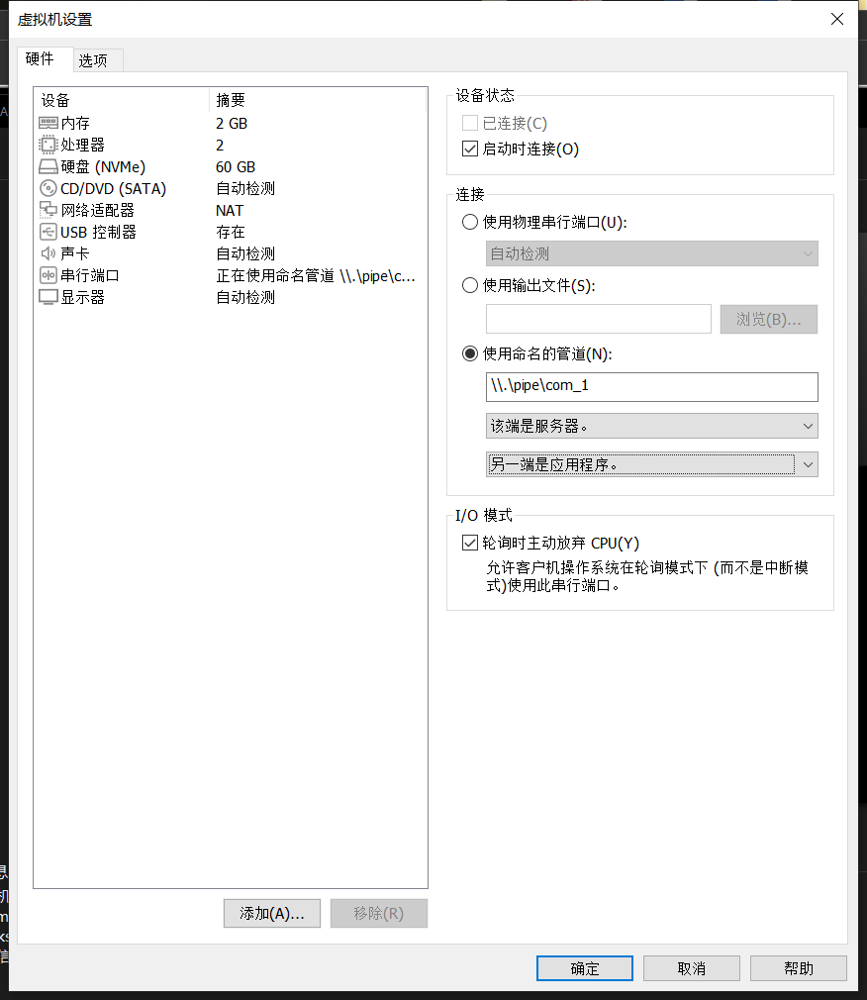
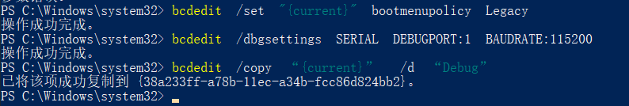
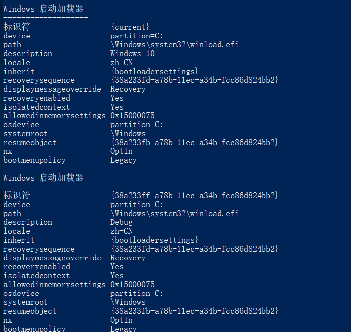
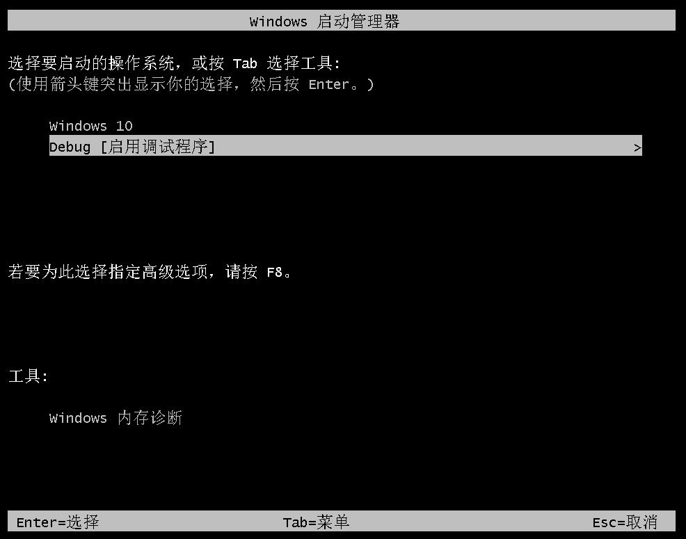
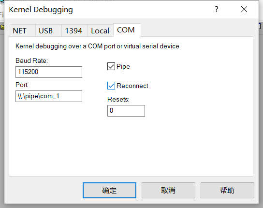
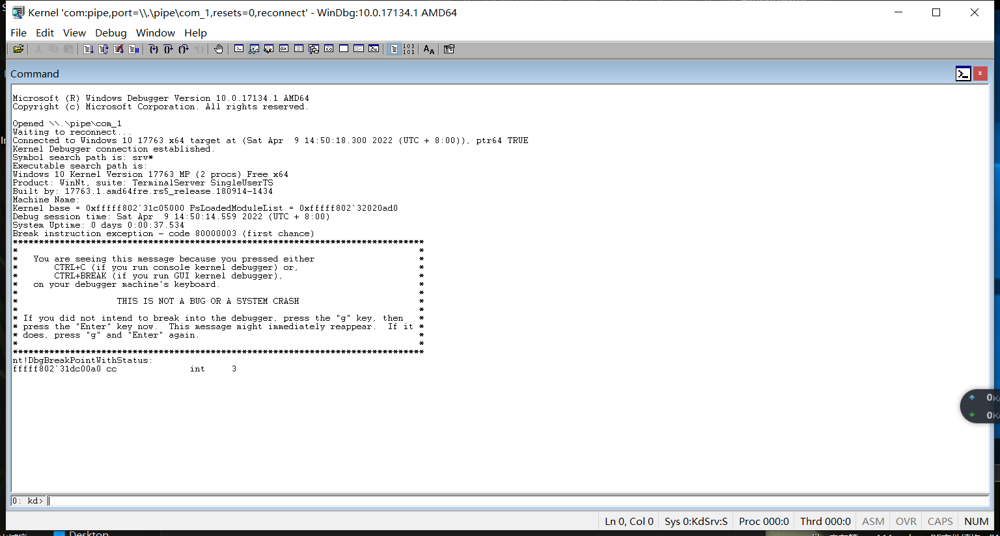
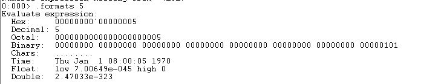

[toc]

# 双机调试

虚拟机添加串行端口：（如果发现建立的串行端口一直是串行端口2，则把虚拟机硬件中的打印机删除即可创建串行端口1）



虚拟机中管理员打开powershell，bcdedit /enum查看启动的配置：


执行以下命令：

```
bcdedit  /set  “{current}”  bootmenupolicy  Legacy             //修改启动方式为Legacy

bcdedit  /dbgsettings  SERIAL  DEBUGPORT:1  BAUDRATE:115200     //设置串口1为调试端口，波特率为115200

bcdedit  /copy  “{current}”   /d  “Debug”      //将当前配置复制到 Debug 启动配置(新建了Debug启动配置)
```



新建的启动配置：



继续执行

```
bcdedit /debug "{38a233ff-a78b-11ec-a34b-fcc86d824bb2}" on      //打开调试开关
//{}里面的是新建的启动配置的标识符
```

查看配置：


虚拟机重启后显示如下则成功：



可以选择这样连接：



也可以`-b -k com:pipe,port=\\.\pipe\com_1,resets=0,reconnect -y`，高级里面管理员运行：


成功：

下面是配置symbol：

可以配置环境变量：

```
_NT_SYMBOL_PATH
srv*E:\symbols*https://msdl.microsoft.com/download/symbols
```

也可以直接在Symbol Search Path中加：

```
srv*E:\symbols*https://msdl.microsoft.com/download/symbols
```

# WinDbg命令

## ring3

-   version：显示调试器版本信息和已加载的调试器扩展

-   vercommand： 显示调试器启动文件的路径

-   .formats：显示数字的各种格式信息

    

-   .cls：清屏

-   ld：加载指定或者所有模块的符号

    

-   lm：显示所有加载和未加载的模块信息


## ring0


额命令啥的先不写了，太多了，之后补充


>   https://www.cnblogs.com/gaochundong/p/windbg_cheat_sheet.html
>
>   https://www.cnblogs.com/kekec/archive/2012/12/02/2798020.html
>
>   https://www.kanxue.com/book-8-62.htm#
>
>   https://www.cnblogs.com/DarkBright/p/10843698.html