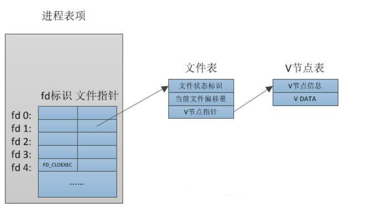
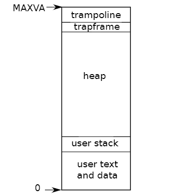

[toc]

>   英文版：https://pdos.csail.mit.edu/6.828/2020/xv6/book-riscv-rev1.pdf
>
>   中文版：http://xv6.dgs.zone/

# Chapter 1:Operating system interfaces


>   xv6 是 MIT 开发的一个教学用的完整的类 Unix 操作系统，并且在 MIT 的操作系统课程 [6.828](http://pdos.csail.mit.edu/6.828/2012/xv6.html) 中使用
>
>   xv6 是 Dennis Ritchie 和 Ken Thompson 合著的 Unix Version 6（v6）操作系统的重新实现。xv6 在一定程度上遵守 v6 的结构和风格，但它是用 ANSI C 实现的，并且是基于 x86 多核处理器的。

进程通过**系统调用**使用内核服务。系统调用会进入内核，让内核执行服务然后返回。所以进程总是在用户空间和内核空间之间交替运行。

内核使用了CPU 的硬件保护机制来保证用户进程只能访问自己的内存空间。内核拥有实现保护机制所需的硬件权限(hardware privileges)，而用户程序没有这些权限。当一个用户程序进行一次系统调用时，硬件会提升特权级并且开始执行一些内核中预定义的功能。

xv6中提供的系统调用(部分unix)：

| 系统调用                  | 描述                               |
| ------------------------- | ---------------------------------- |
| fork()                    | 创建进程                           |
| exit()                    | 结束当前进程                       |
| wait()                    | 等待子进程结束                     |
| kill(pid)                 | 结束 pid 所指进程                  |
| getpid()                  | 获得当前进程 pid                   |
| sleep(n)                  | 睡眠 n 秒                          |
| exec(filename, *argv)     | 加载并执行一个文件                 |
| sbrk(n)                   | 为进程内存空间增加 n 字节          |
| open(filename, flags)     | 打开文件，flags 指定读/写模式      |
| read(fd, buf, n)          | 从文件中读 n 个字节到 buf          |
| write(fd, buf, n)         | 从 buf 中写 n 个字节到文件         |
| close(fd)                 | 关闭打开的 fd                      |
| dup(fd)                   | 复制 fd                            |
| pipe( p)                  | 创建管道， 并把读和写的 fd 返回到p |
| chdir(dirname)            | 改变当前目录                       |
| mkdir(dirname)            | 创建新的目录                       |
| mknod(name, major, minor) | 创建设备文件                       |
| fstat(fd)                 | 返回文件信息                       |
| link(f1, f2)              | 给 f1 创建一个新名字(f2)           |
| unlink(filename)          | 删除文件                           |

xv6 shell的具体实现在`user/sh.c`

## 1.1 进程和内存

`fork` 函数在父进程、子进程中都返回（一次调用两次返回），对于父进程它返回子进程的 pid，对于子进程它返回 0。

```c
int pid;
pid = fork();
if(pid > 0){
    printf("parent: child=%d\n", pid);
    pid = wait();
    printf("child %d is done\n", pid);
} else if(pid == 0){
    printf("child: exiting\n");
    exit();
} else {
    printf("fork error\n");
}
```

系统调用 `wait` 会返回一个**当前进程已退出的子进程**，如果没有子进程退出，`wait` 会等候直到有一个子进程退出。

父子进程拥有不同的内存空间和寄存器，改变一个进程中的变量不会影响另一个进程，这一点在代码中有体现。

`exec`系统调用，从某个*文件*（通常是可执行文件）里读取内存镜像，并将其替换到调用它的进程的内存空间，这样的话，在执行`exec`系统调用后不返回，而是直接执行调用的elf文件：

```c
char *argv[3];
argv[0] = "echo";
argv[1] = "hello";
argv[2] = 0;
exec("/bin/echo", argv);
printf("exec error\n");//注意这里，不返回，走这一步说明出问题了
```

下面是xv6 shell的代码：

```c
int main(void)
{
	static char buf[100];
	int fd;
	// Ensure that three file descriptors are open.
	while ((fd = open("console", O_RDWR)) >= 0)
	{
		if (fd >= 3)
		{
			close(fd);
			break;
		}
	}
	// Read and run input commands.
	while (getcmd(buf, sizeof(buf)) >= 0)//getcmd 读取命令行的输入
	{
		if (buf[0] == 'c' && buf[1] == 'd' && buf[2] == ' ')
		{
			// Chdir must be called by the parent, not the child.
			buf[strlen(buf) - 1] = 0; // chop \n
			if (chdir(buf + 3) < 0)
				fprintf(2, "cannot cd %s\n", buf + 3);
			continue;
		}
		if (fork1() == 0)//调用fork
			runcmd(parsecmd(buf));
		wait(0);//父进程等待子进程退出
	}
	exit(0);
}
```

`fork`的时候要拷贝elf的内容，空间不够的话：`sbrk(n)` 来增加 n 字节的数据内存。`sbrk` 返回新的内存的地址。

## 1.2 I/O 和文件描述符

**文件描述符**是一个整数，它代表了一个进程可以读写的被内核管理的对象。进程可以通过多种方式获得一个文件描述符，如打开文件、目录、设备，或者创建一个管道（pipe），或者复制已经存在的文件描述符。

每个进程都有一张表，而 xv6 内核就以文件描述符作为这张表的索引，所以每个进程都有一个从0开始的文件描述符空间。见下图，但是这里不深究，也就看个大概，真想深究的话，去跟iofile的源码。

文件描述符0读入（标准输入），从文件描述符1输出（标准输出），从文件描述符2输出错误（标准错误输出）。



系统调用 `close` 会释放一个文件描述符，使得它之后可以被 `open`, `pipe`, `dup` 等调用重用。新分配的文件描述符始终是当前进程中编号最少的未使用描述符。

`fork` 会复制父进程的文件描述符和内存，所以子进程和父进程的文件描述符一模一样。

`exec` 会替换调用它的进程的内存但是会保留它的文件描述符表。

```c
char* argv[2];
argv[0] = "cat";
argv[1] = 0;
if (fork() == 0) {
    close(0);
    open("input.txt", O_RDONLY);
    exec("cat", argv);
}
```

在子进程关闭文件描述符0之后，`open`使用新打开的input.txt(0文件描述符为0)。`cat`然后执行文件描述符0(标准输入)，但引用的是input.txt。父进程的文件描述符不会被这个序列改变，因为它只修改子进程的描述符。(这里还是挺有意思的)

`open`的第二个参数由一组标志组成，这些标志以位表示，用于控制打开的操作。在`kernel/fcntl.h`中

```c++
#define O_RDONLY  0x000
#define O_WRONLY  0x001
#define O_RDWR    0x002
#define O_CREATE  0x200//如果文件不存在则创建文件
#define O_TRUNC   0x400//将文件截断为零长度
```

`dup`系统调用复制一个现有的文件描述符，返回一个引用自同一个底层I/O对象的新文件描述符。

helloword的另一种写法：

```c
fd = dup(1);
write(1, "hello", 6);
write(fd, "world\n", 6);
```

## 1.3 管道

管道是一个小的内核缓冲区，它以文件描述符对的形式提供给进程，一个用于写操作，一个用于读操作。从管道的一端写的数据可以从管道的另一端读取。提供了一种**进程间**交互的方式。就是队列，0是读，1是写。

```c
int p[2];
char *argv[2];
argv[0] = "wc";
argv[1] = 0;
pipe(p);
if(fork() == 0) {
    close(0);
    dup(p[0]);//调用close和dup使文件描述符0指向管道的读取端
    close(p[0]);
    close(p[1]);
    exec("/bin/wc", argv);
} else {
    write(p[1], "hello world\n", 12);
    close(p[0]);
    close(p[1]);
}
```

`link`系统调用创建另一个文件名，该文件名指向与现有文件相同的inode。

```c
open("a", O_CREATE | O_WRONLY);
link("a", "b");
// 创建了一个既叫做 a 又叫做 b 的新文件
unlink("a")，
```

读写 `a` 就相当于读写 `b`。每一个 inode 都由一个唯一的 `inode 号` 直接确定。在上面这段代码中，我们可以通过 `fstat` 知道 `a` 和 `b` 都指向同样的内容：`a` 和 `b` 都会返回同样的 inode 号（`ino`），并且 `nlink` 数会设置为2。

系统调用 `unlink` 从文件系统移除一个文件名。一个文件的 inode 和磁盘空间只有当它的链接数变为 0 的时候才会被清空，也就是没有一个文件再指向它。


## 1.4 文件系统

xv6 文件系统提供文件和目录，文件就是一个简单的字节数组，而目录包含指向文件和其他目录的引用。

不从 `/` 开始的目录表示的是相对调用进程当前目录的目录，调用进程的当前目录可以通过 `chdir` 这个系统调用进行改变。

```c
chdir("/a");
chdir("b");
open("c", O_RDONLY);
open("/a/b/c", O_RDONLY);
```

`mknod`创建一个引用设备的特殊文件。与设备文件相关联的是主设备号和次设备号(`mknod`的两个参数)，它们唯一地标识了一个内核设备。当进程稍后打开设备文件时，内核将使用内核设备实现`read`和`write`系统调用，而不是使用文件系统。

```c
mkdir("/dir");
fd = open("/dir/file", O_CREATE | O_WRONLY);
close(fd);
mknod("/console", 1, 1);
```

同一个底层文件（叫做inode，索引结点）可以有多个名字（叫做link，链接）。每个链接都由目录中的一个条目组成;该条目包含一个文件名和一个inode引用。Inode保存有关文件的元数据（用于解释或帮助理解信息的数据），包括其类型(文件/目录/设备)、长度、文件内容在磁盘上的位置以及指向文件的链接数。

`fstat` 可以获取一个文件描述符指向的文件的信息。它填充一个名为 `stat` 的结构体，它在 `stat.h` 中定义为：

```c
#define T_DIR     1   // Directory
#define T_FILE    2   // File
#define T_DEVICE  3   // Device

struct stat {
  int dev;     // File system's disk device
  uint ino;    // Inode number,Inode编号
  short type;  // Type of file
  short nlink; // Number of links to file，指向文件的链接数
  uint64 size; // Size of file in bytes
};
```


# Chapter 2:Operating system organization


## 2.1 xv6架构

| **文件**          | **描述**                                    |
| ----------------- | ------------------------------------------- |
| **bio.c**         | 文件系统的磁盘块缓存                        |
| **def.h**         | 模块间的接口定义                            |
| **console.c**     | 连接到用户的键盘和屏幕                      |
| **entry.S**       | 首次启动指令                                |
| **exec.**         | `exec()`系统调用                            |
| **file.c**        | 文件描述符支持                              |
| **fs.c**          | 文件系统                                    |
| **kalloc.c**      | 物理页面分配器                              |
| **kernelvec.S**   | 处理来自内核的陷入指令以及计时器中断        |
| **log.c**         | 文件系统日志记录以及崩溃修复                |
| **main.c**        | 在启动过程中控制其他模块初始化              |
| **pipe.c**        | 管道                                        |
| **plic.c**        | RISC-V中断控制器                            |
| **printf.c**      | 格式化输出到控制台                          |
| **proc.c**        | 进程和调度                                  |
| **sleeplock.c**   | Locks that yield the CPU                    |
| **spinlock.c**    | Locks that don’t yield the CPU.             |
| **start.c**       | 早期机器模式启动代码                        |
| **string.c**      | 字符串和字节数组库                          |
| **swtch.c**       | 线程切换                                    |
| **syscall.c**     | Dispatch system calls to handling function. |
| **sysfile.c**     | 文件相关的系统调用                          |
| **sysproc.c**     | 进程相关的系统调用                          |
| **trampoline.S**  | 用于在用户和内核之间切换的汇编代码          |
| **trap.c**        | 对陷入指令和中断进行处理并返回的C代码       |
| **uart.c**        | 串口控制台设备驱动程序                      |
| **virtio_disk.c** | 磁盘设备驱动程序                            |
| **vm.c**          | 管理页表和地址空间                          |

## 2.2进程概述

xv6 使用页表（由硬件实现）来为每个进程提供其独有的地址空间(实现隔离)。

页表将*虚拟地址*（x86 指令所使用的地址）翻译（或说“映射”）为*物理地址*（处理器芯片向主存发送的地址）。

Xv6为每个进程维护一个单独的页表，定义了该进程的地址空间。

 RISC-V上的指针有64位宽；硬件在页表中查找虚拟地址时只使用低39位；xv6只使用这39位中的38位。因此，最大地址是2^38-1=0x3fffffffff，即`MAXVA`，在**kernel/riscv.h**中定义：

```c
// one beyond the highest possible virtual address.
// MAXVA is actually one bit less than the max allowed by
// Sv39, to avoid having to sign-extend virtual addresses
// that have the high bit set.
#define MAXVA (1L << (9 + 9 + 9 + 12 - 1))
```

xv6为`trampoline`（用于在用户和内核之间切换）和映射进程切换到内核的`trapframe`分别保留了一个页面:



xv6内核为每个进程维护许多状态片段，并将它们聚集到一个`proc`结构体中`kernel/proc.h`：

```c
// Per-process state
struct proc {
  struct spinlock lock;

  // p->lock must be held when using these:
  enum procstate state;        // Process state,表明进程是已分配、就绪态、运行态、等待I/O中（阻塞态）还是退出
  void *chan;                  // If non-zero, sleeping on chan
  int killed;                  // If non-zero, have been killed
  int xstate;                  // Exit status to be returned to parent's wait
  int pid;                     // Process ID

  // wait_lock must be held when using this:
  struct proc *parent;         // Parent process

  // these are private to the process, so p->lock need not be held.
  uint64 kstack;               // Virtual address of kernel stack
  uint64 sz;                   // Size of process memory (bytes)
  pagetable_t pagetable;       // User page table
  struct trapframe *trapframe; // data page for trampoline.S
  struct context context;      // swtch() here to run process
  struct file *ofile[NOFILE];  // Open files
  struct inode *cwd;           // Current directory
  char name[16];               // Process name (debugging)
};
```

每个进程都有一个执行线程（或简称线程）来执行进程的指令。一个线程可以挂起并且稍后再恢复

每个线程有两个栈区，一个user的stack，一个kernel的stack：`p->kstack`

当进程执行用户指令时，只有它的用户栈在使用，它的内核栈是空的。当进程进入内核（由于系统调用或中断）时，内核代码在进程的内核堆栈上执行；当一个进程在内核中时，它的用户堆栈仍然包含保存的数据，只是不处于活动状态。进程的线程在主动使用它的用户栈和内核栈之间交替。内核栈是独立的（并且不受用户代码的保护），因此即使一个进程破坏了它的用户栈，内核依然可以正常运行。

一个进程可以通过执行RISC-V的`ecall`指令进行系统调用，该指令提升硬件特权级别，并将程序计数器（PC）更改为内核定义的入口点，，入口点的代码切换到内核栈，执行实现系统调用的内核指令，当系统调用完成时，内核切换回用户栈，并通过调用`sret`指令返回用户空间，该指令降低了硬件特权级别，并在系统调用指令刚结束时恢复执行用户指令。进程的线程可以在内核中“阻塞”等待I/O，并在I/O完成后恢复到中断的位置。

## 2.3 启动XV6的第一个程序

初始化自己并运行一个存储在只读内存中的引导加载程序。引导加载程序将xv6内核加载到内存中，之后在机器模式下CPU从`_entry`开始运行，动时页式硬件（paging hardware）处于禁用模式：也就是说虚拟地址将直接映射到物理地址。

```assembly
.section .text
_entry:
	# set up a stack for C.
	# stack0 is declared in start.c,
	# with a 4096-byte stack per CPU.
	# sp = stack0 + (hartid * 4096)
	la sp, stack0
	li a0, 1024*4
	csrr a1, mhartid
	addi a1, a1, 1
	mul a0, a0, a1
	add sp, sp, a0
	# jump to start() in start.c
	call start
```

设置好栈区之后调用start，`start`执行一些仅在机器模式下允许的配置，然后切换到管理模式(`mret`指令)。

```c
void start()
{
	// set M Previous Privilege mode to Supervisor, for mret.
	unsigned long x = r_mstatus();
	x &= ~MSTATUS_MPP_MASK;
	x |= MSTATUS_MPP_S;
	w_mstatus(x);

	// set M Exception Program Counter to main, for mret.
	// requires gcc -mcmodel=medany
	w_mepc((uint64)main);

	// disable paging for now.
	w_satp(0);

	// delegate all interrupts and exceptions to supervisor mode.
	w_medeleg(0xffff);
	w_mideleg(0xffff);
	w_sie(r_sie() | SIE_SEIE | SIE_STIE | SIE_SSIE);

	// ask for clock interrupts.
	timerinit();

	// keep each CPU's hartid in its tp register, for cpuid().
	int id = r_mhartid();
	w_tp(id);

	// switch to supervisor mode and jump to main().
	asm volatile("mret");
}
```

调用`mret`后会导致PC的值为main的地址`kernel/main.c`

>   **注：**`mret`执行返回，返回到先前状态，由于`start`函数将前模式改为了管理模式且返回地址改为了`main`,因此`mret`将返回到`main`函数，并以管理模式运行

`main`初始化几个设备和子系统后，调用`userinit`创建第一个进程（`kernel/proc.c`），第一个进程执行一个用RISC-V程序集写的小型程序：**initcode. S**，调用`exec`系统调用重新进入内核，`exec`使用用 `/init`（**user/init.c**）替换当前进程的内存和寄存器。一旦内核完成`exec`，它就返回`/init`进程中的用户空间。

```assembly
# Initial process that execs /init.
# This code runs in user space.

#include "syscall.h"

# exec(init, argv)
.globl start
start:
        la a0, init
        la a1, argv
        li a7, SYS_exec
        ecall

# for(;;) exit();
exit:
        li a7, SYS_exit
        ecall
        jal exit

# char init[] = "/init\0";
init:
  .string "/init\0"

# char *argv[] = { init, 0 };
.p2align 2
argv:
  .long init
  .long 0
```

之后的`/init`：

```c
//user.init.c
int main(void)
{
	int pid, wpid;

	if (open("console", O_RDWR) < 0)
	{
		mknod("console", CONSOLE, 0);
		open("console", O_RDWR);
	}
	dup(0); // stdout
	dup(0); // stderr

	for (;;)
	{
		printf("init: starting sh\n");
		pid = fork();
		if (pid < 0)
		{
			printf("init: fork failed\n");
			exit(1);
		}
		if (pid == 0)
		{
			exec("sh", argv);
			printf("init: exec sh failed\n");
			exit(1);
		}

		for (;;)
		{
			// this call to wait() returns if the shell exits,
			// or if a parentless process exits.
			wpid = wait((int *)0);
			if (wpid == pid)
			{
				// the shell exited; restart it.
				break;
			}
			else if (wpid < 0)
			{
				printf("init: wait returned an error\n");
				exit(1);
			}
			else
			{
				// it was a parentless process; do nothing.
			}
		}
	}
}
```


# Chapter 3:Page tables

页表是操作系统为每个进程提供自己的私有地址空间和内存的机制。页表决定了内存地址的含义，以及物理内存的哪些部分可以访问。

## 3.1 分页硬件

XV6基于Sv39 RISC-V运行，只使用64位虚拟地址的低39位；而**高25位不使用**。在这种Sv39配置中，RISC-V页表在逻辑上是一个由$2^{27}$（134,217,728）个**页表条目（Page Table Entries/PTE）**组成的数组。每个PTE包含一个44位的**物理页码（Physical Page Number/PPN）**和一些标志。页式硬件通过使用虚拟地址39位中的前27位索引页表，以找到该虚拟地址对应的一个PTE，然后生成一个56位的物理地址，其前44位来自PTE中的PPN，其后12位来自原始虚拟地址。如下图3.1，页表的逻辑视图是一个简单的PTE数组如图3.2。页表通过逻辑到物理地址的转换给了操作系统控制权，转换的粒度是一个个对齐的物理块（一个物理块包含$2^{12}=4096$字节），这样的块称为页。


如果转换地址所需的三个PTE中的任何一个不存在，页式硬件就会引发页面故障异常，并让内核来处理该异常

每个`PTE`包含的标志位（在`kernel/riscv.h`中定义）：

-   `PTE_V`指示PTE是否存在：如果它没有被设置，对页面的引用会导致异常（即不允许）。
-   `PTE_R`控制是否允许指令读取到页面。
-   `PTE_W`控制是否允许指令写入到页面。
-   `PTE_X`控制CPU是否可以将页面内容解释为指令并执行它们。
-   `PTE_U`控制用户模式下的指令是否被允许访问页面；如果没有设置`PTE_U`，PTE只能在管理模式下使用。

```c
#define PGSIZE 4096 // bytes per page
#define PGSHIFT 12  // bits of offset within a page

#define PGROUNDUP(sz)  (((sz)+PGSIZE-1) & ~(PGSIZE-1))
#define PGROUNDDOWN(a) (((a)) & ~(PGSIZE-1))

#define PTE_V (1L << 0) // valid
#define PTE_R (1L << 1)
#define PTE_W (1L << 2)
#define PTE_X (1L << 3)
#define PTE_U (1L << 4) // 1 -> user can access
```

为了告诉硬件使用页表，内核必须将根页表页的物理地址写入到`satp`寄存器中（`satp`的作用是存放根页表页在物理内存中的地址）。每个CPU都有自己的`satp`。一个CPU将使用自己的`satp`指向的页表转换后续指令生成的所有地址。每个CPU都有自己的`satp`，这样不同的CPU就可以运行不同的进程，每个CPU都有自己的页表描述的私有地址空间。

物理内存以一个字节为单位划为地址，称为物理地址。

## 3.2 内核地址空间

**kernel/memlayout.h**声明了xv6内核内存布局的常量，内存映射：


QEMU模拟了一台计算机，它包括从物理地址`0x80000000`开始，到`0x86400000`结束的RAM（物理内存），`KERNBASE`和`PHYSTOP`；QEMU还模拟了IO等设备。

有几个内核虚拟地址不是直接映射：

-   `trampoline page`。映射在虚拟地址空间的顶部；用户页表具有相同的映射。
-   内核栈页面。每个进程都有自己的内核栈，它将映射到偏高一些的地址，这样xv6在它之下就可以留下一个未映射的保护页(**guard page)**。保护页的PTE是无效的（也就是说`PTE_V`没有设置），所以如果内核溢出内核栈就会引发一个异常，内核触发`panic`。如果没有保护页，栈溢出将会覆盖其他内核内存，引发错误操作。（注：Guard page不会浪费物理内存，它只是占据了虚拟地址空间的一段靠后的地址，但并**不映射到物理地址空间**。）

## 3.3 建立一个地址空间

大多数用于操作地址空间和页表的xv6代码都写在**kernel/vm.c**中，核心数据结构是`pagetable_t`(uint64)，一个`pagetable_t`可以是内核页表，也可以是一个进程页表。

最核心的函数是`walk`和`mappages`，前者为虚拟地址找到PTE，后者为新映射装载PTE。名称以`kvm`开头的函数操作内核页表；以`uvm`开头的函数操作用户页表；其他函数用于二者。`copyout`和`copyin`复制数据到用户虚拟地址或从用户虚拟地址复制数据。

```c
void kvminit()
{
	kernel_pagetable = (pagetable_t)kalloc();
	memset(kernel_pagetable, 0, PGSIZE);

	// uart registers
	kvmmap(UART0, UART0, PGSIZE, PTE_R | PTE_W);

	// virtio mmio disk interface
	kvmmap(VIRTIO0, VIRTIO0, PGSIZE, PTE_R | PTE_W);

	// CLINT
	kvmmap(CLINT, CLINT, 0x10000, PTE_R | PTE_W);

	// PLIC
	kvmmap(PLIC, PLIC, 0x400000, PTE_R | PTE_W);

	// map kernel text executable and read-only.
	kvmmap(KERNBASE, KERNBASE, (uint64)etext - KERNBASE, PTE_R | PTE_X);

	// map kernel data and the physical RAM we'll make use of.
	kvmmap((uint64)etext, (uint64)etext, PHYSTOP - (uint64)etext, PTE_R | PTE_W);

	// map the trampoline for trap entry/exit to
	// the highest virtual address in the kernel.
	kvmmap(TRAMPOLINE, (uint64)trampoline, PGSIZE, PTE_R | PTE_X);
}
```

在最开始`main`调用`kvninit` 来创建内核的页表。这个调用发生在xv6使能RISC-V分页之前，所以地址直接引用物理内存。

首先分配一个物理页保存根页表页，之后调用`kvmmap`装载内核需要的转换，

`kvmmap`：调用`mappages`，`mappages`将范围虚拟地址到同等范围物理地址的映射装载到一个页表中。

```c
// add a mapping to the kernel page table.
// only used when booting.
// does not flush TLB or enable paging.
void kvmmap(uint64 va, uint64 pa, uint64 sz, int perm)
{
	if (mappages(kernel_pagetable, va, sz, pa, perm) != 0)
		panic("kvmmap");
}
```

`walk`：为虚拟地址找到PTE，模仿RISC-V分页硬件。每次从三级页表中读9位，使用上一级的9位虚拟地址来查找下一级页表或最终页面的PTE。

```c
// Return the address of the PTE in page table pagetable
// that corresponds to virtual address va.  If alloc!=0,
// create any required page-table pages.
//
// The risc-v Sv39 scheme has three levels of page-table
// pages. A page-table page contains 512 64-bit PTEs.
// A 64-bit virtual address is split into five fields:
//   39..63 -- must be zero.
//   30..38 -- 9 bits of level-2 index.
//   21..29 -- 9 bits of level-1 index.
//   12..20 -- 9 bits of level-0 index.
//    0..11 -- 12 bits of byte offset within the page.
pte_t *walk(pagetable_t pagetable, uint64 va, int alloc)
{
	if (va >= MAXVA)
		panic("walk");

	for (int level = 2; level > 0; level--)
	{
		pte_t *pte = &pagetable[PX(level, va)];
		if (*pte & PTE_V)
		{
			pagetable = (pagetable_t)PTE2PA(*pte);
		}
		else
		{
			if (!alloc || (pagetable = (pde_t *)kalloc()) == 0)
				return 0;
			memset(pagetable, 0, PGSIZE);
			*pte = PA2PTE(pagetable) | PTE_V;
		}
	}
	return &pagetable[PX(0, va)];
}
```

`kvninit`结束后，`main`调用`kvminithart`来安装内核页表。它将根页表页的物理地址写入寄存器`satp`。之后，CPU将使用内核页表转换地址。由于内核使用标识映射，下一条指令的当前虚拟地址将映射到正确的物理内存地址。

```c
// Switch h/w page table register to the kernel's page table,
// and enable paging.
void kvminithart()
{
	w_satp(MAKE_SATP(kernel_pagetable));
	sfence_vma();// flush the TLB.
}
```

之后`main`调用`procinit`，为每个进程分配一个内核栈，它将每个栈映射到`KSTACK`生成的虚拟地址。

```c
// initialize the proc table at boot time.
void procinit(void)
{
	struct proc *p;

	initlock(&pid_lock, "nextpid");
	for (p = proc; p < &proc[NPROC]; p++)
	{
		initlock(&p->lock, "proc");

		// Allocate a page for the process's kernel stack.
		// Map it high in memory, followed by an invalid
		// guard page.
		char *pa = kalloc();
		if (pa == 0)
			panic("kalloc");
		uint64 va = KSTACK((int)(p - proc));
		kvmmap(va, (uint64)pa, PGSIZE, PTE_R | PTE_W);
		p->kstack = va;
	}
	kvminithart();
}
```

每个RISC-V CPU都将页表条目缓存在转译后备缓冲器（快表/TLB）中，RISC-V有一个指令`sfence.vma`，用于刷新当前CPU的TLB


## 3.4 物理内存分配

`kalloc`代码位于`kernelkalloc.c`，`kalloc`的数据结构是可供分配的物理内存页的空闲列表，空闲列表受到自旋锁（spin lock）的保护

```c
// Allocate one 4096-byte page of physical memory.
// Returns a pointer that the kernel can use.
// Returns 0 if the memory cannot be allocated.
void *
kalloc(void)
{
	struct run *r;

	acquire(&kmem.lock);
	r = kmem.freelist;
	if (r)
		kmem.freelist = r->next;
	release(&kmem.lock);

	if (r)
		memset((char *)r, 5, PGSIZE); // fill with junk
	return (void *)r;
}
```

`main`调用`kinit`来初始化分配器，`kinit`初始化空闲列表以保存从内核结束到`PHYSTOP`之间的每一页。

```c
void kinit()
{
	initlock(&kmem.lock, "kmem");
	freerange(end, (void *)PHYSTOP);
}

void freerange(void *pa_start, void *pa_end)
{
	char *p;
	p = (char *)PGROUNDUP((uint64)pa_start);
	for (; p + PGSIZE <= (char *)pa_end; p += PGSIZE)
		kfree(p);
}

// Free the page of physical memory pointed at by v,
// which normally should have been returned by a
// call to kalloc().  (The exception is when
// initializing the allocator; see kinit above.)
void kfree(void *pa)
{
	struct run *r;

	if (((uint64)pa % PGSIZE) != 0 || (char *)pa < end || (uint64)pa >= PHYSTOP)
		panic("kfree");

	// Fill with junk to catch dangling refs.
	memset(pa, 1, PGSIZE);

	r = (struct run *)pa;

	acquire(&kmem.lock);
	r->next = kmem.freelist;
	kmem.freelist = r;
	release(&kmem.lock);
}
```


## 3.5 进程地址空间

每个进程都有一个单独的页表，当xv6在进程之间切换时，也会更改页表。一个进程的用户内存从虚拟地址零开始，可以增长到MAXVA，原则上允许一个进程内存寻址空间为256G。

```c
// one beyond the highest possible virtual address.
// MAXVA is actually one bit less than the max allowed by
// Sv39, to avoid having to sign-extend virtual addresses
// that have the high bit set.
#define MAXVA (1L << (9 + 9 + 9 + 12 - 1))
```


当进程向xv6请求更多的用户内存时，首先使用`kalloc`来分配物理页面。

内核在用户地址空间的顶部映射一个带有蹦床（trampoline）代码的页面，这样在所有地址空间都可以看到一个单独的物理内存页面。

为了检测用户栈是否溢出了所分配栈内存，xv6在栈正下方放置了一个无效的保护页（guard page）。如果用户栈溢出并且进程试图使用栈下方的地址，那么由于映射无效（`PTE_V`为0）硬件将生成一个页面故障异常。

## 3.6 sbrk

`sbrk`是一个用于进程减少或增长其内存的系统调用。其实是调用`growproc`实现

```c
uint64
sys_sbrk(void)
{
  int addr;
  int n;

  if(argint(0, &n) < 0)
    return -1;
  addr = myproc()->sz;
  if(growproc(n) < 0)
    return -1;
  return addr;
}
```

`growproc`根据`n`是正的还是负的调用`uvmalloc`或`uvmdealloc`。`uvmalloc`用`kalloc`分配物理内存，并用`mappages`将PTE添加到用户页表中；`uvmdealloc`调用`uvmunmap`，`uvmunmap`使用`walk`来查找对应的PTE，并使用`kfree`来释放PTE引用的物理内存。

```c
// Grow or shrink user memory by n bytes.
// Return 0 on success, -1 on failure.
int growproc(int n)
{
	uint sz;
	struct proc *p = myproc();

	sz = p->sz;
	if (n > 0)
	{
		if ((sz = uvmalloc(p->pagetable, sz, sz + n)) == 0)
		{
			return -1;
		}
	}
	else if (n < 0)
	{
		sz = uvmdealloc(p->pagetable, sz, sz + n);
	}
	p->sz = sz;
	return 0;
}
```


## 3.7 exec

代码在`kernel/exec.c`中 

```c
int exec(char *path, char **argv)
{
	char *s, *last;
	int i, off;
	uint64 argc, sz = 0, sp, ustack[MAXARG + 1], stackbase;
	struct elfhdr elf;
	struct inode *ip;
	struct proghdr ph;
	pagetable_t pagetable = 0, oldpagetable;
	struct proc *p = myproc();

	begin_op();

	if ((ip = namei(path)) == 0)
	{
		end_op();
		return -1;
	}
	ilock(ip);

	// Check ELF header
	if (readi(ip, 0, (uint64)&elf, 0, sizeof(elf)) != sizeof(elf))
		goto bad;
	if (elf.magic != ELF_MAGIC)
		goto bad;

	if ((pagetable = proc_pagetable(p)) == 0)
		goto bad;

	// Load program into memory.
	for (i = 0, off = elf.phoff; i < elf.phnum; i++, off += sizeof(ph))
	{
		if (readi(ip, 0, (uint64)&ph, off, sizeof(ph)) != sizeof(ph))
			goto bad;
		if (ph.type != ELF_PROG_LOAD)
			continue;
		if (ph.memsz < ph.filesz)
			goto bad;
		if (ph.vaddr + ph.memsz < ph.vaddr)
			goto bad;
		uint64 sz1;
		if ((sz1 = uvmalloc(pagetable, sz, ph.vaddr + ph.memsz)) == 0)
			goto bad;
		sz = sz1;
		if (ph.vaddr % PGSIZE != 0)
			goto bad;
		if (loadseg(pagetable, ph.vaddr, ip, ph.off, ph.filesz) < 0)
			goto bad;
	}
	iunlockput(ip);
	end_op();
	ip = 0;

	p = myproc();
	uint64 oldsz = p->sz;

	// Allocate two pages at the next page boundary.
	// Use the second as the user stack.
	sz = PGROUNDUP(sz);
	uint64 sz1;
	if ((sz1 = uvmalloc(pagetable, sz, sz + 2 * PGSIZE)) == 0)
		goto bad;
	sz = sz1;
	uvmclear(pagetable, sz - 2 * PGSIZE);
	sp = sz;
	stackbase = sp - PGSIZE;

	// Push argument strings, prepare rest of stack in ustack.
	for (argc = 0; argv[argc]; argc++)
	{
		if (argc >= MAXARG)
			goto bad;
		sp -= strlen(argv[argc]) + 1;
		sp -= sp % 16; // riscv sp must be 16-byte aligned
		if (sp < stackbase)
			goto bad;
		if (copyout(pagetable, sp, argv[argc], strlen(argv[argc]) + 1) < 0)
			goto bad;
		ustack[argc] = sp;
	}
	ustack[argc] = 0;

	// push the array of argv[] pointers.
	sp -= (argc + 1) * sizeof(uint64);
	sp -= sp % 16;
	if (sp < stackbase)
		goto bad;
	if (copyout(pagetable, sp, (char *)ustack, (argc + 1) * sizeof(uint64)) < 0)
		goto bad;

	// arguments to user main(argc, argv)
	// argc is returned via the system call return
	// value, which goes in a0.
	p->trapframe->a1 = sp;

	// Save program name for debugging.
	for (last = s = path; *s; s++)
		if (*s == '/')
			last = s + 1;
	safestrcpy(p->name, last, sizeof(p->name));

	// Commit to the user image.
	oldpagetable = p->pagetable;
	p->pagetable = pagetable;
	p->sz = sz;
	p->trapframe->epc = elf.entry; // initial program counter = main
	p->trapframe->sp = sp;		   // initial stack pointer
	proc_freepagetable(oldpagetable, oldsz);

	return argc; // this ends up in a0, the first argument to main(argc, argv)

bad:
	if (pagetable)
		proc_freepagetable(pagetable, sz);
	if (ip)
	{
		iunlockput(ip);
		end_op();
	}
	return -1;
}
```

首先使用`namei`打开指定二进制path，之后读ELF的文件头，检查magic。

之后使用`proc_pagetable`分配一个没有用户映射的新页表，使用`uvmalloc` 为每个ELF段分配内存，并使用`loadseg` 将每个段加载到内存中。`loadseg`使用`walkaddr`找到分配内存的物理地址，在该地址写入ELF段的每一页，并使用`readi`从文件中读取。

现在`exec`分配并初始化用户栈。它只分配一个栈页面。`exec`一次将参数中的一个字符串复制到栈顶，并在`ustack`中记录指向它们的指针。它在传递给`main`的`argv`列表的末尾放置一个空指针。`ustack`中的前三个条目是伪返回程序计数器（fake return program counter）、`argc`和`argv`指针。

`exec`在栈页面的正下方放置了一个不可访问的页面，这样试图使用超过一个页面的程序就会出错。

在准备新内存映像的过程中，如果`exec`检测到像无效程序段这样的错误，它会跳到标签`bad`，释放新映像，并返回-1。`exec`必须等待系统调用会成功后再释放旧映像：因为如果旧映像消失了，系统调用将无法返回-1。`exec`中唯一的错误情况发生在映像的创建过程中。一旦映像完成，`exec`就可以提交到新的页表(上述代码104行)并释放旧的页表(上述代码108行)。

## 3.8 Real world

RISC-V支持物理地址级别的保护，但xv6没有使用这个特性。

xv6内核缺少一个类似`malloc`可以为小对象提供内存的分配器，这使得内核无法使用需要动态分配的复杂数据结构。

# Chapter 4:Traps and system calls

有三种事件会导致中央处理器搁置普通指令的执行，并强制将控制权转移到处理该事件的特殊代码上：陷阱（trap）

1.  系统调用：当用户程序执行`ecall`指令要求内核为其做些什么时
2.  异常：（用户或内核）指令做了一些非法的事情，例如除以零或使用无效的虚拟地址
3.  设备中断：例如当磁盘硬件完成读或写请求时，向系统表明它需要被关注

通常，陷阱发生时正在执行的任何代码都需要稍后恢复。

通常的顺序是陷阱强制将控制权转移到内核；内核保存寄存器和其他状态，以便可以恢复执行；内核执行适当的处理程序代码（例如，系统调用接口或设备驱动程序）；内核恢复保存的状态并从陷阱中返回；原始代码从它停止的地方恢复。


## 4.1 RISC-V陷入机制

每个RISC-V CPU都有一组控制寄存器，内核通过向这些寄存器写入内容来告诉CPU如何处理陷阱，内核可以读取这些寄存器来明确已经发生的陷阱。

一些重要的寄存器介绍：

-   `stvec`：内核在这里写入其陷阱处理程序的地址；RISC-V跳转到这里处理陷阱。
-   `sepc`：当发生陷阱时，RISC-V会在这里保存程序计数器`pc`（因为`pc`会被`stvec`覆盖）。`sret`（从陷阱返回）指令会将`sepc`复制到`pc`。内核可以写入`sepc`来控制`sret`的去向。
-   `scause`： RISC-V在这里放置一个描述陷阱原因的数字。
-   `sscratch`：内核在这里放置了一个值，这个值在陷阱处理程序一开始就会派上用场。
-   `sstatus`：其中的**SIE**位控制设备中断是否启用。如果内核清空**SIE**，RISC-V将推迟设备中断，直到内核重新设置**SIE**。**SPP**位指示陷阱是来自用户模式还是管理模式，并控制`sret`返回的模式。

上述寄存器在用户模式下不能读取和写入。

当需要强制执行陷阱时，RISC-V硬件对所有陷阱类型（计时器中断除外）执行以下操作：

1.  如果陷阱是设备中断，并且状态**SIE**位被清空，则不执行以下任何操作。
2.  清除**SIE**以禁用中断。
3.  将`pc`复制到`sepc`。
4.  将当前模式（用户或管理）保存在状态的**SPP**位中。
5.  设置`scause`以反映产生陷阱的原因。
6.  将模式设置为管理模式。
7.  将`stvec`复制到`pc`。
8.  在新的`pc`上开始执行。

>    **CPU不会切换到内核页表，不会切换到内核栈，也不会保存除`pc`之外的任何寄存器。**

## 4.2 从用户空间陷入

>   来自用户空间的陷阱的高级路径是`uservec` (**kernel/trampoline.S**)，然后是`usertrap` (**kernel/trap.c**)；返回时，先是`usertrapret` (**kernel/trap.c**)，然后是`userret` (**kernel/trampoline.S**)。
>
>   由于RISC-V硬件在陷阱期间不会切换页表，所以用户页表必须包括`uservec`（**stvec**指向的陷阱向量指令）的映射。`uservec`必须切换`satp`以指向内核页表；为了在切换后继续执行指令，`uservec`必须在内核页表中与用户页表中映射相同的地址。
>
>   xv6使用包含`uservec`的蹦床页面（trampoline page）来满足这些约束。xv6将蹦床页面映射到内核页表和每个用户页表中相同的虚拟地址。这个虚拟地址是`TRAMPOLINE`。蹦床内容在**trampoline.S**中设置，并且（当执行用户代码时）`stvec`设置为`uservec` 。
>


>   http://xv6.dgs.zone/tranlate_books/book-riscv-rev1/c4/s2.html

陷入：

`uservec`：

```c
.globl uservec
uservec:    
        # trap.c sets stvec to point here, so
        # traps from user space start here,
        # in supervisor mode, but with a
        # user page table.
        #
        # sscratch points to where the process's p->trapframe is
        # mapped into user space, at TRAPFRAME.
        #
        
	# swap a0 and sscratch
        # so that a0 is TRAPFRAME
        csrrw a0, sscratch, a0

        # save the user registers in TRAPFRAME
        sd ra, 40(a0)
        sd sp, 48(a0)
        sd gp, 56(a0)
        sd tp, 64(a0)
        sd t0, 72(a0)
        sd t1, 80(a0)
        sd t2, 88(a0)
        sd s0, 96(a0)
        sd s1, 104(a0)
        sd a1, 120(a0)
        sd a2, 128(a0)
        sd a3, 136(a0)
        sd a4, 144(a0)
        sd a5, 152(a0)
        sd a6, 160(a0)
        sd a7, 168(a0)
        sd s2, 176(a0)
        sd s3, 184(a0)
        sd s4, 192(a0)
        sd s5, 200(a0)
        sd s6, 208(a0)
        sd s7, 216(a0)
        sd s8, 224(a0)
        sd s9, 232(a0)
        sd s10, 240(a0)
        sd s11, 248(a0)
        sd t3, 256(a0)
        sd t4, 264(a0)
        sd t5, 272(a0)
        sd t6, 280(a0)

	# save the user a0 in p->trapframe->a0
        csrr t0, sscratch
        sd t0, 112(a0)

        # restore kernel stack pointer from p->trapframe->kernel_sp
        ld sp, 8(a0)

        # make tp hold the current hartid, from p->trapframe->kernel_hartid
        ld tp, 32(a0)

        # load the address of usertrap(), p->trapframe->kernel_trap
        ld t0, 16(a0)

        # restore kernel page table from p->trapframe->kernel_satp
        ld t1, 0(a0)
        csrw satp, t1
        sfence.vma zero, zero

        # a0 is no longer valid, since the kernel page
        # table does not specially map p->tf.

        # jump to usertrap(), which does not return
        jr t0

```

`uservec`启动时，所有32个寄存器都包含被中断代码所拥有的值。

`uservec`开始时的`csrrw`指令交换了`a0`和`sscratch`的内容。现在用户代码的`a0`被保存了；`uservec`有一个寄存器（`a0`）可以使用；`a0`包含内核以前放在`sscratch`中的值。


>    这块先过，，，有点跟不懂


## 4.3 调用系统调用

第二章的时候**initcode.S**调用`exec`系统调用后，看看用户调用是如何在内核中实现`exec`系统调用的。

用户代码将`exec`需要的参数放在寄存器`a0`和`a1`中，并将系统调用号放在`a7`中。

`ecall`指令陷入(trap)到内核中，执行`uservec`、`usertrap`和`syscall`，和$(4.2)$步骤一样

```c
// kernel/syscall.c
void syscall(void)
{
	int num;
	struct proc *p = myproc();

	num = p->trapframe->a7;
	if (num > 0 && num < NELEM(syscalls) && syscalls[num])
	{
		p->trapframe->a0 = syscalls[num]();
	}
	else
	{
		printf("%d %s: unknown sys call %d\n",
			   p->pid, p->name, num);
		p->trapframe->a0 = -1;
	}
}
```

`syscall`首先从陷阱帧(trapframe)中保存的a7检索系统调用号，并用它索引到`syscalls`中，对于第一次系统调用，`a7`中的内容是`SYS_exec`（**kernel/syscall. h**），导致了对系统调用接口函数`sys_exec`的调用。

当系统调用接口函数返回时，`syscall`将其返回值记录在`p->trapframe->a0`中。这将导致原始用户空间对`exec()`的调用返回该值，因为RISC-V上的C调用约定将返回值放在`a0`中。系统调用通常返回负数表示错误，返回零或正数表示成功。如果系统调用号无效，`syscall`打印错误并返回-1。


## 4.4 系统调用参数

函数`artint`、`artaddr`和`artfd`从陷阱框架中检索第n个**系统调用参数**并以整数、指针或文件描述符的形式保存。他们都调用`argraw`来检索相应的保存的用户寄存器（**kernel/syscall.c**）。

```c
// Fetch the nth 32-bit system call argument.
int argint(int n, int *ip)
{
	*ip = argraw(n);
	return 0;
}

// Retrieve an argument as a pointer.
// Doesn't check for legality, since
// copyin/copyout will do that.
int argaddr(int n, uint64 *ip)
{
	*ip = argraw(n);
	return 0;
}

// Fetch the nth word-sized system call argument as a null-terminated string.
// Copies into buf, at most max.
// Returns string length if OK (including nul), -1 if error.
int argstr(int n, char *buf, int max)
{
	uint64 addr;
	if (argaddr(n, &addr) < 0)
		return -1;
	return fetchstr(addr, buf, max);
}

static uint64
argraw(int n)
{
	struct proc *p = myproc();
	switch (n)
	{
	case 0:
		return p->trapframe->a0;
	case 1:
		return p->trapframe->a1;
	case 2:
		return p->trapframe->a2;
	case 3:
		return p->trapframe->a3;
	case 4:
		return p->trapframe->a4;
	case 5:
		return p->trapframe->a5;
	}
	panic("argraw");
	return -1;
}
```

内核实现了安全地将数据传输到用户提供的地址和从用户提供的地址传输数据的功能。`fetchstr`是一个例子（**kernel/syscall.c**）。文件系统调用，如`exec`，使用`fetchstr`从用户空间检索字符串文件名参数。`fetchstr`调用`copyinstr`来完成。

```c
// Fetch the nul-terminated string at addr from the current process.
// Returns length of string, not including nul, or -1 for error.
int fetchstr(uint64 addr, char *buf, int max)
{
	struct proc *p = myproc();
	int err = copyinstr(p->pagetable, buf, addr, max);
	if (err < 0)
		return err;
	return strlen(buf);
}
```

`copyinstr`（**kernel/vm.c**）从用户页表页表中的虚拟地址`srcva`复制`max`字节到`dst`。又调用`walk`遍历页表，以确定`srcva`的物理地址`pa0`。由于内核将所有物理RAM地址映射到同一个内核虚拟地址，`copyinstr`可以直接将字符串字节从`pa0`复制到`dst`。`walkaddr`（**kernel/vm.c**）检查用户提供的虚拟地址是否为进程用户地址空间的一部分，因此程序不能欺骗内核读取其他内存。一个类似的函数`copyout`，将数据从内核复制到用户提供的地址。

```c
// Copy a null-terminated string from user to kernel.
// Copy bytes to dst from virtual address srcva in a given page table,
// until a '\0', or max.
// Return 0 on success, -1 on error.
int copyinstr(pagetable_t pagetable, char *dst, uint64 srcva, uint64 max)
{
	uint64 n, va0, pa0;
	int got_null = 0;

	while (got_null == 0 && max > 0)
	{
		va0 = PGROUNDDOWN(srcva);
		pa0 = walkaddr(pagetable, va0);
		if (pa0 == 0)
			return -1;
		n = PGSIZE - (srcva - va0);
		if (n > max)
			n = max;

		char *p = (char *)(pa0 + (srcva - va0));
		while (n > 0)
		{
			if (*p == '\0')
			{
				*dst = '\0';
				got_null = 1;
				break;
			}
			else
			{
				*dst = *p;
			}
			--n;
			--max;
			p++;
			dst++;
		}

		srcva = va0 + PGSIZE;
	}
	if (got_null)
	{
		return 0;
	}
	else
	{
		return -1;
	}
}
```

## 4.5 从内核空间陷入

xv6根据执行的是用户代码还是内核代码，对CPU陷阱寄存器的配置有所不同。当在CPU上执行内核时，内核将`stvec`指向`kernelvec`(**kernel/kernelvec.S**)的汇编代码。由于xv6已经在内核中，`kernelvec`可以依赖于设置为内核页表的`satp`，以及指向有效内核栈的栈指针。

`Kernelvec`在保存寄存器后跳转到`kerneltrap`(**kernel/trap.c**)。为两种类型的陷阱做好了准备：设备中断和异常。调用`devintr`(**kernel/trap.c**)来检查和处理中断。如果陷阱不是设备中断，则必定是一个异常，内核中的异常将是一个致命的错误；内核调用`panic`并停止执行。

如果由于计时器中断而调用了`kerneltrap`，并且一个进程的内核线程正在运行（而不是调度程序线程），`kerneltrap`会调用`yield`，给其他线程一个运行的机会。

```c
// interrupts and exceptions from kernel code go here via kernelvec,
// on whatever the current kernel stack is.
void kerneltrap()
{
	int which_dev = 0;
	uint64 sepc = r_sepc();
	uint64 sstatus = r_sstatus();
	uint64 scause = r_scause();

	if ((sstatus & SSTATUS_SPP) == 0)
		panic("kerneltrap: not from supervisor mode");
	if (intr_get() != 0)
		panic("kerneltrap: interrupts enabled");

	if ((which_dev = devintr()) == 0)
	{
		printf("scause %p\n", scause);
		printf("sepc=%p stval=%p\n", r_sepc(), r_stval());
		panic("kerneltrap");
	}

	// give up the CPU if this is a timer interrupt.
	if (which_dev == 2 && myproc() != 0 && myproc()->state == RUNNING)
		yield();

	// the yield() may have caused some traps to occur,
	// so restore trap registers for use by kernelvec.S's sepc instruction.
	w_sepc(sepc);
	
```

`kerneltrap`完成后，返回到任何被陷阱中断的代码。恢复这些控制寄存器并返回到`kernelvec`(**kernel/kernelvec.S**)，之后`sret`，将`sepc`复制到`pc`并恢复中断的内核代码。

# Chapter 5:Interrupts and device drivers


