# 1.Ret2text

首先file和checksec一下：


ida打开：

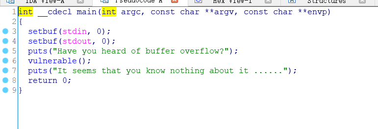
观察到有个vulnerable()函数：


还有个后门函数：get_shell()

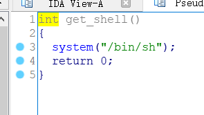
gdb打开，main处下断点后跟进，输入12345678后查看stack：

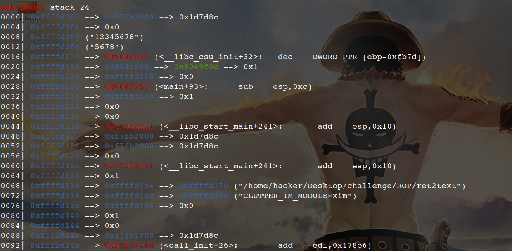
此时ebp= 0xffffd108,

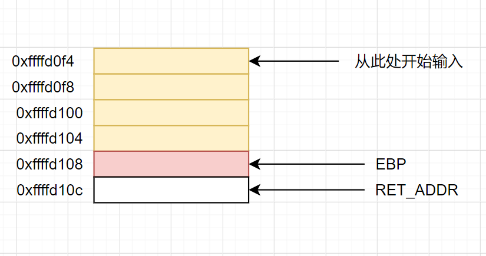
将黄色与红色全部覆盖后填入get_shell()的地址。

exp如下：


getshell：

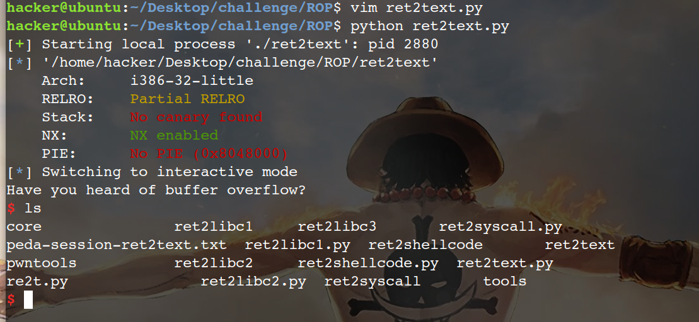


# 2.Ret2syscall

首先file和checksec一下：


这题是静态链接的，所以比较大，

ida查看，有/bin/sh，但是没有system函数，

Linux的系统调用通过int 80h和寄存器来实现，其中eax存放系统调用号，过程如下：

```
1.先将系统调用号放入eax
2.将该函数需要的其他参数存入其他寄存器
3.出发0x80中断（int 0x80h）
```

所以我们需要一些pop和ret指令，这些小片段叫gadget，可以使用ROPgadget这个工具，

本次要用到的：execve("/bin/sh",0,0)

```
eax = 0xb  --->系统调用号
ebx = address of "/bin/sh"
ecx = 0
edx = 0
```

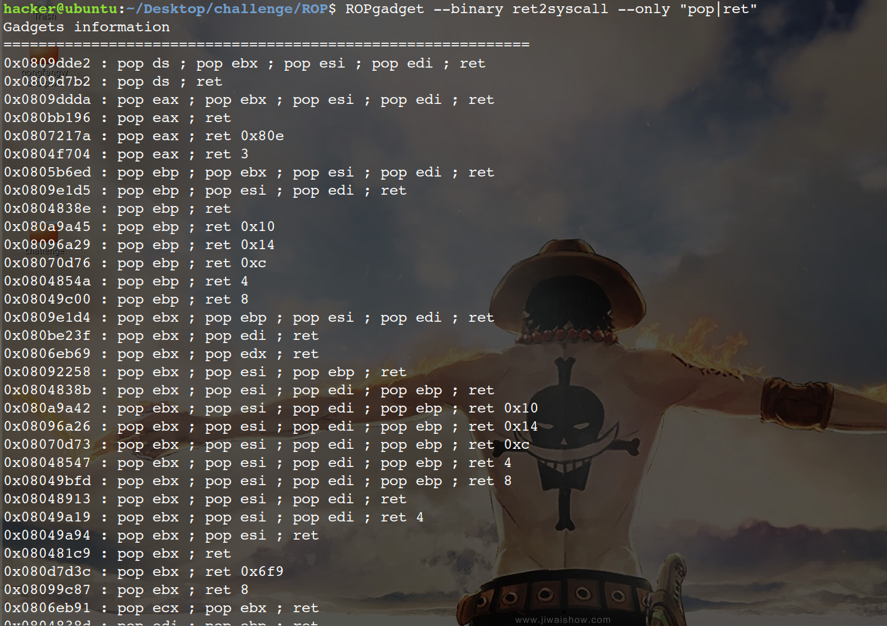
可以看到有许多gadget，选一些有用的就OK。

gdb调试，ebp：0xffffd128


exp如下：

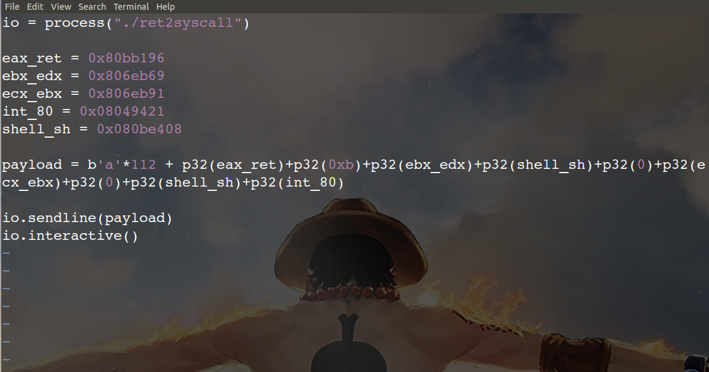
画图来说就是：（下图并不是上面exp的图)


# 3.Ret2shellcode

首先file和checksec一下：

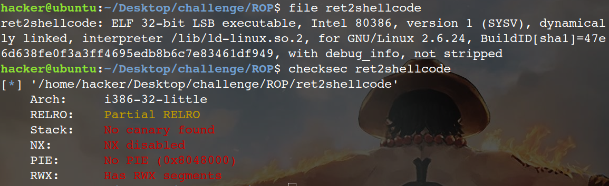
发现rwx并且没有开NX保护，所以代码在堆，栈上可以执行

进入IDA查看，发现这题并没有后门函数，将gets到的s拷贝到buf2.

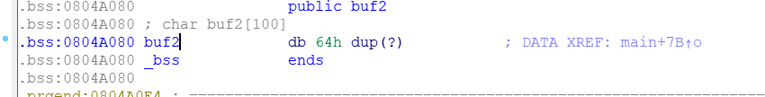
查看buf2所在的bss段是否可执行


main处下断点后run起来，此时ebp=0xffffd118
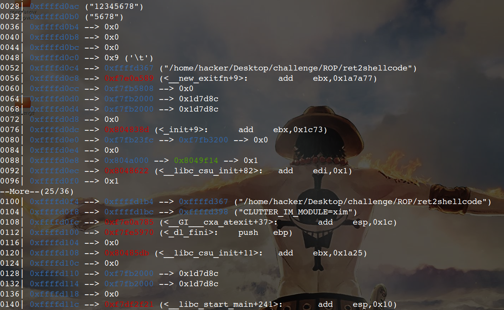
exp如下：


shellcraft.sh()是一段shellcode，ljust()是左对齐，不足处用a填充，画图来说就是这样：

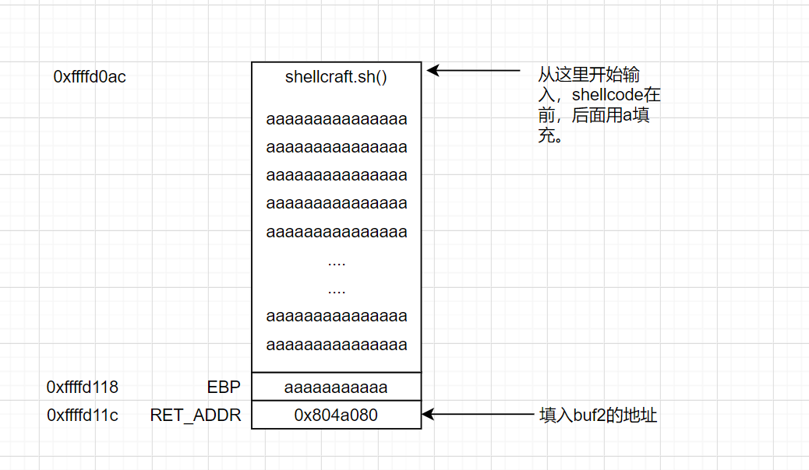
