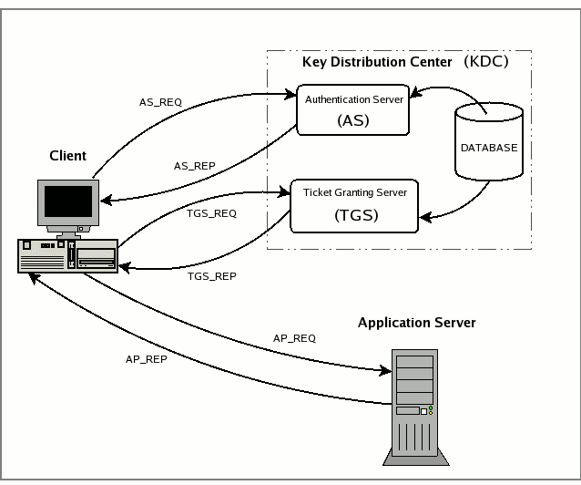

[toc]

这个是鸽了好久好久的，一直没写，今天补一下。还有域委派的想写一直没写......

关于详细的可以RFC文档：https://datatracker.ietf.org/doc/html/rfc4120.html

# kerveros认证

由三方来完成：Client,Server,KDC(密钥分发中心)。

KDC 服务默认会安装在一个域的域控中，而 Client 和 Server 为域内的用户或者是服务，如 HTTP 服务，SQL 服务。在 Kerberos 中 Client 是否有权限访问 Server 端的服务由 KDC 发放的票据来决定。

KDC由两部分组成：

-   AS（**Authentication Server**）：认证服务器，专门用来认证client的身份并发放客户用于访问TGS的TGT（票据授予票据）
-   TGS（**Ticket Granting Ticket**）：票据授予服务器，用来发放整个认证过程以及客户端访问服务端时所需的服务授予票据（Ticket）

## 认证流程

先来看一张图：



当 Client 想要访问 Server 上的某个服务时，需要先向 AS 证明自己的身份，然后通过 AS 发放的 TGT 向 Server 发起认证请求，这个过程分为三块：

**The Authentication Service Exchange**：Client 与 AS 的交互；

**The Ticket-Granting Service (TGS) Exchange**：Client 与 TGS 的交互；

**The Client/Server Authentication Exchange**：Client 与 Server 的交互。


## Client--AS

### AS_REQ

`AS_REQ`中的字段在这里可以看到：[AS_REQ字段](https://daiker.gitbook.io/windows-protocol/kerberos/1#0x03-as_req)

请求中包含：用户hash加密的时间戳`PA-ENC-TIMESTAMP`，用户名。

`AS_REQ`的`PA_DATA`字段中主要用到的是两个：

1.  `PA-ENC-TIMESTAMP`：预认证，用户hash加密的时间戳，之后AS有用户的hash，用于解密，获得时间戳，如果时间在一定范围内，则认证通过
2.  `PA_PAC_REQUEST`：启用PAC支持的扩展，后面会写到。


### AS_REP

AS向活动目录AD请求查询是否有该用户，有的话取出相应用户对应的Hash，并对 `AS_REQ` 请求中加密的时间戳`PA-ENC-TIMESTAMP`进行解密，如果解密成功，则证明客户端提供的密码正确，如果时间戳在五分钟之内，则预认证成功。之后返回TGT票据，分为两部分看下：

1.  `ticket`字段(TGT)：当前KDC中krbtgt hash加密的TGT票据（`Session-key-AS`，时间戳，用户信息，到期时间等），在通信数据包中显示的就是`ticket`字段，`ticket`字段用于`TGS_REQ`的认证，是加密的，**用户不可读取里面的内容**。在`AS_REQ`请求里面时，是使用krbtgt的hash进行加密的，因此如果我们拥有krbtgt的hash就可以自己制作一个ticket，既黄金票据。
2.  `enc-part`字段：AS会生成一个随机数`Session-key-AS`（非常重要，作为kerberos中下一轮的认证密钥），使用用户hash加密该字段可以解密，key是用户hash，解密后得到`Encryptionkey`，其中包含`Session-key-AS`。

总的来说AS_REP包含`Session-key-AS`和`TGT`（由 krbtgt HASH 加密的 `Session-key-AS`和时间戳等信息）


### 工具导出的票据后缀

mimikatz，kekeo，rubeus生成的凭据是以`.kirbi`后缀的。

impacket 生成的凭据的后缀是`.ccache`。

这两种票据主要包含的都是 Session-key 和 TGT，因此可以相互转化。

## Client--TGS

### TGS_REQ

这里client拿到通过`AS_REP`拿到TGT，之后访问KDC访问特定服务。

首先通过用户hash解密`AS_REP`中`enc-part`，得到`Session-key-AS`

Client使用`Session-key-AS`加密时间戳等信息，得到`authenticator`（认证符），之后连同`AS_REP`中的TGT和需要访问的服务ID一起发送给KDC中的TGS。

### TGS_REP

TGS首先检查是否存在Client访问的服务，若存在，使用krbtgt的hash解密TGT得到`Session-key-AS`、时间戳等信息，之后使用`Session-key-AS`解密`authenticator`部分，将得到的两部分时间戳等信息比较，如果时间相差过大则需要重新认证。

认证成功TGS会重新生成session，这里称为`Session-key-TGS`，用于确保客户端与服务器之间通信安全。

响应为两部分：

1.  `Session-key-AS`加密的`Session-key-TGS`
2.  票据ST：server密码的hash加密的`Session-key-TGS`、时间戳等信息

## Client--Server

### AP_REQ

客户端收到TGS_REP响应后，使用`Session-key-AS`解密得到`Session-key-TGS`。

请求有两部分：

1.  新生成的`authenticator`，包含用户ID、时间戳、Client-info等信息，由`Session-key-TGS`加密
2.  票据ST

### AP_REP

使用server密码的hash解密票据ST，得到`Session-key-TGS`、时间戳等信息；之后使用`Session-key-TGS`解密`authenticator`，得到时间戳等信息，将这两者对比校验。

通过客户端身份验证后，Server 会拿着 PAC 去询问 DC 该用户是否有访问权限，DC 拿到 PAC 后进行解密，然后通过 PAC 中的 SID 判断用户的用户组信息、用户权限等信息，然后将结果返回给服务端，服务端再将此信息域用户请求的服务资源的 ACL 进行对比，最后决定是否给用户提供相关的服务。通过认证后 Server 将返回最终的 `AP-REP` 并与 Client 建立通信。


# PAC

## 介绍

用户特权证书。一般的kerberos流程都是如上所述的，但是这里有个问题，那就是用户有没有权限访问该服务，在上面的流程里面，只要用户的hash正确，那么就可以拿到TGT，有了TGT，就可以拿到TGS，有了TGS，就可以访问服务，任何一个用户都可以访问任何服务。也就是说上面的流程解决了`who am i`的问题，并没有解决`What can I do`的问题。

于是微软引入了PAC，流程变成下面的情况：

1.  `AS_REQ`：请求为用户hash加密的时间戳，KDC使用用户hash进行解密，如果结果正确返回用krbtgt hash加密的TGT票据，**TGT里面包含PAC,PAC包含用户的sid，用户所在的组**：`Ticket[Authorization Data[PAC[Signature]]]`
2.  用户凭借TGT票据向KDC发起针对特定服务的TGS_REQ请求，KDC使用krbtgt hash进行解密，如果结果正确，就返回用服务hash 加密的TGS票据(这一步不管用户有没有访问服务的权限，只要TGT正确，就返回TGS票据，任何一个用户，只要hash正确，可以请求域内任何一个服务的TGS票据)
3.  用户拿着TGS票据去请求服务，服务使用自己的hash解密TGS票据。如果解密正确，就拿着PAC去KDC询问用户有没有访问权限，域控解密PAC。获取用户的sid，以及所在的组，再判断用户是否有访问服务的权限，有访问权限(有些服务并没有验证PAC这一步，这也是白银票据能成功的前提，因为就算拥有用户hash，可以制作TGS，也不能制作PAC，PAC当然也验证不成功，但是有些服务不去验证PAC，这是白银票据成功的前提）就允许用户访问。

PAC对于用户和服务全程都是不可见的。只有KDC能制作和查看PAC。

## PAC结构

>    这里看的daiker师傅的文章。


PAC整体上是一个AuthorizationData结构

```
AuthorizationData       ::= SEQUENCE OF SEQUENCE {
              ad-type         [0] Int32,
              ad-data         [1] OCTET STRING
 }
```

其中的ad-type主要有以下几个：

```
AD-IF-RELEVANT                     1
AD-INTENDED-FOR-SERVER             2
AD-INTENDED-FOR-APPLICATION-CLASS  3
AD-KDC-ISSUED                      4
AD-AND-OR                          5
AD-MANDATORY-TICKET-EXTENSIONS     6
AD-IN-TICKET-EXTENSIONS            7
AD-MANDATORY-FOR-KDC               8
Reserved values                 9-63
OSF-DCE                           64
SESAME                            65
AD-OSF-DCE-PKI-CERTID             66 (hemsath @us.ibm.com)
AD-WIN2K-PAC                     128 (jbrezak @exchange.microsoft.com)
AD-ETYPE-NEGOTIATION             129  (lzhu @windows.microsoft.com)
```

整个PAC最外层的`ad-type`为`AD-IF-RELEVANT`，封装了另一个 `AD-WIN2K-PAC` 类型的 `AuthorizationData` 元素，结构为[PACTYPE](https://docs.microsoft.com/en-us/openspecs/windows_protocols/ms-pac/6655b92f-ab06-490b-845d-037e6987275f)

，意思就是这个`AuthorizationData`元素的`ad-type`为`AD-WIN2K-PAC`，而`ad-data`为一段连续的空间，结构为[PAC_INFO_BUFFER](https://docs.microsoft.com/en-us/openspecs/windows_protocols/ms-pac/3341cfa2-6ef5-42e0-b7bc-4544884bf399)

PACTYPE结构：

```c
       typedef struct _PACTYPE {
           ULONG cBuffers;//用于定义Buffers 数组中的条目数。
           ULONG Version;//定义 PAC 版本的小端格式的 32 位无符号整数；必须是 0x00000000。
           PAC_INFO_BUFFER Buffers[1];//PAC_INFO_BUFFER 结构的数组
       } PACTYPE, *PPACTYPE;
```

PAC_INFO_BUFFER结构(key-value型)：

```c
 typedef struct _PAC_INFO_BUFFER {
     ULONG ulType;//描述存在于Offset处的缓冲区中的数据类型
     ULONG cbBufferSize;//包含 PAC 中位于Offset的缓冲区的大小（以字节为单位）
     ULONG64 Offset;//包含从 PACTYPE 结构开头到缓冲区开头的偏移量，以字节为单位。数据偏移量必须是八的倍数。以下部分指定每种元素的格式
 } PAC_INFO_BUFFER, *PPAC_INFO_BUFFER;
```

key的类型：

| 类型       | 意义                                                         |
| :--------- | :----------------------------------------------------------- |
| 0x00000001 | 登录信息。PAC 结构必须包含一个这种类型的缓冲区。必须忽略其他登录信息缓冲区。 |
| 0x00000002 | 凭证信息。PAC 结构不应包含多个此类缓冲区。第二个或后续的凭证信息缓冲区在接收时必须被忽略。 |
| 0x00000006 | 服务器校验和。PAC 结构必须包含一个这种类型的缓冲区。必须忽略其他登录服务器校验和缓冲区。 |
| 0x00000007 | KDC（特权服务器）校验和。PAC 结构必须包含一个这种类型的缓冲区。必须忽略额外的 KDC 校验和缓冲区。 |
| 0x0000000A | 客户名称和票证信息。PAC 结构必须包含一个这种类型的缓冲区。必须忽略其他客户端和票证信息缓冲区。 |
| 0x0000000B | 受约束的委派信息。PAC 结构必须包含一个用于用户到代理服务 (S4U2proxy) 请求的此类缓冲区，否则不包含。必须忽略其他受约束的委托信息缓冲区。 |
| 0x0000000C | 用户主体名称 (UPN) 和域名系统 (DNS) 信息。PAC 结构不应该包含多个此类型的缓冲区。第二个或后续的 UPN 和 DNS 信息缓冲区在接收时必须被忽略。 |
| 0x0000000D | 客户索赔信息。PAC 结构不应该包含多个此类缓冲区。必须忽略其他客户端声明信息缓冲区。 |
| 0x0000000E | 设备信息。PAC 结构不应该包含多个此类缓冲区。必须忽略其他设备信息缓冲区。 |
| 0x0000000F | 设备声明信息。PAC 结构不应该包含多个此类型的缓冲区。必须忽略其他设备声明信息缓冲区。 |
| 0x00000010 | 票证校验和。PAC 结构不应包含多个此类缓冲区。必须忽略额外的票据校验和缓冲区。 |
| 0x00000011 | PAC Attributes 指示缓冲区包含 PAC 的属性位。PAC 结构不应包含多个此类缓冲区。必须忽略其他属性缓冲区。 |
| 0x00000012 | PAC 请求者指示缓冲区包含请求 PAC 的主体的 SID。PAC 结构必须包含一个这种类型的缓冲区。 |

说几个重要的：

-   0x00000001：KERB_VALIDATION_INFO，登陆信息，是一个结构体，整个PAC最重要的部分，如下：

    ```c
     typedef struct _KERB_VALIDATION_INFO {
        FILETIME LogonTime;
        FILETIME LogoffTime;
        FILETIME KickOffTime;
        FILETIME PasswordLastSet;
        FILETIME PasswordCanChange;
        FILETIME PasswordMustChange;
        RPC_UNICODE_STRING EffectiveName;
        RPC_UNICODE_STRING FullName;
        RPC_UNICODE_STRING LogonScript;
        RPC_UNICODE_STRING ProfilePath;
        RPC_UNICODE_STRING HomeDirectory;
        RPC_UNICODE_STRING HomeDirectoryDrive;
        USHORT LogonCount;
        USHORT BadPasswordCount;
        ULONG UserId;
        ULONG PrimaryGroupId;
        ULONG GroupCount;
        [size_is(GroupCount)] PGROUP_MEMBERSHIP GroupIds;
        ULONG UserFlags;
        USER_SESSION_KEY UserSessionKey;
        RPC_UNICODE_STRING LogonServer;
        RPC_UNICODE_STRING LogonDomainName;
        PISID LogonDomainId;
        ULONG Reserved1[2];
        ULONG UserAccountControl;
        ULONG SubAuthStatus;
        FILETIME LastSuccessfulILogon;
        FILETIME LastFailedILogon;
        ULONG FailedILogonCount;
        ULONG Reserved3;
        ULONG SidCount;
        [size_is(SidCount)] PKERB_SID_AND_ATTRIBUTES ExtraSids;
        PISID ResourceGroupDomainSid;
        ULONG ResourceGroupCount;
        [size_is(ResourceGroupCount)] PGROUP_MEMBERSHIP ResourceGroupIds;
     } KERB_VALIDATION_INFO, *PKERB_VALIDATION_INFO;
    ```

-   0x00000006：服务器校验和；0x00000007：KDC（特权服务器）校验和。

    -   分别由server密码和KDC密码加密，是为了防止PAC内容被篡改。

    -   存在签名的原因有两个。首先，存在带有服务器密钥的签名，以防止客户端生成自己的PAC并将其作为加密授权数据发送到KDC，以包含在票证中。其次，提供具有KDC密钥的签名，以防止不受信任的服务伪造带有无效PAC的票证。

    -   两个都是PAC_SIGNATURE_DATA结构：

        ```c
         typedef struct _PAC_SIGNATURE_DATA {
             ULONG SignatureType;//4字节，必须为下表中的值之一
             UCHAR Signature[ANYSIZE_ARRAY];//包含校验和。签名的长度由SignatureType字段的值确定
         } PAC_SIGNATURE_DATA, *PPAC_SIGNATURE_DATA;
        ```

        | 值                                    | 意义                                    |
        | :------------------------------------ | :-------------------------------------- |
        | KERB_CHECKSUM_HMAC_MD5<br/>0xFFFFFF76 | 签名大小为 16 个字节。十进制值为 -138。 |
        | HMAC_SHA1_96_AES128<br />0x0000000F   | 签名大小为 12 个字节。十进制值为 15。   |
        | HMAC_SHA1_96_AES256<br/>0x00000010    | 签名大小为 12 个字节。十进制值为 16。   |

-   0x0000000A：PAC_CLIENT_INFO，客户名称和票证信息，也是一个结构体

    ```c
           typedef struct _PAC_CLIENT_INFO {
               FILETIME ClientId;//小端格式的FILETIME结构，包含 Kerberos 初始票证授予票证 (TGT)身份验证时间
               USHORT NameLength;//用于指定Name 字段的长度
               WCHAR Name[1];//包含客户帐户名称的小端格式的 16 位 Unicode 字符数组
           } PAC_CLIENT_INFO, *PPAC_CLIENT_INFO;
    ```

    
