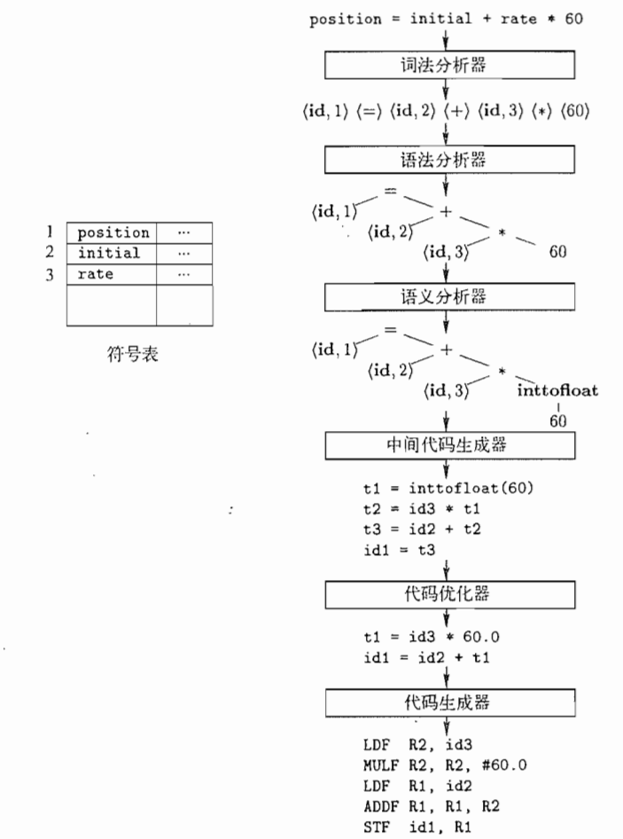

[toc]

英语太差，斯坦福cs143的课看着难受，拿哈工大的编译原理来看，顺序就按照P的顺序

# P2编译系统结构

具体举个例子：

# P3词法分析概述

编译器的第一个步骤称为`词法分析( lexicalanalysis)`。 词法分析器读人组成源程序的字符流，并且将它们组织成为有意义的`词素(lexeme)`的序列。对于每个词素，词法分析器产生`词法单元(token)`作为输出: < token-name, attribute-value >，或者<种别码，属性值>

# P4语法分析

`语法分析(syntax analysis)`。语法分析器使用有词法分析器生成的各个词法单元的第一个分量来创建树形的中间表示。

# P5语义分析

语义分析器(semantic analyzer)。使用语法树和符号表中的信息来检查源程序是否和语言定义的语义一致，同时收集类型信息，并把这些信息存放到语法树或符号表中

---------------

# P1 Introduction

compilers：编译器

Interpreters：解释器

# P2 Structure of a compiler

五个阶段：

1.  lexical analysis：词法分析
2.  Parsing：解析
3.  Semantic Analysis：语义分析
4.  优化
5.  代码生成

# 

