---

title: 重拾Win32
date: 2022-04-01
tags: [Win32]
categories: Technology
---

之后想看看免杀和内核相关的东西，先把win32再看一遍吧，好多都忘了，还是滴水的课程，感谢海哥的课程！

[toc]

# 介绍

Win32不是用来画界面的，如果你以后要在Windows写好程序，是必须要学Win32的；

# 字符编码

## ASCII

使用指定的7 位二进制数组合来表示128种可能的字符。

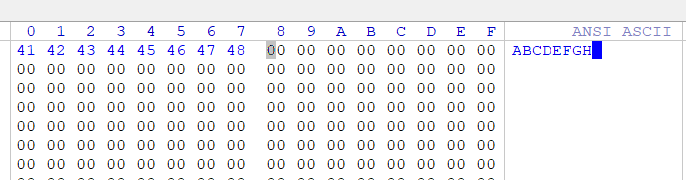

最大为`0x7F`

### 扩展ASCII表

从`0x80` 到`0xFF`：（未截全）

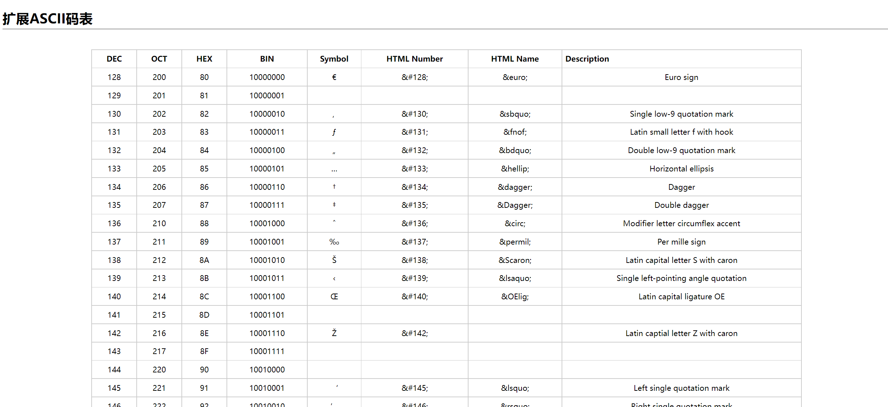

对于中文韩文日文等还是不够。

## ASCII表的扩展

GB2312/GB2312-80，与GBK差不多的。

（GB2312标准共收录 6763个汉字，GBK共收入21886个汉字和图形符号）

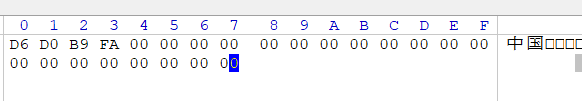

每一个都是扩展ASCII。

假设我们将“中国”这两个字发给国外的朋友，他的电脑上并没有该编码表，所以解析出 来的则不会是汉字，而会出现大家所熟知的“乱码”

## Unicode

Unicode编码创建了一张包含世界上所有文字的编码表，只要世界上存在的文字符号，都会赋予 一个唯一的编码

Unicode编码的范围是：0x0-0x10FFFF，其可以容纳100多万个符号

### 存储方式

#### UTF-16

UTF-16/UTF-8是Unicode存储的实现方式；**UTF-16编码是以16个无符号整数位单位**，注意是16位为一个单位， 但不表示一个字符就只有16位，具体的要看字符的Unicode编码所在范围，有可能是2字节，有可能是4字节， **现在机器上的Unicode编码一般指的就是UTF-16**。

会有le与be两种，就是存储方式为大端序和小端序。

举例（假的）：

-   中（Unicode编码）：0x1234 
-   国（Unicode编码）：0x12345

存储的时候，中占2字节，国占4字节（0x0001 2345）

如‘中’和‘A’的存储


比较浪费，于是有了utf8

#### UTF-8

UTF-8称之为可**变长存储**方案，其存储根据字符大小来分配，例如字母A就分配一个字节，汉字“中”就分配两个 字节。

优点：节省空间；缺点：解析很麻烦

#### BOM

BOM中文为字节顺序标记，其就是用来插入到文本文件起始位置开头的，用于识别Unicode文件的编码类型。

上面的截图，有`FFFE`之类的东西，那个就是。

| utf8             | EF EB BF |
| ---------------- | -------- |
| UTF-16LE(LITTLE) | FF FE    |
| UTF-16BE(BIG)    | FE FF    |


# C语言中的宽字符

```c
ASCII码：char strBuff[] = "中国";
Unicode编码（UTF-16）：wchar_t strBuff[] = L"中国"
```

字符串长度：

```c
char strBuff[] = "China";
wchar_t strBuff1[] = L"China";
strlen(strBuff); //取得多字节字符串中字符长度，不包含 00
wcslen(strBuff1); //取得多字节字符串中字符长度，不包含 00 00
```

```c
#include<Windows.h>
#include<stdio.h>
#include<locale.h>
using namespace std;
int main() 
{
	setlocale(LC_ALL, "");//使用控制台默认编码
	wchar_t wct[] = L"中国";
	wprintf(L"%s\n", wct);
	return 0;
}
```

# Win32API中的宽字符

主要存放在`C:\Windows\System32` （存储的DLL是64位）、`C:\Windows\SysWOW64`（存储的DLL是32位）下面的所有DLL文件（几千个），没写反，就是反的，32和64，qwq。 重要的DLL文件： 

-   Kernel32.dll：最核心的功能模块，例如内存管理、进程线程相关的函数等； 
-   User32.dll：Windows用户界面相关的应用程序接口，例如创建窗口、发送信息等； 
-   GDI32.dll：全称是Graphical Device Interface（图形设备接口），包含用于画图和显示文本的函数。

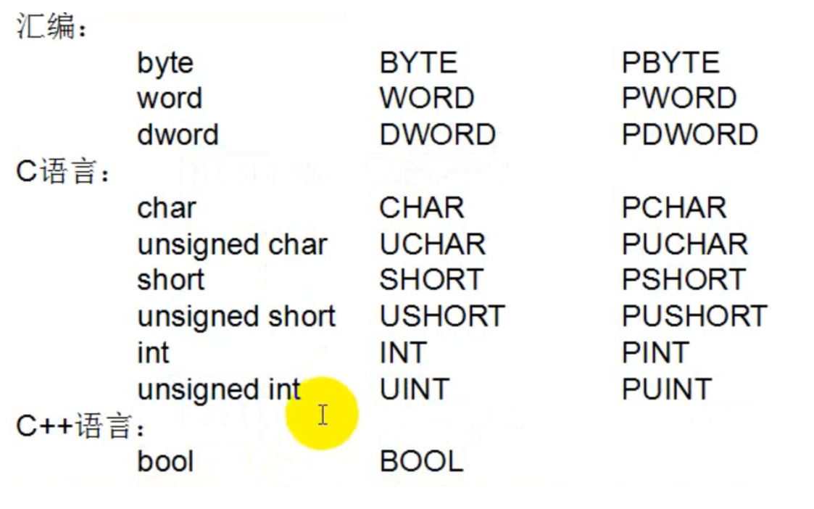

win32使用字符串

字符串

```c
CHAR strBuff[] = "中国"; // char

WCHAR strBuff[] = L"中国"; // wchar_t

TCHAR strBuff[] = TEXT("中国"); // TCHAR 根据当前项目的编码自动选择char还是wchar_t，在Win32中推荐使用这种方式
```

指针

```c
PSTR strPoint = "中国"; // char*

PWSTR strPoint = L"中国"; // wchar_t*

PTSTR strPoint = TEXT("中国"); // PTSTR 根据当前项目的编码自动选择如char*还是wchar_t*，在Win32中推荐使用这种方式
```

# 进程的创建

程序所需要的资源（数据、代码...）是由进程提供的；进程是一种空间上的概念，它的责任就是提供资源，至于资源如何使用，与它无关。


当我们在Windows下双击打开一个文件，实际上就是`explore.exe`这个进程创建的我们打开文件的进程，其使用的方法就是：CreateProcess()

进程创建的过程也就是**CreateProcess函数**：

```
1.  映射EXE文件（低2G）
2.  创建内核对象EPROCESS（高2G）(每个进程都有一个)
3.  映射系统DLL（ntdll.dll）（放到用户区）
4.  创建线程内核对象RTHREAD（高2G）(每个进程都有一个)
5.  系统启动线程：
    1.  映射DLL（ntdll.LdrInitializeThunk）
    2.  线程开始执行
```


# 创建进程

CreateProcess：

```c
BOOL CreateProcess(
    LPCTSTR lpApplicationName,                 // name of executable module 进程名（完整文件路径）
    LPTSTR lpCommandLine,                      // command line string 命令行传参
    LPSECURITY_ATTRIBUTES lpProcessAttributes, // SD 进程句柄
    LPSECURITY_ATTRIBUTES lpThreadAttributes,  // SD 线程句柄
    BOOL bInheritHandles,                      // handle inheritance option 句柄
    DWORD dwCreationFlags,                     // creation flags 标志
    LPVOID lpEnvironment,                      // new environment block 父进程环境变量
    LPCTSTR lpCurrentDirectory,                // current directory name 父进程目录作为当前目录，设置目录
    LPSTARTUPINFO lpStartupInfo,               // startup information 结构体详细信息（启动进程相关信息）
    LPPROCESS_INFORMATION lpProcessInformation // process information 结构体详细信息（进程ID、线程ID、进程句柄、线程句柄）
);
```

其中的倒数第一二个参数是结构体，

```c
typedef struct _STARTUPINFOA {
  DWORD  cb;//The size of the structure, in bytes.
  LPSTR  lpReserved;
  LPSTR  lpDesktop;
  LPSTR  lpTitle;
  DWORD  dwX;
  DWORD  dwY;
  DWORD  dwXSize;
  DWORD  dwYSize;
  DWORD  dwXCountChars;
  DWORD  dwYCountChars;
  DWORD  dwFillAttribute;
  DWORD  dwFlags;
  WORD   wShowWindow;
  WORD   cbReserved2;
  LPBYTE lpReserved2;
  HANDLE hStdInput;
  HANDLE hStdOutput;
  HANDLE hStdError;
} STARTUPINFOA, *LPSTARTUPINFOA;
typedef struct _PROCESS_INFORMATION {
  HANDLE hProcess;
  HANDLE hThread;
  DWORD  dwProcessId;
  DWORD  dwThreadId;
} PROCESS_INFORMATION, *PPROCESS_INFORMATION, *LPPROCESS_INFORMATION;
```

不用管，直接写0就行，而且也差不多可以看懂

```c
int main()
{
	TCHAR childProcessName[] = TEXT("C:/WINDOWS/system32/cmd.exe");
	TCHAR childPeocessCmd[] = TEXT("/c ping www.baidu.com");

	STARTUPINFO si;
	PROCESS_INFORMATION pi;
	ZeroMemory(&si, sizeof(si));
	ZeroMemory(&pi, sizeof(pi));
	if (CreateProcess(childProcessName,
		childPeocessCmd,
		NULL,
		NULL,
		FALSE,
		0, NULL, NULL, &si, &pi))
	{
		printf("create success\n");
	}
	else {
		printf("CreateProcess Error: %d \n", GetLastError());//使用getlasterror获取错误信息
	}

	CloseHandle(pi.hProcess);
	CloseHandle(pi.hThread);

	return 0;
}
```

# 句柄表

## 内核对象

例如进程、线程、文件、互斥体、事件等等在内核都有一个对应的结构体，这些结构体都由内核负责管理，所以我们都可以称之为内核对象。

**CloseHandle**这个API可以关的都是内核对象


## 管理内核对象

当我们使用如下图所示的函数创建时，会在内核层创建一个结构体，而我们该如何管理这些结构体呢？或者说如何使用这些结构体呢？其实很好解决，我们可以通过内核结构体地址来管理，但是这样做存在问题：**应用层很有可能操作不当导致修改啦内核结构体的地址**，我们写应用层代码都知道访问到一个不存在的内存地址就会报错，而如果访问到一个内核地址是错误的，微软系统下则直接会蓝屏。

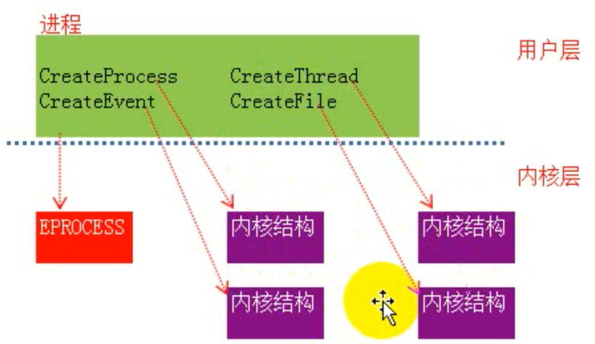

这个时候句柄表出现了。

只有进程才会有句柄表，并且**每一个进程都会有一个句柄表**。


句柄本质上就一个防火墙，将应用层、内核层隔离开来，通过句柄就可以控制进程内核结构体，我们得到所谓句柄的值实际上就是句柄表里的一个索引。

## 多进程共享一个内核对象

A进程通过**CreateProcess函数**创建了一个内核对象；B进程通过**OpenProcess函数**可以打开别人创建好的一个进程，也就是可以操作其的内核对象；A进程想要操作内核对象就通过其对应的句柄表的句柄（索引）来操作；B进程操作这个内核对象也是通过它自己的句柄表的句柄（索引）来操作内核对象。（需要注意的是：句柄表是一个私有的，句柄值就是进程自己句柄表的索引）

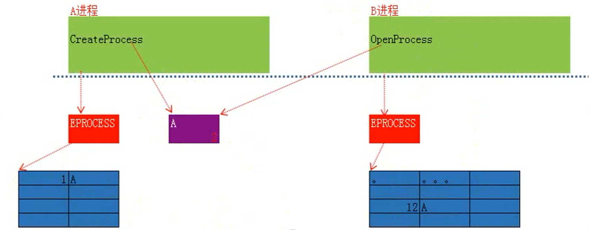

在之前的例子中我们提到了CloseHandle这个函数是用来关闭进程、线程的，其实它的本质就是释放句柄，但是并不代表执行了这个函数，创建的内核对象就会**彻底消失**；如上图中所示内核对象存在一个计数器，目前是2，它的值是根据调用A的次数来决定的，如果我们只是在A进程中执行了**CloseHandle函数**，内核对象并不会消失，因为进程B还在使用，而只有进程B也执行了**CloseHandle函数**，这个内核对象的计数器为0，就会关闭消失了

**最后**：注意，以上所述特性适合于**除了线程**以外的所有内核对象，创建进程，同时也会创建线程，如果你想把线程关闭，首先需要**CloseHandle函数**要让其计数器为0，其次需要有人将其关闭，所以假设我们创建了一个IE进程打开了一个网站，如果我们只是在代码中使用了**CloseHandle函数**，这样IE浏览器并不会关闭，需要我们手动点击窗口的关闭按钮才行（**只有线程关闭了，进程才会关闭**）。

## 句柄是否可以被继承

除了我们上述的方式可以进行共享内核对象以外，Windows还设计了一种方式来提供我们共享内核对象，我们先来了解一下句柄是否"可以"被继承。

如下图所示（**句柄表是有三列的，分别是句柄值、内核结构体地址、句柄是否可以被继承**），比如说我们在A进程（父进程）创建了4个内核对象：

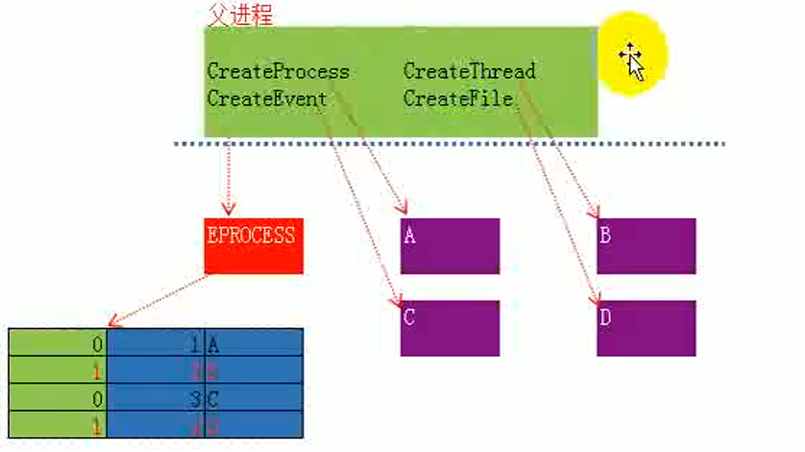

这四个函数都有一个参数**LPSECURITY_ATTRIBUTES lpThreadAttributes**，通过这个参数我们可以判断函数是否创建的是内核对象。

比如拿CreateEvent来看：

```c
HANDLE CreateEventA(
  [in, optional] LPSECURITY_ATTRIBUTES lpEventAttributes,
  [in]           BOOL                  bManualReset,
  [in]           BOOL                  bInitialState,
  [in, optional] LPCSTR                lpName
);
```

它的第一个参数，其实就是一个结构体：

```c
typedef struct _SECURITY_ATTRIBUTES {
  DWORD  nLength;//长度
  LPVOID lpSecurityDescriptor;//安全描述符
  BOOL   bInheritHandle;//句柄是否被继承，这个是重点被关注的
} SECURITY_ATTRIBUTES, *PSECURITY_ATTRIBUTES, *LPSECURITY_ATTRIBUTES;
```

这里使用CreateProcess来看：

```c
BOOL CreateProcessA(
  [in, optional]      LPCSTR                lpApplicationName,
  [in, out, optional] LPSTR                 lpCommandLine,
  [in, optional]      LPSECURITY_ATTRIBUTES lpProcessAttributes,//SD
  [in, optional]      LPSECURITY_ATTRIBUTES lpThreadAttributes,//SD
  [in]                BOOL                  bInheritHandles,
  [in]                DWORD                 dwCreationFlags,
  [in, optional]      LPVOID                lpEnvironment,
  [in, optional]      LPCSTR                lpCurrentDirectory,
  [in]                LPSTARTUPINFOA        lpStartupInfo,
  [out]               LPPROCESS_INFORMATION lpProcessInformation
);
```

有两个LPSECURITY_ATTRIBUTES结构体，一个是进程的，一个是线程的：

```c
//这种是不被继承
CreateProcess(childProcessName,childPeocessCmd,NULL,NULL,FALSE,0, NULL, NULL, &si, &pi);
//进程句柄，线程句柄都可以被继承
SECURITY_ATTRIBUTES sa;
ZeroMemory(&sa, sizeof(sa));
sa.nLength = sizeof(SECURITY_ATTRIBUTES);
sa.bInheritHandle = true;
CreateProcess(childProcessName,childPeocessCmd,&sa,&sa,FALSE,0, NULL, NULL, &si, &pi);
```

## 句柄是否"允许"被继承

上面是说是否可以被继承，真正继承要另一个参数，还是CreateProcess举例，是`bInheritHandles`这个参数，这个参数决定了是否允许创建的子进程继承句柄，设置为TRUE时，我们创建的子进程才允许继承父进程的句柄。

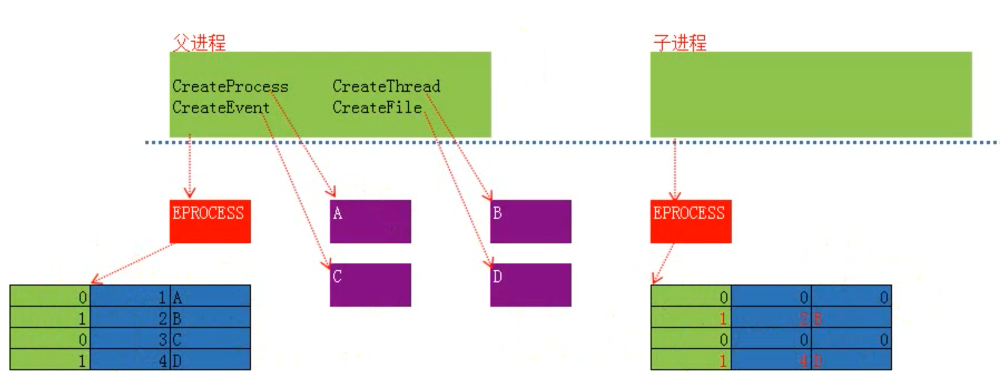

# 进程相关API

CreateProcess函数会给我们返回一个结构体，包含四个数据：进程编号（ID）、进程句柄、线程编号（ID）、线程句柄。

进程ID，通常我们称之为PID，任务管理器中的就是。

## 全局句柄表

每个进程都有一份私有的句柄表，而操作系统也有一份句柄表，我们称之为全局句柄表，这张表里包含了所有正在运行的进程、线程

PID我们就可以理解为是全局句柄表中的一个索引，那么PID和句柄的区别就很容易看出来来了，**PID是全局的，在任何进程中都有意义，都可以使用，而句柄则是局部的、私有的**；PID是**唯一的，绝对不可能出现重复的存在**，但是当进程消失，那么这个PID就有可能会分给另外一个进程。（**PID不是句柄，但是可以通过PID获得到全局句柄表中其对应的句柄**）

A程序打开IE，获取PID和句柄：

```c
#include <Windows.h>
#include <stdio.h>
int main()
{
    TCHAR childProcessName[] = TEXT("C:\\Program Files\\Internet Explorer\\iexplore.exe");
    TCHAR childPeocessCmd[] = TEXT("http://www.baidu.com");

    STARTUPINFO si;
    PROCESS_INFORMATION pi;
    ZeroMemory(&si, sizeof(si));
    ZeroMemory(&pi, sizeof(pi));
    if (CreateProcess(childProcessName,
                      childPeocessCmd,
                      NULL,
                      NULL,
                      FALSE,
                      0, NULL, NULL, &si, &pi))
    {
        printf("create success\nPID:%d, 句柄:%d", pi.dwProcessId, pi.hProcess);
    }
    else
    {
        printf("CreateProcess Error: %d \n", GetLastError());
    }
    
    CloseHandle(pi.hProcess);
    CloseHandle(pi.hThread);
	system("pause");
    return 0;
}
```

之后B使用TerminateProcess函数来终止A进程：

```c
// TerminateProcess函数
BOOL TerminateProcess(
  HANDLE hProcess, // handle to the process 句柄
  UINT uExitCode   // exit code for the process 退出代码
);
```

```c
#include <Windows.h>
#include <stdlib.h>
#include <stdio.h>
int main()
{
    HANDLE hProcess;
    hProcess = (HANDLE)0x1b0;
    if (!TerminateProcess(hProcess, 1))
    {
        printf("终止失败,%d\n", GetLastError());
    }

    return 0;
}
```

可以看见是失败，6，句柄无效，真正的关闭这个进程，那就需要借助PID来获取句柄：

```c
HANDLE OpenProcess(
  DWORD dwDesiredAccess,  // access flag 你希望的访问权限,https://docs.microsoft.com/en-us/windows/win32/procthread/process-security-and-access-rights
  BOOL bInheritHandle,    // handle inheritance option 是否可以被继承
  DWORD dwProcessId       // process identifier 进程ID
);
```

```c
int main()
{
    HANDLE hProcess;
    hProcess = OpenProcess(PROCESS_ALL_ACCESS, FALSE, 0x4598);

    if (!TerminateProcess(hProcess, 0))
    {
        printf("终止进程失败：%d \n", GetLastError());
    }
}
```

运行之后发现iE关了。

## 以挂起的形式创建进程

还是CreateProcess，第六个参数

```c
BOOL CreateProcess(
  LPCTSTR lpApplicationName,                 // name of executable module
  LPTSTR lpCommandLine,                      // command line string
  LPSECURITY_ATTRIBUTES lpProcessAttributes, // SD
  LPSECURITY_ATTRIBUTES lpThreadAttributes,  // SD
  BOOL bInheritHandles,                      // handle inheritance option
  DWORD dwCreationFlags,                     // creation flags <--这个参数
  LPVOID lpEnvironment,                      // new environment block
  LPCTSTR lpCurrentDirectory,                // current directory name
  LPSTARTUPINFO lpStartupInfo,               // startup information
  LPPROCESS_INFORMATION lpProcessInformation // process information
);
```

```c

    TCHAR childProcessName[] = TEXT("C:/WINDOWS/system32/cmd.exe");
    TCHAR childPeocessCmd[] = TEXT("/c ping www.baidu.com");

(CreateProcess(childProcessName,childPeocessCmd,  NULL, NULL, FALSE,CREATE_NEW_CONSOLE, NULL, NULL, &si, &pi)

```

写`CREATE_NEW_CONSOLE`就会在新的终端打开，不然就是本终端打开。

但是我们关注的是另一个，有意义的，`CREATE_SUSPENDED`


释放使用resumeThread

## 模块目录和工作目录

```c
#include <Windows.h>
#include <stdio.h>
int main()
{
    char strModule[256];
    GetModuleFileName(NULL,(LPWSTR)strModule, 256);// 得到当前模块目录，当前exe所在的路径，包含exe文件名
    char strWork[1000];
    GetCurrentDirectory(1000, (LPWSTR)strWork); // 获取当前工作目录

    printf("模块目录：%ws \n工作目录：%ws \n", strModule, strWork);
    return 0;
}
```


## 其他进程相关API

获取当前进程ID（PID）：GetCurrentProcessId

获取当前进程句柄：GetCurrentProcess

获取命令行：GetCommandLine

获取启动信息：GetStartupInfo

遍历进程ID：EnumProcesses

快照：CreateToolhelp32Snapshot

# 创建线程

线程：附属在进程上的执行实体，

```c
HANDLE CreateThread( // 返回值是线程句柄
  LPSECURITY_ATTRIBUTES lpThreadAttributes, // SD 安全属性，包含安全描述符
  SIZE_T dwStackSize,                       // initial stack size 初始堆栈
  LPTHREAD_START_ROUTINE lpStartAddress,    // thread function 线程执行的函数代码
  LPVOID lpParameter,                       // thread argument 线程需要的参数
  DWORD dwCreationFlags,                    // creation option 标识，也可以以挂起形式创建线程
  LPDWORD lpThreadId                        // thread identifier 返回当前线程ID
);
```


```c
#include<windows.h>
#include<stdio.h>
// 线程执行的函数有语法要求，参考MSDN Library
DWORD WINAPI ThreadProc(LPVOID lpParameter) {
    // 要执行的代码
    for (int i = 0; i < 100; i++) {
        Sleep(500);
        printf("++++++ %d \n", i);
    }

    return 0;
}

int main(int argc, char* argv[])
{
    HANDLE hd;
    // 创建线程
    hd=CreateThread(NULL, NULL, ThreadProc, NULL, 0, NULL);
    CloseHandle(hd);
    // 要执行的代码
    for (int i = 0; i < 100; i++) {
        Sleep(500);
        printf("------ %d \n", i);
    }
    return 0;

}
```

## 传参

```c
DWORD WINAPI ThreadProc(LPVOID lpParameter) {
    // 要执行的代码
    int* p = (int*)lpParameter;
    for (int i = 0; i < *p; i++) {
....................
    }

    return 0;
}

int main(int argc, char* argv[])
{
.............
    int n=10;
    // 创建线程
    hd=CreateThread(NULL, NULL, ThreadProc, &n, 0, NULL);
    CloseHandle(hd);
..........

}
```

# 线程控制

## 停止线程

停止自己的线程，可以使用sleep函数，上面有。

下面是停止别的线程：

## SuspendThread

SuspendThread函数用于暂停（挂起）某个线程，当暂停后该线程不会占用CPU，只需要传入一个线程句柄：

```c
DWORD SuspendThread(
  HANDLE hThread   // handle to thread
);
```

```c
HANDLE hd;
hd = CreateThread(NULL, NULL, ThreadProc, NULL, 0, NULL);
Sleep(3000);
SuspendThread(hd);
Sleep(3000);
ResumeThread(hd);
CloseHandle(hd);
```

## 等待线程结束

### WaitForSingleObject

WaitForSingleObject函数用于等待**一个内核对象**状态发生变更

```c
DWORD WaitForSingleObject(
  HANDLE hHandle,       
  DWORD dwMilliseconds   // time-out interval 等待超时时间（毫秒）
);
```

`INFINITE`表示，不指定超时时间，要执行完才继续走

```c
    HANDLE hd;
    hd=CreateThread(NULL, NULL, ThreadProc, NULL, 0, NULL);
   
    WaitForSingleObject(hd, INFINITE);
    SuspendThread(hd);
    printf("end\n");
```

### WaitForMultipleObjects


```c
DWORD WaitForMultipleObjects(
  DWORD nCount,             // number of handles in array 内核对象的数量
  CONST HANDLE *lpHandles,  // object-handle array 内核对象的句柄数组
  BOOL bWaitAll,            // wait option 等待模式
  DWORD dwMilliseconds      // time-out interval 等待超时时间（毫秒）
);
```

```c
    HANDLE hd[2];
    hd[0] = CreateThread(NULL, NULL, ThreadProc, NULL, 0, NULL);

    hd[1] = CreateThread(NULL, NULL, ThreadProc, NULL, 0, NULL);

    WaitForMultipleObjects(2, hd,true, INFINITE);
    SuspendThread(hd);
    printf("end\n");
```

### GetExitCodeThread

和名字一样，

```c
BOOL GetExitCodeThread(
  HANDLE hThread,      // handle to the thread
  LPDWORD lpExitCode   // termination status
);
```

## 获取设置线程上下文

## GetThreadContext

```c
BOOL GetThreadContext(
  HANDLE hThread,       // handle to thread with context 句柄
  LPCONTEXT lpContext   // context structure
);
```

```c
    HANDLE hd[2];
    hd[0] = CreateThread(NULL, NULL, ThreadProc, NULL, 0, NULL);

   /* hd[1] = CreateThread(NULL, NULL, ThreadProc1, NULL, 0, NULL);*/

    SuspendThread(hd[0]);

    CONTEXT context;
    context.ContextFlags = CONTEXT_INTEGER;
    GetThreadContext(hd[0], &context);

    printf("end\n%d ,%d",context.Rax,context.Rbx);
    ResumeThread(hd[0]);
    CloseHandle(hd[0]);
```

### SetThreadContext

修改线程上下文

```c
BOOL SetThreadContext(
  HANDLE hThread,            // handle to thread
  CONST CONTEXT *lpContext   // context structure
);
```

```c
    CONTEXT context;
    context.ContextFlags = CONTEXT_INTEGER;
    context.Eax = 0x123;
    SetThreadContext(hd[0], &context);

    CONTEXT c;
    c.ContextFlags = CONTEXT_INTEGER;
    GetThreadContext(hd[0], &c);

    printf("%x ,%x", c.Eax, c.Ebp);
    getchar();
    ResumeThread(hd[0]);
    CloseHandle(hd[0]);
```


# 临界区

每个线程都有自己的栈，局部变量是存储在栈中的，这就意味着每个进程都会有一份自己的“句柄变量”（栈），如果线程仅仅使用自己的“局部变量”那就不存在线程安全问题，反之，如果多个线程共用一个全局变量，且修改该全局变量就会出现问题。

临界资源：一次只有一个线程使用

临界区：访问临界资源的代码

## 线程锁

使用线程锁来解决上面的问题。

```c
创建全局变量：CRITICAL_SECTION cs;
初始化全局变量：InitializeCriticalSection(&cs);
实现临界区：进入 → EnterCriticalSection(&cs); 离开 → LeaveCriticalSection(&cs);
```

注意要init，找了半天错，，，，，

```c
#include<windows.h>
#include<stdio.h>

CRITICAL_SECTION cs;
int tickNUM = 10;

DWORD WINAPI ThreadProc(LPVOID lpParameter) {
   
    while (1){
        EnterCriticalSection(&cs);
        if (tickNUM > 0){
            printf("现在有%d张 ", tickNUM);
            tickNUM--;
            printf("还有%d 张\n", tickNUM);
        }
        else
        {
            LeaveCriticalSection(&cs);
            break;
        }
        LeaveCriticalSection(&cs);
    }
   
    return 0;
}

int main(int argc, char* argv[])
{
    InitializeCriticalSection(&cs);
    HANDLE hd,hd1;
    hd = CreateThread(NULL, NULL, ThreadProc, NULL, 0, NULL);
    hd1 = CreateThread(NULL, NULL, ThreadProc, NULL, 0, NULL);

    //getchar();

    return 0;

}

```

# 互斥体

**假设A进程的B线程和C进程的D线程**，同时使用的是内核级的临界资源（**内核对象：线程、文件、进程...**）该怎么让这个访问是安全的？**使用线程锁的方式明显不行，因为线程锁仅能控制同进程中的多线程**。这个时候使用互斥体：

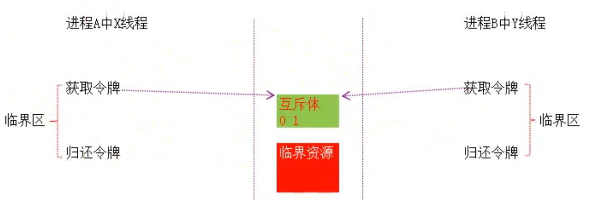


```c
HANDLE CreateMutex(
  LPSECURITY_ATTRIBUTES lpMutexAttributes,  // SD 安全属性，包含安全描述符
  BOOL bInitialOwner,                       // initial owner 是否希望互斥体创建出来就有信号，或者说就可以使用，如果希望的话就为FALSE；官方解释为如果该值为TRUE则表示当前进程拥有该互斥体所有权
  LPCTSTR lpName                            // object name 互斥体的名字
);
```

```c
#include<windows.h>
#include<stdio.h>


int main(int argc, char* argv[])
{
    //想要创建出来就有信号，第二个参数给false
    HANDLE hs = CreateMutex(NULL, FALSE, (LPCWSTR)"xyz");
    WaitForSingleObject(hs, INFINITE);

    for (int i = 0; i < 10; i++)
    {
        Sleep(1000);
        printf("%d\n", i);

    }
    ReleaseMutex(hs);

    return 0;

}

```

## 互斥体和线程锁的区别

1.  线程锁只能用于单个进程间的线程控制
2.  互斥体可以设定等待超时，但线程锁不能
3.  线程意外结束时，互斥体可以避免无限等待
4.  互斥体效率没有线程锁高

## 互斥体防止多开

防止多开，使用互斥体只是一个方法，`ERROR_ALREADY_EXISTS`

```c
int main(int argc, char *argv[])
{
    HANDLE hs = CreateMutex(NULL, true, (LPCWSTR) "防多开");
    if (hs)
    {
        if (GetLastError() == ERROR_ALREADY_EXISTS)
        {
            printf("该程序已经开启了，请勿再次开启！");
            getchar();
            CloseHandle(hs);
            return 0;
        }
        else
        {
            WaitForSingleObject(hs, INFINITE);
            // 操作资源
            for (int i = 0; i < 5; i++)
            {
                printf("Process: A Thread: B -- %d \n", i);
                Sleep(1000);
            }
            ReleaseMutex(hs);
        }
    }
    return 0;
}
```

# 事件

事件本身也是一种内核对象，其也是是用来控制线程的。

## 通知类型

```c
HANDLE CreateEvent(
  LPSECURITY_ATTRIBUTES lpEventAttributes, // SD 安全属性，包含安全描述符
  BOOL bManualReset,                       // reset type 如果你希望当前事件类型是通知类型则写TRUE，反之FALSE
  BOOL bInitialState,                      // initial state 初始状态，决定创建出来时候是否有信号，有为TRUE，没有为FALSE
  LPCTSTR lpName                           // object name 事件名字
);
```

互斥：只能有一个跑

通知：全部可以跑

```c
// 第二个参数，FALSE表示非通知类型通知，也就是互斥；TRUE则表示为通知类型
// 第三个参数表示初始状态没有信号
e_event = CreateEvent(NULL, true, FALSE, NULL);
```


```c
#include <windows.h>
#include<stdio.h>
HANDLE e_event;
DWORD WINAPI ThreadProc(LPVOID lpParameter) {
    // 等待事件
    WaitForSingleObject(e_event, INFINITE);
    printf("ThreadProc - running ...\n");
    return 0;
}

DWORD WINAPI ThreadProcB(LPVOID lpParameter) {
    // 等待事件
    WaitForSingleObject(e_event, INFINITE);
    printf("ThreadProcB - running ...\n");
    return 0;
}

int main(int argc, char* argv[])
{
    // 第二个参数，FALSE表示非通知类型通知，也就是互斥；TRUE则表示为通知类型
    // 第三个参数表示初始状态没有信号
    e_event = CreateEvent(NULL, true, FALSE, NULL);

    // 创建2个线程
    HANDLE hThread[2];
    hThread[0] = CreateThread(NULL, NULL, ThreadProc, NULL, 0, NULL);
    hThread[1] = CreateThread(NULL, NULL, ThreadProcB, NULL, 0, NULL);
    //这里他并没有执行ThreadProc和ThreadProcB
    Sleep(1000);
    
    // 设置事件为已通知，也就是设置为有信号，之后才跑
    SetEvent(e_event);

    // 等待线程执行结束，销毁内核对象
    WaitForMultipleObjects(2, hThread, TRUE, INFINITE);
    CloseHandle(hThread[0]);
    CloseHandle(hThread[1]);
    CloseHandle(e_event);

    return 0;
}
```

## 线程同步

**线程互斥**：线程互斥是指对于共享的进程系统资源，在各单个线程访问时的排它性；当有若干个线程都要使用某一共享资源时，任何时刻最多只允许一个线程去使用，其它要使用该资源的线程必须等待，直到占用资源者释放该资源。

**线程同步**： 线程同步是指线程之间所具有的一种制约关系，一个线程的执行依赖另一个线程的消息，当它没有得到另一个线程的消息时应等待，直到消息到达时才被唤醒；同步的前提是互斥，其次就是有序，**互斥并不代表A线程访问临界资源后就一定是B线程再去访问，也有可能是A线程，这就是属于无序的状态**，所以同步就是**互斥加上有序**。

### 使用互斥体实现

会有很多cpu时间浪费掉：

```c
#include <windows.h>
#include<stdio.h>
// 容器
int container;

// 次数
int count = 10;

// 互斥体
HANDLE hMutex;

// 生产者
DWORD WINAPI ThreadProc(LPVOID lpParameter) {
    for (int i = 0; i < count; i++) {
        if (container==0)
        {
            // 等待互斥体，获取令牌
            WaitForSingleObject(hMutex, INFINITE);
            // 获取当前进程ID
            int threadId = GetCurrentThreadId();
            // 生产存放进容器
            container = 1;
            printf("++Thread: %d, Build: %d \n", threadId, container);
        }
        else
        {
            i--;
            printf("----------------\n");

        }
        ReleaseMutex(hMutex);
       
    }
    return 0;
}

// 消费者
DWORD WINAPI ThreadProcB(LPVOID lpParameter) 
{
    for (int i = 0; i < count; i++) {
        if (container==1)
        {
            // 等待互斥体，获取令牌
            WaitForSingleObject(hMutex, INFINITE);
            // 获取当前进程ID
            int threadId = GetCurrentThreadId();
            printf("--Thread: %d, Consume: %d \n", threadId, container);
            // 消费
            container = 0;
        }
        else
        {
            i--;
            printf("+++++++++++++++\n");
        }
        
        // 释放令牌
        ReleaseMutex(hMutex);
    }
    return 0;
}

int main(int argc, char* argv[])
{
    // 创建互斥体
    hMutex = CreateMutex(NULL, FALSE, NULL);

    // 创建2个线程
    HANDLE hThread[2];
    hThread[0] = CreateThread(NULL, NULL, ThreadProc, NULL, 0, NULL);
    hThread[1] = CreateThread(NULL, NULL, ThreadProcB, NULL, 0, NULL);

    WaitForMultipleObjects(2, hThread, TRUE, INFINITE);
    CloseHandle(hThread[0]);
    CloseHandle(hThread[1]);
    CloseHandle(hMutex);

    return 0;
}
```


为了防止cpu时间的浪费，使用事件可以完美解决

### 事件

```c
#include <windows.h>
#include <stdio.h>
// 容器
int container;
// 次数
int count = 10;
HANDLE eventa, eventb;
// 生产者
DWORD WINAPI ThreadProc(LPVOID lpParameter)
{
    for (int i = 0; i < count; i++)
    {

        // 等待互斥体，获取令牌
        WaitForSingleObject(eventa, INFINITE);
        // 获取当前进程ID
        int threadId = GetCurrentThreadId();
        // 生产存放进容器
        container = 1;
        printf("++Thread: %d, Build: %d \n", threadId, container);

        SetEvent(eventb);
    }
    return 0;
}
// 消费者
DWORD WINAPI ThreadProcB(LPVOID lpParameter)
{
    for (int i = 0; i < count; i++)
    {

        // 等待互斥体，获取令牌
        WaitForSingleObject(eventb, INFINITE);
        // 获取当前进程ID
        int threadId = GetCurrentThreadId();
        container = 0;
        printf("--Thread: %d, Consume: %d \n", threadId, container);
        // 消费

        SetEvent(eventa);
    }
    return 0;
}
int main(int argc, char* argv[])
{
    eventa = CreateEvent(NULL, false, true, NULL);
    eventb = CreateEvent(NULL, false, false, NULL);
    // 创建2个线程
    HANDLE hThread[2];
    hThread[0] = CreateThread(NULL, NULL, ThreadProc, NULL, 0, NULL);
    hThread[1] = CreateThread(NULL, NULL, ThreadProcB, NULL, 0, NULL);

    WaitForMultipleObjects(2, hThread, TRUE, INFINITE);
    CloseHandle(hThread[0]);
    CloseHandle(hThread[1]);
    CloseHandle(eventa);
    CloseHandle(eventb);
    return 0;
}
```


# 窗口

内核层也有模块：

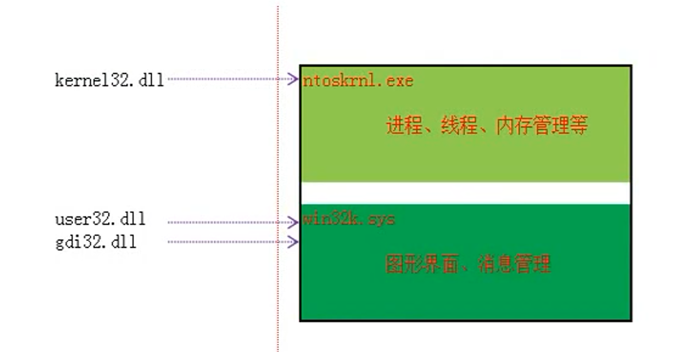

Handle是私有的。

hwnd是全局的。

```cpp
#include <windows.h>

int main(int argc, char *argv[])
{
    HWND hWnd; // 窗口句柄
    HDC hDc;   // 设备上下文对象
    HPEN hPen; // 画笔
    // 1. 设备对象，要绘画的位置
    // 设置为NULL则表示在桌面中绘画
    hWnd = (HWND)0x000C058A;

    // 2. 获取设备的上下文对象（DC）
    /*
        语法格式：
        HDC GetDC(
            HWND hWnd   // handle to window
        );
    */
    hDc = GetDC(hWnd);

    // 3. 创建画笔，设置线条的属性
    /*
        语法格式：
        HPEN CreatePen(
            int fnPenStyle,    // pen style
            int nWidth,        // pen width
            COLORREF crColor   // pen color
        );
    */
    hPen = CreatePen(PS_SOLID, 5, RGB(0xFF, 00, 00)); // RGB表示红绿蓝，红绿蓝的组合就可以组成新的一种颜色。

    // 4. 关联
    /*
        语法格式：
        HGDIOBJ SelectObject(
            HDC hdc,          // handle to DC
            HGDIOBJ hgdiobj   // handle to object
        );
    */
    SelectObject(hDc, hPen);

    // 5. 开始画线
    /*
        语法格式：
        BOOL LineTo(
            HDC hdc,    // device context handle
            int nXEnd,  // x-coordinate of ending point
            int nYEnd   // y-coordinate of ending point
        );
    */
    LineTo(hDc, 400, 400);

    // 6. 释放资源
    DeleteObject(hPen);
    ReleaseDC(hWnd, hDc);
    return 0;
}
```

# 消息队列

消息：当我们点击鼠标的时候，或者当我们按下键盘的时候，操作系统都要把这些动作记录下来，存储到一个结构体中，这个**结构体**就是消息。

消息队列：**每个线程**只有一个消息队列。


# 第一个Windows程序

```c
int WINAPI WinMain(
  HINSTANCE hInstance,      // handle to current instance,指向模块的句柄，实际上这个值就是模块在进程空间内的内存地址
  HINSTANCE hPrevInstance,  // handle to previous instance,该参数永远为空NULL，无需理解
  LPSTR lpCmdLine,          // command line
  int nCmdShow              // show state
);
```

## 调试信息输出

不使用printf，使用OutputDebugString

```
void OutputDebugString(
  LPCTSTR lpOutputString
);
```

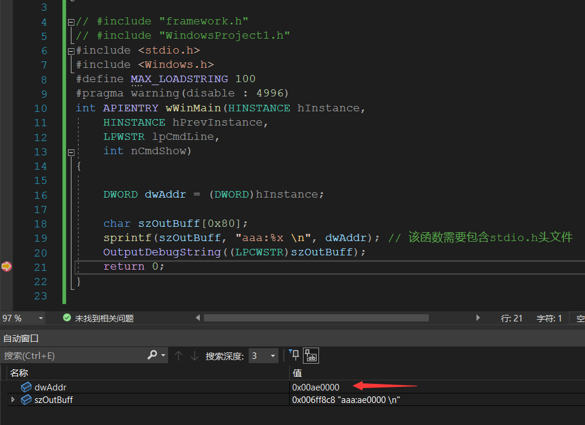

```cpp

#include<Windows.h>

#include<stdio.h>
// 窗口函数定义
LRESULT CALLBACK WindowProc(HWND hwnd, UINT uMsg, WPARAM wParam, LPARAM lParam) {
    // 必须要调用一个默认的消息处理函数，关闭、最小化、最大化都是由默认消息处理函数处理的
    return DefWindowProc(hwnd, uMsg, wParam, lParam);
}

int APIENTRY WinMain(HINSTANCE hInstance,
    HINSTANCE hPrevInstance,
    LPSTR     lpCmdLine,
    int       nCmdShow)
{
    char szOutBuff[0x80];

    // 1. 定义创建的窗口(创建注册窗口类)
    TCHAR className[] = TEXT("My First Window");
    WNDCLASS wndClass = { 0 };
    // 设置窗口背景色
    wndClass.hbrBackground = (HBRUSH)COLOR_BACKGROUND;
    // 设置类名字
    wndClass.lpszClassName = className;
    // 设置模块地址
    wndClass.hInstance = hInstance;
    // 处理消息的窗口函数
    wndClass.lpfnWndProc = WindowProc; // 不是调用函数，只是告诉操作系统，当前窗口对应的窗口回调函数是什么
    // 注册窗口类
    RegisterClass(&wndClass);

    // 2. 创建并显示窗口
    // 创建窗口
    /*
    CreateWindow 语法格式：
    HWND CreateWindow(
        LPCTSTR lpClassName,  // registered class name 类名字
        LPCTSTR lpWindowName, // window name 窗口名字
        DWORD dwStyle,        // window style 窗口外观的样式
        int x,                // horizontal position of window 相对于父窗口x坐标
        int y,                // vertical position of window 相对于父窗口y坐标
        int nWidth,           // window width 窗口宽度：像素
        int nHeight,          // window height 窗口长度：像素
        HWND hWndParent,      // handle to parent or owner window 父窗口句柄
        HMENU hMenu,          // menu handle or child identifier 菜单句柄
        HINSTANCE hInstance,  // handle to application instance 模块
        LPVOID lpParam        // window-creation data  附加数据
    );
    */
    HWND hWnd = CreateWindow(className, TEXT("窗口"), WS_OVERLAPPEDWINDOW, 10, 10, 600, 300, NULL, NULL, hInstance, NULL);

    if (hWnd == NULL) {
        // 如果为NULL则窗口创建失败，输出错误信息
        sprintf(szOutBuff, "Error: %d", GetLastError());
        OutputDebugString((LPCWSTR)szOutBuff);
        return 0;
    }

    // 显示窗口
    /*
    ShowWindow 语法格式：
    BOOL ShowWindow(
        HWND hWnd,     // handle to window 窗口句柄
        int nCmdShow   // show state 显示的形式
    );
    */
    ShowWindow(hWnd, SW_SHOW);

    // 3. 接收消息并处理
    /*
    GetMessage 语法格式：
    BOOL GetMessage(
        LPMSG lpMsg,         // message information OUT类型参数，这是一个指针
        // 后三个参数都是过滤条件
        HWND hWnd,           // handle to window 窗口句柄，如果为NULL则表示该线程中的所有消息都要
        UINT wMsgFilterMin,  // first message 第一条信息
        UINT wMsgFilterMax   // last message 最后一条信息
    );
    */
    MSG msg;
    BOOL bRet;
    while ((bRet = GetMessage(&msg, NULL, 0, 0)) != 0)
    {
        if (bRet == -1)
        {
            // handle the error and possibly exit
            sprintf(szOutBuff, "Error: %d", GetLastError());
            OutputDebugString((LPCWSTR)szOutBuff);
            return 0;
        }
        else
        {
            // 转换消息
            TranslateMessage(&msg);
            // 分发消息：就是给系统调用窗口处理函数
            DispatchMessage(&msg);
        }
    }

    return 0;
}
```

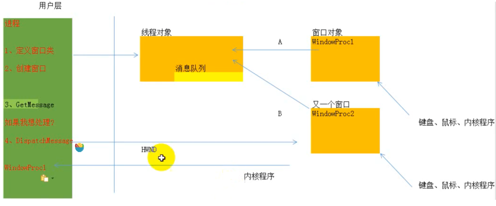

# 消息类型

callback的几个参数，都是之前msg的部分参数

```c
LRESULT CALLBACK WindowProc(HWND hwnd, UINT uMsg, WPARAM wParam, LPARAM lParam) 
```

## 处理窗口关闭

```cpp
case WM_DESTROY:
    {
        PostQuitMessage(0);
        return 0;
    }
```

## 处理键盘按下

```cpp
case WM_KEYDOWN:
    {
        //MessageBox(0, 0, 0, 0)
        sprintf(szOutBuff, "keyboard: %x - %x \n",uMsg, wParam);
        OutputDebugString((LPCTSTR)szOutBuff);
        return 0;
    }    
case WM_CHAR:
    {
        sprintf(szOutBuff, "字符: %c \n", wParam);
        OutputDebugString((LPCTSTR)szOutBuff);
        return 0;
    }
```

所有的消息直接去查就行了，

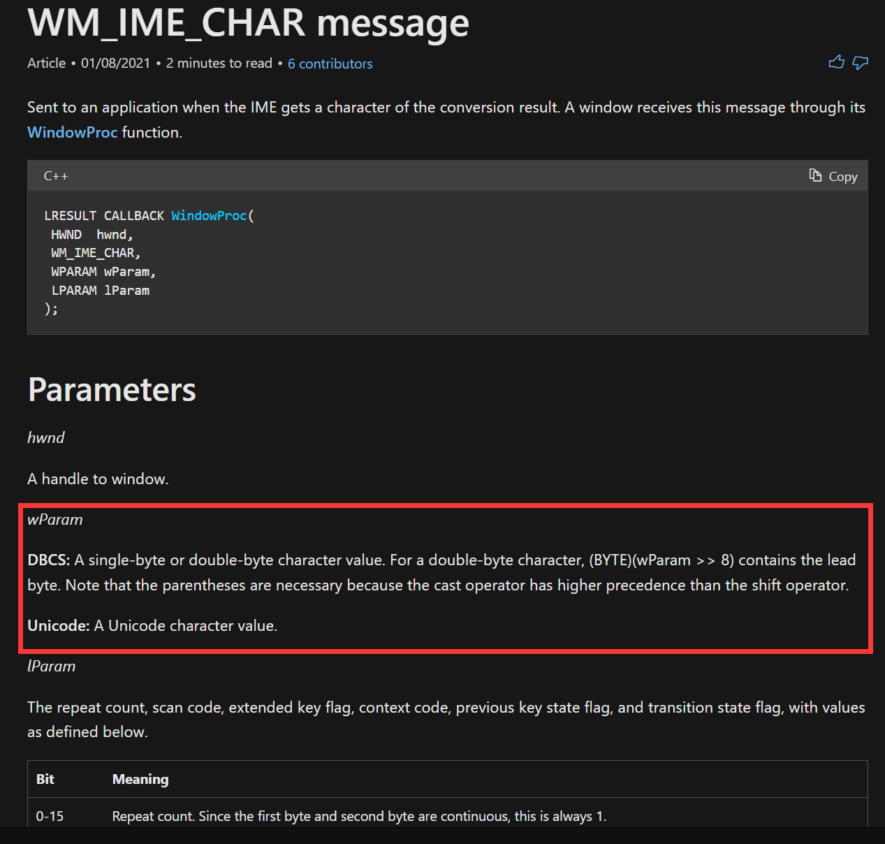

# 子窗口

## 子窗口控件

1.  Windows提供了几个预定义的窗口类以方便我们的使用，我们一般叫它们为子窗口控件，简称控件；
2.  控件会自己处理消息，并在自己状态发生改变时通知父窗口；
3.  预定义的控件有：按钮、复选框、编辑框、静态字符串标签和滚动条等。


```cpp
#define CWA_EDIT 0x100
#define CWA_BUTTON_0 0x101
#define CWA_BUTTON_1 0x102
// gHinstance = hInstance; 全局
case WM_CREATE:
    {
        //编辑框
        CreateWindow(
            "EDIT",                                            // registered class name 注册的类名，使用EDIT则为编辑框
            "",                                                // window name 窗口名称
            WS_CHILD | WS_VISIBLE | WS_VSCROLL | ES_MULTILINE, // window style 子窗口控件样式：子窗口、创建后可以看到、滚动条、自动换行
            0,                                                 // horizontal position of window 在父窗口上的x坐标
            0,                                                 // vertical position of window 在父窗口上的y坐标
            400,                                               // window width 控件宽度
            300,                                               // window height 控件高度
            hwnd,                                              // menu handle or child identifier 父窗口句柄
            (HWND)CWA_EDIT,                                    // menu handle or child identifier 子窗口标识
            gHinstance,                                        // handle to application instance 模块
            NULL                                               // window-creation data 附加数据
        );
        // 创建"设置"按钮
        CreateWindow(
            TEXT("BUTTON"),        // registered class name 注册的类名，使用BUTTON则为按钮
            TEXT("设置"),          // window name 按钮名称
            WS_CHILD | WS_VISIBLE, // window style 子窗口控件样式：子窗口、创建后可以看到
            450,                   // horizontal position of window 在父窗口上的x坐标
            150,                   // vertical position of window 在父窗口上的y坐标
            80,                    // window width 控件宽度
            20,                    // window height 控件高度
            hwnd,                  // menu handle or child identifier 父窗口句柄
            (HWND)CWA_BUTTON_0,    // menu handle or child identifier 子窗口标识
            gHinstance,            // handle to application instance 模块
            NULL                   // window-creation data 附加数据
        );

        // 创建"获取"按钮
        CreateWindow(
            TEXT("BUTTON"),        // registered class name 注册的类名，使用BUTTON则为按钮
            TEXT("获取"),          // window name 按钮名称
            WS_CHILD | WS_VISIBLE, // window style 子窗口控件样式：子窗口、创建后可以看到
            450,                   // horizontal position of window 在父窗口上的x坐标
            100,                   // vertical position of window 在父窗口上的y坐标
            80,                    // window width 控件宽度
            20,                    // window height 控件高度
            hwnd,                  // menu handle or child identifier 父窗口句柄
            (HWND)CWA_BUTTON_1,    // menu handle or child identifier 子窗口标识
            gHinstance,            // handle to application instance 模块
            NULL                   // window-creation data 附加数据
        );

        break;
    }
    // 当按钮点击则处理
    case WM_COMMAND:
    {
        // 宏WM_COMMAND中，wParam参数的低16位中有标识，根据标识我们才能判断哪个按钮和编辑框，使用LOWORD()可以获取低16位
        switch (LOWORD(wParam))
        {
            // 当按钮为设置
        case CWA_BUTTON_0:
        {
            // SetDlgItemText函数修改编辑框内容
            SetDlgItemText(hwnd, (int)CWA_EDIT, TEXT("HACK THE WORLD"));
            break;
        }
        // 当按钮为获取
        case CWA_BUTTON_1:
        {
            // MessageBox弹框输出编辑框内容
            TCHAR szEditBuffer[0x80];
            GetDlgItemText(hwnd, (int)CWA_EDIT, szEditBuffer, 0x80);
            MessageBox(NULL, szEditBuffer, NULL, NULL);
            break;
        }
        }
        break;
    }
```

# 虚拟内存与物理内存

## 可使用的物理内存

MmNumberOfPhysicalPages*4 = 物理内存

虚拟内存（硬盘）

## 可识别的物理内存

**32位操作系统最多可以识别物理内存为64G**，但是操作系统会进行限制，**例如XP这个系统只能识别4G的物理内存**（Windows Server 2003服务器版本可以识别4G以上）。

但是我们可以通过HOOK系统函数来突破XP操作系统的4GB限制


# 私有内存的申请释放

物理内存分为两类，一个是私有内存（Private）一个是共享内存（Mapped），私有内存的意思是这块物理内存（物理页）只有你使用，而共享内存则是多个进程一起用。

申请内存的方式：

1.  通过virtualAllocate/virtualAllocEx申请的：私有
2.  通过CreateFileMapping映射的：共享


## VirtualAlloc

```cpp
LPVOID VirtualAlloc(
  LPVOID lpAddress,        // region to reserve or commit 要分配的内存区域的地址，没有特殊需求通常不指定
  SIZE_T dwSize,           // size of region 分配的大小，一个物理页大小是0x1000（4KB），看你需要申请多少个物理页就乘以多少
  DWORD flAllocationType,  // type of allocation 分配的类型，常用的是MEM_COMMIT（占用线性地址，也需要物理内存）和MEM_RESERVE（占用线性地址，但不需要物理内存）
  DWORD flProtect          // type of access protection 该内存的初始保护属性
);
```

占用线性地址并分配物理内存，可读可写：

```cpp
VirtualAlloc(NULL, 0x1000, MEM_COMMIT, PAGE_READWRITE);// 虚拟地址仍然保留，物理页不保留
```

想要释放物理内存，释放线性地址就写如下代码

```cpp
VirtualFree(p, 0, MEM_RESERVE);// 虚拟地址不保留
```

# 共享内存的申请释放

## CreateFileMapping

内核对象，这个对象可以为我们准备物理内存，还可以将文件映射到物理页

```cpp
HANDLE CreateFileMapping( 
  HANDLE hFile,                       // handle to file 文件句柄，如果不想将文件映射到物理页，则不指定该参数
  LPSECURITY_ATTRIBUTES lpAttributes, // security 安全属性，包含安全描述符
  DWORD flProtect,                    // protection 保护模式，物理页的属性
  DWORD dwMaximumSizeHigh,            // high-order DWORD of size 高32位，在32位计算机里通常设置为空
  DWORD dwMaximumSizeLow,             // low-order DWORD of size 低32位，指定物理内存的大小
  LPCTSTR lpName                      // object name 对象名字，公用时写，自己使用则可以不指定
);
```

创建好物理页后，还需要通过**MapViewOffile函数**将物理页与线性地址进行映射：

```cpp
LPVOID MapViewOfFile(
  HANDLE hFileMappingObject,   // handle to file-mapping object file-mapping对象的句柄
  DWORD dwDesiredAccess,       // access mode 访问模式(虚拟内存的限制必须比物理地址更加严格)
  DWORD dwFileOffsetHigh,      // high-order DWORD of offset 高32位，在32位计算机里通常设置为空
  DWORD dwFileOffsetLow,       // low-order DWORD of offset 低32位，指定从哪里开始映射
  SIZE_T dwNumberOfBytesToMap  // number of bytes to map 共享内存的大小，一般与物理页大小一致
);
```

示例代码，也可以双开一个，直接读

```cpp
#include <windows.h>

#define MapFileName "共享内存"
#define BUF_SIZE 0x1000
HANDLE g_hMapFile;
LPTSTR g_lpBuff;

int main(int argc, char* argv[])
{
    // 内核对象：准备好物理页，无效句柄值-1、物理页可读写、申请一个物理页
    g_hMapFile = CreateFileMapping(INVALID_HANDLE_VALUE, NULL, PAGE_READWRITE, 0, BUF_SIZE, (LPCWSTR)MapFileName);
    // 将物理页与线性地址进行映射

    g_lpBuff = (LPTSTR)MapViewOfFile(g_hMapFile, FILE_MAP_ALL_ACCESS, 0, 0, BUF_SIZE);

    // 向物理内存中存储
    *(PDWORD)g_lpBuff = 0x12345678;

    // 关闭映射，关闭映射则表示释放了线形地址，但是物理页还存在
    UnmapViewOfFile(g_lpBuff);
    // 关闭句柄，这样才能释放物理页，但需要等待物理页使用完毕才会真正的释放，这里只是告诉系统我们当前进程不再使用该句柄（物理页）
    CloseHandle(g_hMapFile);
    return 0;
}
```

# 文件系统(未完成，文件操作相关API未写)

文件系统是操作系统用于管理磁盘上文件的方法和数据结构；简单点说就是在磁盘上如何组织文件的**方法**。

文件系统是软件层面的。

|              | NTFS   | FAT32  |
| ------------ | ------ | ------ |
| 磁盘分区容量 | 2T     | 32G    |
| 单个文件容量 | 4G以上 | 最大4G |
| EFS加密      | 支持   | 不支持 |
| 磁盘配额     | 支持   | 不支持 |

## 卷相关API

### 获取卷（逻辑驱动器）

函数**GetLogicalDrives**用于获取当前计算机所有逻辑驱动器，语法格式为：

```cpp
DWORD GetLogicalDrives(VOID); // 返回值是一个DOWRD，没有参数
```

```cpp
    DWORD gLd = GetLogicalDrives();
    printf("GetLogicalDrives: %x\n", gLd);
```


### 获取所有逻辑驱动器的字符串

```cpp
DWORD GetLogicalDriveStrings(
  DWORD nBufferLength,  // size of buffer 输入类型，要获取字符串的大小
  LPTSTR lpBuffer       // drive strings buffer 输出类型，将获取的字符串放到该参数中
);
```


### 获取卷（逻辑驱动器）的类型

```cpp
UINT GetDriveType(
  LPCTSTR lpRootPathName   // root directory 根目录，这里我们可以使用驱动器字符串
);
```

## 获取卷信息

```cpp
BOOL GetVolumeInformation(
  LPCTSTR lpRootPathName,           // root directory 输入类型，驱动器字符串
  LPTSTR lpVolumeNameBuffer,        // volume name buffer 输出类型，返回卷名
  DWORD nVolumeNameSize,            // length of name buffer 输入类型，卷名长度
  LPDWORD lpVolumeSerialNumber,     // volume serial number 输出类型，卷宗序列号
  LPDWORD lpMaximumComponentLength, // maximum file name length 输出类型，指定文件系统支持的文件名组件的最大长度
  LPDWORD lpFileSystemFlags,        // file system options 输出类型，与指定文件系统相关的标志
  LPTSTR lpFileSystemNameBuffer,    // file system name buffer 输出类型，文件系统（如FAT或NTFS）名称
  DWORD nFileSystemNameSize         // length of file system name buffer 输入类型，文件系统名称的长度
);
```


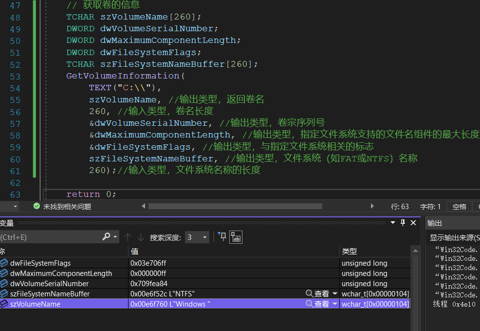


## 目录相关API

## 创建目录

CreateDirectory

```cpp
BOOL CreateDirectory(
  LPCTSTR lpPathName,                         // directory name 目录名称，需要指定完整路径包含盘符的
  LPSECURITY_ATTRIBUTES lpSecurityAttributes  // SD 安全属性，包含安全描述符
);
```

```cpp
CreateDirectory(TEXT("E:\\A"), NULL);
```

## 删除目录

```cpp
BOOL RemoveDirectory(
  LPCTSTR lpPathName   // directory name 目录名称，需要指定完整路径包含盘符的
);
```

## 修改目录名称

```cpp
BOOL MoveFile(
  LPCTSTR lpExistingFileName, // file name 目录名
  LPCTSTR lpNewFileName       // new file name 新目录名
);
```

## 获取程序当前目录

```cpp
DWORD GetCurrentDirectory(
  DWORD nBufferLength,  // size of directory buffer 输入类型，获取当前目录名的大小
  LPTSTR lpBuffer       // directory buffer 输出类型，当前目录名称
);
```

## 设置程序当前目录

```cpp
BOOL SetCurrentDirectory(
  LPCTSTR lpPathName   // new directory name 新的目录名称
);
```


## 文件相关API

## 创建文件

```cpp
HANDLE CreateFile(
  LPCTSTR lpFileName,                         // file name 文件名
  DWORD dwDesiredAccess,                      // access mode 访问模式
  DWORD dwShareMode,                          // share mode 共享模式，如果为0则是排他性，就是目前在使用时其他人是无法使用的
  LPSECURITY_ATTRIBUTES lpSecurityAttributes, // SD 安全属性，包含安全描述符
  DWORD dwCreationDisposition,                // how to create 如何创建，可以打开一个已经存在的文件
  DWORD dwFlagsAndAttributes,                 // file attributes 文件属性，可以创建隐藏文件
  HANDLE hTemplateFile                        // handle to template file 
);
```

以可读可写方式不管有没有，有就覆盖没有就新建的方式创建一个隐藏文件

```cpp
CreateFile(
        TEXT("E:\\A.txt"),
        GENERIC_READ | GENERIC_WRITE,//访问模式
        0,                     //共享模式，如果为0则是排他性，就是目前在使用时其他人是无法使用的
        NULL,                  // SD
        CREATE_ALWAYS,         //如何创建，可以打开一个已经存在的文件
        FILE_ATTRIBUTE_HIDDEN, //文件属性，可以创建隐藏文件
        NULL                   //创建文件的句柄
    );
```

## 关闭文件

未完成..................待续..............


# 内存映射文件

内存映射文件，将硬盘某个文件映射到**物理页**上，然后再将物理页映射到**虚拟内存**中。

## 内存映射文件读写

1.  创建文件
2.  创建FileMapping对象
3.   物理页映射到虚拟内存
4.  之后就是读写文件了
5.  关闭资源

```cpp
#include <Windows.h>
#include <stdio.h>

int main()
{
    HANDLE hFile;
    HANDLE hMapFile;
    LPVOID lpAddr;

    // 1. 创建文件（获取文件句柄）
    hFile = CreateFile(
        TEXT("E:\\1.txt"), 
        GENERIC_READ | GENERIC_WRITE, 
        0, 
        NULL, 
        OPEN_EXISTING, 
        FILE_ATTRIBUTE_NORMAL, 
        NULL);

    // 判断CreateFile是否执行成功
    if (hFile == NULL) {
        printf("CreateFile failed: %d \n", GetLastError());
        return 0;
    }

    // 2. 创建FileMapping对象
    hMapFile = CreateFileMapping(
        hFile, NULL, PAGE_READWRITE, 0, 0, NULL);

    // 判断CreateFileMapping是否执行成功
    if (hMapFile == NULL) {
        printf("CreateFileMapping failed: %d \n", GetLastError());
        return 0;
    }

    // 3. 物理页映射到虚拟内存
    lpAddr = MapViewOfFile(hMapFile, FILE_MAP_COPY, 0, 0, 0);

    // 4. 读取文件
    DWORD dwTest1 = *(LPDWORD)lpAddr; // 读取最开始的4字节
    printf("dwTest1: %x \n", dwTest1);
    // 5. 写文件 
     lpAddr = (LPVOID)0x11111111;
   // 如果你希望修改可以立即生效，我们可以通过FlushViewOfFile函数来强制更新缓存
     FlushViewOfFile(((LPDWORD)lpAddr), 8);
     printf("ok");
    // 6. 关闭资源
    UnmapViewOfFile(lpAddr);
    CloseHandle(hFile);
    CloseHandle(hMapFile);
    return 0;
}
```

## 内存映射文件之共享

实现如下的情况

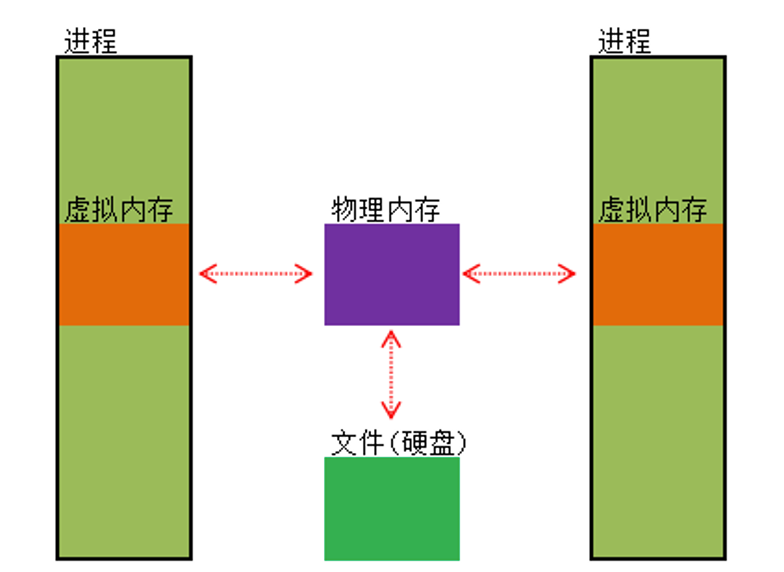

A程序写入，B程序读取：

```cpp
#define MAPPINGNAME "Share File"
 
DWORD MappingFile(LPSTR lpcFile) {
    HANDLE hFile;
    HANDLE hMapFile;
    LPVOID lpAddr;
    
    // 1. 创建文件（获取文件句柄）
    hFile = CreateFile(lpcFile, GENERIC_READ|GENERIC_WRITE, 0, NULL, OPEN_EXISTING, FILE_ATTRIBUTE_NORMAL, NULL);
    
    // 判断CreateFile是否执行成功
    if(hFile == NULL) {
        printf("CreateFile failed: %d \n", GetLastError());
        return 0;
    }
    
    // 2. 创建FileMapping对象
    hMapFile = CreateFileMapping(hFile, NULL, PAGE_READWRITE, 0, 0, MAPPINGNAME);
        
    // 判断CreateFileMapping是否执行成功
    if(hMapFile == NULL) {
        printf("CreateFileMapping failed: %d \n", GetLastError());
        return 0;
    }
 
    // 3. 物理页映射到虚拟内存
    lpAddr = MapViewOfFile(hMapFile, FILE_MAP_ALL_ACCESS, 0, 0, 0);
 
    // 4. 读取文件
    // DWORD dwTest1 = *(LPDWORD)lpAddr; // 读取最开始的4字节
    // printf("dwTest1: %x \n", dwTest1);
    // 5. 写文件
    *(LPDWORD)lpAddr = 0x41414142;
    FlushViewOfFile(((LPDWORD)lpAddr), 4);
    printf("Process A Write");
    getchar();
    // 6. 关闭资源
    UnmapViewOfFile(lpAddr);
    CloseHandle(hFile);
    CloseHandle(hMapFile);
    return 0;
}
```

B程序：

```cpp
#define MAPPINGNAME "Share File"
 
DWORD MappingFile(LPSTR lpcFile) {
    HANDLE hMapFile;
    LPVOID lpAddr;
    
    // 1. 打开FileMapping对象
    /*
    OpenFileMapping 函数语法格式：
    HANDLE OpenFileMapping(
        DWORD dwDesiredAccess,  // access mode 访问模式
        BOOL bInheritHandle,    // inherit flag 继承标识，为真则表示这个可以被新进程继承，为假反之
        LPCTSTR lpName          // object name 对象名称
    );
    */
    hMapFile = OpenFileMapping(FILE_MAP_ALL_ACCESS, FALSE, MAPPINGNAME);
 
    // 2. 物理页映射到虚拟内存
    lpAddr = MapViewOfFile(hMapFile, FILE_MAP_ALL_ACCESS, 0, 0, 0);
 
    // 3. 读取文件
    DWORD dwTest1 = *(LPDWORD)lpAddr; // 读取最开始的4字节
    printf("dwTest1: %x \n", dwTest1);
    // 4. 写文件
    // *(LPDWORD)lpAddr = 0x41414142;
    printf("Process B Read");
    getchar();
    // 5. 关闭资源
    UnmapViewOfFile(lpAddr);
    CloseHandle(hMapFile);
    return 0;
}
```

## 内存映射文件之写拷贝

实际上我们程序调用的user32.dll这类dll文件，也是通过这种方式进行调用的，如果我们进程A修改了某个DLL，就会导致进程B出问题。

为了解决这种隐患，我们可以使用写拷贝的方式来处理。

写拷贝的实现就是**MapViewOfFile函数**中的第二个参数值为**FILE_MAP_COPY**，**它的意思表示当你在写的时候进行拷贝**。写拷贝属性时候，写入时并**不会影响**原本的文件内容

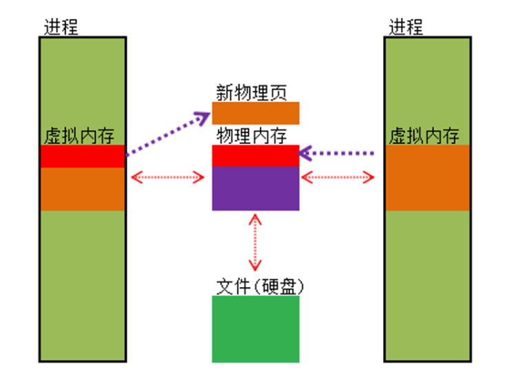

# 静态链接库

动态链接和静态链接之前pwn的时候搞过，就不写的太详细了。


写好之后，将生成的.h文件和.lib文件放到项目的根目录，然后引用：

```c
#include "xxxx.h"
#pragma comment(lib, "xxxx.lib")
```

# 动态链接库

使用的是VS2022,，创建动态链接库项目，把其他的文件删掉，新建MyDLL的h和cpp文件，不使用预编译头。

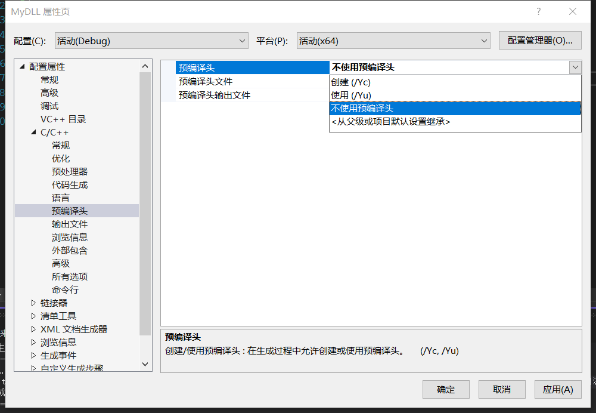

.h:

```c
extern "C" __declspec(dllexport)  int ADD(int a,int b);

extern "C" __declspec(dllexport)  int SUB(int a, int b);
```

.cpp:

```cpp
int ADD(int a, int b)
{
	return a + b;
}
int SUB(int a, int b)
{
	return a - b;
}
```

生成：

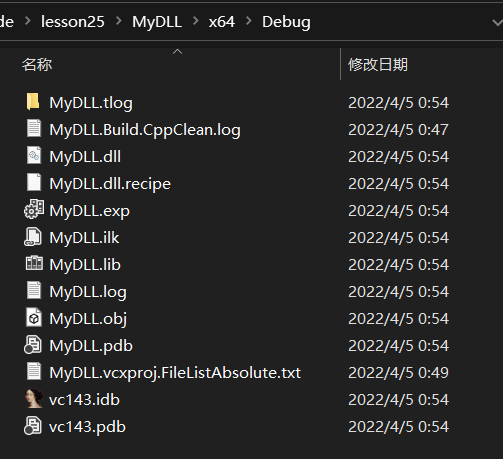

使用：

生成的dll，将dll，lib和h文件放到使用dll的项目中，vcxproj同级。

之后分别右键导入h和lib、dll，直接使用就可：


还可以这样使用：

```cpp
 // 将DLL文件复制到项目目录下

    // 步骤1：定义函数指针,如：
    typedef int (*lpAdd)(int, int);

    // 步骤2：声明函数指针变量,如：
    lpAdd myAdd;

    // 步骤3：动态加载dll到内存中,如：
    // LoadLibrary函数会先从当前目录寻找，然后在系统目录寻找
    HINSTANCE hModule = LoadLibrary(TEXT("MyDLL.dll"));

    // 步骤4：获取函数地址,如：
    myAdd = (lpAdd)GetProcAddress(hModule, "ADD");

    // 步骤5：调用函数,如：
    int a = myAdd(10, 2);
    printf("%d\n", a);

    // 步骤6：释放动态链接库,如：
    FreeLibrary(hModule);
```


# 隐式链接

将动态链接生成的lib和dll文件放到项目目录 ，

```cpp
#include <Windows.h>
#include <stdio.h>
#pragma comment(lib, "MyDLL.lib")
__declspec(dllimport) int ADD(int a, int b);
__declspec(dllimport) int SUB(int a, int b);
int main()
{
    int a = SUB(2, 1);
    int b = ADD(23, 11);
    return 0;
}
```

## DLLMain

dll的入口函数是DLLMain，DLLMain可能执行很多次

```cpp
BOOL WINAPI DllMain(
  HINSTANCE hinstDLL,   // handle to the DLL module DLL模块的句柄，当前DLL被加载到什么位置
  DWORD fdwReason,      // reason for calling function DLL被调用的原因，有4种情况：DLL_PROCESS_ATTACH（当某个进程第一次执行LoadLibrary）、DLL_PROCESS_DETACH（当某个进程释放了DLL）、DLL_THREAD_ATTACH（当某个进程的其他线程再次执行LoadLibrary）、DLL_THREAD_DETACH（当某个进程的其他线程释放了DLL）
  LPVOID lpvReserved    // reserved
);
```

# 远程线程

## CreateRemoteThread

```cpp
HANDLE CreateRemoteThread(
  HANDLE hProcess,                          // handle to process 输入类型，进程句柄
  LPSECURITY_ATTRIBUTES lpThreadAttributes, // SD 输入类型，安全属性，包含安全描述符
  SIZE_T dwStackSize,                       // initial stack size 输入类型，堆大小
  LPTHREAD_START_ROUTINE lpStartAddress,    // thread function 输入类型，线程函数，线程函数地址应该是在别的进程中存在的
  LPVOID lpParameter,                       // thread argument　输入类型，线程参数
  DWORD dwCreationFlags,                    // creation option 输入类型，创建设置
  LPDWORD lpThreadId                        // thread identifier 输出类型，线程id
);
```

**CreateThread**函数是在当前进程中创建线程，而**CreateRemoteThread**函数是允许在其他进程中创建线程，所以**远程线程就可以理解为是非本进程中的线程**。

A进程简单的输出10句话，之后使用B进程创建远程进程

A:

```cpp
void Fun() {
    for(int i = 0; i <= 5; i++) {
        printf("Fun running... \n");
        Sleep(1000);
    }
}
 
DWORD WINAPI ThreadProc(LPVOID lpParameter) {
    Fun();
    return 0;
}
 
int main(int argc, char* argv[]) {
    
    HANDLE hThread = CreateThread(NULL, NULL, ThreadProc, NULL, 0, NULL);
    
    CloseHandle(hThread);
 
    getchar();
    return 0;
}
```


B:执行的远程线程的线程函数地址应该是在别的进程中存在的

```cpp
BOOL MyCreateRemoteThread(DWORD dwProcessId, DWORD dwProcessAddr) {
    DWORD dwThreadId;
    HANDLE hProcess;
    HANDLE hThread;
    // 1. 获取进程句柄
    hProcess = OpenProcess(PROCESS_ALL_ACCESS, FALSE, dwProcessId);
    // 判断OpenProcess是否执行成功
    if (hProcess == NULL) {
        OutputDebugString(TEXT("OpenProcess failed! \n"));
        return FALSE;
    }
    // 2. 创建远程线程
    hThread = CreateRemoteThread(
        hProcess,                          // handle to process
        NULL, // SD
        0,                       // initial stack size
        (LPTHREAD_START_ROUTINE)dwProcessAddr,    // thread function
        NULL,                       // thread argument
        0,                    // creation option
        &dwThreadId                        // thread identifier
    );
    // 判断CreateRemoteThread是否执行成功
    if (hThread == NULL) {
        OutputDebugString(TEXT("CreateRemoteThread failed! \n"));
        CloseHandle(hProcess);
        return FALSE;
    }

    // 3. 关闭
    CloseHandle(hThread);
    CloseHandle(hProcess);

    // 返回
    return TRUE;
}

```

成功执行！

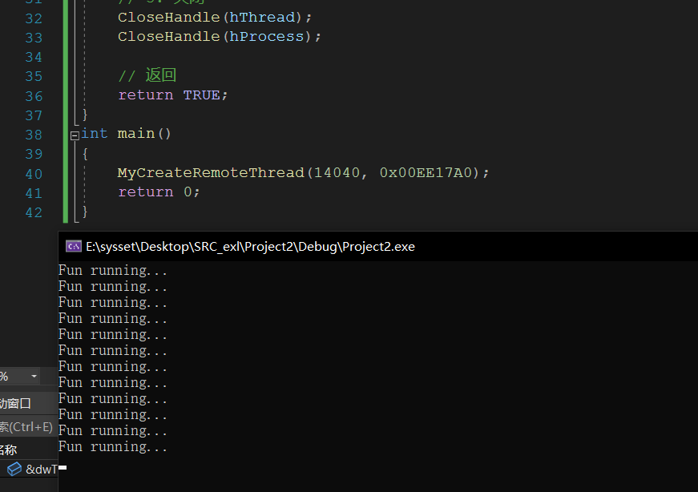


# 远程线程注入

如果我们想要创建远程线程调用自己定义的线程函数就需要使用**远程线程注入**技术。

## 什么是注入

所谓注入就是在第三方进程不知道或者不允许的情况下将模块或者代码写入对方进程空间，并设法执行的技术。

在安全领域，“注入”是非常重要的一种技术手段，注入与反注入也一直处于不断变化的，而且也愈来愈激烈的对抗当中。

**已知的注入方式：**

远程线程注入、APC注入、消息钩子注入、注册表注入、导入表注入、输入法注入等等。

## 远程线程注入的流程

远程线程注入的思路就是在进程A中创建线程，**将线程函数指向LoadLibrary函数**。

那么为什么可以这样呢？这是因为我们执行远程线程函数满足返回值是4字节，一个参数是4字节即可（ThreadProc就是这样的条件）：


重新写个dll：

```cpp
#include<stdio.h>
DWORD WINAPI ThreadProc(LPVOID lpParaneter) {
    for (int i=0;i<10;i++) {
        Sleep(1000);
        printf("DLL RUNNING...");
    }
    return 0;
}

BOOL APIENTRY DllMain(HANDLE hModule,
    DWORD  ul_reason_for_call,
    LPVOID lpReserved
)
{   // 当进程执行LoadLibrary时创建一个线程，执行ThreadProc线程
    switch (ul_reason_for_call) {
    case DLL_PROCESS_ATTACH:
        CreateThread(NULL, 0, ThreadProc, NULL, 0, NULL);
        break;
    }
    return TRUE;
}
```

被注入的程序还是和之前那个一样，下面是注入的程序：（这里我搞了半天，最后还是32位的成功了。。。）

```cpp
#include<Windows.h>
#include<stdio.h>

// LoadDll需要两个参数一个参数是进程ID，一个是DLL文件的路径
BOOL LoadDll(DWORD dwProcessID, char* szDllPathName) {

    BOOL bRet;
    HANDLE hProcess;
    HANDLE hThread;
    DWORD dwLength;
    DWORD dwLoadAddr;
    LPVOID lpAllocAddr;
    DWORD dwThreadID;
    HMODULE hModule;

    bRet = 0;
    dwLoadAddr = 0;
    hProcess = 0;

    // 1. 获取进程句柄
    hProcess = OpenProcess(PROCESS_ALL_ACCESS, FALSE, dwProcessID);
    if (hProcess == NULL) {
        OutputDebugString(TEXT("OpenProcess failed! \n"));
        return FALSE;
    }

    // 2. 获取DLL文件路径的长度，并在最后+1，因为要加上0结尾的长度
    dwLength = strlen(szDllPathName) + 1;

    // 3. 在目标进程分配内存
    lpAllocAddr = VirtualAllocEx(hProcess, NULL, dwLength, MEM_COMMIT, PAGE_READWRITE);
    if (lpAllocAddr == NULL) {
        OutputDebugString(TEXT("VirtualAllocEx failed! \n"));
        CloseHandle(hProcess);
        return FALSE;
    }

    // 4. 拷贝DLL路径名字到目标进程的内存
    bRet = WriteProcessMemory(hProcess, lpAllocAddr, szDllPathName, dwLength, NULL);
    if (!bRet) {
        OutputDebugString(TEXT("WriteProcessMemory failed! \n"));
        CloseHandle(hProcess);
        return FALSE;
    }

    // 5. 获取模块句柄
    // LoadLibrary这个函数是在kernel32.dll这个模块中的，所以需要现货区kernel32.dll这个模块的句柄
    hModule = GetModuleHandle(TEXT("kernel32.dll"));
    if (!hModule) {
        OutputDebugString(TEXT("GetModuleHandle failed! \n"));
        CloseHandle(hProcess);
        return FALSE;
    }

    // 6. 获取LoadLibraryA函数地址
    dwLoadAddr = (DWORD)GetProcAddress(hModule, "LoadLibraryA");
    if (!dwLoadAddr) {
        OutputDebugString(TEXT("GetProcAddress failed! \n"));
        CloseHandle(hModule);
        CloseHandle(hProcess);
        return FALSE;
    }

    // 7. 创建远程线程，加载DLL
    hThread = CreateRemoteThread(hProcess, NULL, 0, (LPTHREAD_START_ROUTINE)dwLoadAddr, lpAllocAddr, 0, &dwThreadID);
    if (!hThread) {
        OutputDebugString(TEXT("CreateRemoteThread failed! \n"));
        CloseHandle(hModule);
        CloseHandle(hProcess);
        return FALSE;
    }

    // 8. 关闭进程句柄
    CloseHandle(hThread);
    CloseHandle(hProcess);

    return TRUE;
}

int main(int argc, char* argv[]) {

    LoadDll(27220, (char*)"E:\\github\\Win32LearnCode\\Code\\lesson28\\MyDLL\\Debug\\MyDLL.dll");
    return 0;
}
```

成功注入！！！


# 模块隐藏

## 模块隐藏-断链

API是从这几个结构体（**结构体属于3环应用层**）中查询出来的：

1.  TEB(Thread Environment Block，线程环境块)，它存放线程的相关信息，每一个线程都有自己的TEB信息，FS:[0]即是当前线程的TEB。
2.  PEB(Process Environment Block，进程环境块)，它存放进程的相关信息，每个进程都有自己的PEB信息，FS:[0x30]即当前进程的PEB。

如下图所示（只介绍与本章节相关的信息）

1.  TEB第一个成员是一个结构体，这个结构体包含了当前线程栈栈底和当前线程栈的界限；TEB的**020**偏移是一个结构体，其包含了两个成员，一个是当前线程所在进程的PID和当前线程自己的线程ID；
2.  PEB的**00c**偏移是一个结构体，这个结构体包括**模块链表**，API函数遍历模块就是查看这个链表。


FS寄存器中存储的就是当前正在使用的线程的TEB结构体的地址。

PEB结构体同理，我们只需要找到FS寄存器中存储地址的0x30偏移然后跟进即可

代码实现：

```cpp
void HideModule(char* szModuleName) {
    // 获取模块的句柄
    HMODULE hMod = GetModuleHandle(szModuleName);
    PLIST_ENTRY Head, Cur;
    PPEB_LDR_DATA ldr;
    PLDR_MODULE ldmod;
    
    __asm {
        mov eax, fs:[0x30] // 取PEB结构体
            mov ecx, [eax + 0x0c] // 取PEB结构体的00c偏移的结构体，就是PEB_LDR_DATA
            mov ldr, ecx // 将ecx给到ldr
    }
    // 获取正在加载的模块列表
    Head = &(ldr->InLoadOrderModuleList);
    // 
    Cur = Head->Flink;
    do {
        // 宏CONTAINING_RECORD根据结构体中某成员的地址来推算出该结构体整体的地址
        ldmod = CONTAINING_RECORD(Cur, LDR_MODULE, InLoadOrderModuleList);
        // 循环遍历，如果地址一致则表示找到对应模块来，就进行断链
        if(hMod == ldmod->BaseAddress) {
            // 断链原理很简单就是将属性交错替换
            ldmod->InLoadOrderModuleList.Blink->Flink = ldmod->InLoadOrderModuleList.Flink;
            ldmod->InLoadOrderModuleList.Flink->Blink = ldmod->InLoadOrderModuleList.Blink;
            
            ldmod->InInitializationOrderModuleList.Blink->Flink = ldmod->InInitializationOrderModuleList.Flink;
            ldmod->InInitializationOrderModuleList.Flink->Blink = ldmod->InInitializationOrderModuleList.Blink;
            
            ldmod->InMemoryOrderModuleList.Blink->Flink = ldmod->InMemoryOrderModuleList.Flink;
            ldmod->InMemoryOrderModuleList.Flink->Blink = ldmod->InMemoryOrderModuleList.Blink;
        }
        Cur = Cur->Flink;
    } while (Head != Cur);
}
```

